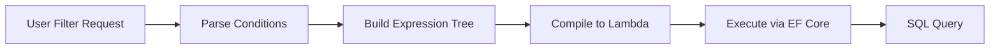

# How to Build a Query Builder with Expression Trees in .NET

Author: [nawazdhandala](https://www.github.com/nawazdhandala)

Tags: .NET, C#, Expression Trees, LINQ, Entity Framework, Performance

Description: Learn how to build dynamic query builders using Expression Trees in .NET. Create type-safe, composable filters that translate to efficient SQL queries with Entity Framework Core.

---

Hardcoded queries break when requirements change. Users want to filter by any field, combine conditions dynamically, and save their custom filters. Expression Trees let you build queries programmatically while maintaining type safety and letting Entity Framework translate them to efficient SQL.

## Why Expression Trees?

LINQ queries are powerful, but they require knowing the filter conditions at compile time. When building search pages, report builders, or API endpoints with dynamic filtering, you need to construct queries at runtime. String concatenation leads to SQL injection. Expression Trees provide a safe, type-checked alternative.



## Expression Tree Basics

An Expression Tree represents code as data. Instead of executing `x => x.Name == "John"`, you can inspect, modify, and combine it with other expressions.

```csharp
// Simple expression tree inspection
// This demonstrates the structure of an expression
public static void ExplainExpression()
{
    // Create a simple lambda expression
    Expression<Func<Person, bool>> expr = p => p.Age > 18;

    // The expression has a body and parameters
    var parameter = expr.Parameters[0]; // p
    var body = expr.Body; // p.Age > 18

    // The body is a BinaryExpression (comparison)
    if (body is BinaryExpression binary)
    {
        Console.WriteLine($"Left: {binary.Left}");   // p.Age
        Console.WriteLine($"Operator: {binary.NodeType}"); // GreaterThan
        Console.WriteLine($"Right: {binary.Right}"); // 18
    }
}

public class Person
{
    public int Id { get; set; }
    public string Name { get; set; } = string.Empty;
    public int Age { get; set; }
    public string Email { get; set; } = string.Empty;
    public DateTime CreatedAt { get; set; }
    public bool IsActive { get; set; }
}
```

## Building Dynamic Filters

Start with a filter specification that describes what to filter. Then convert it to an Expression Tree.

```csharp
// Filter specification that can be serialized from API requests
public class FilterCondition
{
    public string PropertyName { get; set; } = string.Empty;
    public FilterOperator Operator { get; set; }
    public object? Value { get; set; }
}

public enum FilterOperator
{
    Equals,
    NotEquals,
    GreaterThan,
    LessThan,
    GreaterThanOrEqual,
    LessThanOrEqual,
    Contains,
    StartsWith,
    EndsWith
}

// Expression builder that converts filter conditions to expressions
public class ExpressionBuilder<T>
{
    // Build a predicate expression from a filter condition
    public Expression<Func<T, bool>> BuildPredicate(FilterCondition filter)
    {
        // Create parameter: x =>
        var parameter = Expression.Parameter(typeof(T), "x");

        // Get property: x.PropertyName
        var property = Expression.Property(parameter, filter.PropertyName);

        // Convert value to property type
        var value = ConvertValue(filter.Value, property.Type);
        var constant = Expression.Constant(value, property.Type);

        // Build comparison expression based on operator
        Expression comparison = filter.Operator switch
        {
            FilterOperator.Equals => Expression.Equal(property, constant),
            FilterOperator.NotEquals => Expression.NotEqual(property, constant),
            FilterOperator.GreaterThan => Expression.GreaterThan(property, constant),
            FilterOperator.LessThan => Expression.LessThan(property, constant),
            FilterOperator.GreaterThanOrEqual =>
                Expression.GreaterThanOrEqual(property, constant),
            FilterOperator.LessThanOrEqual =>
                Expression.LessThanOrEqual(property, constant),
            FilterOperator.Contains => BuildContainsExpression(property, filter.Value),
            FilterOperator.StartsWith => BuildStringMethod(property, filter.Value, "StartsWith"),
            FilterOperator.EndsWith => BuildStringMethod(property, filter.Value, "EndsWith"),
            _ => throw new NotSupportedException($"Operator {filter.Operator} not supported")
        };

        // Combine into lambda: x => x.Property == value
        return Expression.Lambda<Func<T, bool>>(comparison, parameter);
    }

    private Expression BuildContainsExpression(MemberExpression property, object? value)
    {
        // Call property.Contains(value) for string properties
        var method = typeof(string).GetMethod("Contains", new[] { typeof(string) });
        var constant = Expression.Constant(value?.ToString() ?? string.Empty);
        return Expression.Call(property, method!, constant);
    }

    private Expression BuildStringMethod(
        MemberExpression property,
        object? value,
        string methodName)
    {
        var method = typeof(string).GetMethod(methodName, new[] { typeof(string) });
        var constant = Expression.Constant(value?.ToString() ?? string.Empty);
        return Expression.Call(property, method!, constant);
    }

    private object? ConvertValue(object? value, Type targetType)
    {
        if (value == null) return null;

        var underlyingType = Nullable.GetUnderlyingType(targetType) ?? targetType;
        return Convert.ChangeType(value, underlyingType);
    }
}
```

## Combining Multiple Conditions

Real filters have multiple conditions with AND/OR logic. Use expression visitors to combine them.

```csharp
// Combine multiple expressions with AND or OR
public static class ExpressionCombiner
{
    // Combine two expressions with AND
    public static Expression<Func<T, bool>> And<T>(
        Expression<Func<T, bool>> left,
        Expression<Func<T, bool>> right)
    {
        // Reuse the parameter from the left expression
        var parameter = left.Parameters[0];

        // Replace the parameter in the right expression
        var rightBody = new ParameterReplacer(
            right.Parameters[0],
            parameter).Visit(right.Body);

        // Combine: left.Body AND right.Body
        var combined = Expression.AndAlso(left.Body, rightBody);

        return Expression.Lambda<Func<T, bool>>(combined, parameter);
    }

    // Combine two expressions with OR
    public static Expression<Func<T, bool>> Or<T>(
        Expression<Func<T, bool>> left,
        Expression<Func<T, bool>> right)
    {
        var parameter = left.Parameters[0];
        var rightBody = new ParameterReplacer(
            right.Parameters[0],
            parameter).Visit(right.Body);

        var combined = Expression.OrElse(left.Body, rightBody);

        return Expression.Lambda<Func<T, bool>>(combined, parameter);
    }
}

// Expression visitor that replaces one parameter with another
// Needed when combining expressions that use different parameter instances
public class ParameterReplacer : ExpressionVisitor
{
    private readonly ParameterExpression _oldParameter;
    private readonly ParameterExpression _newParameter;

    public ParameterReplacer(
        ParameterExpression oldParameter,
        ParameterExpression newParameter)
    {
        _oldParameter = oldParameter;
        _newParameter = newParameter;
    }

    protected override Expression VisitParameter(ParameterExpression node)
    {
        return node == _oldParameter ? _newParameter : base.VisitParameter(node);
    }
}
```

## Complete Query Builder Implementation

Putting it all together into a fluent query builder that handles complex filter scenarios.

```csharp
// Fluent query builder for dynamic filtering
public class QueryBuilder<T> where T : class
{
    private readonly List<Expression<Func<T, bool>>> _conditions = new();
    private readonly ExpressionBuilder<T> _expressionBuilder = new();

    // Add a filter condition
    public QueryBuilder<T> Where(FilterCondition condition)
    {
        var expression = _expressionBuilder.BuildPredicate(condition);
        _conditions.Add(expression);
        return this;
    }

    // Add a filter using a lambda directly
    public QueryBuilder<T> Where(Expression<Func<T, bool>> predicate)
    {
        _conditions.Add(predicate);
        return this;
    }

    // Add multiple conditions from a filter group
    public QueryBuilder<T> Where(FilterGroup group)
    {
        if (group.Conditions.Count == 0) return this;

        var expressions = group.Conditions
            .Select(c => _expressionBuilder.BuildPredicate(c))
            .ToList();

        // Combine all conditions in the group
        var combined = expressions[0];
        for (int i = 1; i < expressions.Count; i++)
        {
            combined = group.Logic == FilterLogic.And
                ? ExpressionCombiner.And(combined, expressions[i])
                : ExpressionCombiner.Or(combined, expressions[i]);
        }

        _conditions.Add(combined);
        return this;
    }

    // Build the final combined expression
    public Expression<Func<T, bool>> Build()
    {
        if (_conditions.Count == 0)
        {
            // Return a predicate that matches everything
            return x => true;
        }

        // Combine all conditions with AND
        var result = _conditions[0];
        for (int i = 1; i < _conditions.Count; i++)
        {
            result = ExpressionCombiner.And(result, _conditions[i]);
        }

        return result;
    }

    // Apply directly to a queryable
    public IQueryable<T> ApplyTo(IQueryable<T> query)
    {
        return query.Where(Build());
    }
}

public class FilterGroup
{
    public FilterLogic Logic { get; set; } = FilterLogic.And;
    public List<FilterCondition> Conditions { get; set; } = new();
}

public enum FilterLogic
{
    And,
    Or
}

// Usage example with Entity Framework
public class PersonRepository
{
    private readonly AppDbContext _context;

    public PersonRepository(AppDbContext context)
    {
        _context = context;
    }

    public async Task<List<Person>> SearchAsync(List<FilterCondition> filters)
    {
        var builder = new QueryBuilder<Person>();

        foreach (var filter in filters)
        {
            builder.Where(filter);
        }

        return await builder
            .ApplyTo(_context.People)
            .ToListAsync();
    }
}
```

## Handling Nested Properties

Real-world models have navigation properties. Extend the builder to handle nested paths like "Address.City".

```csharp
// Extended expression builder that handles nested properties
public class NestedExpressionBuilder<T>
{
    // Build property access for paths like "Address.City"
    public MemberExpression BuildPropertyAccess(
        ParameterExpression parameter,
        string propertyPath)
    {
        Expression current = parameter;

        foreach (var part in propertyPath.Split('.'))
        {
            current = Expression.Property(current, part);
        }

        return (MemberExpression)current;
    }

    // Build predicate supporting nested properties
    public Expression<Func<T, bool>> BuildNestedPredicate(FilterCondition filter)
    {
        var parameter = Expression.Parameter(typeof(T), "x");
        var property = BuildPropertyAccess(parameter, filter.PropertyName);

        // Handle null parent objects with null propagation
        var nullChecks = BuildNullChecks(parameter, filter.PropertyName);

        var value = Convert.ChangeType(filter.Value, property.Type);
        var constant = Expression.Constant(value, property.Type);

        Expression comparison = filter.Operator switch
        {
            FilterOperator.Equals => Expression.Equal(property, constant),
            FilterOperator.Contains => BuildContains(property, filter.Value),
            _ => throw new NotSupportedException()
        };

        // Combine null checks with the comparison
        if (nullChecks != null)
        {
            comparison = Expression.AndAlso(nullChecks, comparison);
        }

        return Expression.Lambda<Func<T, bool>>(comparison, parameter);
    }

    // Build null checks for each level of the property path
    private Expression? BuildNullChecks(ParameterExpression parameter, string path)
    {
        var parts = path.Split('.');
        if (parts.Length <= 1) return null;

        Expression current = parameter;
        Expression? result = null;

        // Check each intermediate property for null
        for (int i = 0; i < parts.Length - 1; i++)
        {
            current = Expression.Property(current, parts[i]);
            var nullCheck = Expression.NotEqual(
                current,
                Expression.Constant(null, current.Type));

            result = result == null
                ? nullCheck
                : Expression.AndAlso(result, nullCheck);
        }

        return result;
    }

    private Expression BuildContains(MemberExpression property, object? value)
    {
        var method = typeof(string).GetMethod("Contains", new[] { typeof(string) });
        var constant = Expression.Constant(value?.ToString() ?? string.Empty);
        return Expression.Call(property, method!, constant);
    }
}

// Model with nested properties
public class Order
{
    public int Id { get; set; }
    public decimal Total { get; set; }
    public Customer Customer { get; set; } = null!;
}

public class Customer
{
    public int Id { get; set; }
    public string Name { get; set; } = string.Empty;
    public Address Address { get; set; } = null!;
}

public class Address
{
    public string City { get; set; } = string.Empty;
    public string Country { get; set; } = string.Empty;
}

// Filter orders by customer's city
// FilterCondition { PropertyName = "Customer.Address.City", Value = "London" }
```

## API Controller Integration

Expose the query builder through an API endpoint that accepts filter specifications.

```csharp
// API request model for dynamic filtering
public class SearchRequest
{
    public List<FilterCondition> Filters { get; set; } = new();
    public List<SortCondition> Sorting { get; set; } = new();
    public int Page { get; set; } = 1;
    public int PageSize { get; set; } = 20;
}

public class SortCondition
{
    public string PropertyName { get; set; } = string.Empty;
    public bool Descending { get; set; }
}

[ApiController]
[Route("api/[controller]")]
public class PeopleController : ControllerBase
{
    private readonly AppDbContext _context;

    public PeopleController(AppDbContext context)
    {
        _context = context;
    }

    [HttpPost("search")]
    public async Task<ActionResult<PagedResult<Person>>> Search(
        [FromBody] SearchRequest request)
    {
        // Build filter expression
        var builder = new QueryBuilder<Person>();
        foreach (var filter in request.Filters)
        {
            builder.Where(filter);
        }

        var query = builder.ApplyTo(_context.People);

        // Apply sorting
        query = ApplySorting(query, request.Sorting);

        // Get total count before pagination
        var totalCount = await query.CountAsync();

        // Apply pagination
        var items = await query
            .Skip((request.Page - 1) * request.PageSize)
            .Take(request.PageSize)
            .ToListAsync();

        return Ok(new PagedResult<Person>
        {
            Items = items,
            TotalCount = totalCount,
            Page = request.Page,
            PageSize = request.PageSize
        });
    }

    private IQueryable<Person> ApplySorting(
        IQueryable<Person> query,
        List<SortCondition> sorting)
    {
        if (sorting.Count == 0) return query;

        IOrderedQueryable<Person>? ordered = null;

        foreach (var sort in sorting)
        {
            // Build sort expression
            var parameter = Expression.Parameter(typeof(Person), "x");
            var property = Expression.Property(parameter, sort.PropertyName);
            var lambda = Expression.Lambda(property, parameter);

            // Apply OrderBy or ThenBy
            var methodName = ordered == null
                ? (sort.Descending ? "OrderByDescending" : "OrderBy")
                : (sort.Descending ? "ThenByDescending" : "ThenBy");

            var method = typeof(Queryable)
                .GetMethods()
                .First(m => m.Name == methodName && m.GetParameters().Length == 2)
                .MakeGenericMethod(typeof(Person), property.Type);

            ordered = (IOrderedQueryable<Person>)method.Invoke(
                null,
                new object[] { ordered ?? query, lambda })!;
        }

        return ordered ?? query;
    }
}

public class PagedResult<T>
{
    public List<T> Items { get; set; } = new();
    public int TotalCount { get; set; }
    public int Page { get; set; }
    public int PageSize { get; set; }
}
```

## Caching Compiled Expressions

Expression compilation is expensive. Cache compiled delegates for repeated use.

```csharp
// Cache compiled expressions for better performance
public class CompiledExpressionCache<T>
{
    private readonly ConcurrentDictionary<string, Func<T, bool>> _cache = new();

    public Func<T, bool> GetOrCompile(
        string cacheKey,
        Expression<Func<T, bool>> expression)
    {
        return _cache.GetOrAdd(cacheKey, _ => expression.Compile());
    }

    // Generate cache key from filter conditions
    public string GenerateCacheKey(List<FilterCondition> filters)
    {
        var parts = filters.Select(f =>
            $"{f.PropertyName}:{f.Operator}:{f.Value}");
        return string.Join("|", parts);
    }
}
```

## Summary

Expression Trees unlock dynamic query building without sacrificing type safety or SQL efficiency. Key points:

| Concept | Purpose |
|---------|---------|
| Expression Trees | Represent code as data structures |
| Parameter Expressions | Define lambda parameters |
| Member Expressions | Access properties |
| Binary Expressions | Comparisons and logic |
| Expression Visitors | Transform and combine expressions |

Start simple with basic filters, then add nested property support and caching as needed. Expression Trees have a learning curve, but they enable powerful query scenarios that would otherwise require string manipulation or stored procedures.
