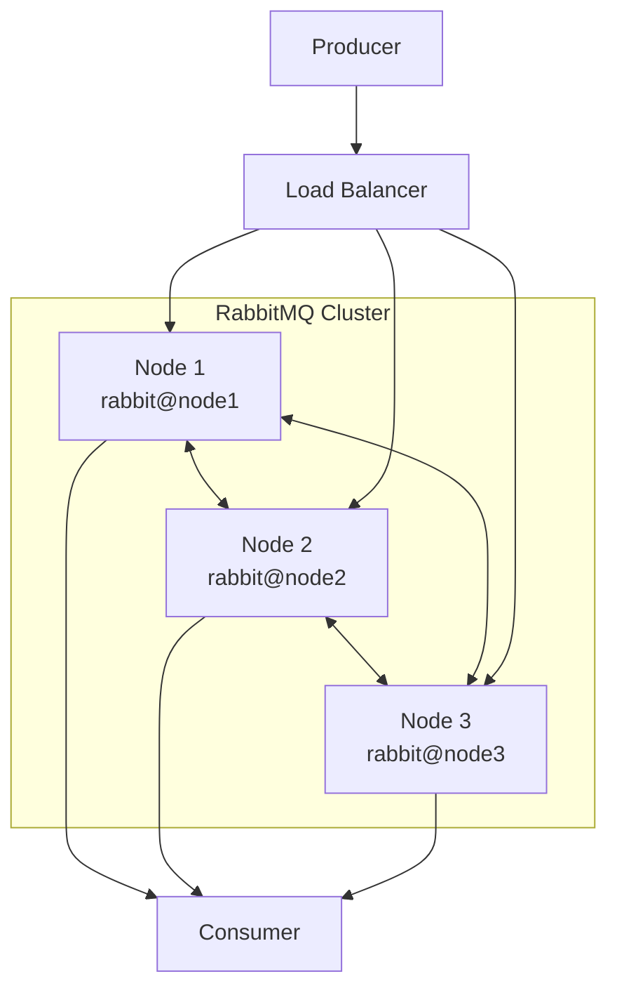

# How to Set Up RabbitMQ Cluster for High Availability

Author: [nawazdhandala](https://www.github.com/nawazdhandala)

Tags: RabbitMQ, Clustering, High Availability, Message Queues, DevOps, Distributed Systems

Description: A practical guide to setting up a RabbitMQ cluster for high availability, covering node configuration, network partitions, and best practices for production deployments.

---

Running a single RabbitMQ node in production is asking for trouble. When that node goes down, your entire messaging infrastructure goes with it. Clustering gives you the resilience you need to keep messages flowing even when hardware fails.

## Why Cluster RabbitMQ?

A RabbitMQ cluster provides several benefits:

- **High availability**: If one node fails, others continue serving requests
- **Increased throughput**: Multiple nodes can handle more connections and messages
- **Geographic distribution**: Spread nodes across availability zones
- **Rolling upgrades**: Update nodes one at a time without downtime



## Prerequisites

Before setting up your cluster, ensure you have:

- Three or more servers running the same RabbitMQ version
- Network connectivity between all nodes on ports 4369 and 25672
- Identical Erlang cookies on all nodes
- DNS resolution or `/etc/hosts` entries for each node

## Step 1: Install RabbitMQ on All Nodes

Install RabbitMQ on each server. Here we use Ubuntu as an example:

```bash
# Add RabbitMQ signing key
curl -1sLf 'https://keys.openpgp.org/vks/v1/by-fingerprint/0A9AF2115F4687BD29803A206B73A36E6026DFCA' | sudo gpg --dearmor -o /usr/share/keyrings/rabbitmq-archive-keyring.gpg

# Add repository
echo "deb [signed-by=/usr/share/keyrings/rabbitmq-archive-keyring.gpg] https://ppa1.novemberain.com/rabbitmq/rabbitmq-erlang/deb/ubuntu jammy main" | sudo tee /etc/apt/sources.list.d/rabbitmq.list

# Install RabbitMQ
sudo apt-get update
sudo apt-get install -y rabbitmq-server

# Enable and start RabbitMQ
sudo systemctl enable rabbitmq-server
sudo systemctl start rabbitmq-server
```

## Step 2: Configure the Erlang Cookie

The Erlang cookie is a shared secret that allows RabbitMQ nodes to communicate. All nodes in a cluster must have the same cookie.

```bash
# On node1, get the cookie value
sudo cat /var/lib/rabbitmq/.erlang.cookie
# Output: ABCDEFGHIJKLMNOPQRST

# Copy this value to node2 and node3
sudo systemctl stop rabbitmq-server
echo "ABCDEFGHIJKLMNOPQRST" | sudo tee /var/lib/rabbitmq/.erlang.cookie
sudo chown rabbitmq:rabbitmq /var/lib/rabbitmq/.erlang.cookie
sudo chmod 400 /var/lib/rabbitmq/.erlang.cookie
sudo systemctl start rabbitmq-server
```

## Step 3: Configure Hostnames

Each node needs to resolve the hostnames of other nodes. Update `/etc/hosts` on all nodes:

```bash
# /etc/hosts on all nodes
192.168.1.10 node1 rabbit@node1
192.168.1.11 node2 rabbit@node2
192.168.1.12 node3 rabbit@node3
```

Set the hostname for RabbitMQ in `/etc/rabbitmq/rabbitmq-env.conf`:

```bash
# On node1
NODENAME=rabbit@node1

# On node2
NODENAME=rabbit@node2

# On node3
NODENAME=rabbit@node3
```

## Step 4: Join Nodes to the Cluster

On node2 and node3, stop the RabbitMQ application and join node1:

```bash
# On node2
sudo rabbitmqctl stop_app
sudo rabbitmqctl reset
sudo rabbitmqctl join_cluster rabbit@node1
sudo rabbitmqctl start_app

# On node3
sudo rabbitmqctl stop_app
sudo rabbitmqctl reset
sudo rabbitmqctl join_cluster rabbit@node1
sudo rabbitmqctl start_app
```

Verify the cluster status:

```bash
sudo rabbitmqctl cluster_status
```

You should see output similar to:

```
Cluster status of node rabbit@node1 ...
Basics

Cluster name: rabbit@node1

Disk Nodes

rabbit@node1
rabbit@node2
rabbit@node3

Running Nodes

rabbit@node1
rabbit@node2
rabbit@node3
```

## Step 5: Configure Queue Mirroring

By default, queues exist only on the node where they were declared. For high availability, configure queue mirroring with policies:

```bash
# Mirror all queues to all nodes
sudo rabbitmqctl set_policy ha-all ".*" '{"ha-mode":"all"}' --apply-to queues

# Or mirror to exactly 2 nodes for better performance
sudo rabbitmqctl set_policy ha-two ".*" '{"ha-mode":"exactly","ha-params":2,"ha-sync-mode":"automatic"}' --apply-to queues
```

## Step 6: Set Up a Load Balancer

Place a load balancer in front of your cluster to distribute connections:

```nginx
# /etc/nginx/nginx.conf
stream {
    upstream rabbitmq {
        # Use least_conn for better distribution
        least_conn;
        server node1:5672 weight=1;
        server node2:5672 weight=1;
        server node3:5672 weight=1;
    }

    server {
        listen 5672;
        proxy_pass rabbitmq;
        proxy_timeout 3s;
        proxy_connect_timeout 1s;
    }
}
```

For HAProxy:

```haproxy
# /etc/haproxy/haproxy.cfg
frontend rabbitmq_front
    bind *:5672
    mode tcp
    default_backend rabbitmq_back

backend rabbitmq_back
    mode tcp
    balance roundrobin
    option tcp-check
    server node1 192.168.1.10:5672 check inter 5s rise 2 fall 3
    server node2 192.168.1.11:5672 check inter 5s rise 2 fall 3
    server node3 192.168.1.12:5672 check inter 5s rise 2 fall 3
```

## Handling Network Partitions

Network partitions happen when nodes lose connectivity but remain running. RabbitMQ supports three partition handling strategies:

```bash
# /etc/rabbitmq/rabbitmq.conf

# Pause minority nodes (recommended for most cases)
cluster_partition_handling = pause_minority

# Auto-heal by restarting the losing partition
# cluster_partition_handling = autoheal

# Ignore partitions (not recommended)
# cluster_partition_handling = ignore
```

The `pause_minority` strategy pauses nodes that cannot reach a majority of the cluster, preventing split-brain scenarios.

## Monitoring Cluster Health

Enable the management plugin and monitor cluster health:

```bash
# Enable management plugin on all nodes
sudo rabbitmq-plugins enable rabbitmq_management

# Check cluster health via API
curl -u admin:password http://node1:15672/api/nodes

# Check for network partitions
curl -u admin:password http://node1:15672/api/overview | jq '.cluster_name, .partitions'
```

Create a simple health check script:

```bash
#!/bin/bash
# cluster_health.sh

NODES=$(rabbitmqctl cluster_status --formatter json | jq -r '.running_nodes | length')
EXPECTED=3

if [ "$NODES" -lt "$EXPECTED" ]; then
    echo "CRITICAL: Only $NODES of $EXPECTED nodes running"
    exit 2
fi

echo "OK: All $NODES nodes running"
exit 0
```

## Best Practices for Production

### Use an Odd Number of Nodes

Three or five nodes work best. This ensures a clear majority during network partitions.

### Distribute Across Availability Zones

Place nodes in different availability zones or data centers to survive zone failures:

```
Node 1: us-east-1a
Node 2: us-east-1b
Node 3: us-east-1c
```

### Configure Resource Limits

Set memory and disk thresholds in `/etc/rabbitmq/rabbitmq.conf`:

```ini
# Trigger memory alarm at 60% of available RAM
vm_memory_high_watermark.relative = 0.6

# Trigger disk alarm with 2GB free
disk_free_limit.absolute = 2GB

# Set per-connection memory limit
channel_max = 128
```

### Enable Prometheus Metrics

Export metrics for monitoring:

```bash
sudo rabbitmq-plugins enable rabbitmq_prometheus

# Scrape metrics at
# http://node1:15692/metrics
```

## Troubleshooting Common Issues

### Nodes Cannot Join Cluster

Check the Erlang cookie matches on all nodes:

```bash
sudo cat /var/lib/rabbitmq/.erlang.cookie
```

Verify network connectivity:

```bash
# Check EPMD port
nc -zv node1 4369

# Check RabbitMQ clustering port
nc -zv node1 25672
```

### Split Brain After Partition

If nodes end up in separate clusters after a partition heals:

```bash
# On the minority node
sudo rabbitmqctl stop_app
sudo rabbitmqctl reset
sudo rabbitmqctl join_cluster rabbit@node1
sudo rabbitmqctl start_app
```

### High Memory Usage

Check queue backlogs and consumer status:

```bash
# List queues with message counts
rabbitmqctl list_queues name messages consumers

# Check memory breakdown
rabbitmqctl status | grep -A 20 "Memory"
```

## Conclusion

A properly configured RabbitMQ cluster provides the reliability your messaging infrastructure needs. Start with three nodes, configure queue mirroring, handle network partitions gracefully, and monitor everything. Your future self will thank you when that inevitable hardware failure happens and your messages keep flowing.
