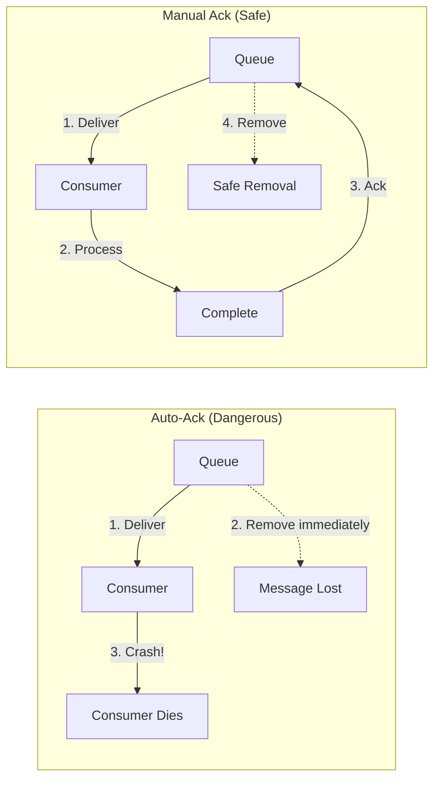

# How to Implement Consumer Acknowledgments in RabbitMQ

Author: [nawazdhandala](https://www.github.com/nawazdhandala)

Tags: RabbitMQ, Consumer Acknowledgments, Message Queues, Reliability, At-Least-Once Delivery, DevOps

Description: Learn how to implement consumer acknowledgments in RabbitMQ to ensure reliable message processing with practical examples covering manual acks, nacks, and requeue strategies.

---

Message acknowledgments are the foundation of reliable messaging. Without proper acknowledgments, messages can be lost when consumers crash or processed multiple times after restarts. Understanding how to use acks, nacks, and rejects correctly is essential for building robust applications.

## The Problem with Auto-Ack

By default, you might be tempted to use auto-acknowledgment mode where messages are removed from the queue immediately upon delivery:

```python
# Dangerous - messages lost if consumer crashes
channel.basic_consume(queue='tasks', auto_ack=True, on_message_callback=process)
```

If your consumer crashes after receiving the message but before processing it, the message is gone forever.



## Manual Acknowledgment Basics

With manual acknowledgment, you explicitly tell RabbitMQ when to remove a message from the queue.

### Python Implementation

```python
import pika
import json

def process_message(channel, method, properties, body):
    try:
        message = json.loads(body)
        print(f"Processing: {message}")

        # Do your work here
        result = perform_work(message)

        # Success - acknowledge the message
        # This tells RabbitMQ to remove the message from the queue
        channel.basic_ack(delivery_tag=method.delivery_tag)
        print(f"Message processed and acknowledged")

    except Exception as e:
        print(f"Error processing message: {e}")
        # We'll handle errors in the next section

def perform_work(message):
    # Your business logic here
    return True

# Connect and consume
connection = pika.BlockingConnection(pika.ConnectionParameters('localhost'))
channel = connection.channel()

# Ensure queue exists
channel.queue_declare(queue='tasks', durable=True)

# Set prefetch to limit unacked messages
channel.basic_qos(prefetch_count=1)

# Consume with manual acknowledgment (auto_ack=False is the default)
channel.basic_consume(
    queue='tasks',
    on_message_callback=process_message,
    auto_ack=False  # This is the default, but explicit is better
)

print("Waiting for messages...")
channel.start_consuming()
```

### Node.js Implementation

```javascript
const amqp = require('amqplib');

async function consumeMessages() {
    const connection = await amqp.connect('amqp://localhost');
    const channel = await connection.createChannel();

    await channel.assertQueue('tasks', { durable: true });
    await channel.prefetch(1);

    console.log('Waiting for messages...');

    channel.consume('tasks', async (msg) => {
        if (msg === null) return;

        try {
            const message = JSON.parse(msg.content.toString());
            console.log('Processing:', message);

            await performWork(message);

            // Acknowledge success
            channel.ack(msg);
            console.log('Message processed and acknowledged');

        } catch (error) {
            console.error('Error processing message:', error);
            // Error handling covered in next section
        }
    }, { noAck: false });  // noAck: false means manual acknowledgment
}

async function performWork(message) {
    // Your business logic
    return true;
}

consumeMessages().catch(console.error);
```

## Handling Failures: Nack and Reject

When processing fails, you have options:

1. **Requeue the message** - Try again later (same or different consumer)
2. **Reject without requeue** - Send to dead letter exchange or discard
3. **Nack multiple messages** - Reject multiple messages at once

### Negative Acknowledgment (Nack)

```python
def process_message(channel, method, properties, body):
    try:
        message = json.loads(body)
        result = perform_work(message)
        channel.basic_ack(delivery_tag=method.delivery_tag)

    except TransientError as e:
        # Temporary failure - requeue for retry
        print(f"Temporary error, requeueing: {e}")
        channel.basic_nack(
            delivery_tag=method.delivery_tag,
            multiple=False,  # Only this message
            requeue=True     # Put back in queue
        )

    except PermanentError as e:
        # Permanent failure - don't requeue (sends to DLX if configured)
        print(f"Permanent error, rejecting: {e}")
        channel.basic_nack(
            delivery_tag=method.delivery_tag,
            multiple=False,
            requeue=False    # Don't put back, goes to DLX
        )

    except Exception as e:
        # Unknown error - reject without requeue
        print(f"Unknown error: {e}")
        channel.basic_reject(
            delivery_tag=method.delivery_tag,
            requeue=False
        )
```

### Reject vs Nack

- `basic_reject`: Rejects a single message
- `basic_nack`: Can reject multiple messages with `multiple=True`

```python
# Reject single message
channel.basic_reject(delivery_tag=method.delivery_tag, requeue=False)

# Nack multiple messages up to and including this delivery_tag
channel.basic_nack(delivery_tag=method.delivery_tag, multiple=True, requeue=False)
```

## Preventing Infinite Requeue Loops

Requeueing a message that always fails creates an infinite loop. Track retry counts to prevent this.

### Using Message Headers

```python
import pika
import json

MAX_RETRIES = 3

def process_message(channel, method, properties, body):
    # Get retry count from headers
    headers = properties.headers or {}
    retry_count = headers.get('x-retry-count', 0)

    try:
        message = json.loads(body)
        result = perform_work(message)
        channel.basic_ack(delivery_tag=method.delivery_tag)

    except Exception as e:
        print(f"Error (attempt {retry_count + 1}): {e}")

        if retry_count < MAX_RETRIES:
            # Republish with incremented retry count
            new_headers = dict(headers)
            new_headers['x-retry-count'] = retry_count + 1

            channel.basic_publish(
                exchange='',
                routing_key='tasks',
                body=body,
                properties=pika.BasicProperties(
                    headers=new_headers,
                    delivery_mode=2
                )
            )
            # Ack the original to remove it
            channel.basic_ack(delivery_tag=method.delivery_tag)
            print(f"Requeued with retry count {retry_count + 1}")
        else:
            # Max retries exceeded - send to dead letter
            print(f"Max retries exceeded, sending to dead letter")
            channel.basic_nack(
                delivery_tag=method.delivery_tag,
                requeue=False
            )
```

### Node.js with Retry Tracking

```javascript
const MAX_RETRIES = 3;

channel.consume('tasks', async (msg) => {
    const headers = msg.properties.headers || {};
    const retryCount = headers['x-retry-count'] || 0;

    try {
        const message = JSON.parse(msg.content.toString());
        await performWork(message);
        channel.ack(msg);

    } catch (error) {
        console.error(`Error (attempt ${retryCount + 1}):`, error.message);

        if (retryCount < MAX_RETRIES) {
            // Republish with incremented retry count
            channel.sendToQueue('tasks', msg.content, {
                persistent: true,
                headers: {
                    ...headers,
                    'x-retry-count': retryCount + 1,
                    'x-last-error': error.message
                }
            });
            channel.ack(msg);
            console.log(`Requeued with retry count ${retryCount + 1}`);
        } else {
            // Max retries - reject to dead letter
            channel.nack(msg, false, false);
            console.log('Max retries exceeded, sent to dead letter');
        }
    }
});
```

## Bulk Acknowledgment

For high-throughput scenarios, acknowledge multiple messages at once:

```python
BATCH_SIZE = 100
pending_deliveries = []

def process_message(channel, method, properties, body):
    global pending_deliveries

    try:
        message = json.loads(body)
        result = perform_work(message)

        pending_deliveries.append(method.delivery_tag)

        # Ack in batches
        if len(pending_deliveries) >= BATCH_SIZE:
            # Ack all messages up to and including this delivery_tag
            channel.basic_ack(
                delivery_tag=method.delivery_tag,
                multiple=True  # Ack all up to this tag
            )
            print(f"Bulk acknowledged {len(pending_deliveries)} messages")
            pending_deliveries = []

    except Exception as e:
        print(f"Error: {e}")
        channel.basic_nack(delivery_tag=method.delivery_tag, requeue=False)
```

## Acknowledgment Timeout

RabbitMQ 3.8+ supports consumer acknowledgment timeout. If a consumer holds a message too long without acknowledging, the connection is closed.

Configure in `rabbitmq.conf`:

```ini
# Timeout after 30 minutes of no ack
consumer_timeout = 1800000
```

Or per-queue:

```python
channel.queue_declare(
    queue='long_tasks',
    durable=True,
    arguments={
        'x-consumer-timeout': 3600000  # 1 hour for this queue
    }
)
```

## Prefetch Count: Controlling Unacked Messages

Prefetch count limits how many unacknowledged messages a consumer can have:

```python
# Process one message at a time
channel.basic_qos(prefetch_count=1)

# Process up to 10 messages concurrently
channel.basic_qos(prefetch_count=10)

# Global prefetch for all consumers on this channel
channel.basic_qos(prefetch_count=100, global_qos=True)
```

Guidelines:
- `prefetch_count=1`: Fair distribution, ordered processing
- `prefetch_count=10-100`: Better throughput, less strict ordering
- Higher values: Bulk processing, async consumers

## Monitoring Unacked Messages

Track unacknowledged messages to detect stuck consumers:

```bash
# List queues with unacked counts
rabbitmqctl list_queues name messages_ready messages_unacknowledged

# Via Management API
curl -u admin:password http://localhost:15672/api/queues/%2F/tasks | \
    jq '{messages_ready, messages_unacknowledged}'
```

Alert when unacked messages are high:

```python
import requests

def check_unacked_messages(queue_name, threshold=1000):
    response = requests.get(
        f'http://localhost:15672/api/queues/%2F/{queue_name}',
        auth=('admin', 'password')
    )
    data = response.json()

    unacked = data.get('messages_unacknowledged', 0)
    if unacked > threshold:
        print(f"ALERT: {queue_name} has {unacked} unacked messages!")
        return True
    return False
```

## Best Practices

### Always Use Manual Acknowledgment in Production

```python
# Good
channel.basic_consume(queue='tasks', on_message_callback=process, auto_ack=False)

# Bad - messages can be lost
channel.basic_consume(queue='tasks', on_message_callback=process, auto_ack=True)
```

### Acknowledge After Processing, Not Before

```python
# Good - ack after work is done
def process(channel, method, properties, body):
    do_work(body)
    channel.basic_ack(delivery_tag=method.delivery_tag)

# Bad - message lost if do_work fails
def process(channel, method, properties, body):
    channel.basic_ack(delivery_tag=method.delivery_tag)
    do_work(body)
```

### Set Appropriate Prefetch

```python
# For CPU-bound work
channel.basic_qos(prefetch_count=1)

# For I/O-bound work with async processing
channel.basic_qos(prefetch_count=50)
```

### Use Dead Letter Exchanges for Failures

```python
channel.queue_declare(
    queue='tasks',
    durable=True,
    arguments={
        'x-dead-letter-exchange': 'dlx',
        'x-dead-letter-routing-key': 'failed'
    }
)
```

### Handle Consumer Shutdown Gracefully

```python
import signal

def shutdown_handler(signum, frame):
    print("Shutting down gracefully...")
    # Current message will be requeued if not acked
    channel.stop_consuming()
    connection.close()

signal.signal(signal.SIGTERM, shutdown_handler)
signal.signal(signal.SIGINT, shutdown_handler)
```

## Conclusion

Consumer acknowledgments are the key to reliable message processing. Use manual acknowledgments, handle failures with appropriate requeue strategies, track retry counts to prevent infinite loops, and monitor unacknowledged messages. When done right, your messages will survive consumer crashes and system failures without data loss.
