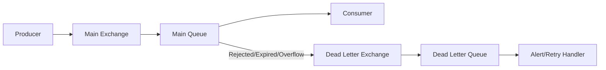
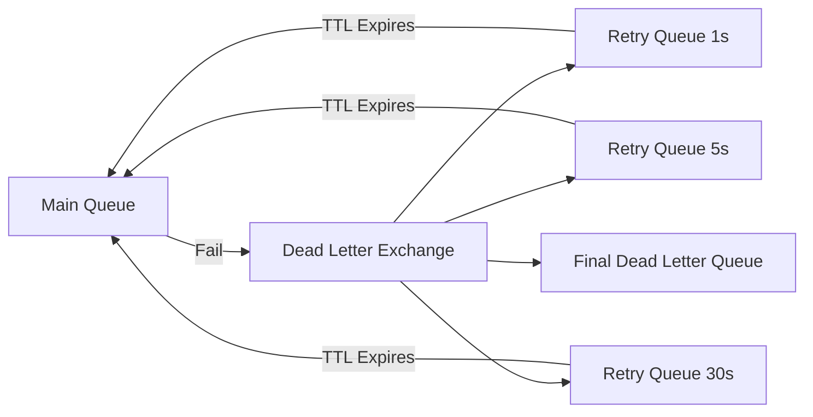

# How to Configure Dead Letter Exchanges in RabbitMQ

Author: [nawazdhandala](https://www.github.com/nawazdhandala)

Tags: RabbitMQ, Dead Letter Exchange, Error Handling, Message Queues, Reliability, DevOps

Description: A comprehensive guide to configuring dead letter exchanges in RabbitMQ for handling failed messages, including retry patterns and monitoring strategies.

---

Messages fail. Consumers crash, business logic rejects invalid data, and timeouts happen. Without a plan for handling these failures, messages simply disappear. Dead letter exchanges (DLX) capture these failed messages so you can analyze, retry, or alert on them.

## What is a Dead Letter Exchange?

A dead letter exchange is a normal RabbitMQ exchange where messages go when they cannot be delivered or processed. Messages become "dead letters" when:

- A consumer rejects the message with `requeue=false`
- The message TTL expires
- The queue reaches its maximum length



## Setting Up a Dead Letter Exchange

You need to create both the dead letter exchange and configure your main queue to use it.

### Using Python with Pika

```python
import pika

connection = pika.BlockingConnection(
    pika.ConnectionParameters('localhost')
)
channel = connection.channel()

# Step 1: Create the dead letter exchange
# This is just a regular exchange
channel.exchange_declare(
    exchange='dlx',
    exchange_type='direct',
    durable=True
)

# Step 2: Create the dead letter queue
channel.queue_declare(
    queue='dead_letters',
    durable=True
)

# Step 3: Bind dead letter queue to the exchange
channel.queue_bind(
    exchange='dlx',
    queue='dead_letters',
    routing_key='failed'
)

# Step 4: Create main exchange
channel.exchange_declare(
    exchange='orders',
    exchange_type='direct',
    durable=True
)

# Step 5: Create main queue with DLX configuration
# x-dead-letter-exchange: where to send dead letters
# x-dead-letter-routing-key: routing key for dead letters
channel.queue_declare(
    queue='order_processing',
    durable=True,
    arguments={
        'x-dead-letter-exchange': 'dlx',
        'x-dead-letter-routing-key': 'failed'
    }
)

channel.queue_bind(
    exchange='orders',
    queue='order_processing',
    routing_key='new_order'
)

print("Dead letter exchange configured")
connection.close()
```

### Using Node.js with amqplib

```javascript
const amqp = require('amqplib');

async function setupDeadLetterExchange() {
    const connection = await amqp.connect('amqp://localhost');
    const channel = await connection.createChannel();

    // Create dead letter exchange and queue
    await channel.assertExchange('dlx', 'direct', { durable: true });
    await channel.assertQueue('dead_letters', { durable: true });
    await channel.bindQueue('dead_letters', 'dlx', 'failed');

    // Create main exchange
    await channel.assertExchange('orders', 'direct', { durable: true });

    // Create main queue with DLX configuration
    await channel.assertQueue('order_processing', {
        durable: true,
        arguments: {
            'x-dead-letter-exchange': 'dlx',
            'x-dead-letter-routing-key': 'failed'
        }
    });

    await channel.bindQueue('order_processing', 'orders', 'new_order');

    console.log('Dead letter exchange configured');
    await connection.close();
}

setupDeadLetterExchange().catch(console.error);
```

## Rejecting Messages to Trigger Dead Lettering

When a consumer cannot process a message, reject it without requeuing to send it to the DLX.

### Python Consumer with Error Handling

```python
import pika
import json

def process_order(channel, method, properties, body):
    try:
        order = json.loads(body)
        print(f"Processing order: {order['id']}")

        # Simulate validation
        if order.get('total', 0) <= 0:
            raise ValueError("Order total must be positive")

        # Process the order...
        print(f"Order {order['id']} processed successfully")

        # Acknowledge successful processing
        channel.basic_ack(delivery_tag=method.delivery_tag)

    except json.JSONDecodeError as e:
        print(f"Invalid JSON: {e}")
        # Reject without requeue sends to DLX
        channel.basic_nack(delivery_tag=method.delivery_tag, requeue=False)

    except ValueError as e:
        print(f"Validation error: {e}")
        # Business logic rejection sends to DLX
        channel.basic_nack(delivery_tag=method.delivery_tag, requeue=False)

    except Exception as e:
        print(f"Processing error: {e}")
        # Unexpected errors also go to DLX
        channel.basic_nack(delivery_tag=method.delivery_tag, requeue=False)

connection = pika.BlockingConnection(pika.ConnectionParameters('localhost'))
channel = connection.channel()

channel.basic_qos(prefetch_count=1)
channel.basic_consume(queue='order_processing', on_message_callback=process_order)

print("Waiting for orders...")
channel.start_consuming()
```

### Node.js Consumer with Error Handling

```javascript
const amqp = require('amqplib');

async function consumeOrders() {
    const connection = await amqp.connect('amqp://localhost');
    const channel = await connection.createChannel();

    await channel.prefetch(1);

    channel.consume('order_processing', async (msg) => {
        try {
            const order = JSON.parse(msg.content.toString());
            console.log(`Processing order: ${order.id}`);

            // Validation
            if (!order.total || order.total <= 0) {
                throw new Error('Order total must be positive');
            }

            // Process order...
            console.log(`Order ${order.id} processed successfully`);

            // Acknowledge success
            channel.ack(msg);

        } catch (error) {
            console.error(`Failed to process order: ${error.message}`);
            // Reject without requeue sends to DLX
            channel.nack(msg, false, false);
        }
    });

    console.log('Waiting for orders...');
}

consumeOrders().catch(console.error);
```

## Message TTL and Dead Lettering

Messages can be dead-lettered when they expire. This is useful for time-sensitive operations.

```python
# Queue-level TTL: all messages expire after 30 seconds
channel.queue_declare(
    queue='time_sensitive_orders',
    durable=True,
    arguments={
        'x-dead-letter-exchange': 'dlx',
        'x-dead-letter-routing-key': 'expired',
        'x-message-ttl': 30000  # 30 seconds in milliseconds
    }
)

# Message-level TTL: per-message expiration
channel.basic_publish(
    exchange='orders',
    routing_key='new_order',
    body=json.dumps({'id': '123', 'total': 99.99}),
    properties=pika.BasicProperties(
        expiration='60000'  # 60 seconds
    )
)
```

## Queue Length Limits and Dead Lettering

Prevent queues from consuming unlimited memory by setting limits:

```python
# Dead letter oldest messages when queue exceeds 10000 messages
channel.queue_declare(
    queue='bounded_orders',
    durable=True,
    arguments={
        'x-dead-letter-exchange': 'dlx',
        'x-dead-letter-routing-key': 'overflow',
        'x-max-length': 10000,
        'x-overflow': 'reject-publish-dlx'
    }
)
```

Overflow behaviors:
- `drop-head`: Remove oldest messages (default)
- `reject-publish`: Reject new messages
- `reject-publish-dlx`: Reject new messages to DLX

## Implementing Retry Logic

Instead of losing failed messages, retry them with exponential backoff.



### Retry Implementation in Python

```python
import pika
import json

def setup_retry_queues(channel):
    # Create exchanges
    channel.exchange_declare(exchange='main', exchange_type='direct', durable=True)
    channel.exchange_declare(exchange='retry', exchange_type='direct', durable=True)
    channel.exchange_declare(exchange='dead', exchange_type='direct', durable=True)

    # Main queue with retry DLX
    channel.queue_declare(
        queue='work',
        durable=True,
        arguments={
            'x-dead-letter-exchange': 'retry',
            'x-dead-letter-routing-key': 'retry'
        }
    )
    channel.queue_bind(exchange='main', queue='work', routing_key='work')

    # Retry queue that sends back to main after TTL
    channel.queue_declare(
        queue='retry_5s',
        durable=True,
        arguments={
            'x-dead-letter-exchange': 'main',
            'x-dead-letter-routing-key': 'work',
            'x-message-ttl': 5000  # 5 seconds
        }
    )
    channel.queue_bind(exchange='retry', queue='retry_5s', routing_key='retry')

    # Final dead letter queue for messages that exceed retry limit
    channel.queue_declare(queue='dead_letters', durable=True)
    channel.queue_bind(exchange='dead', queue='dead_letters', routing_key='dead')

def process_with_retry(channel, method, properties, body):
    # Track retry count in headers
    headers = properties.headers or {}
    retry_count = headers.get('x-retry-count', 0)
    max_retries = 3

    try:
        message = json.loads(body)
        print(f"Processing (attempt {retry_count + 1}): {message}")

        # Simulate occasional failure
        if message.get('fail'):
            raise Exception("Simulated failure")

        channel.basic_ack(delivery_tag=method.delivery_tag)
        print("Success!")

    except Exception as e:
        print(f"Failed: {e}")

        if retry_count < max_retries:
            # Increment retry count and reject to retry queue
            print(f"Scheduling retry {retry_count + 1}/{max_retries}")
            channel.basic_nack(delivery_tag=method.delivery_tag, requeue=False)
        else:
            # Max retries exceeded, send to final dead letter queue
            print("Max retries exceeded, moving to dead letters")
            channel.basic_publish(
                exchange='dead',
                routing_key='dead',
                body=body,
                properties=pika.BasicProperties(
                    headers={'x-retry-count': retry_count, 'x-error': str(e)}
                )
            )
            channel.basic_ack(delivery_tag=method.delivery_tag)
```

## Preserving Original Message Information

When messages are dead-lettered, RabbitMQ adds metadata to the headers:

```python
def inspect_dead_letter(channel, method, properties, body):
    headers = properties.headers or {}

    # x-death contains dead letter history
    x_death = headers.get('x-death', [])

    if x_death:
        death_info = x_death[0]
        print(f"Original queue: {death_info.get('queue')}")
        print(f"Reason: {death_info.get('reason')}")
        print(f"Original exchange: {death_info.get('exchange')}")
        print(f"Original routing key: {death_info.get('routing-keys')}")
        print(f"Death count: {death_info.get('count')}")
        print(f"Death time: {death_info.get('time')}")

    message = json.loads(body)
    print(f"Message content: {message}")

    channel.basic_ack(delivery_tag=method.delivery_tag)
```

## Monitoring Dead Letter Queues

Set up alerts when messages accumulate in dead letter queues:

```bash
#!/bin/bash
# monitor_dlq.sh

DLQ_COUNT=$(rabbitmqctl list_queues name messages | grep dead_letters | awk '{print $2}')
THRESHOLD=100

if [ "$DLQ_COUNT" -gt "$THRESHOLD" ]; then
    echo "ALERT: Dead letter queue has $DLQ_COUNT messages"
    # Send alert via webhook, email, etc.
fi
```

Using the Management API:

```python
import requests

def check_dead_letter_queue(host, user, password, queue_name):
    url = f"http://{host}:15672/api/queues/%2F/{queue_name}"
    response = requests.get(url, auth=(user, password))
    data = response.json()

    message_count = data.get('messages', 0)
    message_rate = data.get('messages_details', {}).get('rate', 0)

    print(f"Dead letter queue: {message_count} messages ({message_rate}/s)")

    if message_count > 100:
        print("WARNING: High dead letter count!")
        # Trigger alert

check_dead_letter_queue('localhost', 'guest', 'guest', 'dead_letters')
```

## Best Practices

### Separate DLX by Failure Type

Use different routing keys or queues for different failure types:

```python
arguments = {
    'x-dead-letter-exchange': 'dlx',
    'x-dead-letter-routing-key': 'orders.validation_failed'
}
```

### Include Context in Rejected Messages

Add error information to headers before rejecting:

```python
# Republish with error context instead of simple reject
channel.basic_publish(
    exchange='dlx',
    routing_key='failed',
    body=body,
    properties=pika.BasicProperties(
        headers={
            'x-error-message': str(error),
            'x-error-timestamp': datetime.utcnow().isoformat(),
            'x-original-queue': 'order_processing'
        }
    )
)
channel.basic_ack(delivery_tag=method.delivery_tag)
```

### Clean Up Old Dead Letters

Implement a process to archive or delete old dead letters:

```python
def archive_old_dead_letters(max_age_hours=24):
    """Move old dead letters to long-term storage"""
    # Connect and consume from dead letter queue
    # Check x-death timestamp
    # Archive messages older than max_age_hours
    # Delete from queue
    pass
```

## Conclusion

Dead letter exchanges are essential for building reliable messaging systems. Configure them from the start, implement retry logic for transient failures, and monitor your dead letter queues. When something fails, you will have the information you need to diagnose and fix the problem rather than wondering where your messages went.
