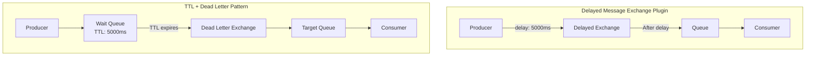

# How to Implement Delayed Messages in RabbitMQ

Author: [nawazdhandala](https://www.github.com/nawazdhandala)

Tags: RabbitMQ, Delayed Messages, Scheduling, Message Queues, Task Scheduling, Event-Driven Architecture

Description: Learn how to implement delayed message delivery in RabbitMQ using the delayed message exchange plugin and TTL-based patterns for scheduling future tasks.

---

Sometimes you need a message to be delivered not now, but later. A reminder email should go out in 24 hours. A retry should happen after a 5-minute cooldown. A subscription renewal check should run 30 days from now. RabbitMQ does not support delayed delivery natively, but there are two solid approaches to achieve it.

## Two Approaches to Delayed Messages

1. **Delayed Message Exchange Plugin**: A dedicated plugin that supports arbitrary delays
2. **TTL + Dead Letter Pattern**: Use message expiration to trigger delayed delivery



## Method 1: Delayed Message Exchange Plugin

The delayed message exchange plugin is the cleanest solution for arbitrary delays.

### Installing the Plugin

```bash
# Download the plugin (check for latest version)
wget https://github.com/rabbitmq/rabbitmq-delayed-message-exchange/releases/download/v3.12.0/rabbitmq_delayed_message_exchange-3.12.0.ez

# Copy to plugins directory
sudo cp rabbitmq_delayed_message_exchange-3.12.0.ez /usr/lib/rabbitmq/plugins/

# Enable the plugin
sudo rabbitmq-plugins enable rabbitmq_delayed_message_exchange

# Restart RabbitMQ
sudo systemctl restart rabbitmq-server
```

### Setting Up a Delayed Exchange

```python
import pika
import json
from datetime import datetime, timedelta

def setup_delayed_exchange():
    connection = pika.BlockingConnection(
        pika.ConnectionParameters('localhost')
    )
    channel = connection.channel()

    # Declare the delayed exchange
    # x-delayed-type specifies the underlying exchange type
    channel.exchange_declare(
        exchange='delayed_tasks',
        exchange_type='x-delayed-message',
        durable=True,
        arguments={
            'x-delayed-type': 'direct'  # Can be direct, topic, fanout, etc.
        }
    )

    # Declare and bind the target queue
    channel.queue_declare(queue='scheduled_tasks', durable=True)
    channel.queue_bind(
        exchange='delayed_tasks',
        queue='scheduled_tasks',
        routing_key='task'
    )

    print("Delayed exchange configured")
    connection.close()

setup_delayed_exchange()
```

### Publishing Delayed Messages

```python
import pika
import json
from datetime import datetime

def publish_delayed_message(task, delay_ms):
    """
    Publish a message with a delay in milliseconds.

    Args:
        task: The task data to send
        delay_ms: Delay in milliseconds before delivery
    """
    connection = pika.BlockingConnection(
        pika.ConnectionParameters('localhost')
    )
    channel = connection.channel()

    message = {
        'task': task,
        'scheduled_at': datetime.utcnow().isoformat(),
        'deliver_after_ms': delay_ms
    }

    # The x-delay header specifies the delay in milliseconds
    channel.basic_publish(
        exchange='delayed_tasks',
        routing_key='task',
        body=json.dumps(message),
        properties=pika.BasicProperties(
            delivery_mode=2,  # Persistent
            headers={
                'x-delay': delay_ms  # Delay in milliseconds
            }
        )
    )

    print(f"Scheduled task to run in {delay_ms}ms: {task}")
    connection.close()

# Schedule tasks with different delays
publish_delayed_message({'action': 'send_reminder', 'user_id': '123'}, 60000)  # 1 minute
publish_delayed_message({'action': 'check_payment', 'order_id': '456'}, 300000)  # 5 minutes
publish_delayed_message({'action': 'cleanup_temp', 'session_id': '789'}, 3600000)  # 1 hour
```

### Node.js Implementation

```javascript
const amqp = require('amqplib');

async function setupDelayedExchange() {
    const connection = await amqp.connect('amqp://localhost');
    const channel = await connection.createChannel();

    // Declare delayed exchange
    await channel.assertExchange('delayed_tasks', 'x-delayed-message', {
        durable: true,
        arguments: {
            'x-delayed-type': 'direct'
        }
    });

    // Declare and bind queue
    await channel.assertQueue('scheduled_tasks', { durable: true });
    await channel.bindQueue('scheduled_tasks', 'delayed_tasks', 'task');

    await connection.close();
}

async function publishDelayedMessage(task, delayMs) {
    const connection = await amqp.connect('amqp://localhost');
    const channel = await connection.createChannel();

    const message = {
        task: task,
        scheduledAt: new Date().toISOString(),
        deliverAfterMs: delayMs
    };

    channel.publish(
        'delayed_tasks',
        'task',
        Buffer.from(JSON.stringify(message)),
        {
            persistent: true,
            headers: {
                'x-delay': delayMs
            }
        }
    );

    console.log(`Scheduled task to run in ${delayMs}ms:`, task);
    await connection.close();
}

// Usage
async function main() {
    await setupDelayedExchange();
    await publishDelayedMessage({ action: 'send_email', to: 'user@example.com' }, 60000);
}

main().catch(console.error);
```

## Method 2: TTL + Dead Letter Pattern

If you cannot install plugins, use TTL and dead letter exchanges to achieve delays.

### How It Works

1. Publish message to a "wait" queue with a TTL
2. When TTL expires, message is dead-lettered to the target queue
3. Consumer processes the message from the target queue

### Setting Up TTL-Based Delays

```python
import pika
import json

def setup_ttl_delay_queues():
    connection = pika.BlockingConnection(
        pika.ConnectionParameters('localhost')
    )
    channel = connection.channel()

    # Target exchange and queue where delayed messages end up
    channel.exchange_declare(exchange='tasks', exchange_type='direct', durable=True)
    channel.queue_declare(queue='task_queue', durable=True)
    channel.queue_bind(exchange='tasks', queue='task_queue', routing_key='task')

    # Create wait queues for different delay intervals
    delays = [
        ('wait_1min', 60000),
        ('wait_5min', 300000),
        ('wait_30min', 1800000),
        ('wait_1hour', 3600000)
    ]

    for queue_name, ttl in delays:
        channel.queue_declare(
            queue=queue_name,
            durable=True,
            arguments={
                'x-dead-letter-exchange': 'tasks',
                'x-dead-letter-routing-key': 'task',
                'x-message-ttl': ttl
            }
        )
        print(f"Created wait queue: {queue_name} (TTL: {ttl}ms)")

    connection.close()

setup_ttl_delay_queues()
```

### Publishing with TTL-Based Delays

```python
def publish_with_delay(task, delay_queue):
    """
    Publish a message to a specific delay queue.

    Args:
        task: The task data
        delay_queue: Name of the wait queue (e.g., 'wait_5min')
    """
    connection = pika.BlockingConnection(
        pika.ConnectionParameters('localhost')
    )
    channel = connection.channel()

    message = {
        'task': task,
        'scheduled_at': datetime.utcnow().isoformat()
    }

    # Publish directly to the wait queue
    channel.basic_publish(
        exchange='',
        routing_key=delay_queue,
        body=json.dumps(message),
        properties=pika.BasicProperties(delivery_mode=2)
    )

    print(f"Task scheduled via {delay_queue}: {task}")
    connection.close()

# Usage
publish_with_delay({'action': 'send_reminder'}, 'wait_5min')
publish_with_delay({'action': 'retry_payment'}, 'wait_1min')
```

### Dynamic Delays with Per-Message TTL

For arbitrary delays without creating many queues:

```python
def setup_dynamic_delay():
    connection = pika.BlockingConnection(
        pika.ConnectionParameters('localhost')
    )
    channel = connection.channel()

    # Target queue
    channel.exchange_declare(exchange='tasks', exchange_type='direct', durable=True)
    channel.queue_declare(queue='task_queue', durable=True)
    channel.queue_bind(exchange='tasks', queue='task_queue', routing_key='task')

    # Single wait queue without queue-level TTL
    # Per-message TTL will be used instead
    channel.queue_declare(
        queue='wait_queue',
        durable=True,
        arguments={
            'x-dead-letter-exchange': 'tasks',
            'x-dead-letter-routing-key': 'task'
        }
    )

    connection.close()

def publish_with_dynamic_delay(task, delay_ms):
    """Publish with an arbitrary delay using per-message TTL"""
    connection = pika.BlockingConnection(
        pika.ConnectionParameters('localhost')
    )
    channel = connection.channel()

    message = json.dumps({
        'task': task,
        'scheduled_at': datetime.utcnow().isoformat()
    })

    channel.basic_publish(
        exchange='',
        routing_key='wait_queue',
        body=message,
        properties=pika.BasicProperties(
            delivery_mode=2,
            expiration=str(delay_ms)  # Per-message TTL in milliseconds
        )
    )

    print(f"Task scheduled with {delay_ms}ms delay: {task}")
    connection.close()

# Dynamic delays
publish_with_dynamic_delay({'action': 'check_status'}, 45000)  # 45 seconds
publish_with_dynamic_delay({'action': 'send_followup'}, 172800000)  # 2 days
```

## Real-World Patterns

### Pattern 1: Retry with Exponential Backoff

```python
class RetryScheduler:
    DELAYS = [1000, 5000, 30000, 300000, 3600000]  # 1s, 5s, 30s, 5m, 1h

    def __init__(self, channel):
        self.channel = channel

    def schedule_retry(self, task, attempt):
        """Schedule a retry with exponential backoff"""
        if attempt >= len(self.DELAYS):
            print(f"Max retries exceeded for task: {task}")
            return False

        delay_ms = self.DELAYS[attempt]

        message = json.dumps({
            'task': task,
            'attempt': attempt + 1,
            'scheduled_at': datetime.utcnow().isoformat()
        })

        self.channel.basic_publish(
            exchange='delayed_tasks',
            routing_key='retry',
            body=message,
            properties=pika.BasicProperties(
                delivery_mode=2,
                headers={'x-delay': delay_ms}
            )
        )

        print(f"Retry {attempt + 1} scheduled in {delay_ms}ms")
        return True

# Usage in consumer
def process_with_retry(channel, method, properties, body, scheduler):
    try:
        task = json.loads(body)
        # Process task...
        channel.basic_ack(delivery_tag=method.delivery_tag)
    except Exception as e:
        attempt = task.get('attempt', 0)
        if scheduler.schedule_retry(task['task'], attempt):
            channel.basic_ack(delivery_tag=method.delivery_tag)
        else:
            # Send to dead letter
            channel.basic_nack(delivery_tag=method.delivery_tag, requeue=False)
```

### Pattern 2: Scheduled Reminders

```python
class ReminderScheduler:
    def __init__(self, channel):
        self.channel = channel

    def schedule_reminder(self, user_id, message, deliver_at):
        """Schedule a reminder for a specific time"""
        now = datetime.utcnow()
        delay_ms = int((deliver_at - now).total_seconds() * 1000)

        if delay_ms < 0:
            print("Cannot schedule reminder in the past")
            return False

        reminder = {
            'user_id': user_id,
            'message': message,
            'scheduled_for': deliver_at.isoformat()
        }

        self.channel.basic_publish(
            exchange='delayed_tasks',
            routing_key='reminder',
            body=json.dumps(reminder),
            properties=pika.BasicProperties(
                delivery_mode=2,
                headers={'x-delay': delay_ms}
            )
        )

        print(f"Reminder scheduled for {deliver_at}: {message}")
        return True

# Usage
scheduler = ReminderScheduler(channel)
scheduler.schedule_reminder(
    user_id='123',
    message='Your subscription expires tomorrow',
    deliver_at=datetime.utcnow() + timedelta(days=29)
)
```

### Pattern 3: Rate-Limited Processing

```python
class RateLimitedQueue:
    def __init__(self, channel, min_delay_ms=100):
        self.channel = channel
        self.min_delay_ms = min_delay_ms
        self.last_publish = 0

    def publish_rate_limited(self, task):
        """Ensure minimum delay between message deliveries"""
        now = int(datetime.utcnow().timestamp() * 1000)
        time_since_last = now - self.last_publish

        delay_ms = max(0, self.min_delay_ms - time_since_last)

        self.channel.basic_publish(
            exchange='delayed_tasks',
            routing_key='rate_limited',
            body=json.dumps(task),
            properties=pika.BasicProperties(
                delivery_mode=2,
                headers={'x-delay': delay_ms}
            )
        )

        self.last_publish = now + delay_ms
```

## Consuming Delayed Messages

Consumers work the same as with regular queues:

```python
def consume_scheduled_tasks():
    connection = pika.BlockingConnection(
        pika.ConnectionParameters('localhost')
    )
    channel = connection.channel()

    def callback(ch, method, properties, body):
        task = json.loads(body)
        print(f"Processing scheduled task: {task}")

        # Check when it was scheduled vs now
        scheduled_at = datetime.fromisoformat(task.get('scheduled_at', ''))
        actual_delay = (datetime.utcnow() - scheduled_at).total_seconds()
        expected_delay = task.get('deliver_after_ms', 0) / 1000

        print(f"Expected delay: {expected_delay}s, Actual: {actual_delay:.2f}s")

        ch.basic_ack(delivery_tag=method.delivery_tag)

    channel.basic_consume(
        queue='scheduled_tasks',
        on_message_callback=callback
    )

    print("Waiting for scheduled tasks...")
    channel.start_consuming()
```

## Limitations and Considerations

### Plugin Limitations

- Maximum delay is about 24 days (2^31 - 1 milliseconds)
- Delayed messages are held in memory until delivery
- Cluster restarts may lose non-persisted delayed messages

### TTL Pattern Limitations

- Per-message TTL only works if messages are at the head of the queue
- Messages with longer TTL can block shorter TTL messages
- Requires pre-defined delay queues for best results

### Memory Usage

Monitor memory when using many delayed messages:

```bash
# Check memory used by delayed messages
rabbitmqctl list_queues name messages memory | grep -E "(delayed|wait)"
```

## Best Practices

1. **Use the plugin for arbitrary delays**: Simpler and more flexible
2. **Use TTL pattern for fixed intervals**: Less overhead, no plugin required
3. **Set reasonable maximum delays**: Avoid scheduling messages years in advance
4. **Monitor delayed message counts**: Alert if too many messages accumulate
5. **Handle time drift**: Use UTC timestamps and account for clock skew
6. **Test delay accuracy**: Actual delay may vary slightly from requested

## Conclusion

Delayed messages enable powerful scheduling patterns in RabbitMQ. The delayed message exchange plugin provides the cleanest solution for arbitrary delays, while the TTL-based pattern works without any plugins. Choose based on your requirements, and remember that both approaches have trade-offs in terms of precision and resource usage.
