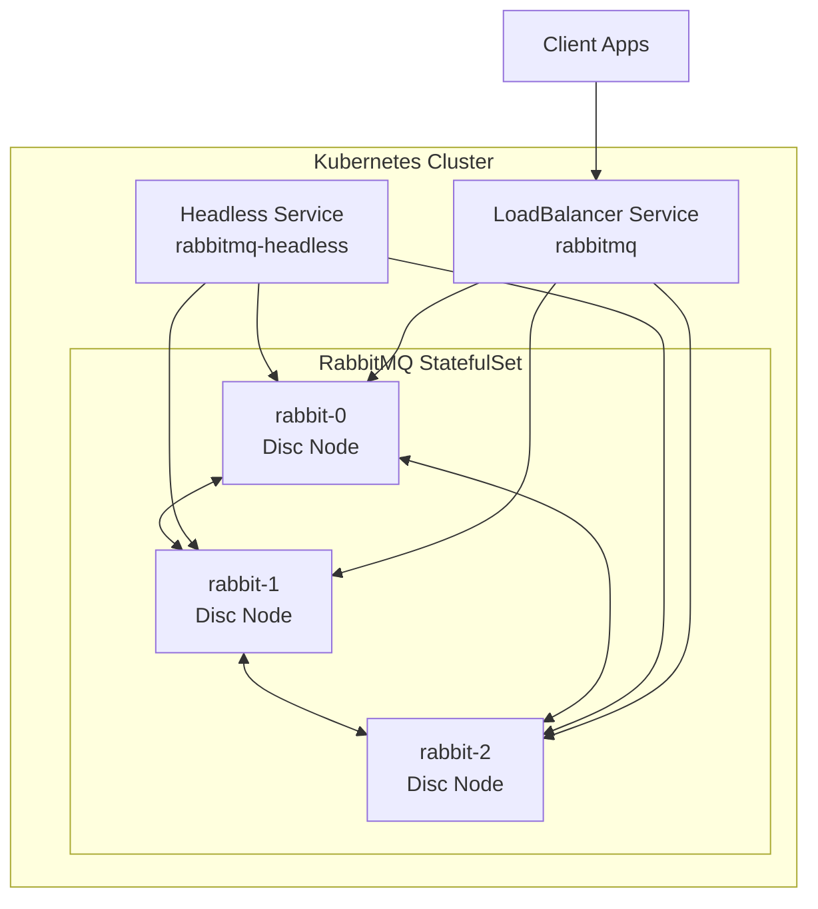

# How to Deploy RabbitMQ on Kubernetes

Author: [nawazdhandala](https://www.github.com/nawazdhandala)

Tags: RabbitMQ, Kubernetes, DevOps, Message Queues, Container Orchestration, High Availability

Description: A practical guide to deploying RabbitMQ on Kubernetes using the cluster operator, StatefulSets, and best practices for production-ready messaging infrastructure.

---

Running RabbitMQ on Kubernetes gives you automated failover, easy scaling, and integration with your existing infrastructure. But getting it right requires understanding both RabbitMQ clustering and Kubernetes primitives. This guide covers the essential patterns for production deployments.

## Deployment Options

Three main approaches for running RabbitMQ on Kubernetes:

1. **RabbitMQ Cluster Operator** - Recommended for most cases
2. **Helm Chart** - Quick setup with customization
3. **Manual StatefulSet** - Full control, more work



## Method 1: RabbitMQ Cluster Operator

The cluster operator is the officially supported way to run RabbitMQ on Kubernetes.

### Install the Operator

```bash
# Install the operator using kubectl
kubectl apply -f "https://github.com/rabbitmq/cluster-operator/releases/latest/download/cluster-operator.yml"

# Verify installation
kubectl get pods -n rabbitmq-system
```

### Create a RabbitMQ Cluster

```yaml
# rabbitmq-cluster.yaml
apiVersion: rabbitmq.com/v1beta1
kind: RabbitmqCluster
metadata:
  name: rabbitmq
  namespace: messaging
spec:
  replicas: 3

  # Resource allocation
  resources:
    requests:
      cpu: 500m
      memory: 1Gi
    limits:
      cpu: 2
      memory: 4Gi

  # Persistence configuration
  persistence:
    storageClassName: standard  # Use your storage class
    storage: 20Gi

  # RabbitMQ configuration
  rabbitmq:
    additionalConfig: |
      cluster_partition_handling = pause_minority
      vm_memory_high_watermark.relative = 0.7
      disk_free_limit.absolute = 2GB
      collect_statistics_interval = 10000

  # Enable management plugin
  rabbitmq:
    additionalPlugins:
      - rabbitmq_management
      - rabbitmq_prometheus
      - rabbitmq_shovel
      - rabbitmq_shovel_management

  # Service configuration
  service:
    type: LoadBalancer
    annotations:
      service.beta.kubernetes.io/aws-load-balancer-internal: "true"

  # Affinity rules for high availability
  affinity:
    podAntiAffinity:
      requiredDuringSchedulingIgnoredDuringExecution:
        - labelSelector:
            matchLabels:
              app.kubernetes.io/name: rabbitmq
          topologyKey: kubernetes.io/hostname
```

Apply the configuration:

```bash
kubectl create namespace messaging
kubectl apply -f rabbitmq-cluster.yaml

# Watch cluster formation
kubectl get pods -n messaging -w
```

### Access Credentials

The operator creates a secret with default credentials:

```bash
# Get username
kubectl get secret rabbitmq-default-user -n messaging -o jsonpath='{.data.username}' | base64 --decode

# Get password
kubectl get secret rabbitmq-default-user -n messaging -o jsonpath='{.data.password}' | base64 --decode

# Get connection string
kubectl get secret rabbitmq-default-user -n messaging -o jsonpath='{.data.uri}' | base64 --decode
```

## Method 2: Helm Chart Deployment

For quick deployments with common defaults:

```bash
# Add Bitnami repo
helm repo add bitnami https://charts.bitnami.com/bitnami
helm repo update

# Install with custom values
helm install rabbitmq bitnami/rabbitmq \
  --namespace messaging \
  --create-namespace \
  --set replicaCount=3 \
  --set auth.username=admin \
  --set auth.password=secretpassword \
  --set persistence.size=20Gi \
  --set resources.requests.memory=1Gi \
  --set resources.requests.cpu=500m
```

Custom values file for more control:

```yaml
# values.yaml
replicaCount: 3

auth:
  username: admin
  password: secretpassword
  erlangCookie: "MYSECRETCOOKIE123456"

persistence:
  enabled: true
  size: 20Gi
  storageClass: "standard"

resources:
  requests:
    memory: 1Gi
    cpu: 500m
  limits:
    memory: 4Gi
    cpu: 2

clustering:
  enabled: true
  forceBoot: false

metrics:
  enabled: true
  serviceMonitor:
    enabled: true  # For Prometheus Operator

extraConfiguration: |
  cluster_partition_handling = pause_minority
  vm_memory_high_watermark.relative = 0.7
```

Install with values file:

```bash
helm install rabbitmq bitnami/rabbitmq -f values.yaml -n messaging
```

## Method 3: Manual StatefulSet

For complete control over the deployment:

```yaml
# namespace.yaml
apiVersion: v1
kind: Namespace
metadata:
  name: messaging
---
# configmap.yaml
apiVersion: v1
kind: ConfigMap
metadata:
  name: rabbitmq-config
  namespace: messaging
data:
  enabled_plugins: |
    [rabbitmq_management,rabbitmq_prometheus,rabbitmq_peer_discovery_k8s].

  rabbitmq.conf: |
    cluster_formation.peer_discovery_backend = k8s
    cluster_formation.k8s.host = kubernetes.default.svc.cluster.local
    cluster_formation.k8s.address_type = hostname
    cluster_formation.k8s.service_name = rabbitmq-headless
    cluster_formation.k8s.hostname_suffix = .rabbitmq-headless.messaging.svc.cluster.local
    cluster_formation.node_cleanup.interval = 30
    cluster_formation.node_cleanup.only_log_warning = true
    cluster_partition_handling = pause_minority
    queue_master_locator = min-masters
    vm_memory_high_watermark.relative = 0.7
    disk_free_limit.absolute = 2GB

---
# secret.yaml
apiVersion: v1
kind: Secret
metadata:
  name: rabbitmq-secret
  namespace: messaging
type: Opaque
stringData:
  erlang-cookie: "MYSUPERSECRETCOOKIE"
  default-user: "admin"
  default-pass: "changeme123"

---
# rbac.yaml
apiVersion: v1
kind: ServiceAccount
metadata:
  name: rabbitmq
  namespace: messaging
---
apiVersion: rbac.authorization.k8s.io/v1
kind: Role
metadata:
  name: rabbitmq
  namespace: messaging
rules:
  - apiGroups: [""]
    resources: ["endpoints"]
    verbs: ["get", "list", "watch"]
---
apiVersion: rbac.authorization.k8s.io/v1
kind: RoleBinding
metadata:
  name: rabbitmq
  namespace: messaging
subjects:
  - kind: ServiceAccount
    name: rabbitmq
roleRef:
  apiGroup: rbac.authorization.k8s.io
  kind: Role
  name: rabbitmq

---
# services.yaml
apiVersion: v1
kind: Service
metadata:
  name: rabbitmq-headless
  namespace: messaging
spec:
  clusterIP: None
  selector:
    app: rabbitmq
  ports:
    - name: amqp
      port: 5672
    - name: management
      port: 15672
    - name: epmd
      port: 4369
    - name: clustering
      port: 25672
---
apiVersion: v1
kind: Service
metadata:
  name: rabbitmq
  namespace: messaging
spec:
  type: LoadBalancer
  selector:
    app: rabbitmq
  ports:
    - name: amqp
      port: 5672
    - name: management
      port: 15672

---
# statefulset.yaml
apiVersion: apps/v1
kind: StatefulSet
metadata:
  name: rabbitmq
  namespace: messaging
spec:
  serviceName: rabbitmq-headless
  replicas: 3
  selector:
    matchLabels:
      app: rabbitmq
  template:
    metadata:
      labels:
        app: rabbitmq
    spec:
      serviceAccountName: rabbitmq
      terminationGracePeriodSeconds: 120

      affinity:
        podAntiAffinity:
          requiredDuringSchedulingIgnoredDuringExecution:
            - labelSelector:
                matchLabels:
                  app: rabbitmq
              topologyKey: kubernetes.io/hostname

      containers:
        - name: rabbitmq
          image: rabbitmq:3.12-management
          ports:
            - containerPort: 5672
              name: amqp
            - containerPort: 15672
              name: management
            - containerPort: 4369
              name: epmd
            - containerPort: 25672
              name: clustering

          env:
            - name: RABBITMQ_DEFAULT_USER
              valueFrom:
                secretKeyRef:
                  name: rabbitmq-secret
                  key: default-user
            - name: RABBITMQ_DEFAULT_PASS
              valueFrom:
                secretKeyRef:
                  name: rabbitmq-secret
                  key: default-pass
            - name: RABBITMQ_ERLANG_COOKIE
              valueFrom:
                secretKeyRef:
                  name: rabbitmq-secret
                  key: erlang-cookie
            - name: K8S_SERVICE_NAME
              value: rabbitmq-headless
            - name: K8S_HOSTNAME_SUFFIX
              value: .rabbitmq-headless.messaging.svc.cluster.local
            - name: RABBITMQ_NODENAME
              valueFrom:
                fieldRef:
                  fieldPath: metadata.name
            - name: RABBITMQ_USE_LONGNAME
              value: "true"

          resources:
            requests:
              memory: 1Gi
              cpu: 500m
            limits:
              memory: 4Gi
              cpu: 2

          volumeMounts:
            - name: data
              mountPath: /var/lib/rabbitmq/mnesia
            - name: config
              mountPath: /etc/rabbitmq/conf.d/10-custom.conf
              subPath: rabbitmq.conf
            - name: config
              mountPath: /etc/rabbitmq/enabled_plugins
              subPath: enabled_plugins

          livenessProbe:
            exec:
              command: ["rabbitmq-diagnostics", "ping"]
            initialDelaySeconds: 60
            periodSeconds: 30
            timeoutSeconds: 15

          readinessProbe:
            exec:
              command: ["rabbitmq-diagnostics", "check_port_connectivity"]
            initialDelaySeconds: 20
            periodSeconds: 10
            timeoutSeconds: 10

      volumes:
        - name: config
          configMap:
            name: rabbitmq-config

  volumeClaimTemplates:
    - metadata:
        name: data
      spec:
        accessModes: ["ReadWriteOnce"]
        storageClassName: standard
        resources:
          requests:
            storage: 20Gi
```

Apply all resources:

```bash
kubectl apply -f namespace.yaml
kubectl apply -f configmap.yaml
kubectl apply -f secret.yaml
kubectl apply -f rbac.yaml
kubectl apply -f services.yaml
kubectl apply -f statefulset.yaml
```

## Connecting from Applications

### Using Kubernetes DNS

```python
import pika

# Connect using the service DNS name
connection = pika.BlockingConnection(
    pika.ConnectionParameters(
        host='rabbitmq.messaging.svc.cluster.local',
        port=5672,
        credentials=pika.PlainCredentials('admin', 'password')
    )
)
```

### Using Environment Variables

```yaml
# In your application deployment
env:
  - name: RABBITMQ_HOST
    value: rabbitmq.messaging.svc.cluster.local
  - name: RABBITMQ_USER
    valueFrom:
      secretKeyRef:
        name: rabbitmq-default-user
        key: username
  - name: RABBITMQ_PASS
    valueFrom:
      secretKeyRef:
        name: rabbitmq-default-user
        key: password
```

## Monitoring and Observability

### Enable Prometheus Metrics

```yaml
# servicemonitor.yaml
apiVersion: monitoring.coreos.com/v1
kind: ServiceMonitor
metadata:
  name: rabbitmq
  namespace: messaging
spec:
  selector:
    matchLabels:
      app: rabbitmq
  endpoints:
    - port: prometheus
      interval: 15s
      path: /metrics
```

### Pod Disruption Budget

Ensure cluster availability during node maintenance:

```yaml
apiVersion: policy/v1
kind: PodDisruptionBudget
metadata:
  name: rabbitmq-pdb
  namespace: messaging
spec:
  minAvailable: 2
  selector:
    matchLabels:
      app: rabbitmq
```

## Scaling the Cluster

### Horizontal Scaling

```bash
# Scale up (operator)
kubectl patch rabbitmqcluster rabbitmq -n messaging \
  --type merge -p '{"spec":{"replicas":5}}'

# Scale up (StatefulSet)
kubectl scale statefulset rabbitmq -n messaging --replicas=5
```

### Vertical Scaling

```yaml
# Update resource limits
spec:
  resources:
    requests:
      cpu: 1
      memory: 2Gi
    limits:
      cpu: 4
      memory: 8Gi
```

## Backup and Recovery

### Backup Definitions

```bash
# Export definitions (queues, exchanges, users, policies)
kubectl exec -n messaging rabbitmq-0 -- \
  rabbitmqctl export_definitions /tmp/definitions.json

# Copy to local
kubectl cp messaging/rabbitmq-0:/tmp/definitions.json ./backup-definitions.json
```

### Restore Definitions

```bash
# Copy definitions to pod
kubectl cp ./backup-definitions.json messaging/rabbitmq-0:/tmp/definitions.json

# Import definitions
kubectl exec -n messaging rabbitmq-0 -- \
  rabbitmqctl import_definitions /tmp/definitions.json
```

## Troubleshooting

### Check Cluster Status

```bash
# View cluster status
kubectl exec -n messaging rabbitmq-0 -- rabbitmqctl cluster_status

# Check node health
kubectl exec -n messaging rabbitmq-0 -- rabbitmq-diagnostics check_running
```

### View Logs

```bash
# Stream logs from all pods
kubectl logs -n messaging -l app=rabbitmq -f

# Logs from specific pod
kubectl logs -n messaging rabbitmq-0
```

### Force Cluster Reset

If a node gets stuck:

```bash
# Reset a specific node
kubectl exec -n messaging rabbitmq-1 -- rabbitmqctl stop_app
kubectl exec -n messaging rabbitmq-1 -- rabbitmqctl reset
kubectl exec -n messaging rabbitmq-1 -- rabbitmqctl join_cluster rabbit@rabbitmq-0.rabbitmq-headless.messaging.svc.cluster.local
kubectl exec -n messaging rabbitmq-1 -- rabbitmqctl start_app
```

## Best Practices

1. **Use the Cluster Operator**: Less maintenance, better defaults
2. **Set Pod Anti-Affinity**: Distribute pods across nodes
3. **Configure PDB**: Maintain quorum during maintenance
4. **Use Persistent Volumes**: Survive pod restarts
5. **Set Resource Limits**: Prevent memory issues
6. **Enable Prometheus Metrics**: Monitor everything
7. **Backup Definitions**: Automate definition backups
8. **Use Separate Namespace**: Isolate messaging infrastructure

## Conclusion

Deploying RabbitMQ on Kubernetes requires careful attention to clustering, persistence, and high availability. The cluster operator simplifies most of this, but understanding the underlying components helps when troubleshooting. Start with the operator for new deployments, and customize as your requirements grow.
