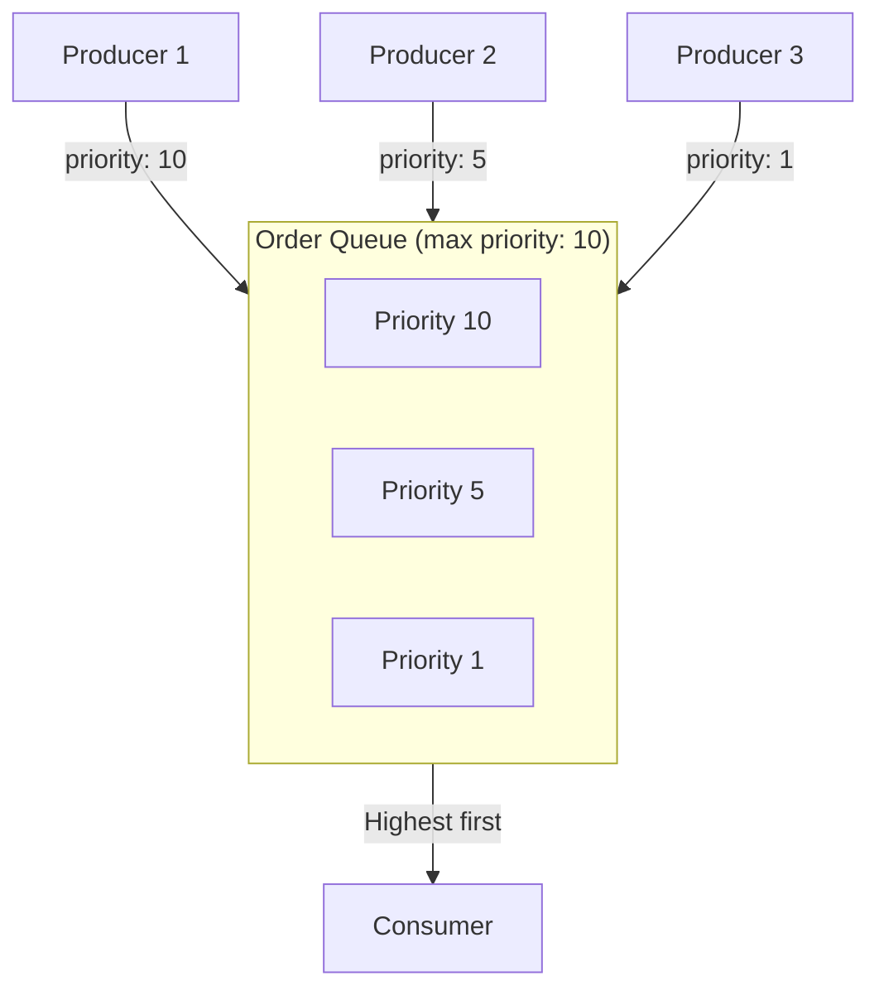

# How to Implement Priority Queues in RabbitMQ

Author: [nawazdhandala](https://www.github.com/nawazdhandala)

Tags: RabbitMQ, Priority Queues, Message Queues, Performance, Task Scheduling, DevOps

Description: Learn how to implement priority queues in RabbitMQ to ensure high-priority messages are processed first, with practical examples and performance considerations.

---

Not all messages are created equal. A password reset request should jump ahead of a marketing email. A fraud alert needs attention before a routine notification. Priority queues let you ensure critical messages get processed first, even when your queue has a backlog.

## How Priority Queues Work

RabbitMQ implements priority queues as a single queue with multiple internal sub-queues, one for each priority level. When a consumer asks for a message, RabbitMQ delivers from the highest priority sub-queue first.



## Setting Up a Priority Queue

Priority queues require declaring the queue with a maximum priority level.

### Python Implementation

```python
import pika
import json
import random

def setup_priority_queue():
    connection = pika.BlockingConnection(
        pika.ConnectionParameters('localhost')
    )
    channel = connection.channel()

    # Declare a priority queue
    # x-max-priority sets the maximum priority level (1-255, recommended max 10)
    channel.queue_declare(
        queue='tasks',
        durable=True,
        arguments={
            'x-max-priority': 10  # Priority levels 0-10
        }
    )

    print("Priority queue created")
    connection.close()

setup_priority_queue()
```

### Node.js Implementation

```javascript
const amqp = require('amqplib');

async function setupPriorityQueue() {
    const connection = await amqp.connect('amqp://localhost');
    const channel = await connection.createChannel();

    // Declare queue with maximum priority
    await channel.assertQueue('tasks', {
        durable: true,
        arguments: {
            'x-max-priority': 10
        }
    });

    console.log('Priority queue created');
    await connection.close();
}

setupPriorityQueue().catch(console.error);
```

## Publishing Messages with Priority

Set the priority when publishing each message. Higher numbers mean higher priority.

### Python Publisher

```python
import pika
import json

class PriorityPublisher:
    # Define priority levels as constants
    PRIORITY_LOW = 1
    PRIORITY_NORMAL = 5
    PRIORITY_HIGH = 8
    PRIORITY_CRITICAL = 10

    def __init__(self):
        self.connection = pika.BlockingConnection(
            pika.ConnectionParameters('localhost')
        )
        self.channel = self.connection.channel()

    def publish(self, task, priority=5):
        """Publish a task with specified priority"""
        message = json.dumps(task)

        self.channel.basic_publish(
            exchange='',
            routing_key='tasks',
            body=message,
            properties=pika.BasicProperties(
                delivery_mode=2,  # Persistent
                priority=priority,
                content_type='application/json'
            )
        )
        print(f"Published task with priority {priority}: {task['type']}")

    def close(self):
        self.connection.close()

# Example usage
publisher = PriorityPublisher()

# Publish various tasks with different priorities
publisher.publish(
    {'type': 'password_reset', 'user_id': '123'},
    priority=PriorityPublisher.PRIORITY_CRITICAL
)

publisher.publish(
    {'type': 'send_newsletter', 'campaign_id': '456'},
    priority=PriorityPublisher.PRIORITY_LOW
)

publisher.publish(
    {'type': 'process_order', 'order_id': '789'},
    priority=PriorityPublisher.PRIORITY_HIGH
)

publisher.publish(
    {'type': 'update_analytics', 'event': 'page_view'},
    priority=PriorityPublisher.PRIORITY_NORMAL
)

publisher.close()
```

### Node.js Publisher

```javascript
const amqp = require('amqplib');

// Priority level constants
const Priority = {
    LOW: 1,
    NORMAL: 5,
    HIGH: 8,
    CRITICAL: 10
};

async function publishTask(task, priority = Priority.NORMAL) {
    const connection = await amqp.connect('amqp://localhost');
    const channel = await connection.createChannel();

    channel.sendToQueue(
        'tasks',
        Buffer.from(JSON.stringify(task)),
        {
            persistent: true,
            priority: priority,
            contentType: 'application/json'
        }
    );

    console.log(`Published task with priority ${priority}: ${task.type}`);
    await connection.close();
}

// Publish tasks with different priorities
async function main() {
    await publishTask(
        { type: 'password_reset', userId: '123' },
        Priority.CRITICAL
    );

    await publishTask(
        { type: 'send_newsletter', campaignId: '456' },
        Priority.LOW
    );

    await publishTask(
        { type: 'process_order', orderId: '789' },
        Priority.HIGH
    );
}

main().catch(console.error);
```

## Consuming from Priority Queues

Consumers do not need special configuration. RabbitMQ automatically delivers higher priority messages first.

### Python Consumer

```python
import pika
import json
import time

def process_task(channel, method, properties, body):
    task = json.loads(body)
    priority = properties.priority or 0

    print(f"Processing task (priority {priority}): {task['type']}")

    # Simulate work
    time.sleep(1)

    print(f"Completed: {task['type']}")
    channel.basic_ack(delivery_tag=method.delivery_tag)

connection = pika.BlockingConnection(pika.ConnectionParameters('localhost'))
channel = connection.channel()

# Process one task at a time to demonstrate priority ordering
channel.basic_qos(prefetch_count=1)

channel.basic_consume(
    queue='tasks',
    on_message_callback=process_task
)

print("Waiting for tasks...")
channel.start_consuming()
```

### Node.js Consumer

```javascript
const amqp = require('amqplib');

async function consumeTasks() {
    const connection = await amqp.connect('amqp://localhost');
    const channel = await connection.createChannel();

    // Process one at a time to see priority ordering
    await channel.prefetch(1);

    console.log('Waiting for tasks...');

    channel.consume('tasks', async (msg) => {
        const task = JSON.parse(msg.content.toString());
        const priority = msg.properties.priority || 0;

        console.log(`Processing task (priority ${priority}): ${task.type}`);

        // Simulate work
        await new Promise(resolve => setTimeout(resolve, 1000));

        console.log(`Completed: ${task.type}`);
        channel.ack(msg);
    });
}

consumeTasks().catch(console.error);
```

## Priority Queue Behavior

Understanding how priority queues behave helps you use them effectively.

### Empty Queue Behavior

When the queue is empty, all messages are delivered immediately regardless of priority. Priority ordering only matters when messages are waiting in the queue.

### Prefetch and Priority

If your prefetch count is high, consumers may pull multiple messages before processing starts. This can dilute the priority effect:

```python
# Low prefetch ensures priority ordering is respected
channel.basic_qos(prefetch_count=1)  # Good for strict priority

# High prefetch may batch messages of mixed priority
channel.basic_qos(prefetch_count=100)  # Priority less effective
```

### Memory Usage

Each priority level uses a separate internal queue. Higher maximum priority values use more memory:

```python
# 10 priority levels - reasonable memory use
arguments={'x-max-priority': 10}

# 255 priority levels - high memory overhead
arguments={'x-max-priority': 255}  # Usually unnecessary
```

## Real-World Priority Patterns

### Pattern 1: Notification System

```python
class NotificationPriority:
    SECURITY_ALERT = 10    # Password changed, suspicious login
    TRANSACTIONAL = 8      # Order confirmation, shipping update
    ACCOUNT = 5            # Welcome email, profile update
    MARKETING = 2          # Newsletter, promotions
    ANALYTICS = 1          # Tracking, metrics

def send_notification(notification_type, recipient, content, priority):
    message = {
        'type': notification_type,
        'recipient': recipient,
        'content': content,
        'timestamp': datetime.utcnow().isoformat()
    }

    channel.basic_publish(
        exchange='',
        routing_key='notifications',
        body=json.dumps(message),
        properties=pika.BasicProperties(
            priority=priority,
            delivery_mode=2
        )
    )

# Usage
send_notification(
    'security_alert',
    'user@example.com',
    'New login detected from unknown device',
    NotificationPriority.SECURITY_ALERT
)
```

### Pattern 2: Task Queue with SLA

```python
class TaskPriority:
    PLATINUM = 10  # < 1 minute SLA
    GOLD = 7       # < 5 minute SLA
    SILVER = 4     # < 30 minute SLA
    BRONZE = 1     # Best effort

def get_priority_for_customer(customer_tier):
    tier_map = {
        'platinum': TaskPriority.PLATINUM,
        'gold': TaskPriority.GOLD,
        'silver': TaskPriority.SILVER,
        'bronze': TaskPriority.BRONZE
    }
    return tier_map.get(customer_tier, TaskPriority.BRONZE)

def submit_task(task, customer_tier):
    priority = get_priority_for_customer(customer_tier)

    channel.basic_publish(
        exchange='',
        routing_key='work_queue',
        body=json.dumps(task),
        properties=pika.BasicProperties(
            priority=priority,
            headers={'customer_tier': customer_tier}
        )
    )
```

### Pattern 3: Retry with Decreasing Priority

Failed tasks can be retried with lower priority to prevent them from blocking new work:

```python
def process_with_priority_decay(channel, method, properties, body):
    priority = properties.priority or 5
    retry_count = (properties.headers or {}).get('x-retry-count', 0)

    try:
        task = json.loads(body)
        # Process task...
        channel.basic_ack(delivery_tag=method.delivery_tag)

    except Exception as e:
        if retry_count < 3:
            # Republish with lower priority
            new_priority = max(1, priority - 2)

            channel.basic_publish(
                exchange='',
                routing_key='tasks',
                body=body,
                properties=pika.BasicProperties(
                    priority=new_priority,
                    headers={'x-retry-count': retry_count + 1}
                )
            )
            print(f"Retrying with priority {new_priority}")
        else:
            print(f"Max retries reached, moving to dead letter")
            # Send to dead letter queue

        channel.basic_ack(delivery_tag=method.delivery_tag)
```

## Performance Considerations

### Benchmark Results

Priority queues have overhead compared to regular queues:

| Queue Type | Messages/sec | Memory per 10K messages |
|------------|--------------|-------------------------|
| Regular | 50,000 | 10 MB |
| Priority (max 5) | 35,000 | 15 MB |
| Priority (max 10) | 30,000 | 20 MB |

*Results vary based on message size and hardware*

### When Not to Use Priority Queues

Avoid priority queues when:
- You need maximum throughput
- All messages have the same priority
- You have separate queues for different priority levels already
- Queue depth is always near zero (no backlog)

### Alternative: Multiple Queues

For very high throughput, use separate queues with dedicated consumers:

```python
# High priority queue with more consumers
channel.queue_declare(queue='tasks_high', durable=True)

# Low priority queue with fewer consumers
channel.queue_declare(queue='tasks_low', durable=True)

# Route based on priority at publish time
def publish_task(task, is_high_priority):
    queue = 'tasks_high' if is_high_priority else 'tasks_low'
    channel.basic_publish(exchange='', routing_key=queue, body=json.dumps(task))
```

## Monitoring Priority Queues

Monitor the breakdown of messages by priority:

```python
import requests

def get_queue_priority_breakdown(host, queue_name, user, password):
    """Get message counts by priority level"""
    url = f"http://{host}:15672/api/queues/%2F/{queue_name}"
    response = requests.get(url, auth=(user, password))
    data = response.json()

    # Check backing queue mode
    print(f"Queue: {queue_name}")
    print(f"Total messages: {data.get('messages', 0)}")
    print(f"Backing queue mode: {data.get('backing_queue_status', {}).get('mode', 'unknown')}")

    # Priority queues report priority distribution in certain versions
    if 'message_stats' in data:
        print(f"Message stats: {data['message_stats']}")

get_queue_priority_breakdown('localhost', 'tasks', 'guest', 'guest')
```

## Best Practices

1. **Keep priority levels small**: 5-10 levels are sufficient for most use cases
2. **Use meaningful constants**: Define priority levels with descriptive names
3. **Set low prefetch**: Use `prefetch_count=1` for strict priority ordering
4. **Monitor queue depth**: Priority only matters when there is a backlog
5. **Document priority meanings**: Make sure your team understands what each level means
6. **Consider alternatives**: Sometimes separate queues work better than priority

## Conclusion

Priority queues help ensure critical messages get processed first during high load. Set up a queue with a reasonable maximum priority, publish messages with appropriate priority values, and keep your prefetch count low to maintain ordering. For extreme throughput needs, consider using multiple queues instead of a single priority queue.
