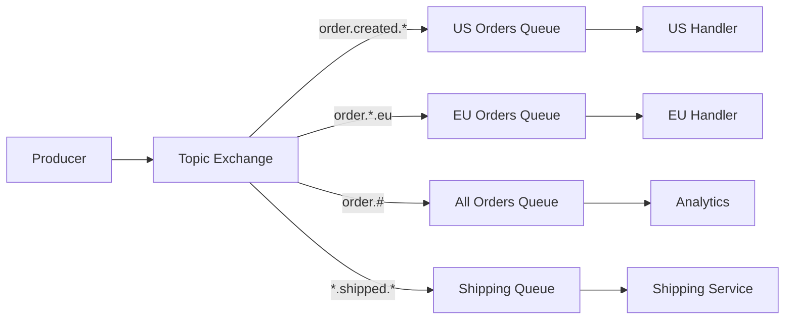

# How to Implement Topic Exchanges in RabbitMQ

Author: [nawazdhandala](https://www.github.com/nawazdhandala)

Tags: RabbitMQ, Topic Exchange, Message Routing, Pub/Sub, Message Queues, Event-Driven Architecture

Description: Learn how to implement topic exchanges in RabbitMQ for flexible message routing using wildcard patterns, with practical examples in Python and Node.js.

---

Topic exchanges give you the flexibility of pattern-based routing in RabbitMQ. Unlike direct exchanges that route based on exact key matches, topic exchanges let you use wildcards to create sophisticated routing patterns. This is perfect for event-driven architectures where consumers need to subscribe to specific categories of messages.

## Understanding Topic Exchanges

A topic exchange routes messages based on the routing key pattern. The routing key must be a list of words separated by dots (e.g., `order.created.us`).

Two special characters work as wildcards:
- `*` (star) matches exactly one word
- `#` (hash) matches zero or more words



## When to Use Topic Exchanges

Topic exchanges work well for:
- Log aggregation by severity and source
- Geographic routing of events
- Multi-tenant applications
- Microservices event distribution
- Any scenario where consumers need subset filtering

## Setting Up a Topic Exchange

First, create a topic exchange and bind queues with routing patterns.

### Using Python with Pika

```python
import pika

# Connect to RabbitMQ
connection = pika.BlockingConnection(
    pika.ConnectionParameters('localhost')
)
channel = connection.channel()

# Declare a topic exchange
# durable=True ensures the exchange survives broker restarts
channel.exchange_declare(
    exchange='events',
    exchange_type='topic',
    durable=True
)

# Declare queues for different consumers
channel.queue_declare(queue='us_orders', durable=True)
channel.queue_declare(queue='eu_orders', durable=True)
channel.queue_declare(queue='all_orders', durable=True)
channel.queue_declare(queue='shipping', durable=True)

# Bind queues with routing patterns
# This queue receives orders created in the US
channel.queue_bind(
    exchange='events',
    queue='us_orders',
    routing_key='order.created.us'
)

# This queue receives all EU order events
channel.queue_bind(
    exchange='events',
    queue='eu_orders',
    routing_key='order.*.eu'
)

# This queue receives ALL order events
channel.queue_bind(
    exchange='events',
    queue='all_orders',
    routing_key='order.#'
)

# This queue receives shipped events from any region
channel.queue_bind(
    exchange='events',
    queue='shipping',
    routing_key='*.shipped.*'
)

print("Exchange and queues configured successfully")
connection.close()
```

### Using Node.js with amqplib

```javascript
const amqp = require('amqplib');

async function setupTopicExchange() {
    // Connect to RabbitMQ
    const connection = await amqp.connect('amqp://localhost');
    const channel = await connection.createChannel();

    // Declare topic exchange
    await channel.assertExchange('events', 'topic', {
        durable: true
    });

    // Declare and bind queues
    const queues = [
        { name: 'us_orders', pattern: 'order.created.us' },
        { name: 'eu_orders', pattern: 'order.*.eu' },
        { name: 'all_orders', pattern: 'order.#' },
        { name: 'shipping', pattern: '*.shipped.*' }
    ];

    for (const q of queues) {
        await channel.assertQueue(q.name, { durable: true });
        await channel.bindQueue(q.name, 'events', q.pattern);
        console.log(`Bound ${q.name} to pattern: ${q.pattern}`);
    }

    await connection.close();
}

setupTopicExchange().catch(console.error);
```

## Publishing Messages

When publishing, specify a routing key that describes the message content.

### Python Publisher

```python
import pika
import json
from datetime import datetime

def publish_event(event_type, region, data):
    connection = pika.BlockingConnection(
        pika.ConnectionParameters('localhost')
    )
    channel = connection.channel()

    # Build routing key from event type and region
    # Example: order.created.us or order.shipped.eu
    routing_key = f"{event_type}.{region}"

    message = {
        'event': event_type,
        'region': region,
        'data': data,
        'timestamp': datetime.utcnow().isoformat()
    }

    # Publish with the routing key
    channel.basic_publish(
        exchange='events',
        routing_key=routing_key,
        body=json.dumps(message),
        properties=pika.BasicProperties(
            delivery_mode=2,  # Make message persistent
            content_type='application/json'
        )
    )

    print(f"Published {routing_key}: {data}")
    connection.close()

# Publish various events
publish_event('order.created', 'us', {'order_id': '12345', 'total': 99.99})
publish_event('order.created', 'eu', {'order_id': '12346', 'total': 149.99})
publish_event('order.shipped', 'us', {'order_id': '12345', 'carrier': 'UPS'})
publish_event('order.cancelled', 'eu', {'order_id': '12346', 'reason': 'customer request'})
```

### Node.js Publisher

```javascript
const amqp = require('amqplib');

async function publishEvent(eventType, region, data) {
    const connection = await amqp.connect('amqp://localhost');
    const channel = await connection.createChannel();

    const routingKey = `${eventType}.${region}`;

    const message = {
        event: eventType,
        region: region,
        data: data,
        timestamp: new Date().toISOString()
    };

    channel.publish(
        'events',
        routingKey,
        Buffer.from(JSON.stringify(message)),
        {
            persistent: true,
            contentType: 'application/json'
        }
    );

    console.log(`Published ${routingKey}:`, data);
    await connection.close();
}

// Example usage
async function main() {
    await publishEvent('order.created', 'us', { orderId: '12345', total: 99.99 });
    await publishEvent('order.created', 'eu', { orderId: '12346', total: 149.99 });
    await publishEvent('order.shipped', 'us', { orderId: '12345', carrier: 'UPS' });
}

main().catch(console.error);
```

## Consuming Messages

Consumers subscribe to queues and process messages matching their bound patterns.

### Python Consumer

```python
import pika
import json

def consume_orders(queue_name):
    connection = pika.BlockingConnection(
        pika.ConnectionParameters('localhost')
    )
    channel = connection.channel()

    def callback(ch, method, properties, body):
        message = json.loads(body)
        print(f"[{queue_name}] Received: {message['event']} from {message['region']}")
        print(f"  Data: {message['data']}")

        # Acknowledge message after processing
        ch.basic_ack(delivery_tag=method.delivery_tag)

    # Set prefetch to process one message at a time
    channel.basic_qos(prefetch_count=1)

    channel.basic_consume(
        queue=queue_name,
        on_message_callback=callback
    )

    print(f"Waiting for messages on {queue_name}...")
    channel.start_consuming()

# Run consumer for all orders
consume_orders('all_orders')
```

### Node.js Consumer

```javascript
const amqp = require('amqplib');

async function consumeOrders(queueName) {
    const connection = await amqp.connect('amqp://localhost');
    const channel = await connection.createChannel();

    // Process one message at a time
    await channel.prefetch(1);

    console.log(`Waiting for messages on ${queueName}...`);

    channel.consume(queueName, (msg) => {
        if (msg !== null) {
            const message = JSON.parse(msg.content.toString());
            console.log(`[${queueName}] Received: ${message.event} from ${message.region}`);
            console.log(`  Data:`, message.data);

            // Acknowledge after processing
            channel.ack(msg);
        }
    });
}

// Start consuming from the all_orders queue
consumeOrders('all_orders').catch(console.error);
```

## Advanced Routing Patterns

### Multiple Bindings per Queue

A single queue can have multiple bindings to receive messages from different patterns:

```python
# Receive both US and EU orders in one queue
channel.queue_bind(exchange='events', queue='north_atlantic', routing_key='order.*.us')
channel.queue_bind(exchange='events', queue='north_atlantic', routing_key='order.*.eu')
channel.queue_bind(exchange='events', queue='north_atlantic', routing_key='order.*.uk')
```

### Hierarchical Routing Keys

Design routing keys with a consistent hierarchy for maximum flexibility:

```
# Format: entity.action.region.priority
order.created.us.high
order.shipped.eu.normal
payment.processed.asia.high
inventory.updated.global.low
```

Consumers can then subscribe at any level:
- `order.#` - All order events
- `*.created.#` - All created events
- `#.high` - All high priority events
- `order.*.us.*` - All US order events

### Dynamic Subscription

Let consumers dynamically add subscriptions:

```python
def subscribe_to_pattern(channel, queue_name, pattern):
    """Add a new subscription pattern to an existing queue"""
    channel.queue_bind(
        exchange='events',
        queue=queue_name,
        routing_key=pattern
    )
    print(f"Subscribed {queue_name} to {pattern}")

def unsubscribe_from_pattern(channel, queue_name, pattern):
    """Remove a subscription pattern from a queue"""
    channel.queue_unbind(
        exchange='events',
        queue=queue_name,
        routing_key=pattern
    )
    print(f"Unsubscribed {queue_name} from {pattern}")
```

## Comparing Topic Exchange to Other Types

| Exchange Type | Routing | Use Case |
|---------------|---------|----------|
| Direct | Exact key match | Task queues, RPC |
| Fanout | Broadcast to all | Notifications, logs |
| Topic | Pattern matching | Event filtering, pub/sub |
| Headers | Header matching | Complex routing rules |

Topic exchanges offer a good balance between flexibility and performance. They are slightly slower than direct exchanges due to pattern matching, but the routing flexibility is worth it for most use cases.

## Best Practices

### Keep Routing Keys Consistent

Define a schema for your routing keys and document it:

```python
# routing_keys.py
# Schema: {domain}.{action}.{region}.{priority}

class RoutingKeys:
    @staticmethod
    def order_created(region, priority='normal'):
        return f"order.created.{region}.{priority}"

    @staticmethod
    def order_shipped(region, priority='normal'):
        return f"order.shipped.{region}.{priority}"

    @staticmethod
    def pattern_all_orders():
        return "order.#"

    @staticmethod
    def pattern_region(region):
        return f"*.*.{region}.*"
```

### Avoid Overly Complex Patterns

Keep your routing key depth manageable. Four to five levels is usually sufficient. More levels add complexity without much benefit.

### Monitor Unroutable Messages

Set up an alternate exchange to catch messages that do not match any binding:

```python
# Create alternate exchange for unrouted messages
channel.exchange_declare(exchange='unrouted', exchange_type='fanout')
channel.queue_declare(queue='unrouted_messages')
channel.queue_bind(exchange='unrouted', queue='unrouted_messages')

# Declare main exchange with alternate exchange
channel.exchange_declare(
    exchange='events',
    exchange_type='topic',
    durable=True,
    arguments={'alternate-exchange': 'unrouted'}
)
```

## Conclusion

Topic exchanges provide the routing flexibility needed for complex event-driven systems. Design your routing keys with a clear hierarchy, use wildcards strategically, and your consumers will receive exactly the messages they need. Start with simple patterns and add complexity only when necessary.
