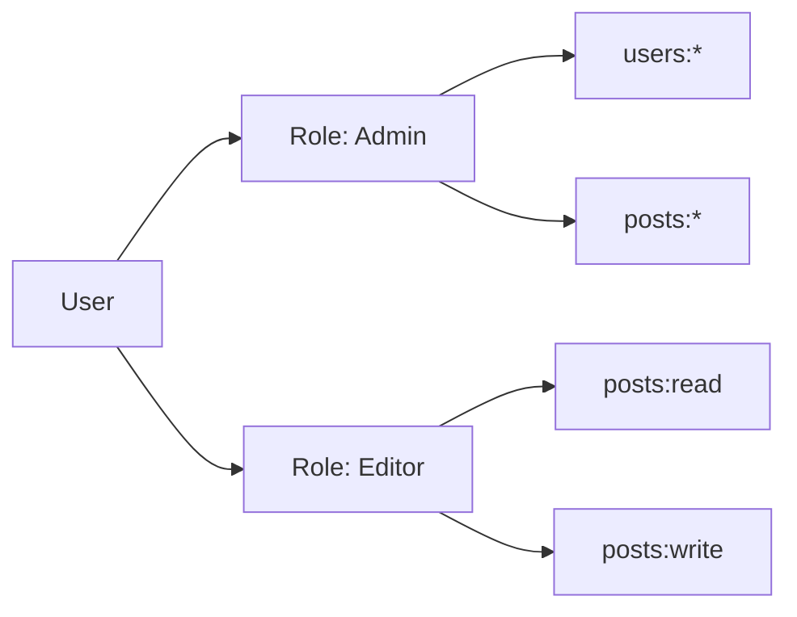

# How to Implement RBAC with Custom Guards in NestJS

Author: [nawazdhandala](https://www.github.com/nawazdhandala)

Tags: NodeJS, TypeScript, NestJS, RBAC, Security, Authorization, Guards

Description: Learn how to implement Role-Based Access Control (RBAC) in NestJS using custom guards, decorators, and a flexible permission system that scales with your application.

---

Authorization is one of the most critical aspects of any application. While NestJS provides basic authentication patterns, implementing a robust Role-Based Access Control (RBAC) system requires careful design. This guide walks through building a production-ready RBAC system with custom guards, decorators, and a hierarchical permission model.

## RBAC Concepts

Before diving into code, let's clarify the key concepts in RBAC:

| Concept | Description |
|---------|-------------|
| **User** | An entity that authenticates and performs actions |
| **Role** | A named collection of permissions (e.g., admin, editor, viewer) |
| **Permission** | A specific action on a resource (e.g., users:read, posts:delete) |
| **Resource** | An entity in your system (users, posts, orders) |
| **Action** | An operation on a resource (create, read, update, delete) |



## Project Setup

First, set up a new NestJS project with the required dependencies.

```bash
# Create a new NestJS project
nest new rbac-demo

# Install required packages
npm install @nestjs/passport passport passport-jwt @nestjs/jwt
npm install bcrypt class-validator class-transformer
npm install -D @types/passport-jwt @types/bcrypt
```

## Permission and Role Definitions

Define your permissions and roles in a structured way. Using constants prevents typos and enables autocomplete.

```typescript
// src/auth/permissions.ts
// Define all permissions as constants for type safety and autocomplete
// Format: resource:action where action can be create, read, update, delete, or *

export const PERMISSIONS = {
  // User management permissions
  USERS_CREATE: 'users:create',
  USERS_READ: 'users:read',
  USERS_UPDATE: 'users:update',
  USERS_DELETE: 'users:delete',
  USERS_ALL: 'users:*',

  // Post management permissions
  POSTS_CREATE: 'posts:create',
  POSTS_READ: 'posts:read',
  POSTS_UPDATE: 'posts:update',
  POSTS_DELETE: 'posts:delete',
  POSTS_ALL: 'posts:*',

  // Comment permissions
  COMMENTS_CREATE: 'comments:create',
  COMMENTS_READ: 'comments:read',
  COMMENTS_DELETE: 'comments:delete',
  COMMENTS_MODERATE: 'comments:moderate',

  // Analytics permissions
  ANALYTICS_VIEW: 'analytics:view',
  ANALYTICS_EXPORT: 'analytics:export',

  // System permissions
  SYSTEM_ADMIN: 'system:admin',
} as const;

export type Permission = typeof PERMISSIONS[keyof typeof PERMISSIONS];

// src/auth/roles.ts
// Define roles with their associated permissions
// Roles can include wildcard permissions for broader access

import { PERMISSIONS, Permission } from './permissions';

export interface RoleDefinition {
  name: string;
  description: string;
  permissions: Permission[];
  inherits?: string[];  // Roles this role inherits from
}

export const ROLES: Record<string, RoleDefinition> = {
  // Viewer can only read content
  viewer: {
    name: 'viewer',
    description: 'Can view public content',
    permissions: [
      PERMISSIONS.POSTS_READ,
      PERMISSIONS.COMMENTS_READ,
    ],
  },

  // Editor can manage content but not users
  editor: {
    name: 'editor',
    description: 'Can create and edit content',
    permissions: [
      PERMISSIONS.POSTS_CREATE,
      PERMISSIONS.POSTS_READ,
      PERMISSIONS.POSTS_UPDATE,
      PERMISSIONS.COMMENTS_CREATE,
      PERMISSIONS.COMMENTS_READ,
      PERMISSIONS.COMMENTS_DELETE,
    ],
    inherits: ['viewer'],
  },

  // Moderator can moderate content
  moderator: {
    name: 'moderator',
    description: 'Can moderate user content',
    permissions: [
      PERMISSIONS.POSTS_DELETE,
      PERMISSIONS.COMMENTS_MODERATE,
    ],
    inherits: ['editor'],
  },

  // Admin has full access
  admin: {
    name: 'admin',
    description: 'Full system access',
    permissions: [
      PERMISSIONS.USERS_ALL,
      PERMISSIONS.POSTS_ALL,
      PERMISSIONS.ANALYTICS_VIEW,
      PERMISSIONS.ANALYTICS_EXPORT,
      PERMISSIONS.SYSTEM_ADMIN,
    ],
    inherits: ['moderator'],
  },
};
```

## Permission Service

Create a service that resolves permissions for users, handling role inheritance and wildcard matching.

```typescript
// src/auth/permission.service.ts
import { Injectable } from '@nestjs/common';
import { ROLES, RoleDefinition } from './roles';
import { Permission } from './permissions';

@Injectable()
export class PermissionService {
  // Cache resolved permissions per role to avoid recomputation
  private rolePermissionCache: Map<string, Set<string>> = new Map();

  // Get all permissions for a role, including inherited ones
  getPermissionsForRole(roleName: string): Set<string> {
    // Check cache first
    if (this.rolePermissionCache.has(roleName)) {
      return this.rolePermissionCache.get(roleName)!;
    }

    const role = ROLES[roleName];
    if (!role) {
      return new Set();
    }

    const permissions = new Set<string>(role.permissions);

    // Add inherited permissions recursively
    if (role.inherits) {
      for (const parentRole of role.inherits) {
        const parentPermissions = this.getPermissionsForRole(parentRole);
        parentPermissions.forEach(p => permissions.add(p));
      }
    }

    // Cache the result
    this.rolePermissionCache.set(roleName, permissions);

    return permissions;
  }

  // Get all permissions for a user with multiple roles
  getPermissionsForUser(roles: string[]): Set<string> {
    const allPermissions = new Set<string>();

    for (const role of roles) {
      const rolePermissions = this.getPermissionsForRole(role);
      rolePermissions.forEach(p => allPermissions.add(p));
    }

    return allPermissions;
  }

  // Check if a permission set includes a specific permission
  // Handles wildcard matching: users:* matches users:read
  hasPermission(userPermissions: Set<string>, required: string): boolean {
    // Direct match
    if (userPermissions.has(required)) {
      return true;
    }

    // Check for wildcard permissions
    const [resource, action] = required.split(':');

    // Check for resource wildcard (e.g., users:* includes users:read)
    if (userPermissions.has(`${resource}:*`)) {
      return true;
    }

    // Check for system admin (full access)
    if (userPermissions.has('system:admin')) {
      return true;
    }

    return false;
  }

  // Check if user has all required permissions
  hasAllPermissions(userPermissions: Set<string>, required: string[]): boolean {
    return required.every(perm => this.hasPermission(userPermissions, perm));
  }

  // Check if user has any of the required permissions
  hasAnyPermission(userPermissions: Set<string>, required: string[]): boolean {
    return required.some(perm => this.hasPermission(userPermissions, perm));
  }
}
```

## Custom Decorators

Create decorators to mark routes with required permissions. These decorators use NestJS metadata to store requirements that guards will check.

```typescript
// src/auth/decorators/permissions.decorator.ts
import { SetMetadata } from '@nestjs/common';
import { Permission } from '../permissions';

// Key used to store permission metadata
export const PERMISSIONS_KEY = 'permissions';

// Decorator to require specific permissions on a route
// Usage: @RequirePermissions(PERMISSIONS.USERS_READ, PERMISSIONS.USERS_UPDATE)
export const RequirePermissions = (...permissions: Permission[]) =>
  SetMetadata(PERMISSIONS_KEY, permissions);

// src/auth/decorators/roles.decorator.ts
import { SetMetadata } from '@nestjs/common';

export const ROLES_KEY = 'roles';

// Decorator to require specific roles on a route
// Usage: @RequireRoles('admin', 'moderator')
export const RequireRoles = (...roles: string[]) =>
  SetMetadata(ROLES_KEY, roles);

// src/auth/decorators/public.decorator.ts
import { SetMetadata } from '@nestjs/common';

export const IS_PUBLIC_KEY = 'isPublic';

// Decorator to mark a route as public (no auth required)
// Usage: @Public()
export const Public = () => SetMetadata(IS_PUBLIC_KEY, true);

// src/auth/decorators/current-user.decorator.ts
import { createParamDecorator, ExecutionContext } from '@nestjs/common';

// Decorator to extract current user from request
// Usage: @CurrentUser() user: User
export const CurrentUser = createParamDecorator(
  (data: string | undefined, ctx: ExecutionContext) => {
    const request = ctx.switchToHttp().getRequest();
    const user = request.user;

    // If data is provided, return that specific property
    return data ? user?.[data] : user;
  },
);
```

## User Entity and JWT Payload

Define the user entity and JWT payload structure.

```typescript
// src/users/user.entity.ts
export interface User {
  id: string;
  email: string;
  passwordHash: string;
  roles: string[];
  isActive: boolean;
  createdAt: Date;
  updatedAt: Date;
}

// src/auth/interfaces/jwt-payload.interface.ts
export interface JwtPayload {
  sub: string;        // User ID
  email: string;
  roles: string[];
  iat?: number;       // Issued at
  exp?: number;       // Expiration
}
```

## JWT Strategy

Implement the Passport JWT strategy to validate tokens and attach user info to requests.

```typescript
// src/auth/strategies/jwt.strategy.ts
import { Injectable, UnauthorizedException } from '@nestjs/common';
import { PassportStrategy } from '@nestjs/passport';
import { ExtractJwt, Strategy } from 'passport-jwt';
import { ConfigService } from '@nestjs/config';
import { JwtPayload } from '../interfaces/jwt-payload.interface';
import { UsersService } from '../../users/users.service';

@Injectable()
export class JwtStrategy extends PassportStrategy(Strategy) {
  constructor(
    private configService: ConfigService,
    private usersService: UsersService,
  ) {
    super({
      jwtFromRequest: ExtractJwt.fromAuthHeaderAsBearerToken(),
      ignoreExpiration: false,
      secretOrKey: configService.get<string>('JWT_SECRET'),
    });
  }

  // Passport calls this after token validation
  // Return value is attached to request.user
  async validate(payload: JwtPayload) {
    const user = await this.usersService.findById(payload.sub);

    if (!user || !user.isActive) {
      throw new UnauthorizedException('User not found or inactive');
    }

    // Return user info that will be available in guards
    return {
      id: user.id,
      email: user.email,
      roles: user.roles,
    };
  }
}
```

## RBAC Guard Implementation

Now for the main event: the custom guard that enforces permissions.

```typescript
// src/auth/guards/rbac.guard.ts
import {
  Injectable,
  CanActivate,
  ExecutionContext,
  ForbiddenException,
} from '@nestjs/common';
import { Reflector } from '@nestjs/core';
import { PERMISSIONS_KEY } from '../decorators/permissions.decorator';
import { ROLES_KEY } from '../decorators/roles.decorator';
import { IS_PUBLIC_KEY } from '../decorators/public.decorator';
import { PermissionService } from '../permission.service';
import { Permission } from '../permissions';

@Injectable()
export class RbacGuard implements CanActivate {
  constructor(
    private reflector: Reflector,
    private permissionService: PermissionService,
  ) {}

  canActivate(context: ExecutionContext): boolean {
    // Check if route is marked as public
    const isPublic = this.reflector.getAllAndOverride<boolean>(IS_PUBLIC_KEY, [
      context.getHandler(),
      context.getClass(),
    ]);

    if (isPublic) {
      return true;
    }

    const request = context.switchToHttp().getRequest();
    const user = request.user;

    if (!user) {
      throw new ForbiddenException('No user found in request');
    }

    // Get required permissions from decorator metadata
    const requiredPermissions = this.reflector.getAllAndOverride<Permission[]>(
      PERMISSIONS_KEY,
      [context.getHandler(), context.getClass()],
    );

    // Get required roles from decorator metadata
    const requiredRoles = this.reflector.getAllAndOverride<string[]>(
      ROLES_KEY,
      [context.getHandler(), context.getClass()],
    );

    // If no requirements specified, allow access (authenticated is enough)
    if (!requiredPermissions?.length && !requiredRoles?.length) {
      return true;
    }

    // Get user's effective permissions
    const userPermissions = this.permissionService.getPermissionsForUser(user.roles);

    // Check role requirements
    if (requiredRoles?.length) {
      const hasRole = requiredRoles.some(role => user.roles.includes(role));
      if (!hasRole) {
        throw new ForbiddenException(
          `Requires one of these roles: ${requiredRoles.join(', ')}`
        );
      }
    }

    // Check permission requirements
    if (requiredPermissions?.length) {
      const hasAllPermissions = this.permissionService.hasAllPermissions(
        userPermissions,
        requiredPermissions,
      );

      if (!hasAllPermissions) {
        throw new ForbiddenException(
          `Missing required permissions: ${requiredPermissions.join(', ')}`
        );
      }
    }

    return true;
  }
}
```

## Resource Ownership Guard

Sometimes you need to check if a user owns a resource, not just has a permission. This guard handles that pattern.

```typescript
// src/auth/guards/resource-owner.guard.ts
import {
  Injectable,
  CanActivate,
  ExecutionContext,
  ForbiddenException,
} from '@nestjs/common';
import { Reflector } from '@nestjs/core';
import { PermissionService } from '../permission.service';
import { PERMISSIONS } from '../permissions';

// Metadata key for resource ownership configuration
export const RESOURCE_OWNER_KEY = 'resourceOwner';

export interface ResourceOwnerConfig {
  paramName: string;           // URL param containing resource ID
  userIdField: string;         // Field on resource that holds owner ID
  allowAdminOverride: boolean; // Allow admins to bypass ownership check
}

// Decorator to configure resource ownership check
export const CheckResourceOwner = (config: ResourceOwnerConfig) =>
  Reflect.metadata(RESOURCE_OWNER_KEY, config);

@Injectable()
export class ResourceOwnerGuard implements CanActivate {
  constructor(
    private reflector: Reflector,
    private permissionService: PermissionService,
  ) {}

  async canActivate(context: ExecutionContext): Promise<boolean> {
    const config = this.reflector.get<ResourceOwnerConfig>(
      RESOURCE_OWNER_KEY,
      context.getHandler(),
    );

    if (!config) {
      return true; // No ownership check configured
    }

    const request = context.switchToHttp().getRequest();
    const user = request.user;

    // Check admin override
    if (config.allowAdminOverride) {
      const userPermissions = this.permissionService.getPermissionsForUser(user.roles);
      if (userPermissions.has(PERMISSIONS.SYSTEM_ADMIN)) {
        return true;
      }
    }

    // Get resource from request
    // The resource should be loaded by a previous interceptor or guard
    const resource = request.resource;

    if (!resource) {
      throw new ForbiddenException('Resource not found');
    }

    // Check ownership
    const ownerId = resource[config.userIdField];
    if (ownerId !== user.id) {
      throw new ForbiddenException('You do not own this resource');
    }

    return true;
  }
}
```

## Module Configuration

Wire everything together in the auth module.

```typescript
// src/auth/auth.module.ts
import { Module, Global } from '@nestjs/common';
import { JwtModule } from '@nestjs/jwt';
import { PassportModule } from '@nestjs/passport';
import { ConfigModule, ConfigService } from '@nestjs/config';
import { APP_GUARD } from '@nestjs/core';
import { JwtStrategy } from './strategies/jwt.strategy';
import { JwtAuthGuard } from './guards/jwt-auth.guard';
import { RbacGuard } from './guards/rbac.guard';
import { PermissionService } from './permission.service';
import { AuthService } from './auth.service';
import { UsersModule } from '../users/users.module';

@Global()
@Module({
  imports: [
    UsersModule,
    PassportModule.register({ defaultStrategy: 'jwt' }),
    JwtModule.registerAsync({
      imports: [ConfigModule],
      useFactory: async (configService: ConfigService) => ({
        secret: configService.get<string>('JWT_SECRET'),
        signOptions: {
          expiresIn: configService.get<string>('JWT_EXPIRATION', '1h'),
        },
      }),
      inject: [ConfigService],
    }),
  ],
  providers: [
    AuthService,
    PermissionService,
    JwtStrategy,
    // Apply JWT guard globally
    {
      provide: APP_GUARD,
      useClass: JwtAuthGuard,
    },
    // Apply RBAC guard globally
    {
      provide: APP_GUARD,
      useClass: RbacGuard,
    },
  ],
  exports: [AuthService, PermissionService],
})
export class AuthModule {}
```

## Controller Usage Examples

Here is how to use the RBAC system in your controllers.

```typescript
// src/users/users.controller.ts
import {
  Controller,
  Get,
  Post,
  Put,
  Delete,
  Body,
  Param,
} from '@nestjs/common';
import { RequirePermissions } from '../auth/decorators/permissions.decorator';
import { RequireRoles } from '../auth/decorators/roles.decorator';
import { Public } from '../auth/decorators/public.decorator';
import { CurrentUser } from '../auth/decorators/current-user.decorator';
import { PERMISSIONS } from '../auth/permissions';
import { UsersService } from './users.service';
import { CreateUserDto, UpdateUserDto } from './dto';

@Controller('users')
export class UsersController {
  constructor(private usersService: UsersService) {}

  // Only admins can list all users
  @Get()
  @RequirePermissions(PERMISSIONS.USERS_READ)
  async findAll() {
    return this.usersService.findAll();
  }

  // Any authenticated user can view their own profile
  @Get('me')
  async getProfile(@CurrentUser() user) {
    return this.usersService.findById(user.id);
  }

  // Only users with create permission
  @Post()
  @RequirePermissions(PERMISSIONS.USERS_CREATE)
  async create(@Body() dto: CreateUserDto) {
    return this.usersService.create(dto);
  }

  // Require specific role
  @Put(':id/roles')
  @RequireRoles('admin')
  async updateRoles(
    @Param('id') id: string,
    @Body() body: { roles: string[] },
  ) {
    return this.usersService.updateRoles(id, body.roles);
  }

  // Multiple permissions required
  @Delete(':id')
  @RequirePermissions(PERMISSIONS.USERS_DELETE)
  async remove(@Param('id') id: string) {
    return this.usersService.remove(id);
  }
}

// src/posts/posts.controller.ts
@Controller('posts')
export class PostsController {
  constructor(private postsService: PostsService) {}

  // Public endpoint, no auth required
  @Public()
  @Get()
  async findAll() {
    return this.postsService.findAll();
  }

  // Requires posts:create permission
  @Post()
  @RequirePermissions(PERMISSIONS.POSTS_CREATE)
  async create(@Body() dto: CreatePostDto, @CurrentUser() user) {
    return this.postsService.create(dto, user.id);
  }

  // Combine permissions check with ownership
  @Put(':id')
  @RequirePermissions(PERMISSIONS.POSTS_UPDATE)
  async update(
    @Param('id') id: string,
    @Body() dto: UpdatePostDto,
    @CurrentUser() user,
  ) {
    const post = await this.postsService.findById(id);

    // Check ownership or admin permission
    if (post.authorId !== user.id && !user.roles.includes('admin')) {
      throw new ForbiddenException('Cannot edit posts you do not own');
    }

    return this.postsService.update(id, dto);
  }
}
```

## Testing RBAC

Write tests to verify your RBAC logic works correctly.

```typescript
// src/auth/permission.service.spec.ts
import { Test, TestingModule } from '@nestjs/testing';
import { PermissionService } from './permission.service';
import { PERMISSIONS } from './permissions';

describe('PermissionService', () => {
  let service: PermissionService;

  beforeEach(async () => {
    const module: TestingModule = await Test.createTestingModule({
      providers: [PermissionService],
    }).compile();

    service = module.get<PermissionService>(PermissionService);
  });

  describe('getPermissionsForRole', () => {
    it('should return permissions for viewer role', () => {
      const permissions = service.getPermissionsForRole('viewer');
      expect(permissions.has(PERMISSIONS.POSTS_READ)).toBe(true);
      expect(permissions.has(PERMISSIONS.POSTS_CREATE)).toBe(false);
    });

    it('should include inherited permissions', () => {
      const permissions = service.getPermissionsForRole('editor');
      // Direct permission
      expect(permissions.has(PERMISSIONS.POSTS_CREATE)).toBe(true);
      // Inherited from viewer
      expect(permissions.has(PERMISSIONS.POSTS_READ)).toBe(true);
    });
  });

  describe('hasPermission', () => {
    it('should match direct permissions', () => {
      const permissions = new Set([PERMISSIONS.POSTS_READ]);
      expect(service.hasPermission(permissions, PERMISSIONS.POSTS_READ)).toBe(true);
      expect(service.hasPermission(permissions, PERMISSIONS.POSTS_CREATE)).toBe(false);
    });

    it('should match wildcard permissions', () => {
      const permissions = new Set([PERMISSIONS.POSTS_ALL]);
      expect(service.hasPermission(permissions, PERMISSIONS.POSTS_READ)).toBe(true);
      expect(service.hasPermission(permissions, PERMISSIONS.POSTS_DELETE)).toBe(true);
      expect(service.hasPermission(permissions, PERMISSIONS.USERS_READ)).toBe(false);
    });

    it('should grant full access to system admin', () => {
      const permissions = new Set([PERMISSIONS.SYSTEM_ADMIN]);
      expect(service.hasPermission(permissions, PERMISSIONS.POSTS_DELETE)).toBe(true);
      expect(service.hasPermission(permissions, PERMISSIONS.USERS_DELETE)).toBe(true);
    });
  });
});
```

## Summary

Building RBAC in NestJS involves several components working together:

1. **Permissions**: Define granular actions on resources
2. **Roles**: Group permissions into named collections with inheritance
3. **Permission Service**: Resolve effective permissions with wildcard support
4. **Custom Decorators**: Mark routes with requirements
5. **Guards**: Enforce permissions at runtime

This approach provides flexibility to add new permissions and roles without changing guard logic. The hierarchical role system reduces duplication, and wildcard matching simplifies admin access patterns.

For production systems, consider storing roles and permissions in a database rather than code, enabling runtime updates without deployments.
