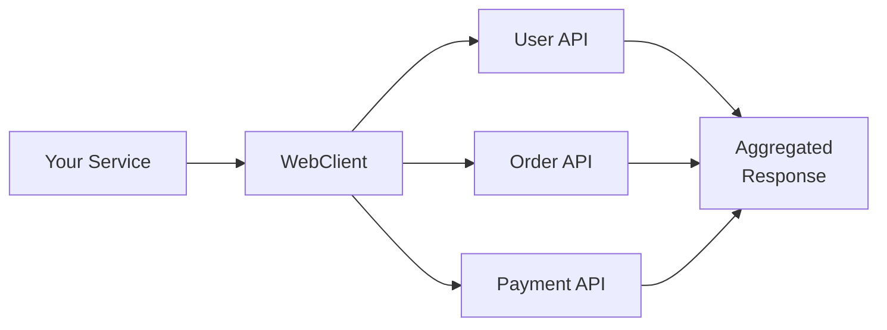

# How to Build Reactive HTTP Clients with WebClient in Spring

Author: [nawazdhandala](https://www.github.com/nawazdhandala)

Tags: Java, Spring, WebClient, Reactive Programming, HTTP Client, WebFlux, Non-Blocking, Microservices

Description: Learn how to build reactive HTTP clients using Spring WebClient for non-blocking communication between microservices. This guide covers configuration, error handling, retries, and practical patterns for production use.

---

> RestTemplate served us well for years, but it blocks threads while waiting for responses. WebClient is Spring's modern, non-blocking HTTP client that handles concurrent requests efficiently. When your service calls multiple external APIs, WebClient keeps threads free to handle other work.

Blocking HTTP clients waste resources. WebClient lets your application do more with less.

---

## Overview



---

## Dependencies

Add the WebFlux dependency to your project:

```xml
<!-- pom.xml -->
<dependency>
    <groupId>org.springframework.boot</groupId>
    <artifactId>spring-boot-starter-webflux</artifactId>
</dependency>
```

For Gradle users:

```groovy
// build.gradle
implementation 'org.springframework.boot:spring-boot-starter-webflux'
```

---

## Creating a WebClient Instance

### Basic Configuration

Configure WebClient as a Spring bean with sensible defaults:

```java
package com.example.config;

import org.springframework.context.annotation.Bean;
import org.springframework.context.annotation.Configuration;
import org.springframework.http.HttpHeaders;
import org.springframework.http.MediaType;
import org.springframework.web.reactive.function.client.WebClient;

@Configuration
public class WebClientConfig {

    @Bean
    public WebClient userServiceClient() {
        return WebClient.builder()
            // Set the base URL for all requests
            .baseUrl("https://api.users.example.com")
            // Add default headers that apply to all requests
            .defaultHeader(HttpHeaders.CONTENT_TYPE, MediaType.APPLICATION_JSON_VALUE)
            .defaultHeader(HttpHeaders.ACCEPT, MediaType.APPLICATION_JSON_VALUE)
            // Add an API key header for authentication
            .defaultHeader("X-API-Key", "${USER_SERVICE_API_KEY}")
            .build();
    }
}
```

### Advanced Configuration with Timeouts

Configure connection and read timeouts for production environments:

```java
package com.example.config;

import io.netty.channel.ChannelOption;
import io.netty.handler.timeout.ReadTimeoutHandler;
import io.netty.handler.timeout.WriteTimeoutHandler;
import org.springframework.context.annotation.Bean;
import org.springframework.context.annotation.Configuration;
import org.springframework.http.client.reactive.ReactorClientHttpConnector;
import org.springframework.web.reactive.function.client.WebClient;
import reactor.netty.http.client.HttpClient;

import java.time.Duration;
import java.util.concurrent.TimeUnit;

@Configuration
public class WebClientConfig {

    @Bean
    public WebClient webClient() {
        // Configure the underlying Netty HTTP client
        HttpClient httpClient = HttpClient.create()
            // Connection timeout: how long to wait for a connection
            .option(ChannelOption.CONNECT_TIMEOUT_MILLIS, 5000)
            // Response timeout: how long to wait for a response
            .responseTimeout(Duration.ofSeconds(10))
            // Configure channel handlers for read/write timeouts
            .doOnConnected(conn -> conn
                .addHandlerLast(new ReadTimeoutHandler(10, TimeUnit.SECONDS))
                .addHandlerLast(new WriteTimeoutHandler(10, TimeUnit.SECONDS))
            );

        return WebClient.builder()
            .clientConnector(new ReactorClientHttpConnector(httpClient))
            .baseUrl("https://api.example.com")
            .build();
    }
}
```

---

## Making HTTP Requests

### GET Request

Fetch data from an external API:

```java
package com.example.service;

import com.example.model.User;
import org.springframework.stereotype.Service;
import org.springframework.web.reactive.function.client.WebClient;
import reactor.core.publisher.Mono;
import reactor.core.publisher.Flux;

@Service
public class UserService {

    private final WebClient webClient;

    public UserService(WebClient webClient) {
        this.webClient = webClient;
    }

    // Fetch a single user by ID
    public Mono<User> getUserById(String userId) {
        return webClient.get()
            .uri("/users/{id}", userId)
            .retrieve()
            // Convert the response body to a User object
            .bodyToMono(User.class);
    }

    // Fetch multiple users
    public Flux<User> getAllUsers() {
        return webClient.get()
            .uri("/users")
            .retrieve()
            // Use Flux for collections
            .bodyToFlux(User.class);
    }

    // Fetch users with query parameters
    public Flux<User> searchUsers(String name, int page, int size) {
        return webClient.get()
            .uri(uriBuilder -> uriBuilder
                .path("/users/search")
                .queryParam("name", name)
                .queryParam("page", page)
                .queryParam("size", size)
                .build())
            .retrieve()
            .bodyToFlux(User.class);
    }
}
```

### POST Request

Send data to create a new resource:

```java
package com.example.service;

import com.example.model.Order;
import com.example.model.OrderRequest;
import org.springframework.stereotype.Service;
import org.springframework.web.reactive.function.client.WebClient;
import reactor.core.publisher.Mono;

@Service
public class OrderService {

    private final WebClient webClient;

    public OrderService(WebClient webClient) {
        this.webClient = webClient;
    }

    // Create a new order
    public Mono<Order> createOrder(OrderRequest request) {
        return webClient.post()
            .uri("/orders")
            // Set the request body
            .bodyValue(request)
            .retrieve()
            .bodyToMono(Order.class);
    }

    // Create order with headers
    public Mono<Order> createOrderWithAuth(OrderRequest request, String authToken) {
        return webClient.post()
            .uri("/orders")
            // Add request-specific headers
            .header("Authorization", "Bearer " + authToken)
            .header("X-Request-ID", java.util.UUID.randomUUID().toString())
            .bodyValue(request)
            .retrieve()
            .bodyToMono(Order.class);
    }
}
```

### PUT and DELETE Requests

Update and delete resources:

```java
package com.example.service;

import com.example.model.User;
import com.example.model.UpdateUserRequest;
import org.springframework.stereotype.Service;
import org.springframework.web.reactive.function.client.WebClient;
import reactor.core.publisher.Mono;

@Service
public class UserService {

    private final WebClient webClient;

    public UserService(WebClient webClient) {
        this.webClient = webClient;
    }

    // Update an existing user
    public Mono<User> updateUser(String userId, UpdateUserRequest request) {
        return webClient.put()
            .uri("/users/{id}", userId)
            .bodyValue(request)
            .retrieve()
            .bodyToMono(User.class);
    }

    // Partial update with PATCH
    public Mono<User> patchUser(String userId, UpdateUserRequest request) {
        return webClient.patch()
            .uri("/users/{id}", userId)
            .bodyValue(request)
            .retrieve()
            .bodyToMono(User.class);
    }

    // Delete a user
    public Mono<Void> deleteUser(String userId) {
        return webClient.delete()
            .uri("/users/{id}", userId)
            .retrieve()
            // Use Void for responses with no body
            .bodyToMono(Void.class);
    }
}
```

---

## Error Handling

### Basic Error Handling

Handle HTTP errors and convert them to application exceptions:

```java
package com.example.service;

import com.example.exception.ResourceNotFoundException;
import com.example.exception.ServiceException;
import com.example.model.User;
import org.springframework.http.HttpStatus;
import org.springframework.stereotype.Service;
import org.springframework.web.reactive.function.client.WebClient;
import reactor.core.publisher.Mono;

@Service
public class UserService {

    private final WebClient webClient;

    public UserService(WebClient webClient) {
        this.webClient = webClient;
    }

    public Mono<User> getUserById(String userId) {
        return webClient.get()
            .uri("/users/{id}", userId)
            .retrieve()
            // Handle specific HTTP status codes
            .onStatus(
                status -> status == HttpStatus.NOT_FOUND,
                response -> Mono.error(new ResourceNotFoundException("User not found: " + userId))
            )
            // Handle all other error statuses
            .onStatus(
                HttpStatus::isError,
                response -> response.bodyToMono(String.class)
                    .flatMap(body -> Mono.error(new ServiceException(
                        "Failed to fetch user: " + response.statusCode() + " - " + body
                    )))
            )
            .bodyToMono(User.class);
    }
}
```

### Structured Error Response Handling

Parse error responses into structured objects:

```java
package com.example.service;

import com.example.exception.ApiException;
import com.example.model.ApiError;
import com.example.model.User;
import org.springframework.http.HttpStatus;
import org.springframework.stereotype.Service;
import org.springframework.web.reactive.function.client.WebClient;
import reactor.core.publisher.Mono;

@Service
public class UserService {

    private final WebClient webClient;

    public UserService(WebClient webClient) {
        this.webClient = webClient;
    }

    public Mono<User> getUserById(String userId) {
        return webClient.get()
            .uri("/users/{id}", userId)
            .retrieve()
            .onStatus(
                HttpStatus::isError,
                response -> response.bodyToMono(ApiError.class)
                    .flatMap(error -> Mono.error(new ApiException(
                        error.getCode(),
                        error.getMessage(),
                        response.statusCode().value()
                    )))
            )
            .bodyToMono(User.class)
            // Provide fallback for empty responses
            .switchIfEmpty(Mono.error(new ResourceNotFoundException("User not found")));
    }
}
```

---

## Retries and Resilience

### Configuring Retries

Add retry logic for transient failures:

```java
package com.example.service;

import com.example.model.User;
import org.springframework.stereotype.Service;
import org.springframework.web.reactive.function.client.WebClient;
import org.springframework.web.reactive.function.client.WebClientResponseException;
import reactor.core.publisher.Mono;
import reactor.util.retry.Retry;

import java.time.Duration;

@Service
public class UserService {

    private final WebClient webClient;

    public UserService(WebClient webClient) {
        this.webClient = webClient;
    }

    public Mono<User> getUserWithRetry(String userId) {
        return webClient.get()
            .uri("/users/{id}", userId)
            .retrieve()
            .bodyToMono(User.class)
            // Retry up to 3 times with exponential backoff
            .retryWhen(Retry.backoff(3, Duration.ofMillis(500))
                // Only retry on specific exceptions
                .filter(throwable -> throwable instanceof WebClientResponseException.ServiceUnavailable
                    || throwable instanceof WebClientResponseException.GatewayTimeout)
                // Maximum backoff duration
                .maxBackoff(Duration.ofSeconds(5))
                // Add jitter to prevent thundering herd
                .jitter(0.5)
                // Log retry attempts
                .doBeforeRetry(signal ->
                    System.out.println("Retrying request, attempt: " + signal.totalRetries())
                )
            );
    }
}
```

### Timeout and Fallback

Combine timeout with a fallback value:

```java
package com.example.service;

import com.example.model.User;
import org.springframework.stereotype.Service;
import org.springframework.web.reactive.function.client.WebClient;
import reactor.core.publisher.Mono;

import java.time.Duration;

@Service
public class UserService {

    private final WebClient webClient;

    public UserService(WebClient webClient) {
        this.webClient = webClient;
    }

    public Mono<User> getUserWithFallback(String userId) {
        return webClient.get()
            .uri("/users/{id}", userId)
            .retrieve()
            .bodyToMono(User.class)
            // Set a request-level timeout
            .timeout(Duration.ofSeconds(5))
            // Return a default user on any error
            .onErrorResume(error -> {
                System.err.println("Failed to fetch user: " + error.getMessage());
                return Mono.just(User.defaultUser(userId));
            });
    }
}
```

---

## Parallel Requests

### Executing Multiple Requests Concurrently

Call multiple services in parallel and combine results:

```java
package com.example.service;

import com.example.model.*;
import org.springframework.stereotype.Service;
import org.springframework.web.reactive.function.client.WebClient;
import reactor.core.publisher.Mono;

@Service
public class OrderAggregatorService {

    private final WebClient userClient;
    private final WebClient orderClient;
    private final WebClient paymentClient;

    public OrderAggregatorService(
            WebClient userClient,
            WebClient orderClient,
            WebClient paymentClient) {
        this.userClient = userClient;
        this.orderClient = orderClient;
        this.paymentClient = paymentClient;
    }

    // Fetch data from multiple services in parallel
    public Mono<OrderDetails> getOrderDetails(String orderId, String userId) {
        // Create individual request Monos
        Mono<User> userMono = userClient.get()
            .uri("/users/{id}", userId)
            .retrieve()
            .bodyToMono(User.class);

        Mono<Order> orderMono = orderClient.get()
            .uri("/orders/{id}", orderId)
            .retrieve()
            .bodyToMono(Order.class);

        Mono<PaymentInfo> paymentMono = paymentClient.get()
            .uri("/payments/order/{id}", orderId)
            .retrieve()
            .bodyToMono(PaymentInfo.class);

        // Execute all requests in parallel and combine results
        return Mono.zip(userMono, orderMono, paymentMono)
            .map(tuple -> new OrderDetails(
                tuple.getT1(),  // User
                tuple.getT2(),  // Order
                tuple.getT3()   // PaymentInfo
            ));
    }
}
```

### Handling Partial Failures

Continue with partial data when some requests fail:

```java
package com.example.service;

import com.example.model.*;
import org.springframework.stereotype.Service;
import org.springframework.web.reactive.function.client.WebClient;
import reactor.core.publisher.Mono;

@Service
public class DashboardService {

    private final WebClient webClient;

    public DashboardService(WebClient webClient) {
        this.webClient = webClient;
    }

    public Mono<Dashboard> getDashboard(String userId) {
        // Each request handles its own errors and provides defaults
        Mono<UserStats> statsMono = webClient.get()
            .uri("/users/{id}/stats", userId)
            .retrieve()
            .bodyToMono(UserStats.class)
            .onErrorResume(e -> Mono.just(UserStats.empty()));

        Mono<RecentActivity> activityMono = webClient.get()
            .uri("/users/{id}/activity", userId)
            .retrieve()
            .bodyToMono(RecentActivity.class)
            .onErrorResume(e -> Mono.just(RecentActivity.empty()));

        Mono<Notifications> notificationsMono = webClient.get()
            .uri("/users/{id}/notifications", userId)
            .retrieve()
            .bodyToMono(Notifications.class)
            .onErrorResume(e -> Mono.just(Notifications.empty()));

        // Combine results - dashboard will be built even if some parts failed
        return Mono.zip(statsMono, activityMono, notificationsMono)
            .map(tuple -> Dashboard.builder()
                .stats(tuple.getT1())
                .activity(tuple.getT2())
                .notifications(tuple.getT3())
                .build());
    }
}
```

---

## Request and Response Logging

### Adding a Logging Filter

Create a filter to log requests and responses:

```java
package com.example.config;

import org.slf4j.Logger;
import org.slf4j.LoggerFactory;
import org.springframework.context.annotation.Bean;
import org.springframework.context.annotation.Configuration;
import org.springframework.web.reactive.function.client.ExchangeFilterFunction;
import org.springframework.web.reactive.function.client.WebClient;
import reactor.core.publisher.Mono;

@Configuration
public class WebClientConfig {

    private static final Logger log = LoggerFactory.getLogger(WebClientConfig.class);

    @Bean
    public WebClient webClient() {
        return WebClient.builder()
            .baseUrl("https://api.example.com")
            // Add request logging filter
            .filter(logRequest())
            // Add response logging filter
            .filter(logResponse())
            .build();
    }

    private ExchangeFilterFunction logRequest() {
        return ExchangeFilterFunction.ofRequestProcessor(request -> {
            log.info("Request: {} {}", request.method(), request.url());
            request.headers().forEach((name, values) ->
                values.forEach(value -> log.debug("Header: {}={}", name, value))
            );
            return Mono.just(request);
        });
    }

    private ExchangeFilterFunction logResponse() {
        return ExchangeFilterFunction.ofResponseProcessor(response -> {
            log.info("Response: {} from {}",
                response.statusCode(),
                response.request().getURI()
            );
            return Mono.just(response);
        });
    }
}
```

---

## Testing WebClient

### Using MockWebServer

Test WebClient calls with OkHttp's MockWebServer:

```java
package com.example.service;

import com.example.model.User;
import okhttp3.mockwebserver.MockResponse;
import okhttp3.mockwebserver.MockWebServer;
import org.junit.jupiter.api.AfterEach;
import org.junit.jupiter.api.BeforeEach;
import org.junit.jupiter.api.Test;
import org.springframework.web.reactive.function.client.WebClient;
import reactor.test.StepVerifier;

import java.io.IOException;

class UserServiceTest {

    private MockWebServer mockWebServer;
    private UserService userService;

    @BeforeEach
    void setUp() throws IOException {
        mockWebServer = new MockWebServer();
        mockWebServer.start();

        WebClient webClient = WebClient.builder()
            .baseUrl(mockWebServer.url("/").toString())
            .build();

        userService = new UserService(webClient);
    }

    @AfterEach
    void tearDown() throws IOException {
        mockWebServer.shutdown();
    }

    @Test
    void getUserById_ReturnsUser() {
        // Prepare mock response
        mockWebServer.enqueue(new MockResponse()
            .setBody("{\"id\":\"123\",\"name\":\"John Doe\",\"email\":\"john@example.com\"}")
            .addHeader("Content-Type", "application/json"));

        // Execute and verify
        StepVerifier.create(userService.getUserById("123"))
            .expectNextMatches(user ->
                user.getId().equals("123") && user.getName().equals("John Doe"))
            .verifyComplete();
    }

    @Test
    void getUserById_HandlesNotFound() {
        mockWebServer.enqueue(new MockResponse().setResponseCode(404));

        StepVerifier.create(userService.getUserById("unknown"))
            .expectError(ResourceNotFoundException.class)
            .verify();
    }
}
```

---

## Best Practices

1. **Reuse WebClient instances** - create once and inject where needed
2. **Configure timeouts** - prevent requests from hanging indefinitely
3. **Handle errors explicitly** - map HTTP errors to domain exceptions
4. **Use retries wisely** - only for idempotent operations and transient failures
5. **Log requests and responses** - but redact sensitive data
6. **Test with MockWebServer** - avoid hitting real APIs in tests

---

## Conclusion

WebClient provides a modern, non-blocking approach to HTTP communication in Spring applications. Key takeaways:

- Configure WebClient with appropriate timeouts and connection settings
- Use `Mono` for single values and `Flux` for collections
- Handle errors with `onStatus()` and convert to domain exceptions
- Execute parallel requests with `Mono.zip()` for better performance
- Add retries with exponential backoff for transient failures

WebClient is the foundation for building scalable microservices that communicate efficiently.

---

*Building reactive microservices? [OneUptime](https://oneuptime.com) provides comprehensive monitoring for your Spring WebFlux applications with distributed tracing support.*
