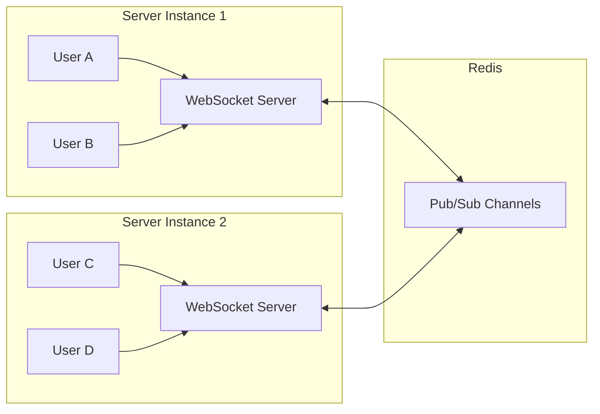

# How to Build Real-Time Chat with Redis Pub/Sub

Author: [nawazdhandala](https://www.github.com/nawazdhandala)

Tags: Redis, Pub/Sub, Real-Time, Chat, WebSocket, Node.js

Description: Build a scalable real-time chat application using Redis Pub/Sub for message distribution across multiple server instances. This guide covers WebSocket integration, room management, and message persistence.

---

Building a chat application is straightforward until you need to scale. When users connect to different server instances, messages sent on one server need to reach users on other servers. Redis Pub/Sub solves this by acting as a message broker between your servers. This guide shows you how to build a real-time chat system that scales horizontally.

## Architecture Overview

Redis Pub/Sub enables a publish-subscribe messaging pattern. When a user sends a message, it gets published to a Redis channel. All server instances subscribed to that channel receive the message and forward it to their connected users.



## Setting Up the Project

First, let's set up the dependencies and Redis connections.

```javascript
// package.json dependencies
// "dependencies": {
//   "express": "^4.18.2",
//   "ws": "^8.14.2",
//   "ioredis": "^5.3.2",
//   "uuid": "^9.0.0"
// }

// redis-connections.js
// Separate connections for publishing and subscribing
// Redis requires separate connections for sub mode
const Redis = require('ioredis');

// Publisher connection - for sending messages
const publisher = new Redis({
  host: process.env.REDIS_HOST || 'localhost',
  port: process.env.REDIS_PORT || 6379,
  password: process.env.REDIS_PASSWORD,
});

// Subscriber connection - enters subscribe mode
const subscriber = new Redis({
  host: process.env.REDIS_HOST || 'localhost',
  port: process.env.REDIS_PORT || 6379,
  password: process.env.REDIS_PASSWORD,
});

// Regular connection for data operations
const redis = new Redis({
  host: process.env.REDIS_HOST || 'localhost',
  port: process.env.REDIS_PORT || 6379,
  password: process.env.REDIS_PASSWORD,
});

publisher.on('connect', () => console.log('Publisher connected'));
subscriber.on('connect', () => console.log('Subscriber connected'));

module.exports = { publisher, subscriber, redis };
```

## WebSocket Server with Room Support

Here's the core WebSocket server that handles connections, rooms, and message routing.

```javascript
// chat-server.js
// WebSocket chat server with Redis Pub/Sub for scaling
const WebSocket = require('ws');
const { v4: uuidv4 } = require('uuid');
const { publisher, subscriber, redis } = require('./redis-connections');

class ChatServer {
  constructor(server) {
    this.wss = new WebSocket.Server({ server });
    // Map of WebSocket connections: connectionId -> { ws, userId, rooms }
    this.connections = new Map();
    // Map of rooms: roomId -> Set of connectionIds
    this.rooms = new Map();
    // This server instance ID for tracking
    this.serverId = uuidv4().slice(0, 8);

    this.setupWebSocket();
    this.setupRedisSubscriber();
  }

  setupWebSocket() {
    this.wss.on('connection', (ws, req) => {
      const connectionId = uuidv4();

      this.connections.set(connectionId, {
        ws,
        userId: null,
        rooms: new Set(),
      });

      console.log(`New connection: ${connectionId} on server ${this.serverId}`);

      ws.on('message', (data) => {
        this.handleMessage(connectionId, data);
      });

      ws.on('close', () => {
        this.handleDisconnect(connectionId);
      });

      // Send connection acknowledgment
      this.sendToConnection(connectionId, {
        type: 'connected',
        connectionId,
        serverId: this.serverId,
      });
    });
  }

  setupRedisSubscriber() {
    // Pattern subscribe to all chat rooms
    subscriber.psubscribe('chat:room:*', (err) => {
      if (err) {
        console.error('Failed to subscribe:', err);
        return;
      }
      console.log('Subscribed to chat:room:* pattern');
    });

    // Handle incoming messages from Redis
    subscriber.on('pmessage', (pattern, channel, message) => {
      const roomId = channel.replace('chat:room:', '');
      const parsed = JSON.parse(message);

      // Only broadcast if message is from another server
      // Messages from this server are already sent directly
      if (parsed.serverId !== this.serverId) {
        this.broadcastToRoom(roomId, parsed, true);
      }
    });
  }

  handleMessage(connectionId, data) {
    let message;
    try {
      message = JSON.parse(data);
    } catch (e) {
      this.sendError(connectionId, 'Invalid JSON');
      return;
    }

    switch (message.type) {
      case 'auth':
        this.handleAuth(connectionId, message);
        break;
      case 'join':
        this.handleJoin(connectionId, message);
        break;
      case 'leave':
        this.handleLeave(connectionId, message);
        break;
      case 'message':
        this.handleChatMessage(connectionId, message);
        break;
      case 'typing':
        this.handleTyping(connectionId, message);
        break;
      default:
        this.sendError(connectionId, 'Unknown message type');
    }
  }

  handleAuth(connectionId, message) {
    const connection = this.connections.get(connectionId);
    if (!connection) return;

    connection.userId = message.userId;

    // Store user's current connection in Redis for presence tracking
    redis.hset(`user:${message.userId}:connections`, connectionId, this.serverId);
    redis.sadd('online_users', message.userId);

    this.sendToConnection(connectionId, {
      type: 'authenticated',
      userId: message.userId,
    });
  }

  async handleJoin(connectionId, message) {
    const connection = this.connections.get(connectionId);
    if (!connection || !connection.userId) {
      this.sendError(connectionId, 'Not authenticated');
      return;
    }

    const { roomId } = message;

    // Add to local room tracking
    if (!this.rooms.has(roomId)) {
      this.rooms.set(roomId, new Set());
    }
    this.rooms.get(roomId).add(connectionId);
    connection.rooms.add(roomId);

    // Track room membership in Redis
    await redis.sadd(`room:${roomId}:members`, connection.userId);

    // Notify room about new member
    const joinMessage = {
      type: 'user_joined',
      roomId,
      userId: connection.userId,
      timestamp: Date.now(),
      serverId: this.serverId,
    };

    // Publish to Redis so other servers know
    await publisher.publish(`chat:room:${roomId}`, JSON.stringify(joinMessage));

    // Send to local connections
    this.broadcastToRoom(roomId, joinMessage, false);

    // Send room history to the joining user
    const history = await this.getRoomHistory(roomId, 50);
    this.sendToConnection(connectionId, {
      type: 'room_history',
      roomId,
      messages: history,
    });
  }

  async handleLeave(connectionId, message) {
    const connection = this.connections.get(connectionId);
    if (!connection) return;

    const { roomId } = message;

    this.removeFromRoom(connectionId, roomId);

    // Notify room
    const leaveMessage = {
      type: 'user_left',
      roomId,
      userId: connection.userId,
      timestamp: Date.now(),
      serverId: this.serverId,
    };

    await publisher.publish(`chat:room:${roomId}`, JSON.stringify(leaveMessage));
    this.broadcastToRoom(roomId, leaveMessage, false);
  }

  async handleChatMessage(connectionId, message) {
    const connection = this.connections.get(connectionId);
    if (!connection || !connection.userId) {
      this.sendError(connectionId, 'Not authenticated');
      return;
    }

    const { roomId, content } = message;

    if (!connection.rooms.has(roomId)) {
      this.sendError(connectionId, 'Not in room');
      return;
    }

    const chatMessage = {
      type: 'message',
      id: uuidv4(),
      roomId,
      userId: connection.userId,
      content,
      timestamp: Date.now(),
      serverId: this.serverId,
    };

    // Store message in Redis for history
    await this.storeMessage(roomId, chatMessage);

    // Publish to Redis for other servers
    await publisher.publish(`chat:room:${roomId}`, JSON.stringify(chatMessage));

    // Broadcast to local room connections
    this.broadcastToRoom(roomId, chatMessage, false);
  }

  handleTyping(connectionId, message) {
    const connection = this.connections.get(connectionId);
    if (!connection) return;

    const { roomId, isTyping } = message;

    const typingMessage = {
      type: 'typing',
      roomId,
      userId: connection.userId,
      isTyping,
      serverId: this.serverId,
    };

    // Publish typing indicator (don't persist these)
    publisher.publish(`chat:room:${roomId}`, JSON.stringify(typingMessage));
    this.broadcastToRoom(roomId, typingMessage, false);
  }

  handleDisconnect(connectionId) {
    const connection = this.connections.get(connectionId);
    if (!connection) return;

    // Leave all rooms
    for (const roomId of connection.rooms) {
      this.removeFromRoom(connectionId, roomId);

      if (connection.userId) {
        const leaveMessage = {
          type: 'user_left',
          roomId,
          userId: connection.userId,
          timestamp: Date.now(),
          serverId: this.serverId,
        };
        publisher.publish(`chat:room:${roomId}`, JSON.stringify(leaveMessage));
      }
    }

    // Clean up user presence
    if (connection.userId) {
      redis.hdel(`user:${connection.userId}:connections`, connectionId);
      // Check if user has other connections before marking offline
      redis.hlen(`user:${connection.userId}:connections`).then((count) => {
        if (count === 0) {
          redis.srem('online_users', connection.userId);
        }
      });
    }

    this.connections.delete(connectionId);
    console.log(`Connection closed: ${connectionId}`);
  }

  removeFromRoom(connectionId, roomId) {
    const connection = this.connections.get(connectionId);
    if (!connection) return;

    connection.rooms.delete(roomId);

    const room = this.rooms.get(roomId);
    if (room) {
      room.delete(connectionId);
      if (room.size === 0) {
        this.rooms.delete(roomId);
      }
    }

    if (connection.userId) {
      redis.srem(`room:${roomId}:members`, connection.userId);
    }
  }

  broadcastToRoom(roomId, message, fromRedis) {
    const room = this.rooms.get(roomId);
    if (!room) return;

    const messageStr = JSON.stringify(message);

    for (const connectionId of room) {
      const connection = this.connections.get(connectionId);
      if (connection && connection.ws.readyState === WebSocket.OPEN) {
        // Don't send message back to the sender if it's from local
        if (!fromRedis && message.userId === connection.userId && message.type === 'message') {
          continue;
        }
        connection.ws.send(messageStr);
      }
    }
  }

  sendToConnection(connectionId, message) {
    const connection = this.connections.get(connectionId);
    if (connection && connection.ws.readyState === WebSocket.OPEN) {
      connection.ws.send(JSON.stringify(message));
    }
  }

  sendError(connectionId, error) {
    this.sendToConnection(connectionId, { type: 'error', error });
  }

  // Store messages in a Redis sorted set for history
  async storeMessage(roomId, message) {
    const key = `room:${roomId}:messages`;

    await redis.zadd(key, message.timestamp, JSON.stringify(message));

    // Keep only last 1000 messages
    await redis.zremrangebyrank(key, 0, -1001);

    // Set TTL for inactive rooms (30 days)
    await redis.expire(key, 30 * 24 * 60 * 60);
  }

  // Get room history from Redis
  async getRoomHistory(roomId, limit = 50) {
    const key = `room:${roomId}:messages`;
    const messages = await redis.zrevrange(key, 0, limit - 1);

    return messages
      .map((m) => JSON.parse(m))
      .reverse(); // Return in chronological order
  }
}

module.exports = ChatServer;
```

## Express Server Integration

Here's how to integrate the chat server with Express.

```javascript
// server.js
// Main server file combining Express and WebSocket
const express = require('express');
const http = require('http');
const ChatServer = require('./chat-server');

const app = express();
const server = http.createServer(app);

// Initialize chat server
const chatServer = new ChatServer(server);

// Health check endpoint
app.get('/health', async (req, res) => {
  const { redis } = require('./redis-connections');

  try {
    await redis.ping();
    res.json({
      status: 'healthy',
      connections: chatServer.connections.size,
      rooms: chatServer.rooms.size,
      serverId: chatServer.serverId,
    });
  } catch (error) {
    res.status(500).json({ status: 'unhealthy', error: error.message });
  }
});

// Get online users
app.get('/api/online-users', async (req, res) => {
  const { redis } = require('./redis-connections');
  const users = await redis.smembers('online_users');
  res.json({ users, count: users.length });
});

// Get room members
app.get('/api/rooms/:roomId/members', async (req, res) => {
  const { redis } = require('./redis-connections');
  const members = await redis.smembers(`room:${req.params.roomId}:members`);
  res.json({ members, count: members.length });
});

const PORT = process.env.PORT || 3000;
server.listen(PORT, () => {
  console.log(`Server running on port ${PORT}`);
  console.log(`Server ID: ${chatServer.serverId}`);
});
```

## Client-Side Implementation

Here's a simple client implementation for testing.

```javascript
// client.js
// Browser-based chat client
class ChatClient {
  constructor(serverUrl) {
    this.serverUrl = serverUrl;
    this.ws = null;
    this.userId = null;
    this.currentRoom = null;
    this.messageHandlers = new Map();
  }

  connect() {
    return new Promise((resolve, reject) => {
      this.ws = new WebSocket(this.serverUrl);

      this.ws.onopen = () => {
        console.log('Connected to chat server');
        resolve();
      };

      this.ws.onerror = (error) => {
        console.error('WebSocket error:', error);
        reject(error);
      };

      this.ws.onmessage = (event) => {
        const message = JSON.parse(event.data);
        this.handleMessage(message);
      };

      this.ws.onclose = () => {
        console.log('Disconnected from chat server');
        // Implement reconnection logic here
        setTimeout(() => this.connect(), 3000);
      };
    });
  }

  handleMessage(message) {
    console.log('Received:', message);

    // Call registered handlers for this message type
    const handlers = this.messageHandlers.get(message.type) || [];
    handlers.forEach((handler) => handler(message));
  }

  on(messageType, handler) {
    if (!this.messageHandlers.has(messageType)) {
      this.messageHandlers.set(messageType, []);
    }
    this.messageHandlers.get(messageType).push(handler);
  }

  send(message) {
    if (this.ws && this.ws.readyState === WebSocket.OPEN) {
      this.ws.send(JSON.stringify(message));
    }
  }

  authenticate(userId) {
    this.userId = userId;
    this.send({ type: 'auth', userId });
  }

  joinRoom(roomId) {
    this.currentRoom = roomId;
    this.send({ type: 'join', roomId });
  }

  leaveRoom(roomId) {
    this.send({ type: 'leave', roomId });
    if (this.currentRoom === roomId) {
      this.currentRoom = null;
    }
  }

  sendMessage(roomId, content) {
    this.send({ type: 'message', roomId, content });
  }

  sendTyping(roomId, isTyping) {
    this.send({ type: 'typing', roomId, isTyping });
  }
}

// Usage example
const chat = new ChatClient('ws://localhost:3000');

chat.on('message', (msg) => {
  console.log(`[${msg.userId}]: ${msg.content}`);
});

chat.on('user_joined', (msg) => {
  console.log(`${msg.userId} joined the room`);
});

chat.on('typing', (msg) => {
  if (msg.isTyping) {
    console.log(`${msg.userId} is typing...`);
  }
});

// Connect and start chatting
chat.connect().then(() => {
  chat.authenticate('user123');
  chat.joinRoom('general');
  chat.sendMessage('general', 'Hello everyone!');
});
```

## Scaling Considerations

| Aspect | Solution |
|--------|----------|
| Multiple servers | Redis Pub/Sub broadcasts to all |
| Message persistence | Store in Redis sorted sets |
| User presence | Redis sets with connection tracking |
| Room membership | Redis sets per room |
| Message ordering | Use timestamps and sorted sets |

## Performance Tips

1. **Use pattern subscriptions wisely** - Subscribing to `chat:room:*` is convenient but means every server receives every message. For very large deployments, consider selective subscriptions.

2. **Batch typing indicators** - Don't publish every keystroke. Debounce typing events to reduce Redis traffic.

3. **Implement message acknowledgments** - For critical messages, use a separate channel for delivery confirmations.

4. **Consider Redis Streams for persistence** - For more robust message storage with consumer groups, Redis Streams offer better guarantees than Pub/Sub alone.

Redis Pub/Sub makes building scalable real-time applications straightforward. Your chat servers can scale horizontally behind a load balancer while Redis ensures messages reach all connected users regardless of which server they're connected to.
