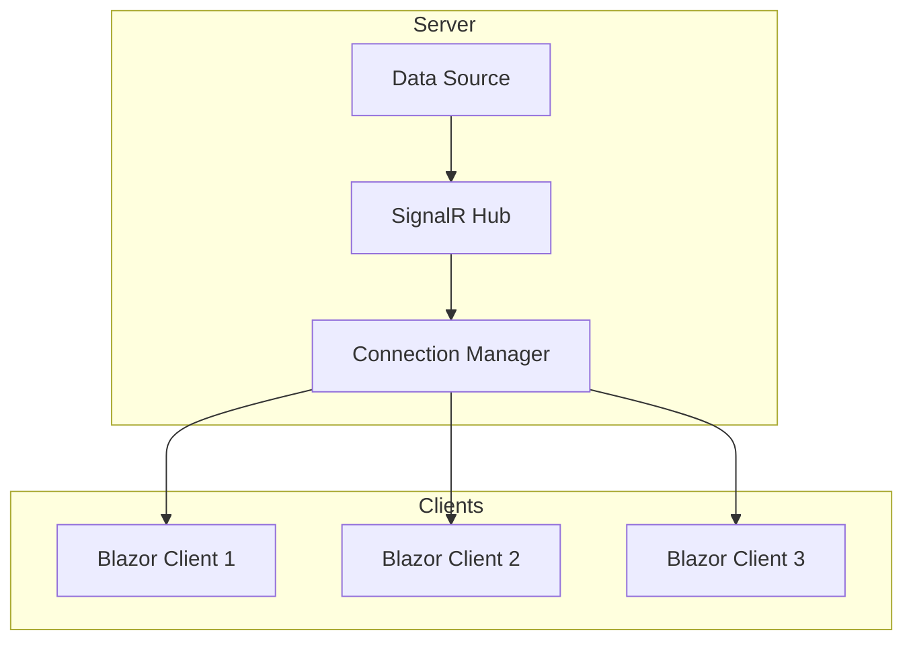

# How to Build Real-Time Dashboards with SignalR and Blazor

Author: [nawazdhandala](https://www.github.com/nawazdhandala)

Tags: .NET, Blazor, SignalR, Real-Time, WebSockets, Dashboard

Description: Learn how to build real-time dashboards using SignalR and Blazor in .NET. Create live updating charts, metrics displays, and notification systems that push data to clients instantly.

---

Polling wastes resources. Users refresh pages hoping for updates. Real-time dashboards solve this by pushing data to clients the moment it changes. SignalR handles the WebSocket connections while Blazor renders the UI reactively. Together they create dashboards that update instantly without page refreshes.

## Architecture Overview

SignalR establishes persistent connections between the server and all connected clients. When data changes on the server, it broadcasts to relevant clients through these connections. Blazor components re-render automatically when their state changes.



## Setting Up the SignalR Hub

The hub manages connections and broadcasts updates to clients. Create strongly-typed hub interfaces for compile-time safety.

```csharp
// Interface defining what the server can call on clients
public interface IDashboardClient
{
    Task ReceiveMetricUpdate(MetricUpdate update);
    Task ReceiveAlert(AlertNotification alert);
    Task ReceiveChartData(ChartDataPoint point);
    Task ReceiveSystemStatus(SystemStatus status);
}

// Data models for dashboard updates
public class MetricUpdate
{
    public string MetricName { get; set; } = string.Empty;
    public double Value { get; set; }
    public DateTime Timestamp { get; set; }
    public string Unit { get; set; } = string.Empty;
}

public class AlertNotification
{
    public string Id { get; set; } = Guid.NewGuid().ToString();
    public string Title { get; set; } = string.Empty;
    public string Message { get; set; } = string.Empty;
    public AlertSeverity Severity { get; set; }
    public DateTime Timestamp { get; set; }
}

public enum AlertSeverity
{
    Info,
    Warning,
    Error,
    Critical
}

public class ChartDataPoint
{
    public string Series { get; set; } = string.Empty;
    public DateTime Timestamp { get; set; }
    public double Value { get; set; }
}

public class SystemStatus
{
    public double CpuUsage { get; set; }
    public double MemoryUsage { get; set; }
    public int ActiveConnections { get; set; }
    public int RequestsPerSecond { get; set; }
    public DateTime Timestamp { get; set; }
}

// SignalR Hub with strongly-typed client interface
public class DashboardHub : Hub<IDashboardClient>
{
    private readonly ILogger<DashboardHub> _logger;
    private readonly ConnectionTracker _connectionTracker;

    public DashboardHub(
        ILogger<DashboardHub> logger,
        ConnectionTracker connectionTracker)
    {
        _logger = logger;
        _connectionTracker = connectionTracker;
    }

    public override async Task OnConnectedAsync()
    {
        _connectionTracker.AddConnection(Context.ConnectionId);
        _logger.LogInformation(
            "Client connected: {ConnectionId}",
            Context.ConnectionId);

        // Send current state to newly connected client
        await Clients.Caller.ReceiveSystemStatus(new SystemStatus
        {
            CpuUsage = 45.2,
            MemoryUsage = 62.8,
            ActiveConnections = _connectionTracker.ConnectionCount,
            RequestsPerSecond = 1250,
            Timestamp = DateTime.UtcNow
        });

        await base.OnConnectedAsync();
    }

    public override Task OnDisconnectedAsync(Exception? exception)
    {
        _connectionTracker.RemoveConnection(Context.ConnectionId);
        _logger.LogInformation(
            "Client disconnected: {ConnectionId}",
            Context.ConnectionId);

        return base.OnDisconnectedAsync(exception);
    }

    // Allow clients to subscribe to specific metric streams
    public async Task SubscribeToMetric(string metricName)
    {
        await Groups.AddToGroupAsync(Context.ConnectionId, $"metric:{metricName}");
        _logger.LogInformation(
            "Client {ConnectionId} subscribed to metric {Metric}",
            Context.ConnectionId,
            metricName);
    }

    public async Task UnsubscribeFromMetric(string metricName)
    {
        await Groups.RemoveFromGroupAsync(Context.ConnectionId, $"metric:{metricName}");
    }

    // Allow clients to subscribe to alerts by severity
    public async Task SubscribeToAlerts(AlertSeverity minimumSeverity)
    {
        await Groups.AddToGroupAsync(
            Context.ConnectionId,
            $"alerts:{minimumSeverity}");
    }
}

// Track active connections for dashboard display
public class ConnectionTracker
{
    private readonly ConcurrentDictionary<string, DateTime> _connections = new();

    public int ConnectionCount => _connections.Count;

    public void AddConnection(string connectionId)
    {
        _connections[connectionId] = DateTime.UtcNow;
    }

    public void RemoveConnection(string connectionId)
    {
        _connections.TryRemove(connectionId, out _);
    }
}
```

## Broadcasting Updates

Create a service that broadcasts updates to connected clients. This can be triggered by background jobs, message queues, or database change notifications.

```csharp
// Service for broadcasting updates to dashboard clients
public class DashboardBroadcaster
{
    private readonly IHubContext<DashboardHub, IDashboardClient> _hubContext;
    private readonly ILogger<DashboardBroadcaster> _logger;

    public DashboardBroadcaster(
        IHubContext<DashboardHub, IDashboardClient> hubContext,
        ILogger<DashboardBroadcaster> logger)
    {
        _hubContext = hubContext;
        _logger = logger;
    }

    // Broadcast metric update to all clients subscribed to that metric
    public async Task BroadcastMetricAsync(MetricUpdate update)
    {
        await _hubContext.Clients
            .Group($"metric:{update.MetricName}")
            .ReceiveMetricUpdate(update);

        _logger.LogDebug(
            "Broadcast metric {Metric}: {Value}",
            update.MetricName,
            update.Value);
    }

    // Broadcast alert to clients based on severity subscription
    public async Task BroadcastAlertAsync(AlertNotification alert)
    {
        // Send to all groups at or above this severity level
        var tasks = new List<Task>();

        foreach (AlertSeverity severity in Enum.GetValues<AlertSeverity>())
        {
            if (severity <= alert.Severity)
            {
                tasks.Add(_hubContext.Clients
                    .Group($"alerts:{severity}")
                    .ReceiveAlert(alert));
            }
        }

        await Task.WhenAll(tasks);
    }

    // Broadcast system status to all connected clients
    public async Task BroadcastSystemStatusAsync(SystemStatus status)
    {
        await _hubContext.Clients.All.ReceiveSystemStatus(status);
    }

    // Broadcast chart data point to all clients
    public async Task BroadcastChartDataAsync(ChartDataPoint point)
    {
        await _hubContext.Clients.All.ReceiveChartData(point);
    }
}

// Background service that periodically broadcasts system metrics
public class MetricsCollectorService : BackgroundService
{
    private readonly DashboardBroadcaster _broadcaster;
    private readonly ConnectionTracker _connectionTracker;
    private readonly ILogger<MetricsCollectorService> _logger;

    public MetricsCollectorService(
        DashboardBroadcaster broadcaster,
        ConnectionTracker connectionTracker,
        ILogger<MetricsCollectorService> logger)
    {
        _broadcaster = broadcaster;
        _connectionTracker = connectionTracker;
        _logger = logger;
    }

    protected override async Task ExecuteAsync(CancellationToken stoppingToken)
    {
        while (!stoppingToken.IsCancellationRequested)
        {
            try
            {
                // Collect and broadcast system metrics
                var status = CollectSystemMetrics();
                await _broadcaster.BroadcastSystemStatusAsync(status);

                // Simulate metric updates
                await BroadcastSampleMetrics();

                await Task.Delay(1000, stoppingToken); // Update every second
            }
            catch (Exception ex)
            {
                _logger.LogError(ex, "Error collecting metrics");
            }
        }
    }

    private SystemStatus CollectSystemMetrics()
    {
        // In production, use actual system metrics
        var random = new Random();
        return new SystemStatus
        {
            CpuUsage = 40 + random.NextDouble() * 20,
            MemoryUsage = 55 + random.NextDouble() * 15,
            ActiveConnections = _connectionTracker.ConnectionCount,
            RequestsPerSecond = 1000 + random.Next(500),
            Timestamp = DateTime.UtcNow
        };
    }

    private async Task BroadcastSampleMetrics()
    {
        var random = new Random();
        var metrics = new[]
        {
            ("requests_per_second", 1000 + random.Next(500), "req/s"),
            ("response_time_ms", 50 + random.Next(100), "ms"),
            ("error_rate", random.NextDouble() * 5, "%"),
            ("active_users", 500 + random.Next(200), "users")
        };

        foreach (var (name, value, unit) in metrics)
        {
            await _broadcaster.BroadcastMetricAsync(new MetricUpdate
            {
                MetricName = name,
                Value = value,
                Unit = unit,
                Timestamp = DateTime.UtcNow
            });
        }
    }
}
```

## Blazor Dashboard Component

Create a Blazor component that connects to the SignalR hub and displays real-time data.

```csharp
@page "/dashboard"
@using Microsoft.AspNetCore.SignalR.Client
@implements IAsyncDisposable

<h1>Real-Time Dashboard</h1>

<div class="dashboard-grid">
    <!-- System Status Cards -->
    <div class="status-cards">
        <div class="card">
            <h3>CPU Usage</h3>
            <div class="metric-value @GetCpuClass()">
                @_systemStatus.CpuUsage.ToString("F1")%
            </div>
        </div>

        <div class="card">
            <h3>Memory Usage</h3>
            <div class="metric-value @GetMemoryClass()">
                @_systemStatus.MemoryUsage.ToString("F1")%
            </div>
        </div>

        <div class="card">
            <h3>Active Connections</h3>
            <div class="metric-value">
                @_systemStatus.ActiveConnections
            </div>
        </div>

        <div class="card">
            <h3>Requests/sec</h3>
            <div class="metric-value">
                @_systemStatus.RequestsPerSecond
            </div>
        </div>
    </div>

    <!-- Live Metrics Table -->
    <div class="metrics-table">
        <h2>Live Metrics</h2>
        <table>
            <thead>
                <tr>
                    <th>Metric</th>
                    <th>Value</th>
                    <th>Unit</th>
                    <th>Updated</th>
                </tr>
            </thead>
            <tbody>
                @foreach (var metric in _metrics.Values)
                {
                    <tr>
                        <td>@metric.MetricName</td>
                        <td>@metric.Value.ToString("F2")</td>
                        <td>@metric.Unit</td>
                        <td>@metric.Timestamp.ToString("HH:mm:ss")</td>
                    </tr>
                }
            </tbody>
        </table>
    </div>

    <!-- Alerts Panel -->
    <div class="alerts-panel">
        <h2>Recent Alerts</h2>
        @foreach (var alert in _alerts.TakeLast(10).Reverse())
        {
            <div class="alert alert-@alert.Severity.ToString().ToLower()">
                <strong>@alert.Title</strong>
                <span class="timestamp">@alert.Timestamp.ToString("HH:mm:ss")</span>
                <p>@alert.Message</p>
            </div>
        }
    </div>

    <!-- Connection Status -->
    <div class="connection-status">
        <span class="status-indicator @(_isConnected ? "connected" : "disconnected")">
        </span>
        @(_isConnected ? "Connected" : "Disconnected")
    </div>
</div>

@code {
    private HubConnection? _hubConnection;
    private bool _isConnected;
    private SystemStatus _systemStatus = new();
    private Dictionary<string, MetricUpdate> _metrics = new();
    private List<AlertNotification> _alerts = new();

    protected override async Task OnInitializedAsync()
    {
        // Build SignalR connection
        _hubConnection = new HubConnectionBuilder()
            .WithUrl(Navigation.ToAbsoluteUri("/hubs/dashboard"))
            .WithAutomaticReconnect(new[] {
                TimeSpan.Zero,
                TimeSpan.FromSeconds(2),
                TimeSpan.FromSeconds(5),
                TimeSpan.FromSeconds(10)
            })
            .Build();

        // Register event handlers
        _hubConnection.On<SystemStatus>("ReceiveSystemStatus", OnSystemStatusReceived);
        _hubConnection.On<MetricUpdate>("ReceiveMetricUpdate", OnMetricUpdateReceived);
        _hubConnection.On<AlertNotification>("ReceiveAlert", OnAlertReceived);

        // Handle connection state changes
        _hubConnection.Closed += OnConnectionClosed;
        _hubConnection.Reconnected += OnReconnected;
        _hubConnection.Reconnecting += OnReconnecting;

        // Start connection
        await StartConnection();
    }

    private async Task StartConnection()
    {
        try
        {
            await _hubConnection!.StartAsync();
            _isConnected = true;

            // Subscribe to metrics we want to display
            await _hubConnection.SendAsync("SubscribeToMetric", "requests_per_second");
            await _hubConnection.SendAsync("SubscribeToMetric", "response_time_ms");
            await _hubConnection.SendAsync("SubscribeToMetric", "error_rate");
            await _hubConnection.SendAsync("SubscribeToMetric", "active_users");

            // Subscribe to all alerts
            await _hubConnection.SendAsync("SubscribeToAlerts", AlertSeverity.Info);

            StateHasChanged();
        }
        catch (Exception ex)
        {
            Console.WriteLine($"Connection failed: {ex.Message}");
            _isConnected = false;
        }
    }

    private void OnSystemStatusReceived(SystemStatus status)
    {
        _systemStatus = status;
        InvokeAsync(StateHasChanged);
    }

    private void OnMetricUpdateReceived(MetricUpdate update)
    {
        _metrics[update.MetricName] = update;
        InvokeAsync(StateHasChanged);
    }

    private void OnAlertReceived(AlertNotification alert)
    {
        _alerts.Add(alert);

        // Keep only last 100 alerts in memory
        if (_alerts.Count > 100)
        {
            _alerts.RemoveAt(0);
        }

        InvokeAsync(StateHasChanged);
    }

    private Task OnConnectionClosed(Exception? ex)
    {
        _isConnected = false;
        InvokeAsync(StateHasChanged);
        return Task.CompletedTask;
    }

    private Task OnReconnected(string? connectionId)
    {
        _isConnected = true;
        InvokeAsync(StateHasChanged);
        return Task.CompletedTask;
    }

    private Task OnReconnecting(Exception? ex)
    {
        _isConnected = false;
        InvokeAsync(StateHasChanged);
        return Task.CompletedTask;
    }

    private string GetCpuClass() => _systemStatus.CpuUsage switch
    {
        > 90 => "critical",
        > 70 => "warning",
        _ => "normal"
    };

    private string GetMemoryClass() => _systemStatus.MemoryUsage switch
    {
        > 90 => "critical",
        > 75 => "warning",
        _ => "normal"
    };

    public async ValueTask DisposeAsync()
    {
        if (_hubConnection != null)
        {
            await _hubConnection.DisposeAsync();
        }
    }

    [Inject]
    private NavigationManager Navigation { get; set; } = default!;
}
```

## Live Chart Component

Add a chart component that updates in real-time as data arrives.

```csharp
@using System.Collections.Generic

<div class="chart-container">
    <h3>@Title</h3>
    <svg width="@Width" height="@Height" class="line-chart">
        <!-- Y-axis -->
        <line x1="50" y1="10" x2="50" y2="@(Height - 30)" stroke="#ccc" />

        <!-- X-axis -->
        <line x1="50" y1="@(Height - 30)" x2="@(Width - 10)" y2="@(Height - 30)"
              stroke="#ccc" />

        <!-- Data line -->
        @if (_points.Count > 1)
        {
            <polyline
                points="@GetPolylinePoints()"
                fill="none"
                stroke="#3498db"
                stroke-width="2" />
        }

        <!-- Data points -->
        @foreach (var (x, y) in GetScaledPoints())
        {
            <circle cx="@x" cy="@y" r="3" fill="#3498db" />
        }

        <!-- Y-axis labels -->
        <text x="5" y="15" font-size="10">@_maxValue.ToString("F0")</text>
        <text x="5" y="@(Height - 30)" font-size="10">@_minValue.ToString("F0")</text>
    </svg>
</div>

@code {
    [Parameter]
    public string Title { get; set; } = "Chart";

    [Parameter]
    public int Width { get; set; } = 400;

    [Parameter]
    public int Height { get; set; } = 200;

    [Parameter]
    public int MaxPoints { get; set; } = 60;

    private List<ChartDataPoint> _points = new();
    private double _minValue = 0;
    private double _maxValue = 100;

    public void AddPoint(ChartDataPoint point)
    {
        _points.Add(point);

        // Keep only recent points
        if (_points.Count > MaxPoints)
        {
            _points.RemoveAt(0);
        }

        // Update scale
        if (_points.Count > 0)
        {
            _minValue = _points.Min(p => p.Value) * 0.9;
            _maxValue = _points.Max(p => p.Value) * 1.1;
        }

        StateHasChanged();
    }

    private string GetPolylinePoints()
    {
        var scaled = GetScaledPoints();
        return string.Join(" ", scaled.Select(p => $"{p.x},{p.y}"));
    }

    private List<(double x, double y)> GetScaledPoints()
    {
        var result = new List<(double x, double y)>();
        if (_points.Count == 0) return result;

        var chartWidth = Width - 60;
        var chartHeight = Height - 40;
        var xStep = chartWidth / (double)Math.Max(_points.Count - 1, 1);

        for (int i = 0; i < _points.Count; i++)
        {
            var x = 50 + i * xStep;
            var normalizedY = (_points[i].Value - _minValue) / (_maxValue - _minValue);
            var y = Height - 30 - normalizedY * chartHeight;
            result.Add((x, y));
        }

        return result;
    }
}
```

## Program.cs Configuration

Wire everything together in Program.cs.

```csharp
var builder = WebApplication.CreateBuilder(args);

// Add services
builder.Services.AddRazorComponents()
    .AddInteractiveServerComponents();

builder.Services.AddSignalR();

// Register dashboard services
builder.Services.AddSingleton<ConnectionTracker>();
builder.Services.AddSingleton<DashboardBroadcaster>();
builder.Services.AddHostedService<MetricsCollectorService>();

var app = builder.Build();

app.UseStaticFiles();
app.UseRouting();
app.UseAntiforgery();

// Map SignalR hub
app.MapHub<DashboardHub>("/hubs/dashboard");

app.MapRazorComponents<App>()
    .AddInteractiveServerRenderMode();

app.Run();
```

## Scaling with Redis Backplane

For multiple server instances, use Redis as a SignalR backplane.

```csharp
// Add Redis backplane for SignalR in multi-server deployments
builder.Services.AddSignalR()
    .AddStackExchangeRedis(options =>
    {
        options.Configuration = builder.Configuration
            .GetConnectionString("Redis");
        options.Configuration.ChannelPrefix = "Dashboard";
    });

// The broadcaster now works across all server instances
// Redis handles message distribution between servers
```

## Summary

Building real-time dashboards with SignalR and Blazor requires:

| Component | Purpose |
|-----------|---------|
| SignalR Hub | Manage connections, broadcast updates |
| Typed client interface | Compile-time safety for client methods |
| Connection tracker | Monitor active clients |
| Background service | Collect and broadcast metrics |
| Blazor component | Reactive UI that updates on push |

Start with basic status updates, then add charts and alerts. Use groups for targeted broadcasting to reduce unnecessary network traffic. Consider Redis backplane when scaling beyond a single server.
