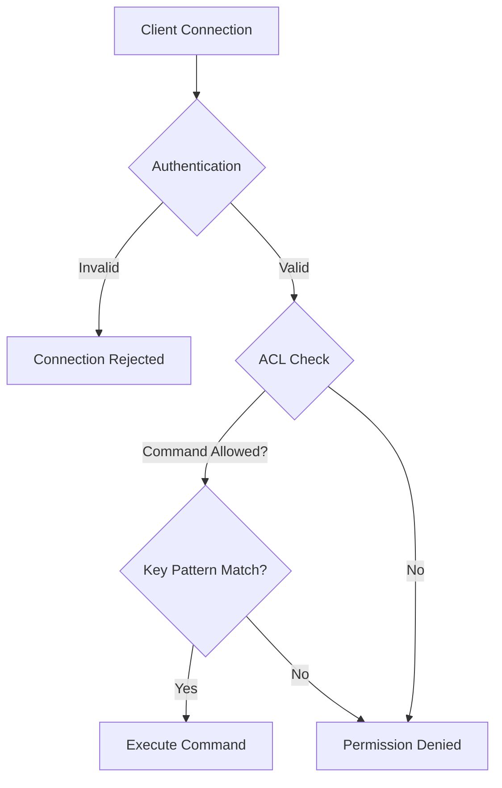

# How to Secure Redis with ACLs and RBAC

Author: [nawazdhandala](https://www.github.com/nawazdhandala)

Tags: Redis, Security, ACL, RBAC, Authentication, Authorization

Description: Learn how to secure Redis using Access Control Lists (ACLs) to implement role-based access control, limit command permissions, and restrict key access patterns.

---

By default, Redis trusts anyone who can connect to it. A single password protects everything, and any authenticated user can run any command, including dangerous ones like FLUSHALL or CONFIG. Redis ACLs (Access Control Lists) introduced in Redis 6 fix this by letting you create users with specific permissions. This guide covers implementing proper access control for production Redis deployments.

## Why Redis ACLs?

Before ACLs, Redis security was all-or-nothing. The `requirepass` setting gave full access to anyone with the password. With ACLs, you can create users that can only read certain keys, users that can only run specific commands, and users limited to particular key patterns.



## Basic ACL Configuration

```bash
# Connect to Redis and check current ACL setup
redis-cli

# List all users (default only has 'default' user)
ACL LIST

# See current user
ACL WHOAMI

# Check what commands a user can run
ACL CAT                    # List all command categories
ACL CAT read              # List commands in 'read' category
ACL CAT write             # List commands in 'write' category
ACL CAT dangerous         # List dangerous commands
```

## Creating Users with ACL Commands

```bash
# Create a read-only user
# Can only run read commands and only access keys starting with 'cache:'
ACL SETUSER readonly on >password123 ~cache:* +@read

# Create an application user with read/write on specific keys
ACL SETUSER appuser on >securepass ~app:* ~session:* +@read +@write +@connection

# Create an admin user with full access
ACL SETUSER admin on >adminpass ~* +@all

# Create a user that can only run specific commands
ACL SETUSER metrics on >metricspass ~stats:* +get +set +incr +incrby

# Verify the user was created
ACL LIST

# Test user permissions
AUTH readonly password123
SET cache:test "value"    # Should work
SET other:test "value"    # Should fail - wrong key pattern
FLUSHALL                  # Should fail - not in @read category
```

## ACL Configuration File

For production, define ACLs in a configuration file that persists across restarts.

```conf
# /etc/redis/users.acl

# Default user - disable or restrict heavily
user default off

# Application service account
# Can read/write to app:* and session:* keys
# Cannot run admin or dangerous commands
user appservice on >app_secret_password_here ~app:* ~session:* +@read +@write +@connection -@admin -@dangerous

# Cache reader for web tier
# Read-only access to cache keys
user cache_reader on >cache_reader_pass ~cache:* +@read +@connection

# Cache writer for backend services
# Read/write to cache keys only
user cache_writer on >cache_writer_pass ~cache:* +@read +@write +@connection

# Metrics collector
# Can only interact with metrics keys
user metrics on >metrics_pass ~metrics:* ~stats:* +get +set +incr +incrby +expire +ttl

# Pub/sub user for event system
# Can only publish and subscribe, no key access
user pubsub on >pubsub_pass &events:* +subscribe +publish +psubscribe +punsubscribe

# Admin user with full access
# Use only for maintenance, not regular operations
user admin on >very_secure_admin_password ~* +@all

# Replication user for replicas
user replication on >replication_password ~* +psync +replconf +ping
```

Load the ACL file in redis.conf:

```conf
# redis.conf
aclfile /etc/redis/users.acl
```

## ACL Permission Syntax

```bash
# User state
# on       - user is enabled
# off      - user is disabled (cannot authenticate)

# Passwords
# >password    - add a password (user can have multiple)
# <password    - remove a password
# nopass       - user doesn't need a password (dangerous!)
# resetpass    - remove all passwords

# Key patterns
# ~pattern     - allow access to keys matching pattern
# ~*           - allow access to all keys
# resetkeys    - remove all key patterns

# Channel patterns (for Pub/Sub)
# &pattern     - allow Pub/Sub on channels matching pattern
# &*           - allow all channels
# resetchannels - remove all channel patterns

# Commands
# +command     - allow a specific command
# -command     - deny a specific command
# +@category   - allow all commands in a category
# -@category   - deny all commands in a category
# +@all        - allow all commands
# -@all        - deny all commands (then whitelist specific ones)
# allcommands  - same as +@all
# nocommands   - same as -@all
```

## Practical ACL Examples

```python
import redis

def create_limited_users():
    """
    Create users with minimal necessary permissions.
    Principle of least privilege: give only what's needed.
    """
    admin = redis.Redis(host='localhost', port=6379, password='admin_password')

    # User for web application sessions
    # Can only read/write session keys with specific TTL
    admin.execute_command(
        'ACL', 'SETUSER', 'webapp',
        'on',                           # Enable user
        '>webapp_secret_123',           # Set password
        '~session:*',                   # Only session keys
        '+get', '+set', '+del',         # Basic operations
        '+expire', '+ttl',              # TTL management
        '+exists',                       # Check existence
        '+@connection',                 # Connection commands (PING, AUTH, etc.)
    )

    # User for background job worker
    # Needs access to job queues (lists) and results (hashes)
    admin.execute_command(
        'ACL', 'SETUSER', 'worker',
        'on',
        '>worker_secret_456',
        '~job:*', '~result:*',
        '+lpush', '+rpush', '+lpop', '+rpop', '+brpop', '+blpop',  # Queue ops
        '+llen', '+lrange',              # Queue inspection
        '+hset', '+hget', '+hgetall', '+hdel',  # Result storage
        '+expire', '+del',               # Cleanup
        '+@connection',
    )

    # User for metrics/monitoring
    # Read-only access to everything, plus ability to run INFO
    admin.execute_command(
        'ACL', 'SETUSER', 'monitoring',
        'on',
        '>monitoring_secret_789',
        '~*',                            # All keys (read only)
        '+@read',                        # All read commands
        '+info', '+dbsize', '+lastsave', # Server info commands
        '+client', '+slowlog',           # Debugging commands
        '+@connection',
    )

    # Verify users
    users = admin.execute_command('ACL', 'LIST')
    for user in users:
        print(user)


def test_user_permissions():
    """
    Test that ACL restrictions work as expected.
    """
    # Connect as webapp user
    webapp = redis.Redis(
        host='localhost',
        port=6379,
        username='webapp',
        password='webapp_secret_123'
    )

    # These should work
    webapp.set('session:user123', 'data')
    webapp.get('session:user123')
    webapp.expire('session:user123', 3600)

    # These should fail
    try:
        webapp.set('other:key', 'value')  # Wrong key pattern
    except redis.exceptions.NoPermissionError as e:
        print(f"Blocked as expected: {e}")

    try:
        webapp.flushall()  # Dangerous command not allowed
    except redis.exceptions.NoPermissionError as e:
        print(f"Blocked as expected: {e}")

    try:
        webapp.config_get('*')  # Admin command not allowed
    except redis.exceptions.NoPermissionError as e:
        print(f"Blocked as expected: {e}")
```

## Role-Based Access Control Pattern

Implement RBAC by creating users for each role, not each person.

```python
class RedisRBAC:
    """
    Manage Redis ACL users following RBAC principles.
    """

    ROLES = {
        'reader': {
            'description': 'Read-only access to application data',
            'keys': ['app:*', 'cache:*'],
            'commands': ['+@read', '+@connection'],
        },
        'writer': {
            'description': 'Read/write access to application data',
            'keys': ['app:*', 'cache:*'],
            'commands': ['+@read', '+@write', '+@connection'],
        },
        'queue_worker': {
            'description': 'Access to job queues',
            'keys': ['queue:*', 'job:*'],
            'commands': [
                '+lpush', '+rpush', '+lpop', '+rpop',
                '+brpop', '+blpop', '+llen', '+lrange',
                '+@connection'
            ],
        },
        'admin': {
            'description': 'Full administrative access',
            'keys': ['*'],
            'commands': ['+@all'],
        },
    }

    def __init__(self, admin_client):
        self.admin = admin_client

    def create_user(self, username, password, role):
        """
        Create a user with permissions based on their role.
        """
        if role not in self.ROLES:
            raise ValueError(f"Unknown role: {role}")

        role_config = self.ROLES[role]

        # Build ACL command
        acl_parts = ['ACL', 'SETUSER', username, 'on', f'>{password}']

        # Add key patterns
        for pattern in role_config['keys']:
            acl_parts.append(f'~{pattern}')

        # Add commands
        acl_parts.extend(role_config['commands'])

        self.admin.execute_command(*acl_parts)

        return {
            'username': username,
            'role': role,
            'keys': role_config['keys'],
        }

    def delete_user(self, username):
        """Remove a user."""
        self.admin.execute_command('ACL', 'DELUSER', username)

    def list_users(self):
        """List all users and their permissions."""
        return self.admin.execute_command('ACL', 'LIST')

    def rotate_password(self, username, new_password):
        """
        Rotate a user's password.
        Removes old passwords and sets the new one.
        """
        self.admin.execute_command(
            'ACL', 'SETUSER', username,
            'resetpass',           # Remove all existing passwords
            f'>{new_password}'     # Set new password
        )

    def audit_user(self, username):
        """Get detailed information about a user's permissions."""
        result = self.admin.execute_command('ACL', 'GETUSER', username)

        # Parse the result into a readable format
        user_info = {}
        for i in range(0, len(result), 2):
            key = result[i]
            value = result[i + 1]
            user_info[key] = value

        return user_info


# Usage
admin = redis.Redis(host='localhost', port=6379, password='admin_password')
rbac = RedisRBAC(admin)

# Create users for different services
rbac.create_user('web_frontend', 'secure_pass_1', 'reader')
rbac.create_user('api_backend', 'secure_pass_2', 'writer')
rbac.create_user('job_processor', 'secure_pass_3', 'queue_worker')

# Audit a user's permissions
print(rbac.audit_user('web_frontend'))
```

## Securing the Default User

```bash
# Option 1: Disable the default user entirely
ACL SETUSER default off

# Option 2: Restrict the default user severely
ACL SETUSER default on >strong_password ~temp:* +@read +@connection

# Option 3: Reset to minimal permissions
ACL SETUSER default resetkeys resetpass off
```

## Monitoring and Auditing

```python
def audit_redis_security(admin_client):
    """
    Audit Redis security configuration.
    """
    issues = []

    # Check all users
    users = admin_client.execute_command('ACL', 'LIST')

    for user_acl in users:
        user_str = user_acl if isinstance(user_acl, str) else user_acl.decode()

        # Check for nopass users
        if 'nopass' in user_str:
            issues.append(f"User has no password: {user_str.split()[1]}")

        # Check for users with ~* (all keys access)
        if ' ~* ' in user_str or user_str.endswith(' ~*'):
            username = user_str.split()[1]
            if username != 'admin':  # Admin might legitimately need this
                issues.append(f"User has access to all keys: {username}")

        # Check for users with +@all or +@dangerous
        if '+@all' in user_str or '+@dangerous' in user_str:
            username = user_str.split()[1]
            issues.append(f"User has dangerous permissions: {username}")

    # Check if default user is properly secured
    default_info = admin_client.execute_command('ACL', 'GETUSER', 'default')
    flags = default_info[1] if len(default_info) > 1 else []
    if 'on' in flags:
        issues.append("Default user is enabled - consider disabling it")

    # Check server configuration
    config = admin_client.config_get('*')

    if config.get('protected-mode') == 'no':
        issues.append("Protected mode is disabled")

    if not config.get('requirepass') and not config.get('aclfile'):
        issues.append("No authentication configured")

    return {
        'issues': issues,
        'user_count': len(users),
        'secure': len(issues) == 0,
    }


# Run audit
admin = redis.Redis(host='localhost', port=6379, password='admin_password')
audit_result = audit_redis_security(admin)

if audit_result['secure']:
    print("Redis security configuration looks good")
else:
    print("Security issues found:")
    for issue in audit_result['issues']:
        print(f"  - {issue}")
```

## Summary

| Permission Type | Syntax | Example |
|-----------------|--------|---------|
| Enable/disable user | `on` / `off` | `ACL SETUSER myuser on` |
| Set password | `>password` | `>secretpass123` |
| Allow key pattern | `~pattern` | `~app:*` |
| Allow command | `+command` | `+get` |
| Allow category | `+@category` | `+@read` |
| Deny command | `-command` | `-flushall` |
| Allow Pub/Sub channel | `&pattern` | `&events:*` |

Redis ACLs provide fine-grained access control that every production deployment should use. Create separate users for each service with minimal necessary permissions, disable or restrict the default user, and regularly audit your ACL configuration to ensure it remains secure as your system evolves.
