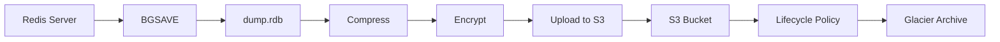

# How to Automate Redis Backups to S3

Author: [nawazdhandala](https://www.github.com/nawazdhandala)

Tags: Redis, Backup, S3, AWS, DevOps, Disaster Recovery

Description: Learn how to set up automated Redis backups to Amazon S3 with RDB snapshots, backup rotation, encryption, and restoration procedures for disaster recovery.

---

Redis stores data in memory, making backups critical for disaster recovery. A crashed server or corrupted data file can mean permanent data loss without proper backups. This guide covers automating Redis backups to S3, including RDB snapshots, encryption, rotation, and tested restoration procedures.

## Backup Strategy Overview

Redis supports two persistence mechanisms: RDB snapshots (point-in-time) and AOF (append-only file). For backups, RDB snapshots are preferred because they create a compact, portable file that can be easily copied to remote storage.



## Basic Backup Script

```bash
#!/bin/bash
# redis-backup.sh - Backup Redis to S3
# Usage: ./redis-backup.sh

set -e  # Exit on any error

# Configuration
REDIS_HOST="${REDIS_HOST:-localhost}"
REDIS_PORT="${REDIS_PORT:-6379}"
REDIS_PASSWORD="${REDIS_PASSWORD:-}"
S3_BUCKET="${S3_BUCKET:-my-redis-backups}"
S3_PREFIX="${S3_PREFIX:-redis/production}"
BACKUP_DIR="/tmp/redis-backups"
RETENTION_DAYS="${RETENTION_DAYS:-30}"

# Generate timestamp for backup filename
TIMESTAMP=$(date +%Y%m%d-%H%M%S)
BACKUP_NAME="redis-backup-${TIMESTAMP}"

# Create backup directory
mkdir -p "${BACKUP_DIR}"

echo "Starting Redis backup at ${TIMESTAMP}"

# Trigger Redis background save
if [ -n "${REDIS_PASSWORD}" ]; then
    redis-cli -h "${REDIS_HOST}" -p "${REDIS_PORT}" -a "${REDIS_PASSWORD}" BGSAVE
else
    redis-cli -h "${REDIS_HOST}" -p "${REDIS_PORT}" BGSAVE
fi

# Wait for BGSAVE to complete
echo "Waiting for BGSAVE to complete..."
while true; do
    if [ -n "${REDIS_PASSWORD}" ]; then
        LASTSAVE=$(redis-cli -h "${REDIS_HOST}" -p "${REDIS_PORT}" -a "${REDIS_PASSWORD}" LASTSAVE)
    else
        LASTSAVE=$(redis-cli -h "${REDIS_HOST}" -p "${REDIS_PORT}" LASTSAVE)
    fi

    CURRENT_TIME=$(date +%s)

    # LASTSAVE should be within last 60 seconds
    if [ $((CURRENT_TIME - LASTSAVE)) -lt 60 ]; then
        echo "BGSAVE completed"
        break
    fi

    sleep 2
done

# Find the RDB file location
if [ -n "${REDIS_PASSWORD}" ]; then
    RDB_DIR=$(redis-cli -h "${REDIS_HOST}" -p "${REDIS_PORT}" -a "${REDIS_PASSWORD}" CONFIG GET dir | tail -1)
    RDB_FILE=$(redis-cli -h "${REDIS_HOST}" -p "${REDIS_PORT}" -a "${REDIS_PASSWORD}" CONFIG GET dbfilename | tail -1)
else
    RDB_DIR=$(redis-cli -h "${REDIS_HOST}" -p "${REDIS_PORT}" CONFIG GET dir | tail -1)
    RDB_FILE=$(redis-cli -h "${REDIS_HOST}" -p "${REDIS_PORT}" CONFIG GET dbfilename | tail -1)
fi

RDB_PATH="${RDB_DIR}/${RDB_FILE}"

# Copy and compress the backup
echo "Compressing backup..."
cp "${RDB_PATH}" "${BACKUP_DIR}/${BACKUP_NAME}.rdb"
gzip "${BACKUP_DIR}/${BACKUP_NAME}.rdb"

# Upload to S3
echo "Uploading to S3..."
aws s3 cp "${BACKUP_DIR}/${BACKUP_NAME}.rdb.gz" \
    "s3://${S3_BUCKET}/${S3_PREFIX}/${BACKUP_NAME}.rdb.gz" \
    --storage-class STANDARD_IA

# Cleanup local backup
rm -f "${BACKUP_DIR}/${BACKUP_NAME}.rdb.gz"

echo "Backup completed: s3://${S3_BUCKET}/${S3_PREFIX}/${BACKUP_NAME}.rdb.gz"
```

## Python Backup Script with Encryption

```python
#!/usr/bin/env python3
"""
redis_backup.py - Encrypted Redis backup to S3
Supports: compression, encryption, checksums, and notifications
"""

import os
import sys
import time
import gzip
import hashlib
import subprocess
from datetime import datetime
from pathlib import Path

import redis
import boto3
from cryptography.fernet import Fernet


class RedisBackup:
    """
    Handles Redis backup operations with encryption and S3 upload.
    """

    def __init__(self, config):
        self.config = config
        self.redis_client = redis.Redis(
            host=config['redis_host'],
            port=config['redis_port'],
            password=config.get('redis_password'),
            decode_responses=True,
        )
        self.s3_client = boto3.client('s3')

        # Initialize encryption if key provided
        if config.get('encryption_key'):
            self.cipher = Fernet(config['encryption_key'].encode())
        else:
            self.cipher = None

    def trigger_bgsave(self):
        """
        Trigger a background save and wait for completion.
        Returns the timestamp of the completed save.
        """
        # Get current LASTSAVE timestamp
        last_save_before = self.redis_client.lastsave()

        # Trigger background save
        self.redis_client.bgsave()
        print("BGSAVE triggered, waiting for completion...")

        # Wait for save to complete (LASTSAVE will change)
        max_wait = 300  # 5 minutes max
        waited = 0

        while waited < max_wait:
            time.sleep(2)
            waited += 2

            current_lastsave = self.redis_client.lastsave()
            if current_lastsave > last_save_before:
                print(f"BGSAVE completed in {waited} seconds")
                return current_lastsave

        raise TimeoutError("BGSAVE did not complete within timeout")

    def get_rdb_path(self):
        """Get the path to the RDB dump file."""
        config = self.redis_client.config_get('dir', 'dbfilename')
        return Path(config['dir']) / config['dbfilename']

    def create_backup(self, backup_dir):
        """
        Create a compressed and optionally encrypted backup.
        Returns the path to the backup file and its checksum.
        """
        # Trigger save and get RDB path
        self.trigger_bgsave()
        rdb_path = self.get_rdb_path()

        if not rdb_path.exists():
            raise FileNotFoundError(f"RDB file not found: {rdb_path}")

        # Generate backup filename
        timestamp = datetime.now().strftime('%Y%m%d-%H%M%S')
        backup_name = f"redis-backup-{timestamp}"

        # Read and compress the RDB file
        print(f"Reading RDB file: {rdb_path}")
        with open(rdb_path, 'rb') as f:
            rdb_data = f.read()

        print(f"Compressing {len(rdb_data)} bytes...")
        compressed_data = gzip.compress(rdb_data, compresslevel=9)
        print(f"Compressed to {len(compressed_data)} bytes")

        # Encrypt if encryption is enabled
        if self.cipher:
            print("Encrypting backup...")
            final_data = self.cipher.encrypt(compressed_data)
            extension = '.rdb.gz.enc'
        else:
            final_data = compressed_data
            extension = '.rdb.gz'

        # Calculate checksum
        checksum = hashlib.sha256(final_data).hexdigest()

        # Write backup file
        backup_path = Path(backup_dir) / f"{backup_name}{extension}"
        backup_path.parent.mkdir(parents=True, exist_ok=True)

        with open(backup_path, 'wb') as f:
            f.write(final_data)

        print(f"Backup created: {backup_path}")
        print(f"Checksum: {checksum}")

        return backup_path, checksum

    def upload_to_s3(self, backup_path, checksum):
        """
        Upload backup to S3 with metadata.
        """
        bucket = self.config['s3_bucket']
        prefix = self.config.get('s3_prefix', 'redis-backups')
        key = f"{prefix}/{backup_path.name}"

        print(f"Uploading to s3://{bucket}/{key}")

        # Upload with metadata
        self.s3_client.upload_file(
            str(backup_path),
            bucket,
            key,
            ExtraArgs={
                'StorageClass': 'STANDARD_IA',  # Cheaper for infrequent access
                'Metadata': {
                    'checksum-sha256': checksum,
                    'source-host': self.config['redis_host'],
                    'backup-time': datetime.now().isoformat(),
                },
            }
        )

        print(f"Upload completed: s3://{bucket}/{key}")
        return f"s3://{bucket}/{key}"

    def cleanup_old_backups(self):
        """
        Delete backups older than retention period from S3.
        """
        bucket = self.config['s3_bucket']
        prefix = self.config.get('s3_prefix', 'redis-backups')
        retention_days = self.config.get('retention_days', 30)

        # List objects in the backup prefix
        paginator = self.s3_client.get_paginator('list_objects_v2')

        deleted_count = 0
        cutoff_time = datetime.now().timestamp() - (retention_days * 86400)

        for page in paginator.paginate(Bucket=bucket, Prefix=prefix):
            for obj in page.get('Contents', []):
                if obj['LastModified'].timestamp() < cutoff_time:
                    print(f"Deleting old backup: {obj['Key']}")
                    self.s3_client.delete_object(Bucket=bucket, Key=obj['Key'])
                    deleted_count += 1

        print(f"Cleaned up {deleted_count} old backups")

    def run_backup(self):
        """
        Execute the full backup process.
        """
        backup_dir = self.config.get('backup_dir', '/tmp/redis-backups')

        try:
            # Create backup
            backup_path, checksum = self.create_backup(backup_dir)

            # Upload to S3
            s3_uri = self.upload_to_s3(backup_path, checksum)

            # Cleanup local file
            backup_path.unlink()

            # Cleanup old backups from S3
            self.cleanup_old_backups()

            return {
                'status': 'success',
                's3_uri': s3_uri,
                'checksum': checksum,
            }

        except Exception as e:
            return {
                'status': 'failed',
                'error': str(e),
            }


if __name__ == '__main__':
    # Load configuration from environment
    config = {
        'redis_host': os.environ.get('REDIS_HOST', 'localhost'),
        'redis_port': int(os.environ.get('REDIS_PORT', 6379)),
        'redis_password': os.environ.get('REDIS_PASSWORD'),
        's3_bucket': os.environ['S3_BUCKET'],  # Required
        's3_prefix': os.environ.get('S3_PREFIX', 'redis-backups'),
        'encryption_key': os.environ.get('BACKUP_ENCRYPTION_KEY'),
        'retention_days': int(os.environ.get('RETENTION_DAYS', 30)),
        'backup_dir': os.environ.get('BACKUP_DIR', '/tmp/redis-backups'),
    }

    backup = RedisBackup(config)
    result = backup.run_backup()

    if result['status'] == 'success':
        print(f"\nBackup successful: {result['s3_uri']}")
        sys.exit(0)
    else:
        print(f"\nBackup failed: {result['error']}")
        sys.exit(1)
```

## Scheduling with Cron or Kubernetes

```bash
# Cron job - run backup every 6 hours
# Add to crontab with: crontab -e
0 */6 * * * /usr/local/bin/redis-backup.sh >> /var/log/redis-backup.log 2>&1
```

```yaml
# Kubernetes CronJob for Redis backup
apiVersion: batch/v1
kind: CronJob
metadata:
  name: redis-backup
  namespace: database
spec:
  # Run every 6 hours
  schedule: "0 */6 * * *"
  concurrencyPolicy: Forbid
  successfulJobsHistoryLimit: 3
  failedJobsHistoryLimit: 3
  jobTemplate:
    spec:
      template:
        spec:
          containers:
          - name: backup
            image: my-redis-backup:latest
            env:
            - name: REDIS_HOST
              value: "redis-master.database.svc.cluster.local"
            - name: REDIS_PORT
              value: "6379"
            - name: REDIS_PASSWORD
              valueFrom:
                secretKeyRef:
                  name: redis-credentials
                  key: password
            - name: S3_BUCKET
              value: "my-redis-backups"
            - name: S3_PREFIX
              value: "production/redis"
            - name: BACKUP_ENCRYPTION_KEY
              valueFrom:
                secretKeyRef:
                  name: backup-encryption
                  key: key
            - name: AWS_ACCESS_KEY_ID
              valueFrom:
                secretKeyRef:
                  name: aws-credentials
                  key: access-key-id
            - name: AWS_SECRET_ACCESS_KEY
              valueFrom:
                secretKeyRef:
                  name: aws-credentials
                  key: secret-access-key
          restartPolicy: OnFailure
          serviceAccountName: redis-backup
```

## Restoration Procedure

```python
#!/usr/bin/env python3
"""
redis_restore.py - Restore Redis from S3 backup
"""

import os
import sys
import gzip
from pathlib import Path

import boto3
from cryptography.fernet import Fernet


def restore_backup(s3_uri, target_path, encryption_key=None):
    """
    Download and decrypt a backup from S3.

    Args:
        s3_uri: S3 URI of the backup (s3://bucket/key)
        target_path: Where to save the restored dump.rdb
        encryption_key: Fernet key if backup is encrypted
    """
    # Parse S3 URI
    parts = s3_uri.replace('s3://', '').split('/', 1)
    bucket = parts[0]
    key = parts[1]

    s3_client = boto3.client('s3')

    # Download backup
    print(f"Downloading backup from {s3_uri}")
    local_backup = Path('/tmp/redis-restore-temp')
    s3_client.download_file(bucket, key, str(local_backup))

    # Read the backup data
    with open(local_backup, 'rb') as f:
        data = f.read()

    # Decrypt if needed
    if encryption_key:
        print("Decrypting backup...")
        cipher = Fernet(encryption_key.encode())
        data = cipher.decrypt(data)

    # Decompress
    print("Decompressing backup...")
    rdb_data = gzip.decompress(data)

    # Write the RDB file
    print(f"Writing RDB to {target_path}")
    with open(target_path, 'wb') as f:
        f.write(rdb_data)

    # Cleanup temp file
    local_backup.unlink()

    print(f"Restore complete: {len(rdb_data)} bytes written to {target_path}")
    print("\nNext steps:")
    print("1. Stop Redis server")
    print("2. Replace the existing dump.rdb with the restored file")
    print("3. Start Redis server")
    print("4. Verify data integrity")


def list_available_backups(bucket, prefix):
    """
    List available backups in S3 bucket.
    """
    s3_client = boto3.client('s3')

    response = s3_client.list_objects_v2(
        Bucket=bucket,
        Prefix=prefix,
    )

    backups = []
    for obj in response.get('Contents', []):
        backups.append({
            'key': obj['Key'],
            'size': obj['Size'],
            'last_modified': obj['LastModified'],
        })

    # Sort by date, newest first
    backups.sort(key=lambda x: x['last_modified'], reverse=True)

    return backups


if __name__ == '__main__':
    if len(sys.argv) < 2:
        # List available backups
        bucket = os.environ['S3_BUCKET']
        prefix = os.environ.get('S3_PREFIX', 'redis-backups')

        print(f"Available backups in s3://{bucket}/{prefix}/:\n")
        for backup in list_available_backups(bucket, prefix):
            size_mb = backup['size'] / (1024 * 1024)
            print(f"  {backup['last_modified']} - {backup['key']} ({size_mb:.1f} MB)")

        print("\nUsage: python redis_restore.py <s3-uri> <target-path>")
    else:
        s3_uri = sys.argv[1]
        target_path = sys.argv[2] if len(sys.argv) > 2 else '/tmp/dump.rdb'
        encryption_key = os.environ.get('BACKUP_ENCRYPTION_KEY')

        restore_backup(s3_uri, target_path, encryption_key)
```

## S3 Lifecycle Policy for Cost Optimization

```json
{
    "Rules": [
        {
            "ID": "RedisBackupLifecycle",
            "Status": "Enabled",
            "Filter": {
                "Prefix": "redis-backups/"
            },
            "Transitions": [
                {
                    "Days": 30,
                    "StorageClass": "STANDARD_IA"
                },
                {
                    "Days": 90,
                    "StorageClass": "GLACIER"
                }
            ],
            "Expiration": {
                "Days": 365
            }
        }
    ]
}
```

## Summary

| Component | Purpose | Configuration |
|-----------|---------|---------------|
| **BGSAVE** | Create point-in-time snapshot | Triggered before backup |
| **Compression** | Reduce storage and transfer costs | gzip -9 |
| **Encryption** | Protect sensitive data | Fernet (AES) |
| **S3 Storage Class** | Optimize cost | STANDARD_IA for recent, Glacier for old |
| **Retention** | Manage backup lifecycle | 30 days default, configurable |
| **Monitoring** | Alert on failures | CronJob status, CloudWatch |

Regular, tested backups are your insurance against data loss. Run restoration tests monthly to verify your backups actually work when you need them.
