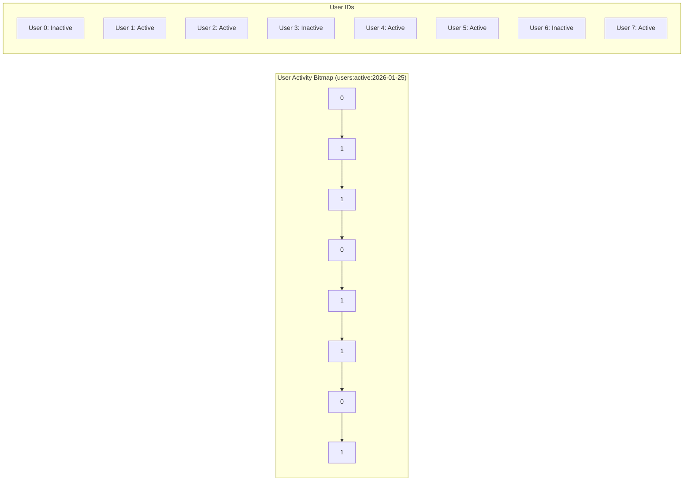

# How to Use Redis Bitmaps for Analytics

Author: [nawazdhandala](https://www.github.com/nawazdhandala)

Tags: Redis, Bitmaps, Analytics, Data Structures, Performance

Description: Learn how to use Redis Bitmaps for memory-efficient analytics, including tracking user activity, feature flags, and real-time statistics with minimal storage overhead.

---

When you need to track binary states for millions of users or events, Redis Bitmaps offer an incredibly memory-efficient solution. A single Redis key can track the state of 4 billion items using just 512 MB of memory. Let us explore how to use this powerful data structure for analytics.

## Understanding Bitmaps

A bitmap in Redis is not a special data type. It is actually a string that Redis treats as an array of bits. Each bit position can be 0 or 1, perfect for tracking yes/no states.



Key insight: User ID 5 being active sets bit position 5 to 1. Checking if user 5 was active is just reading bit 5.

## Basic Bitmap Operations

### Setting and Getting Bits

```bash
# Set bit at position (user_id) to 1 (active)
SETBIT users:active:2026-01-25 12345 1

# Get bit at position
GETBIT users:active:2026-01-25 12345

# Count all set bits (total active users)
BITCOUNT users:active:2026-01-25
```

### Python Implementation

```python
import redis
from datetime import datetime, timedelta

r = redis.Redis()

class UserActivityTracker:
    """Track user activity using Redis bitmaps."""

    def __init__(self, redis_client):
        self.r = redis_client

    def mark_active(self, user_id: int, date: str = None):
        """Mark a user as active for a given date."""
        if date is None:
            date = datetime.now().strftime('%Y-%m-%d')
        key = f"users:active:{date}"
        self.r.setbit(key, user_id, 1)

    def is_active(self, user_id: int, date: str) -> bool:
        """Check if user was active on a specific date."""
        key = f"users:active:{date}"
        return bool(self.r.getbit(key, user_id))

    def count_active(self, date: str) -> int:
        """Count total active users on a date."""
        key = f"users:active:{date}"
        return self.r.bitcount(key)

    def get_active_streak(self, user_id: int, days: int) -> int:
        """Calculate consecutive active days for a user."""
        streak = 0
        for i in range(days):
            date = (datetime.now() - timedelta(days=i)).strftime('%Y-%m-%d')
            if self.is_active(user_id, date):
                streak += 1
            else:
                break
        return streak

# Usage
tracker = UserActivityTracker(r)

# Track activity
tracker.mark_active(12345)
tracker.mark_active(67890)

# Check stats
today = datetime.now().strftime('%Y-%m-%d')
print(f"Active users today: {tracker.count_active(today)}")
print(f"User 12345 active: {tracker.is_active(12345, today)}")
```

## Bitmap Operations for Analytics

Redis provides powerful bitwise operations that work across multiple bitmaps:

### BITOP - Combine Bitmaps

```bash
# AND - Users active on BOTH days
BITOP AND users:active:both users:active:2026-01-24 users:active:2026-01-25

# OR - Users active on EITHER day
BITOP OR users:active:either users:active:2026-01-24 users:active:2026-01-25

# XOR - Users active on exactly ONE day
BITOP XOR users:active:exclusive users:active:2026-01-24 users:active:2026-01-25

# NOT - Invert bits (users NOT active)
BITOP NOT users:inactive:2026-01-25 users:active:2026-01-25
```

### Retention Analysis

Calculate user retention using bitmap operations:

```python
class RetentionAnalyzer:
    """Analyze user retention using bitmap operations."""

    def __init__(self, redis_client):
        self.r = redis_client

    def daily_retention(self, date1: str, date2: str) -> dict:
        """Calculate retention between two dates."""
        key1 = f"users:active:{date1}"
        key2 = f"users:active:{date2}"
        result_key = f"retention:{date1}:{date2}"

        # Users active on both days
        self.r.bitop('AND', result_key, key1, key2)

        retained = self.r.bitcount(result_key)
        original = self.r.bitcount(key1)

        # Clean up temp key
        self.r.delete(result_key)

        retention_rate = (retained / original * 100) if original > 0 else 0

        return {
            'original_users': original,
            'retained_users': retained,
            'retention_rate': round(retention_rate, 2)
        }

    def cohort_retention(self, cohort_date: str, days: int) -> list:
        """Calculate retention for a cohort over multiple days."""
        cohort_key = f"users:active:{cohort_date}"
        cohort_size = self.r.bitcount(cohort_key)

        retention = []
        for i in range(1, days + 1):
            check_date = (datetime.strptime(cohort_date, '%Y-%m-%d') +
                         timedelta(days=i)).strftime('%Y-%m-%d')
            check_key = f"users:active:{check_date}"
            temp_key = f"temp:retention:{cohort_date}:{check_date}"

            self.r.bitop('AND', temp_key, cohort_key, check_key)
            retained = self.r.bitcount(temp_key)
            self.r.delete(temp_key)

            rate = (retained / cohort_size * 100) if cohort_size > 0 else 0
            retention.append({
                'day': i,
                'retained': retained,
                'rate': round(rate, 2)
            })

        return retention

# Usage
analyzer = RetentionAnalyzer(r)

# Day-over-day retention
result = analyzer.daily_retention('2026-01-24', '2026-01-25')
print(f"Retention: {result['retention_rate']}%")

# 7-day cohort retention
cohort = analyzer.cohort_retention('2026-01-18', 7)
for day in cohort:
    print(f"Day {day['day']}: {day['rate']}% retained")
```

## Feature Flag Tracking

Bitmaps are perfect for tracking which users have specific features enabled:

```python
class FeatureFlagTracker:
    """Track feature flags using bitmaps."""

    def __init__(self, redis_client):
        self.r = redis_client

    def enable_feature(self, feature: str, user_id: int):
        """Enable a feature for a user."""
        self.r.setbit(f"feature:{feature}", user_id, 1)

    def disable_feature(self, feature: str, user_id: int):
        """Disable a feature for a user."""
        self.r.setbit(f"feature:{feature}", user_id, 0)

    def has_feature(self, feature: str, user_id: int) -> bool:
        """Check if user has feature enabled."""
        return bool(self.r.getbit(f"feature:{feature}", user_id))

    def count_users_with_feature(self, feature: str) -> int:
        """Count users with feature enabled."""
        return self.r.bitcount(f"feature:{feature}")

    def users_with_all_features(self, features: list) -> int:
        """Count users with ALL specified features."""
        if not features:
            return 0

        keys = [f"feature:{f}" for f in features]
        result_key = "temp:all_features"

        self.r.bitop('AND', result_key, *keys)
        count = self.r.bitcount(result_key)
        self.r.delete(result_key)

        return count

    def users_with_any_feature(self, features: list) -> int:
        """Count users with ANY of the specified features."""
        if not features:
            return 0

        keys = [f"feature:{f}" for f in features]
        result_key = "temp:any_features"

        self.r.bitop('OR', result_key, *keys)
        count = self.r.bitcount(result_key)
        self.r.delete(result_key)

        return count

# Usage
flags = FeatureFlagTracker(r)

# Enable features
flags.enable_feature('dark_mode', 12345)
flags.enable_feature('beta_ui', 12345)
flags.enable_feature('dark_mode', 67890)

# Check feature access
print(f"User 12345 has dark_mode: {flags.has_feature('dark_mode', 12345)}")

# Analytics
print(f"Users with dark_mode: {flags.count_users_with_feature('dark_mode')}")
print(f"Users with both features: {flags.users_with_all_features(['dark_mode', 'beta_ui'])}")
```

## Real-Time Statistics

Track real-time events efficiently:

```python
class RealtimeStats:
    """Real-time statistics using bitmaps."""

    def __init__(self, redis_client):
        self.r = redis_client

    def record_event(self, event: str, entity_id: int):
        """Record an event for an entity (user, product, etc)."""
        hour = datetime.now().strftime('%Y-%m-%d-%H')
        key = f"events:{event}:{hour}"
        self.r.setbit(key, entity_id, 1)
        self.r.expire(key, 86400 * 7)  # Keep 7 days

    def count_hourly(self, event: str, hour: str) -> int:
        """Count unique entities for an event in an hour."""
        return self.r.bitcount(f"events:{event}:{hour}")

    def count_daily(self, event: str, date: str) -> int:
        """Count unique entities for an event in a day."""
        # Merge all hourly bitmaps for the day
        keys = [f"events:{event}:{date}-{h:02d}" for h in range(24)]
        existing_keys = [k for k in keys if self.r.exists(k)]

        if not existing_keys:
            return 0

        result_key = f"temp:daily:{event}:{date}"
        self.r.bitop('OR', result_key, *existing_keys)
        count = self.r.bitcount(result_key)
        self.r.delete(result_key)

        return count

    def unique_across_events(self, events: list, date: str) -> int:
        """Count entities that triggered ANY of the events."""
        all_keys = []
        for event in events:
            keys = [f"events:{event}:{date}-{h:02d}" for h in range(24)]
            all_keys.extend([k for k in keys if self.r.exists(k)])

        if not all_keys:
            return 0

        result_key = f"temp:multi_event:{date}"
        self.r.bitop('OR', result_key, *all_keys)
        count = self.r.bitcount(result_key)
        self.r.delete(result_key)

        return count

# Usage
stats = RealtimeStats(r)

# Record events
stats.record_event('page_view', 12345)
stats.record_event('button_click', 12345)
stats.record_event('page_view', 67890)

# Get statistics
today = datetime.now().strftime('%Y-%m-%d')
print(f"Unique page viewers today: {stats.count_daily('page_view', today)}")
```

## Memory Efficiency

Let us calculate actual memory usage:

```python
def calculate_bitmap_memory(max_user_id: int) -> str:
    """Calculate memory needed for a bitmap."""
    # Each bit represents one user
    bits = max_user_id + 1
    bytes_needed = (bits + 7) // 8

    if bytes_needed < 1024:
        return f"{bytes_needed} bytes"
    elif bytes_needed < 1024 * 1024:
        return f"{bytes_needed / 1024:.2f} KB"
    else:
        return f"{bytes_needed / (1024 * 1024):.2f} MB"

# Examples
print(f"1 million users: {calculate_bitmap_memory(1_000_000)}")    # ~122 KB
print(f"10 million users: {calculate_bitmap_memory(10_000_000)}")  # ~1.19 MB
print(f"100 million users: {calculate_bitmap_memory(100_000_000)}") # ~11.92 MB
```

Compare this to storing user IDs in a Set:
- Set with 1 million 8-byte IDs: ~8 MB + overhead
- Bitmap for 1 million users: ~122 KB

That is roughly 65x more memory-efficient for dense data.

## When to Use Bitmaps

Bitmaps work best when:

1. **IDs are sequential integers** - Gaps waste space
2. **You need binary state** - Active/inactive, enabled/disabled
3. **You need aggregate operations** - AND, OR, COUNT across sets
4. **Data is reasonably dense** - Sparse data wastes bits

Avoid bitmaps when:

1. **IDs are UUIDs or strings** - Cannot use as bit positions
2. **IDs have huge gaps** - A single user ID of 1 billion allocates 125 MB
3. **You need to store values** - Bitmaps only store 0 or 1

## Handling Non-Sequential IDs

If your user IDs are not sequential, create a mapping:

```python
class BitmapWithMapping:
    """Bitmap with ID mapping for non-sequential IDs."""

    def __init__(self, redis_client, namespace: str):
        self.r = redis_client
        self.ns = namespace
        self.counter_key = f"{namespace}:counter"
        self.mapping_key = f"{namespace}:mapping"

    def get_bit_position(self, external_id: str) -> int:
        """Get or create bit position for an external ID."""
        # Check if mapping exists
        position = self.r.hget(self.mapping_key, external_id)
        if position:
            return int(position)

        # Create new mapping
        position = self.r.incr(self.counter_key)
        self.r.hset(self.mapping_key, external_id, position)
        return position

    def set_bit(self, bitmap_key: str, external_id: str, value: int):
        """Set bit for an external ID."""
        position = self.get_bit_position(external_id)
        self.r.setbit(bitmap_key, position, value)

    def get_bit(self, bitmap_key: str, external_id: str) -> int:
        """Get bit for an external ID."""
        position = self.r.hget(self.mapping_key, external_id)
        if position is None:
            return 0
        return self.r.getbit(bitmap_key, int(position))

# Usage with UUIDs
mapper = BitmapWithMapping(r, "users")
mapper.set_bit("active:2026-01-25", "550e8400-e29b-41d4-a716-446655440000", 1)
```

---

Redis Bitmaps provide an elegant solution for tracking binary states at scale. Whether you are building user activity tracking, feature flags, or real-time analytics, bitmaps let you handle millions of records with minimal memory overhead. The bitwise operations make complex queries like retention analysis fast and efficient. Start with simple use cases and expand as you discover more opportunities in your data.
