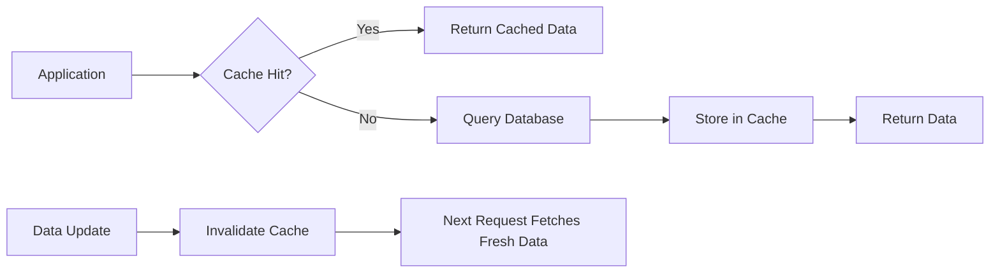

# How to Implement Cache Invalidation with Redis

Author: [nawazdhandala](https://www.github.com/nawazdhandala)

Tags: Redis, Caching, Cache Invalidation, Performance, Backend

Description: Learn practical strategies for cache invalidation in Redis, including TTL-based expiration, event-driven invalidation, cache-aside patterns, and tag-based invalidation for complex dependencies.

---

Cache invalidation is one of the hardest problems in computer science. When you cache data in Redis to speed up your application, you need a reliable way to remove or update stale entries when the underlying data changes. Get it wrong, and users see outdated information. This guide covers practical invalidation strategies that work in production.

## The Cache Invalidation Problem

When you cache database results in Redis, you create a copy of your data. The moment the source data changes, your cache becomes stale. The challenge is keeping these two in sync without losing the performance benefits of caching.



## Strategy 1: TTL-Based Expiration

The simplest approach is setting a Time-To-Live (TTL) on cached entries. Redis automatically removes keys after the specified duration. This works well when you can tolerate some staleness.

```python
import redis
import json

# Initialize Redis connection
r = redis.Redis(host='localhost', port=6379, db=0, decode_responses=True)

def get_user_profile(user_id):
    """
    Fetch user profile with TTL-based caching.
    Cache expires after 5 minutes, so data is at most 5 minutes stale.
    """
    cache_key = f"user:profile:{user_id}"

    # Try to get from cache first
    cached = r.get(cache_key)
    if cached:
        return json.loads(cached)

    # Cache miss - fetch from database
    profile = fetch_profile_from_db(user_id)

    # Store in cache with 5 minute TTL
    # EX sets expiration in seconds
    r.set(cache_key, json.dumps(profile), ex=300)

    return profile


def get_product_catalog():
    """
    Cache product catalog for 1 hour.
    Products change infrequently, so longer TTL is acceptable.
    """
    cache_key = "catalog:products:all"

    cached = r.get(cache_key)
    if cached:
        return json.loads(cached)

    products = fetch_all_products_from_db()

    # 1 hour TTL for relatively static data
    r.set(cache_key, json.dumps(products), ex=3600)

    return products
```

The downside of TTL-only invalidation is that stale data persists until expiration. For user-facing data that changes frequently, this might not be acceptable.

## Strategy 2: Explicit Invalidation on Write

When data changes, explicitly delete or update the corresponding cache entries. This gives you immediate consistency at the cost of more complex application logic.

```python
def update_user_profile(user_id, new_data):
    """
    Update user profile and invalidate cache.
    The next read will fetch fresh data from the database.
    """
    # Update the database first
    update_profile_in_db(user_id, new_data)

    # Invalidate the cache entry
    cache_key = f"user:profile:{user_id}"
    r.delete(cache_key)

    # You could also update the cache directly instead of deleting
    # r.set(cache_key, json.dumps(new_data), ex=300)


def update_product_price(product_id, new_price):
    """
    Update product price and invalidate related caches.
    Multiple cache keys might depend on this product.
    """
    # Update database
    update_price_in_db(product_id, new_price)

    # Invalidate all affected cache keys
    # Single product cache
    r.delete(f"product:{product_id}")

    # Product might appear in category listings
    product = get_product_details(product_id)
    r.delete(f"category:{product['category_id']}:products")

    # Invalidate full catalog cache
    r.delete("catalog:products:all")
```

## Strategy 3: Tag-Based Invalidation

When cache entries have complex dependencies, use tags (also called cache groups) to invalidate multiple related entries at once. Store tag-to-key mappings in Redis sets.

```python
class TaggedCache:
    """
    Cache implementation with tag-based invalidation.
    Entries can be tagged, and invalidating a tag removes all associated entries.
    """

    def __init__(self, redis_client):
        self.r = redis_client

    def set_with_tags(self, key, value, tags, ttl=300):
        """
        Store a value with associated tags for group invalidation.
        """
        # Use a pipeline for atomic operations
        pipe = self.r.pipeline()

        # Store the actual value
        pipe.set(key, json.dumps(value), ex=ttl)

        # Add this key to each tag's set
        # Tag sets track which keys belong to each tag
        for tag in tags:
            tag_key = f"tag:{tag}"
            pipe.sadd(tag_key, key)
            # Expire the tag set slightly after the longest possible TTL
            pipe.expire(tag_key, ttl + 60)

        pipe.execute()

    def get(self, key):
        """Retrieve a cached value."""
        cached = self.r.get(key)
        if cached:
            return json.loads(cached)
        return None

    def invalidate_tag(self, tag):
        """
        Invalidate all cache entries with the given tag.
        Useful when an entity change affects multiple cached views.
        """
        tag_key = f"tag:{tag}"

        # Get all keys associated with this tag
        keys = self.r.smembers(tag_key)

        if keys:
            # Delete all cached entries and the tag set itself
            pipe = self.r.pipeline()
            for key in keys:
                pipe.delete(key)
            pipe.delete(tag_key)
            pipe.execute()


# Usage example
cache = TaggedCache(r)

def cache_user_orders(user_id):
    """
    Cache user orders with tags for both user and order-related invalidation.
    """
    orders = fetch_user_orders_from_db(user_id)

    # Tag with both user ID and 'orders' for flexible invalidation
    cache.set_with_tags(
        f"user:{user_id}:orders",
        orders,
        tags=[f"user:{user_id}", "orders"],
        ttl=600
    )

    return orders


def on_user_deleted(user_id):
    """
    When a user is deleted, invalidate all their cached data.
    """
    cache.invalidate_tag(f"user:{user_id}")


def on_order_system_update():
    """
    When order processing logic changes, invalidate all order caches.
    """
    cache.invalidate_tag("orders")
```

## Strategy 4: Event-Driven Invalidation with Pub/Sub

For distributed systems, use Redis Pub/Sub to broadcast invalidation events to all application instances. This ensures every instance clears its local references.

```python
import threading

class DistributedCache:
    """
    Cache with event-driven invalidation across multiple instances.
    Uses Redis Pub/Sub to notify all instances when data changes.
    """

    def __init__(self, redis_client):
        self.r = redis_client
        self.pubsub = self.r.pubsub()
        self.invalidation_channel = "cache:invalidation"

        # Start listening for invalidation events
        self._start_listener()

    def _start_listener(self):
        """
        Background thread that listens for invalidation messages.
        When another instance invalidates a key, we hear about it.
        """
        def listen():
            self.pubsub.subscribe(self.invalidation_channel)
            for message in self.pubsub.listen():
                if message['type'] == 'message':
                    key = message['data']
                    # Handle the invalidation locally if needed
                    # This is where you'd clear any in-memory caches
                    print(f"Received invalidation for: {key}")

        thread = threading.Thread(target=listen, daemon=True)
        thread.start()

    def set(self, key, value, ttl=300):
        """Store value in Redis."""
        self.r.set(key, json.dumps(value), ex=ttl)

    def get(self, key):
        """Retrieve value from Redis."""
        cached = self.r.get(key)
        if cached:
            return json.loads(cached)
        return None

    def invalidate(self, key):
        """
        Invalidate a key and notify all instances.
        Other application instances will receive this message.
        """
        # Delete from Redis
        self.r.delete(key)

        # Publish invalidation event
        # All subscribed instances will receive this
        self.r.publish(self.invalidation_channel, key)

    def invalidate_pattern(self, pattern):
        """
        Invalidate all keys matching a pattern.
        Useful for invalidating all user-related caches at once.
        """
        # SCAN is better than KEYS for production use
        # It doesn't block the server on large datasets
        cursor = 0
        while True:
            cursor, keys = self.r.scan(cursor, match=pattern, count=100)
            for key in keys:
                self.invalidate(key)
            if cursor == 0:
                break
```

## Strategy 5: Write-Through Cache

Instead of invalidating, update the cache immediately when data changes. This keeps the cache warm and avoids cache miss storms after invalidation.

```python
def update_user_profile_write_through(user_id, new_data):
    """
    Write-through pattern: update both database and cache atomically.
    The cache is always current, no invalidation needed.
    """
    # Start a database transaction
    with db.transaction():
        # Update the database
        update_profile_in_db(user_id, new_data)

        # Immediately update the cache with fresh data
        cache_key = f"user:profile:{user_id}"
        r.set(cache_key, json.dumps(new_data), ex=300)

    return new_data


def create_order_write_through(user_id, order_data):
    """
    When creating an order, update all affected caches.
    More complex because multiple cache entries are affected.
    """
    with db.transaction():
        # Create the order in the database
        order = create_order_in_db(user_id, order_data)

        # Update the orders list cache by fetching fresh data
        orders = fetch_user_orders_from_db(user_id)
        r.set(f"user:{user_id}:orders", json.dumps(orders), ex=600)

        # Update order count
        r.set(f"user:{user_id}:order_count", len(orders), ex=600)

    return order
```

## Handling Cache Stampede

When a popular cache entry expires or gets invalidated, many requests might hit the database simultaneously. Use a lock to ensure only one request rebuilds the cache.

```python
def get_popular_data_with_lock(key, fetch_func, ttl=300):
    """
    Prevent cache stampede using a distributed lock.
    Only one request will fetch from the database, others wait.
    """
    # Try to get from cache
    cached = r.get(key)
    if cached:
        return json.loads(cached)

    # Cache miss - try to acquire lock for rebuilding
    lock_key = f"lock:{key}"

    # SET NX returns True if we got the lock (key didn't exist)
    # Lock expires after 10 seconds to prevent deadlocks
    acquired = r.set(lock_key, "1", nx=True, ex=10)

    if acquired:
        try:
            # We got the lock, fetch and cache the data
            data = fetch_func()
            r.set(key, json.dumps(data), ex=ttl)
            return data
        finally:
            # Release the lock
            r.delete(lock_key)
    else:
        # Another request is fetching, wait and retry
        import time
        for _ in range(50):  # Wait up to 5 seconds
            time.sleep(0.1)
            cached = r.get(key)
            if cached:
                return json.loads(cached)

        # Timeout - fetch from database as fallback
        return fetch_func()
```

## Summary

| Strategy | Best For | Trade-off |
|----------|----------|-----------|
| **TTL-based** | Data that can be slightly stale | Simple but may serve stale data |
| **Explicit invalidation** | Single-entry updates | Requires tracking cache keys |
| **Tag-based** | Complex dependencies | Additional storage for tag mappings |
| **Event-driven** | Distributed systems | More infrastructure complexity |
| **Write-through** | Frequently read data | Higher write latency |

Choose your invalidation strategy based on your consistency requirements and system complexity. For most applications, combining TTL with explicit invalidation on writes provides a good balance between simplicity and freshness.
