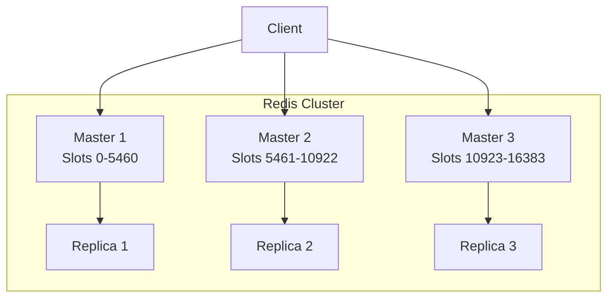

# How to Use Redis Cluster for High Availability

Author: [nawazdhandala](https://www.github.com/nawazdhandala)

Tags: Redis, Cluster, High Availability, Scaling, DevOps, Architecture

Description: Deploy Redis Cluster for automatic sharding and high availability. Learn cluster setup, data distribution, failover handling, and client configuration.

---

Redis Cluster provides automatic data sharding across multiple nodes and high availability through automatic failover. When a master node fails, one of its replicas is promoted automatically. This guide covers setting up and operating a production Redis Cluster.

## Cluster Architecture

Redis Cluster uses hash slots to distribute data. There are 16,384 slots distributed across master nodes:



## Setting Up a Cluster

Create a 6-node cluster (3 masters, 3 replicas):

```bash
# Create directories for each node
mkdir -p /data/redis-cluster/{7000,7001,7002,7003,7004,7005}

# Create configuration for each node
for port in 7000 7001 7002 7003 7004 7005; do
cat > /data/redis-cluster/$port/redis.conf << EOF
port $port
cluster-enabled yes
cluster-config-file nodes-$port.conf
cluster-node-timeout 5000
appendonly yes
appendfilename "appendonly-$port.aof"
dbfilename dump-$port.rdb
dir /data/redis-cluster/$port
bind 0.0.0.0
protected-mode no
EOF
done

# Start each node
for port in 7000 7001 7002 7003 7004 7005; do
    redis-server /data/redis-cluster/$port/redis.conf &
done

# Create the cluster
redis-cli --cluster create \
    127.0.0.1:7000 127.0.0.1:7001 127.0.0.1:7002 \
    127.0.0.1:7003 127.0.0.1:7004 127.0.0.1:7005 \
    --cluster-replicas 1

# Verify cluster status
redis-cli -p 7000 cluster info
redis-cli -p 7000 cluster nodes
```

## Docker Compose Setup

```yaml
# docker-compose.yml
version: '3.8'

services:
  redis-node-1:
    image: redis:7-alpine
    command: redis-server --port 6379 --cluster-enabled yes --cluster-config-file nodes.conf --cluster-node-timeout 5000 --appendonly yes
    ports:
      - "7000:6379"
    volumes:
      - redis-node-1-data:/data

  redis-node-2:
    image: redis:7-alpine
    command: redis-server --port 6379 --cluster-enabled yes --cluster-config-file nodes.conf --cluster-node-timeout 5000 --appendonly yes
    ports:
      - "7001:6379"
    volumes:
      - redis-node-2-data:/data

  redis-node-3:
    image: redis:7-alpine
    command: redis-server --port 6379 --cluster-enabled yes --cluster-config-file nodes.conf --cluster-node-timeout 5000 --appendonly yes
    ports:
      - "7002:6379"
    volumes:
      - redis-node-3-data:/data

  redis-node-4:
    image: redis:7-alpine
    command: redis-server --port 6379 --cluster-enabled yes --cluster-config-file nodes.conf --cluster-node-timeout 5000 --appendonly yes
    ports:
      - "7003:6379"
    volumes:
      - redis-node-4-data:/data

  redis-node-5:
    image: redis:7-alpine
    command: redis-server --port 6379 --cluster-enabled yes --cluster-config-file nodes.conf --cluster-node-timeout 5000 --appendonly yes
    ports:
      - "7004:6379"
    volumes:
      - redis-node-5-data:/data

  redis-node-6:
    image: redis:7-alpine
    command: redis-server --port 6379 --cluster-enabled yes --cluster-config-file nodes.conf --cluster-node-timeout 5000 --appendonly yes
    ports:
      - "7005:6379"
    volumes:
      - redis-node-6-data:/data

volumes:
  redis-node-1-data:
  redis-node-2-data:
  redis-node-3-data:
  redis-node-4-data:
  redis-node-5-data:
  redis-node-6-data:
```

## Python Client Connection

```python
from redis.cluster import RedisCluster
from redis.exceptions import RedisClusterException

def get_cluster_connection():
    """Connect to Redis Cluster"""
    # Provide at least one node; client discovers others
    nodes = [
        {'host': 'localhost', 'port': 7000},
        {'host': 'localhost', 'port': 7001},
        {'host': 'localhost', 'port': 7002},
    ]

    rc = RedisCluster(
        startup_nodes=nodes,
        decode_responses=True,
        skip_full_coverage_check=True
    )

    return rc

# Basic operations
rc = get_cluster_connection()

# Set and get - automatically routed to correct node
rc.set('user:1', 'Alice')
rc.set('user:2', 'Bob')
rc.set('user:3', 'Charlie')

print(rc.get('user:1'))  # Alice

# Cluster info
print(f"Cluster nodes: {len(rc.get_nodes())}")

for node in rc.get_nodes():
    print(f"  {node.host}:{node.port} - {node.server_type}")
```

## Hash Tags for Multi-Key Operations

Keys with the same hash tag go to the same slot:

```python
from redis.cluster import RedisCluster

rc = RedisCluster(startup_nodes=[{'host': 'localhost', 'port': 7000}])

# Without hash tags, these keys might be on different nodes
# Multi-key operations would fail
rc.set('user:1:name', 'Alice')
rc.set('user:1:email', 'alice@example.com')

# With hash tags {user:1}, both keys go to same slot
rc.set('{user:1}:name', 'Alice')
rc.set('{user:1}:email', 'alice@example.com')

# Now MGET works because keys are on same node
values = rc.mget('{user:1}:name', '{user:1}:email')
print(values)  # ['Alice', 'alice@example.com']

# Transactions work with hash tags
pipe = rc.pipeline()
pipe.set('{order:100}:status', 'pending')
pipe.set('{order:100}:total', '99.99')
pipe.incr('{order:100}:items')
pipe.execute()

# Calculate which slot a key maps to
slot = rc.cluster_keyslot('user:1')
print(f"Key 'user:1' maps to slot {slot}")

slot_tagged = rc.cluster_keyslot('{user:1}:name')
print(f"Key '{{user:1}}:name' maps to slot {slot_tagged}")
```

## Handling Failover

```python
from redis.cluster import RedisCluster
from redis.exceptions import ClusterDownError, ConnectionError
import time

class ResilientClusterClient:
    """Redis Cluster client with failover handling"""

    def __init__(self, nodes):
        self.nodes = nodes
        self._client = None

    def _connect(self):
        """Create cluster connection with retry"""
        max_retries = 3
        retry_delay = 1

        for attempt in range(max_retries):
            try:
                client = RedisCluster(
                    startup_nodes=self.nodes,
                    decode_responses=True,
                    skip_full_coverage_check=True,
                    cluster_error_retry_attempts=3
                )
                # Verify connection
                client.ping()
                return client

            except (ClusterDownError, ConnectionError) as e:
                print(f"Connection attempt {attempt + 1} failed: {e}")
                if attempt < max_retries - 1:
                    time.sleep(retry_delay)
                    retry_delay *= 2
                else:
                    raise

    @property
    def client(self):
        if self._client is None:
            self._client = self._connect()
        return self._client

    def execute(self, method, *args, **kwargs):
        """Execute with automatic reconnection on cluster changes"""
        max_retries = 3

        for attempt in range(max_retries):
            try:
                func = getattr(self.client, method)
                return func(*args, **kwargs)

            except ClusterDownError as e:
                print(f"Cluster down, waiting for failover: {e}")
                time.sleep(2)
                self._client = None  # Force reconnection

            except ConnectionError as e:
                print(f"Connection error: {e}")
                self._client = None
                if attempt < max_retries - 1:
                    time.sleep(1)
                else:
                    raise

# Usage
client = ResilientClusterClient([
    {'host': 'redis-1', 'port': 6379},
    {'host': 'redis-2', 'port': 6379},
    {'host': 'redis-3', 'port': 6379},
])

# Operations automatically handle failover
client.execute('set', 'key', 'value')
value = client.execute('get', 'key')
```

## Monitoring Cluster Health

```python
from redis.cluster import RedisCluster

rc = RedisCluster(startup_nodes=[{'host': 'localhost', 'port': 7000}])

def check_cluster_health():
    """Check cluster status and node health"""
    # Cluster info
    info = rc.cluster_info()
    print(f"Cluster state: {info['cluster_state']}")
    print(f"Known nodes: {info['cluster_known_nodes']}")
    print(f"Cluster size: {info['cluster_size']}")

    # Check each node
    nodes = rc.cluster_nodes()
    for node_id, node_info in nodes.items():
        flags = node_info.get('flags', '')
        print(f"\nNode: {node_info['host']}:{node_info['port']}")
        print(f"  Flags: {flags}")
        print(f"  Slots: {node_info.get('slots', [])}")

        # Check if node is healthy
        if 'fail' in flags:
            print("  WARNING: Node marked as failed!")
        if 'master' in flags and not node_info.get('slots'):
            print("  WARNING: Master with no slots!")

def get_slot_distribution():
    """Show how slots are distributed across masters"""
    nodes = rc.cluster_nodes()

    masters = {}
    for node_id, info in nodes.items():
        if 'master' in info.get('flags', ''):
            slots = info.get('slots', [])
            slot_count = sum(
                (s[1] - s[0] + 1) if isinstance(s, list) else 1
                for s in slots
            )
            masters[f"{info['host']}:{info['port']}"] = slot_count

    print("\nSlot distribution:")
    for master, count in sorted(masters.items()):
        bar = '=' * (count // 500)
        print(f"  {master}: {count} slots {bar}")

check_cluster_health()
get_slot_distribution()
```

## Cluster Operations

```bash
# Check cluster status
redis-cli -p 7000 cluster info

# List all nodes
redis-cli -p 7000 cluster nodes

# Add a new node as master
redis-cli --cluster add-node new-host:7006 existing-host:7000

# Add a new node as replica
redis-cli --cluster add-node new-host:7006 existing-host:7000 \
    --cluster-slave --cluster-master-id <master-node-id>

# Remove a node (must be empty - reshard first)
redis-cli --cluster del-node host:port <node-id>

# Reshard slots between nodes
redis-cli --cluster reshard host:7000

# Rebalance slots evenly
redis-cli --cluster rebalance host:7000

# Manual failover (promote replica to master)
redis-cli -p 7003 cluster failover

# Fix cluster issues
redis-cli --cluster fix host:7000
```

## Summary

| Feature | Benefit |
|---------|---------|
| Auto sharding | Horizontal scaling |
| Auto failover | High availability |
| Hash tags | Multi-key operations |
| Cluster-aware clients | Automatic routing |

Key points:
- Minimum 3 master nodes for cluster quorum
- Use replicas for high availability
- Hash tags enable multi-key operations
- Clients must be cluster-aware
- Monitor cluster health continuously
- Plan capacity before reaching limits
