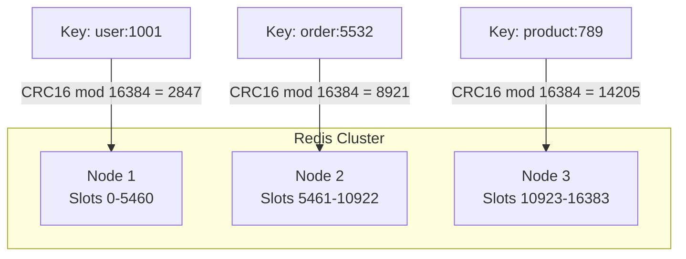

# How to Rebalance Redis Cluster Slots

Author: [nawazdhandala](https://www.github.com/nawazdhandala)

Tags: Redis, Redis Cluster, Slot Rebalancing, Sharding, High Availability, DevOps

Description: A practical guide to rebalancing slots in a Redis Cluster. Learn how to add nodes, migrate slots, handle resharding, and maintain cluster health during scaling operations.

---

> Redis Cluster distributes data across multiple nodes using hash slots. When you add or remove nodes, you need to rebalance these slots to maintain even data distribution. Understanding slot migration is essential for operating Redis at scale.

Redis Cluster uses 16384 hash slots to partition data. Each key is mapped to a slot using CRC16(key) mod 16384. When cluster topology changes, slots must be migrated between nodes to redistribute the workload. This guide walks through the process of rebalancing slots safely and efficiently.

---

## Understanding Redis Cluster Slots

### How Slots Work

Every key in Redis Cluster belongs to exactly one of 16384 slots:



### Checking Current Slot Distribution

Use redis-cli to inspect your cluster:

```bash
# Connect to any cluster node
redis-cli -c -h 192.168.1.10 -p 6379

# View cluster node information
CLUSTER NODES
# Output shows each node with its slot ranges:
# abc123... 192.168.1.10:6379 master - 0 0 1 connected 0-5460
# def456... 192.168.1.11:6379 master - 0 0 2 connected 5461-10922
# ghi789... 192.168.1.12:6379 master - 0 0 3 connected 10923-16383

# Get detailed slot information
CLUSTER SLOTS
```

Check slot distribution from the command line:

```bash
# View cluster info including slot coverage
redis-cli -c -h 192.168.1.10 -p 6379 CLUSTER INFO

# Output includes:
# cluster_state:ok
# cluster_slots_assigned:16384
# cluster_slots_ok:16384
# cluster_known_nodes:6
```

---

## Adding a New Node to the Cluster

### Step 1: Start the New Node

Configure the new Redis instance for cluster mode:

```bash
# redis.conf for the new node
port 6379
cluster-enabled yes
cluster-config-file nodes.conf
cluster-node-timeout 5000
appendonly yes

# Start Redis with cluster configuration
redis-server /path/to/redis.conf
```

### Step 2: Join the Cluster

Add the new node to an existing cluster:

```bash
# Meet the new node to the cluster
# This introduces the new node but doesn't assign any slots yet
redis-cli --cluster add-node 192.168.1.13:6379 192.168.1.10:6379

# Verify the node joined
redis-cli -c -h 192.168.1.10 -p 6379 CLUSTER NODES
# The new node appears with no slots assigned
```

---

## Rebalancing Slots

### Automatic Rebalancing

The simplest approach uses the built-in rebalance command:

```bash
# Automatic rebalancing distributes slots evenly across all master nodes
# This is the recommended approach for most scenarios
redis-cli --cluster rebalance 192.168.1.10:6379

# Rebalance with specific options
redis-cli --cluster rebalance 192.168.1.10:6379 \
    --cluster-weight abc123=1 def456=1 ghi789=1 jkl012=1 \
    --cluster-use-empty-masters \
    --cluster-timeout 5000 \
    --cluster-simulate  # Dry run first

# Remove --cluster-simulate to execute the actual rebalancing
redis-cli --cluster rebalance 192.168.1.10:6379 \
    --cluster-use-empty-masters
```

### Manual Slot Migration

For fine-grained control, migrate slots manually:

```bash
# Reshard specific number of slots to a target node
# This interactive command prompts for source and destination
redis-cli --cluster reshard 192.168.1.10:6379

# Non-interactive resharding
# Move 4096 slots to the new node (jkl012 is the new node ID)
redis-cli --cluster reshard 192.168.1.10:6379 \
    --cluster-from abc123,def456,ghi789 \
    --cluster-to jkl012 \
    --cluster-slots 4096 \
    --cluster-yes
```

### Python Script for Controlled Migration

For production environments, use a script with monitoring:

```python
import redis
import time

class ClusterRebalancer:
    """
    Handles Redis Cluster slot rebalancing with monitoring and safety checks.
    """

    def __init__(self, startup_nodes):
        # Connect to the cluster
        self.rc = redis.RedisCluster(
            startup_nodes=startup_nodes,
            decode_responses=True
        )

    def get_slot_distribution(self):
        """
        Returns a dictionary of node_id -> slot_count
        """
        cluster_info = self.rc.cluster_slots()
        distribution = {}

        for slot_range in cluster_info:
            start_slot, end_slot = slot_range[0], slot_range[1]
            node_info = slot_range[2]
            node_id = f"{node_info[0]}:{node_info[1]}"

            slot_count = end_slot - start_slot + 1
            distribution[node_id] = distribution.get(node_id, 0) + slot_count

        return distribution

    def check_cluster_health(self):
        """
        Verify cluster is healthy before proceeding with operations
        """
        info = self.rc.cluster_info()

        if info['cluster_state'] != 'ok':
            raise Exception(f"Cluster not healthy: {info['cluster_state']}")

        if int(info['cluster_slots_assigned']) != 16384:
            raise Exception(f"Not all slots assigned: {info['cluster_slots_assigned']}")

        return True

    def calculate_target_distribution(self, node_count):
        """
        Calculate ideal slot distribution for even balancing
        """
        slots_per_node = 16384 // node_count
        remainder = 16384 % node_count

        # Distribute remainder slots to first few nodes
        targets = []
        for i in range(node_count):
            extra = 1 if i < remainder else 0
            targets.append(slots_per_node + extra)

        return targets

    def monitor_migration(self, check_interval=5):
        """
        Monitor ongoing migrations and report progress
        """
        while True:
            try:
                # Check for migrating slots
                nodes_info = self.rc.cluster_nodes()

                migrating = False
                for node_id, info in nodes_info.items():
                    if 'migrating' in str(info) or 'importing' in str(info):
                        migrating = True
                        print(f"Migration in progress on {node_id}")

                if not migrating:
                    print("No active migrations")
                    break

                # Print current distribution
                dist = self.get_slot_distribution()
                print("Current distribution:")
                for node, count in dist.items():
                    print(f"  {node}: {count} slots")

                time.sleep(check_interval)

            except Exception as e:
                print(f"Error checking migration status: {e}")
                time.sleep(check_interval)

# Usage
startup_nodes = [
    {"host": "192.168.1.10", "port": 6379},
    {"host": "192.168.1.11", "port": 6379}
]

rebalancer = ClusterRebalancer(startup_nodes)

# Check health first
rebalancer.check_cluster_health()

# View current distribution
print("Current slot distribution:")
for node, count in rebalancer.get_slot_distribution().items():
    print(f"  {node}: {count} slots")
```

---

## Handling Node Removal

### Graceful Node Removal

Before removing a node, migrate all its slots to other nodes:

```bash
# First, reshard all slots away from the node being removed
# Get the node ID of the node to remove
redis-cli -c -h 192.168.1.10 CLUSTER NODES | grep 192.168.1.13

# Reshard slots to remaining nodes
redis-cli --cluster reshard 192.168.1.10:6379 \
    --cluster-from <node-to-remove-id> \
    --cluster-to <remaining-node-id> \
    --cluster-slots 4096 \
    --cluster-yes

# After all slots are migrated, remove the empty node
redis-cli --cluster del-node 192.168.1.10:6379 <node-to-remove-id>
```

### Emergency Node Failure

If a master fails without replicas, you need to handle the situation:

```bash
# Check cluster state
redis-cli -c -h 192.168.1.10 CLUSTER INFO
# cluster_state:fail indicates problems

# Manually assign orphaned slots to healthy nodes
# First identify the failed node's slots from CLUSTER NODES output
# Then assign them manually:
redis-cli -c -h 192.168.1.10 CLUSTER ADDSLOTS 5461 5462 5463 ...

# Or use fix command to repair cluster
redis-cli --cluster fix 192.168.1.10:6379
```

---

## Weighted Rebalancing

When nodes have different capacities, use weights:

```bash
# Assign weights based on node capacity
# Higher weight means more slots
# Example: new-node has 2x memory, so weight=2
redis-cli --cluster rebalance 192.168.1.10:6379 \
    --cluster-weight abc123=1 def456=1 ghi789=1 jkl012=2

# This distributes slots proportionally:
# - Nodes with weight 1: ~3277 slots each
# - Node with weight 2: ~6553 slots
```

---

## Monitoring During Rebalancing

### Track Migration Progress

```python
import redis
import time

def track_rebalance_progress(host, port, target_distribution):
    """
    Monitor rebalancing progress until distribution matches target
    """
    r = redis.Redis(host=host, port=port, decode_responses=True)

    while True:
        # Get current slot counts per node
        slots_info = r.execute_command('CLUSTER', 'SLOTS')

        current_dist = {}
        for slot_range in slots_info:
            start, end = slot_range[0], slot_range[1]
            master = f"{slot_range[2][0]}:{slot_range[2][1]}"
            current_dist[master] = current_dist.get(master, 0) + (end - start + 1)

        # Calculate progress
        total_diff = sum(
            abs(current_dist.get(node, 0) - target)
            for node, target in target_distribution.items()
        )

        print(f"Slots remaining to migrate: ~{total_diff // 2}")

        for node, count in sorted(current_dist.items()):
            target = target_distribution.get(node, 0)
            diff = count - target
            status = "OK" if abs(diff) < 10 else f"{diff:+d}"
            print(f"  {node}: {count} slots ({status})")

        # Check if balanced
        if total_diff < 10:
            print("Rebalancing complete!")
            break

        time.sleep(10)

# Define target distribution
target = {
    "192.168.1.10:6379": 4096,
    "192.168.1.11:6379": 4096,
    "192.168.1.12:6379": 4096,
    "192.168.1.13:6379": 4096
}

track_rebalance_progress("192.168.1.10", 6379, target)
```

### Key Metrics to Watch

```bash
# Monitor cluster during rebalancing
watch -n 2 'redis-cli -c -h 192.168.1.10 CLUSTER INFO | grep -E "state|slots|messages"'

# Check for slot migration conflicts
redis-cli -c -h 192.168.1.10 CLUSTER NODES | grep -E "migrating|importing"

# Monitor memory usage during migration
redis-cli -c -h 192.168.1.10 INFO memory | grep used_memory_human
```

---

## Best Practices

### Pre-Rebalancing Checklist

1. **Verify cluster health**: All nodes should report `cluster_state:ok`
2. **Check replica coverage**: Ensure each master has at least one replica
3. **Monitor memory**: Ensure destination nodes have capacity
4. **Schedule during low traffic**: Migrations consume bandwidth and CPU
5. **Have rollback plan**: Know how to reverse changes if needed

### Safe Migration Settings

```bash
# Set migration timeout (milliseconds)
redis-cli -c CONFIG SET cluster-migration-barrier 1

# Limit migration bandwidth (bytes per second)
# Configure in redis.conf:
# cluster-migration-barrier 1

# Use pipeline for bulk operations during migration
redis-cli --cluster reshard 192.168.1.10:6379 \
    --cluster-pipeline 1000 \
    --cluster-timeout 60000
```

---

## Conclusion

Rebalancing Redis Cluster slots is a critical operation for maintaining performance as your cluster grows. Key points to remember:

- Always check cluster health before starting migrations
- Use automatic rebalancing for simple scenarios
- Manual resharding gives fine-grained control
- Monitor progress and cluster metrics during migration
- Weight-based distribution handles heterogeneous hardware

With careful planning and monitoring, slot rebalancing can be performed with minimal impact on your application.

---

*Monitor your Redis Cluster health and performance with [OneUptime](https://oneuptime.com). Get alerts on cluster state changes, slot coverage issues, and memory pressure before they impact your users.*

**Related Reading:**
- [How to Tune Redis for High Write Throughput](https://oneuptime.com/blog/post/2026-01-25-redis-high-write-throughput/view)
- [How to Build Distributed Counters with Redis](https://oneuptime.com/blog/post/2026-01-27-redis-distributed-counters/view)
