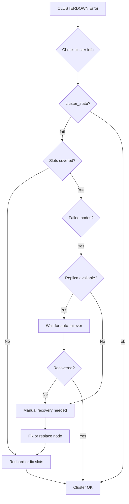

# How to Fix 'CLUSTERDOWN' Errors in Redis

Author: [nawazdhandala](https://www.github.com/nawazdhandala)

Tags: Redis, Cluster, Troubleshooting, High Availability, DevOps

Description: Diagnose and resolve Redis CLUSTERDOWN errors caused by slot coverage issues, node failures, or cluster state problems with practical troubleshooting steps.

---

The "CLUSTERDOWN The cluster is down" error indicates that your Redis Cluster cannot serve requests because it is in a failed state. This typically happens when the cluster lacks complete slot coverage or when quorum is lost. This guide walks through diagnosis and resolution.

## Understanding the Error

```python
# Error message:
# redis.exceptions.ResponseError: CLUSTERDOWN The cluster is down

# Or more specific:
# CLUSTERDOWN Hash slot not served
# CLUSTERDOWN The cluster is down because quorum is not met
```

## Quick Diagnosis

```bash
# Check cluster state
redis-cli -p 7000 CLUSTER INFO

# Key fields to check:
# cluster_state: fail (should be 'ok')
# cluster_slots_assigned: should be 16384
# cluster_slots_ok: should be 16384
# cluster_known_nodes: count of known nodes

# Check node status
redis-cli -p 7000 CLUSTER NODES

# Look for:
# - Nodes marked as 'fail' or 'fail?'
# - Slots with no assigned master
```

## Common Causes and Solutions

### 1. Missing Slot Coverage

The cluster requires all 16384 slots to be assigned to healthy masters:

```bash
# Check which slots are not covered
redis-cli -p 7000 CLUSTER SLOTS

# Find unassigned slots
redis-cli --cluster check localhost:7000

# Example output showing problem:
# [ERR] Not all 16384 slots are covered by nodes.
# Slots 5461-10922 are not covered.
```

Fix missing slots:

```bash
# Option 1: Let Redis fix it automatically
redis-cli --cluster fix localhost:7000

# Option 2: Manually assign slots to a node
redis-cli -p 7000 CLUSTER ADDSLOTS 5461 5462 5463...

# Option 3: Reshard slots from another node
redis-cli --cluster reshard localhost:7000 \
    --cluster-from <source-node-id> \
    --cluster-to <target-node-id> \
    --cluster-slots 1000 \
    --cluster-yes
```

### 2. Master Node Failure Without Replica

```bash
# Check for failed nodes
redis-cli -p 7000 CLUSTER NODES | grep fail

# If a master failed without replica:
# 1. If the node can be recovered, restart it
# 2. If data is lost, add a new node and assign slots

# Add new node
redis-cli --cluster add-node new-host:7006 existing-host:7000

# Assign slots (if the old master is gone)
redis-cli --cluster reshard localhost:7000
```

### 3. Quorum Lost

The cluster needs a majority of masters to agree on state:

```bash
# Check how many masters are up
redis-cli -p 7000 CLUSTER NODES | grep master | grep -v fail | wc -l

# With 3 masters, you need at least 2 up
# With 5 masters, you need at least 3 up
```

If quorum is lost:
```bash
# Restart failed masters
# If permanently lost, you may need to force failover

# Force failover on a replica (run on replica)
redis-cli -p 7003 CLUSTER FAILOVER FORCE

# Or use TAKEOVER for extreme cases (no master agreement needed)
redis-cli -p 7003 CLUSTER FAILOVER TAKEOVER
```

### 4. Network Partition

Nodes cannot communicate:

```bash
# Check connectivity between nodes
redis-cli -p 7000 CLUSTER NODES

# Look for nodes showing as 'disconnected' or 'fail?'
# The '?' means failure is suspected but not confirmed

# Verify network connectivity
for port in 7000 7001 7002 7003 7004 7005; do
    echo "Testing port $port"
    redis-cli -p $port PING
done

# Check cluster bus connectivity (port + 10000)
nc -zv localhost 17000
nc -zv localhost 17001
# etc.
```

## Automated Recovery Script

```python
import redis
from redis.cluster import RedisCluster
import time

def diagnose_cluster(host, port):
    """Diagnose cluster health issues"""
    try:
        r = redis.Redis(host=host, port=port)
        info = r.cluster_info()
        nodes = r.cluster_nodes()

        print("Cluster Info:")
        print(f"  State: {info['cluster_state']}")
        print(f"  Slots assigned: {info['cluster_slots_assigned']}")
        print(f"  Slots OK: {info['cluster_slots_ok']}")
        print(f"  Known nodes: {info['cluster_known_nodes']}")

        print("\nNode Status:")
        failed_nodes = []
        for node_id, node_info in nodes.items():
            flags = node_info.get('flags', '')
            if 'fail' in flags:
                failed_nodes.append(node_info)
                print(f"  FAILED: {node_info['host']}:{node_info['port']} - {flags}")
            elif 'master' in flags:
                slots = len(node_info.get('slots', []))
                print(f"  Master: {node_info['host']}:{node_info['port']} - {slots} slot ranges")

        if failed_nodes:
            print(f"\n{len(failed_nodes)} failed node(s) detected!")

        # Check for uncovered slots
        covered = set()
        for node_id, node_info in nodes.items():
            if 'master' in node_info.get('flags', '') and 'fail' not in node_info.get('flags', ''):
                for slot_range in node_info.get('slots', []):
                    if isinstance(slot_range, list):
                        for s in range(slot_range[0], slot_range[1] + 1):
                            covered.add(s)
                    else:
                        covered.add(slot_range)

        uncovered = set(range(16384)) - covered
        if uncovered:
            print(f"\nUncovered slots: {len(uncovered)}")
            print(f"  First few: {sorted(list(uncovered))[:10]}")

        return {
            'state': info['cluster_state'],
            'failed_nodes': failed_nodes,
            'uncovered_slots': len(uncovered)
        }

    except Exception as e:
        print(f"Error connecting: {e}")
        return None

def attempt_recovery(host, port):
    """Attempt automatic cluster recovery"""
    print("\nAttempting recovery...")

    # Step 1: Check if any nodes can be pinged
    for p in [port, port + 1, port + 2]:
        try:
            r = redis.Redis(host=host, port=p)
            if r.ping():
                print(f"  Node {host}:{p} is responding")
        except Exception:
            print(f"  Node {host}:{p} is not responding")

    # Step 2: Wait for potential auto-failover
    print("\nWaiting for auto-failover (30 seconds)...")
    time.sleep(30)

    # Step 3: Re-check cluster state
    diagnosis = diagnose_cluster(host, port)

    if diagnosis and diagnosis['state'] == 'ok':
        print("\nCluster recovered!")
        return True
    else:
        print("\nManual intervention required:")
        print("  1. Check if failed nodes can be restarted")
        print("  2. Run: redis-cli --cluster fix localhost:7000")
        print("  3. If data loss acceptable: reshard slots to healthy nodes")
        return False

# Usage
diagnosis = diagnose_cluster('localhost', 7000)
if diagnosis and diagnosis['state'] == 'fail':
    attempt_recovery('localhost', 7000)
```

## Prevention Strategies

```bash
# 1. Use adequate replicas
# Minimum: 1 replica per master
# Recommended: 2 replicas per master for critical data

# 2. Configure appropriate timeouts
# redis.conf
cluster-node-timeout 15000  # 15 seconds before marking node as failed
cluster-replica-validity-factor 10  # How long replica can be disconnected

# 3. Enable cluster-require-full-coverage
# If false, cluster serves requests even with missing slots
cluster-require-full-coverage yes  # Default and recommended

# 4. Monitor cluster health
redis-cli --cluster check localhost:7000
```

## Recovery Flowchart



## Summary

| Cause | Solution |
|-------|----------|
| Missing slot coverage | Run cluster fix or reshard |
| Master failed, has replica | Wait for auto-failover |
| Master failed, no replica | Add node and reshard |
| Quorum lost | Restart nodes or force failover |
| Network partition | Fix network, wait for healing |

Key commands:
- `CLUSTER INFO` - Check cluster state
- `CLUSTER NODES` - List all nodes and status
- `redis-cli --cluster check` - Comprehensive health check
- `redis-cli --cluster fix` - Attempt automatic fixes
- `CLUSTER FAILOVER FORCE/TAKEOVER` - Manual failover
