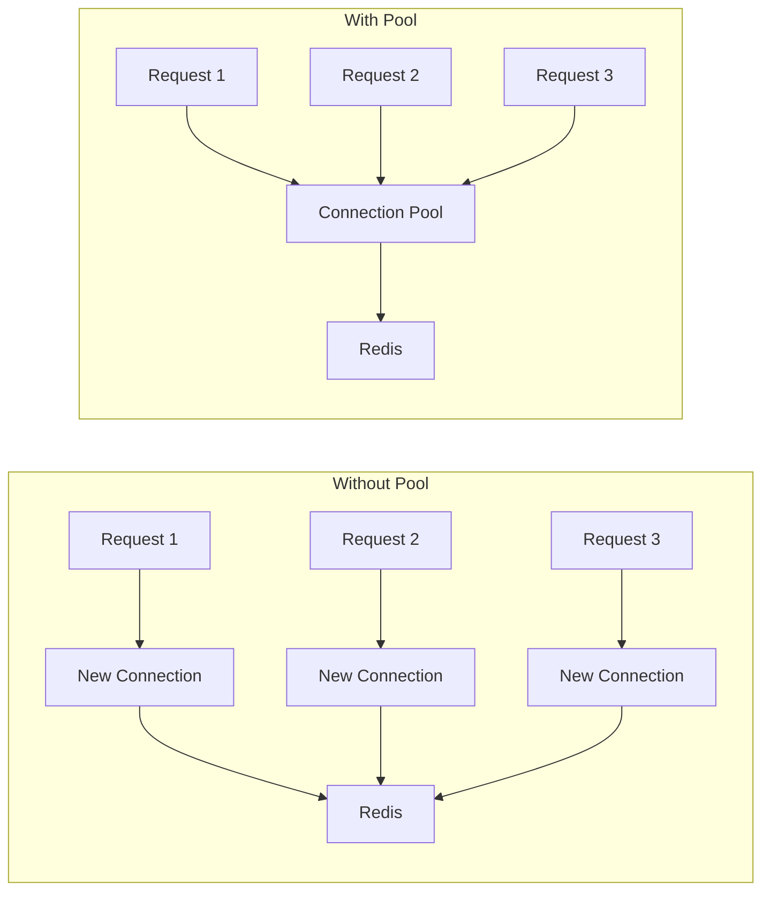

# How to Configure Connection Pooling for Redis

Author: [nawazdhandala](https://www.github.com/nawazdhandala)

Tags: Redis, Connection Pooling, Performance, Python, Node.js

Description: Learn how to properly configure Redis connection pools to maximize throughput, minimize latency, and avoid connection-related issues in production applications.

---

Opening a new TCP connection to Redis for every operation is slow and wasteful. Connection pooling maintains a set of reusable connections, significantly improving performance for applications that make frequent Redis calls. This guide covers connection pool configuration for Python and Node.js with production-ready settings.

## Why Connection Pooling Matters

Without pooling, each Redis operation requires: DNS lookup, TCP handshake, optional TLS handshake, and Redis AUTH. This adds 1-10ms of overhead per operation. With pooling, connections are reused, and this overhead is paid only once.



## Python: redis-py Connection Pooling

The redis-py library uses connection pooling by default, but the defaults may not suit high-traffic applications.

```python
import redis
from redis import ConnectionPool, BlockingConnectionPool

# Basic pooling (default behavior)
# Creates a pool with default settings (max 50 connections)
r = redis.Redis(host='localhost', port=6379, db=0)

# Explicit pool configuration
# Use this for fine-grained control over pool behavior
pool = ConnectionPool(
    host='localhost',
    port=6379,
    db=0,
    max_connections=100,        # Maximum connections in the pool
    socket_timeout=5.0,         # Timeout for socket operations
    socket_connect_timeout=2.0, # Timeout for initial connection
    retry_on_timeout=True,      # Retry operations that time out
    decode_responses=True,      # Return strings instead of bytes
)

r = redis.Redis(connection_pool=pool)


def create_production_pool():
    """
    Create a production-ready connection pool with sensible defaults.
    """
    return ConnectionPool(
        host='redis.example.com',
        port=6379,
        db=0,
        password='your-password',

        # Pool size - adjust based on your application's concurrency
        # Too small: requests wait for connections
        # Too large: wastes Redis server resources
        max_connections=50,

        # Socket timeouts prevent hanging operations
        socket_timeout=5.0,
        socket_connect_timeout=2.0,

        # Retry timed-out operations once
        # Helps with transient network issues
        retry_on_timeout=True,

        # Health check interval (seconds)
        # Connections are validated before use after this interval
        health_check_interval=30,

        # Return strings instead of bytes
        decode_responses=True,
    )


# Shared pool for the application
_pool = None

def get_redis():
    """Get a Redis client with shared connection pool."""
    global _pool
    if _pool is None:
        _pool = create_production_pool()
    return redis.Redis(connection_pool=_pool)
```

## BlockingConnectionPool for Request Queuing

The standard `ConnectionPool` raises an error when exhausted. `BlockingConnectionPool` makes requests wait for an available connection.

```python
from redis import BlockingConnectionPool

def create_blocking_pool():
    """
    Create a pool that blocks when connections are exhausted.
    Requests wait in queue rather than failing immediately.
    """
    return BlockingConnectionPool(
        host='localhost',
        port=6379,
        db=0,

        max_connections=50,

        # How long to wait for a connection before raising an error
        # Set to None for infinite wait (dangerous in production)
        timeout=5.0,

        socket_timeout=5.0,
        socket_connect_timeout=2.0,
        decode_responses=True,
    )


# Usage
pool = create_blocking_pool()
r = redis.Redis(connection_pool=pool)

try:
    result = r.get('key')
except redis.ConnectionError as e:
    # Pool exhausted and timeout exceeded
    print(f"Could not get connection: {e}")
```

## Connection Pool Monitoring

Track pool usage to detect issues before they cause outages.

```python
import time
import threading

class MonitoredPool:
    """
    Wrapper around Redis pool that tracks usage metrics.
    """

    def __init__(self, pool):
        self.pool = pool
        self.checkout_count = 0
        self.wait_time_total = 0
        self.lock = threading.Lock()

    def get_connection(self, command_name, *keys, **options):
        """Track connection checkout time."""
        start = time.time()
        conn = self.pool.get_connection(command_name, *keys, **options)
        elapsed = time.time() - start

        with self.lock:
            self.checkout_count += 1
            self.wait_time_total += elapsed

        return conn

    def release(self, connection):
        """Release connection back to pool."""
        self.pool.release(connection)

    def get_stats(self):
        """Get pool usage statistics."""
        with self.lock:
            avg_wait = self.wait_time_total / self.checkout_count if self.checkout_count > 0 else 0

        return {
            'max_connections': self.pool.max_connections,
            'current_connections': len(self.pool._available_connections) + len(self.pool._in_use_connections),
            'available': len(self.pool._available_connections),
            'in_use': len(self.pool._in_use_connections),
            'total_checkouts': self.checkout_count,
            'avg_wait_ms': avg_wait * 1000,
        }


def check_pool_health(pool):
    """
    Check if pool is healthy and log warnings.
    Run this periodically in a background thread.
    """
    stats = {
        'max_connections': pool.max_connections,
        'created': len(pool._available_connections) + len(pool._in_use_connections),
        'available': len(pool._available_connections),
        'in_use': len(pool._in_use_connections),
    }

    utilization = stats['in_use'] / stats['max_connections'] * 100

    if utilization > 80:
        print(f"WARNING: Redis pool utilization at {utilization:.0f}%")

    return stats
```

## Node.js: ioredis Connection Pooling

The ioredis library handles pooling differently than redis-py. A single ioredis client multiplexes commands over one connection. For true pooling, use a cluster or create multiple clients.

```javascript
const Redis = require('ioredis');

// Single connection (uses pipelining for efficiency)
const redis = new Redis({
  host: 'localhost',
  port: 6379,
  password: 'your-password',
  db: 0,

  // Connection options
  connectTimeout: 5000,       // Max time to establish connection
  commandTimeout: 5000,       // Max time for a command to complete

  // Reconnection strategy
  retryStrategy(times) {
    // Wait longer between retries, max 30 seconds
    const delay = Math.min(times * 100, 30000);
    return delay;
  },

  // Maximum reconnection attempts before giving up
  maxRetriesPerRequest: 3,

  // Enable read-only mode if connection is lost
  enableReadyCheck: true,
  enableOfflineQueue: true,
});


// For high-concurrency, use a connection pool via generic-pool
const genericPool = require('generic-pool');

function createRedisPool(options = {}) {
  const {
    host = 'localhost',
    port = 6379,
    password = null,
    min = 2,        // Minimum connections to keep open
    max = 10,       // Maximum connections
  } = options;

  const factory = {
    create: async () => {
      const client = new Redis({
        host,
        port,
        password,
        lazyConnect: true,  // Don't connect until first command
      });

      await client.connect();
      return client;
    },

    destroy: async (client) => {
      await client.quit();
    },

    validate: async (client) => {
      try {
        await client.ping();
        return true;
      } catch {
        return false;
      }
    },
  };

  const poolConfig = {
    min,
    max,
    acquireTimeoutMillis: 5000,  // Max wait for connection
    idleTimeoutMillis: 30000,    // Close idle connections after 30s
    evictionRunIntervalMillis: 10000,  // Check for idle connections every 10s
    testOnBorrow: true,  // Validate connection before use
  };

  return genericPool.createPool(factory, poolConfig);
}


// Usage with pool
async function withPooledRedis(pool, operation) {
  const client = await pool.acquire();

  try {
    return await operation(client);
  } finally {
    await pool.release(client);
  }
}

// Example
const pool = createRedisPool({ max: 20 });

async function getCachedUser(userId) {
  return withPooledRedis(pool, async (redis) => {
    const cached = await redis.get(`user:${userId}`);
    return cached ? JSON.parse(cached) : null;
  });
}
```

## Cluster and Sentinel Configurations

For Redis Cluster or Sentinel setups, connection pooling works differently.

```python
# Python: Redis Cluster with pooling
from rediscluster import RedisCluster

def create_cluster_client():
    """
    Create a Redis Cluster client.
    Each node gets its own connection pool automatically.
    """
    startup_nodes = [
        {'host': 'redis-1.example.com', 'port': 6379},
        {'host': 'redis-2.example.com', 'port': 6379},
        {'host': 'redis-3.example.com', 'port': 6379},
    ]

    return RedisCluster(
        startup_nodes=startup_nodes,
        decode_responses=True,
        skip_full_coverage_check=True,

        # Pool settings apply to each node
        max_connections=20,
        socket_timeout=5.0,
    )


# Python: Sentinel with pooling
from redis.sentinel import Sentinel

def create_sentinel_client():
    """
    Create a client that uses Sentinel for master discovery.
    Automatically fails over to new master if current one fails.
    """
    sentinel = Sentinel(
        [
            ('sentinel-1.example.com', 26379),
            ('sentinel-2.example.com', 26379),
            ('sentinel-3.example.com', 26379),
        ],
        socket_timeout=5.0,
    )

    # Get master connection with pooling
    master = sentinel.master_for(
        'mymaster',
        socket_timeout=5.0,
        password='your-password',
        db=0,
    )

    return master
```

## Sizing Your Connection Pool

The right pool size depends on your application's concurrency and Redis usage patterns.

```python
def calculate_pool_size(
    concurrent_requests,
    redis_ops_per_request,
    redis_op_latency_ms,
    request_duration_ms
):
    """
    Estimate optimal pool size based on workload.

    concurrent_requests: Average concurrent requests your app handles
    redis_ops_per_request: Average Redis operations per request
    redis_op_latency_ms: Average Redis operation latency
    request_duration_ms: Average total request duration
    """
    # Time spent waiting on Redis per request
    redis_time_per_request = redis_ops_per_request * redis_op_latency_ms

    # Fraction of request time using Redis
    redis_fraction = redis_time_per_request / request_duration_ms

    # Connections needed = concurrent requests * time spent using Redis
    estimated = concurrent_requests * redis_fraction

    # Add 20% buffer for burst traffic
    recommended = int(estimated * 1.2)

    return {
        'estimated': int(estimated),
        'recommended': recommended,
        'min_suggestion': max(5, recommended // 2),
        'max_suggestion': min(200, recommended * 2),
    }


# Example calculation
sizing = calculate_pool_size(
    concurrent_requests=100,
    redis_ops_per_request=5,
    redis_op_latency_ms=1,
    request_duration_ms=50
)
print(f"Recommended pool size: {sizing['recommended']}")
# Output: Recommended pool size: 12
```

## Common Pool Issues and Solutions

| Issue | Symptom | Solution |
|-------|---------|----------|
| Pool exhaustion | Connection errors under load | Increase max_connections or use BlockingConnectionPool |
| Connection leaks | Pool grows but connections never return | Ensure connections are always released (use context managers) |
| Stale connections | Random timeouts | Enable health_check_interval |
| Too many connections | Redis "max clients reached" | Reduce pool size across all app instances |

```python
# Safe connection handling with context manager
from contextlib import contextmanager

@contextmanager
def get_redis_connection(pool):
    """
    Safely acquire and release a connection.
    Connection is always returned to the pool, even if an error occurs.
    """
    conn = pool.get_connection('_')
    try:
        yield conn
    finally:
        pool.release(conn)


# Check Redis server's client list
def audit_connections(r):
    """See all connected clients and their status."""
    clients = r.client_list()

    summary = {
        'total': len(clients),
        'idle': sum(1 for c in clients if int(c.get('idle', 0)) > 60),
        'by_name': {},
    }

    for client in clients:
        name = client.get('name', 'unnamed')
        summary['by_name'][name] = summary['by_name'].get(name, 0) + 1

    return summary
```

## Summary

| Language | Library | Default Pool | Recommendation |
|----------|---------|--------------|----------------|
| Python | redis-py | Yes (50 connections) | Use BlockingConnectionPool for production |
| Node.js | ioredis | No (single multiplexed) | Use generic-pool for high concurrency |
| Java | Jedis | JedisPool | Configure min/max carefully |
| Go | go-redis | Yes | Set PoolSize based on GOMAXPROCS |

Proper connection pool configuration prevents the most common Redis performance issues. Start with conservative settings, monitor utilization, and adjust based on actual usage patterns.
