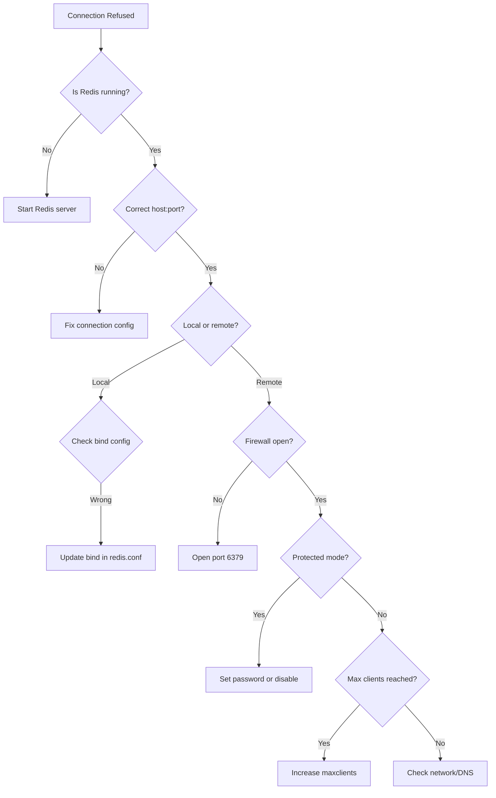

# How to Fix "Connection refused" Errors in Redis

Author: [nawazdhandala](https://www.github.com/nawazdhandala)

Tags: Redis, Troubleshooting, DevOps, Networking, Error Handling

Description: Diagnose and fix Redis "Connection refused" errors caused by server issues, network problems, firewall rules, or misconfiguration with step-by-step solutions.

---

The "Connection refused" error is one of the most common Redis issues. It means your client attempted to connect but the server actively rejected the connection. This guide walks through systematic troubleshooting to identify and fix the root cause.

## Understanding the Error

The error appears differently depending on your client:

```python
# Python redis-py
redis.exceptions.ConnectionError: Error 111 connecting to localhost:6379. Connection refused.

# Node.js ioredis
Error: connect ECONNREFUSED 127.0.0.1:6379

# Java Jedis
JedisConnectionException: java.net.ConnectException: Connection refused
```

## Quick Diagnostic Steps

```bash
# 1. Check if Redis is running
ps aux | grep redis-server

# 2. Check Redis port is listening
netstat -tlnp | grep 6379
# or
ss -tlnp | grep 6379

# 3. Test local connection
redis-cli ping

# 4. Test specific host/port
redis-cli -h 127.0.0.1 -p 6379 ping

# 5. Check Redis logs
tail -100 /var/log/redis/redis-server.log
# or
journalctl -u redis -n 100
```

## Common Causes and Solutions

### 1. Redis Server Not Running

The most common cause. Start the Redis server:

```bash
# Systemd (most Linux distributions)
sudo systemctl start redis
sudo systemctl enable redis  # Start on boot

# Check status
sudo systemctl status redis

# If using redis-server directly
redis-server /etc/redis/redis.conf

# macOS with Homebrew
brew services start redis
```

```python
import redis
import subprocess

def check_redis_running():
    """Check if Redis server is running"""
    try:
        result = subprocess.run(
            ['pgrep', '-x', 'redis-server'],
            capture_output=True,
            text=True
        )
        return result.returncode == 0
    except Exception:
        return False

def ensure_redis_connection():
    """Connect with helpful error messages"""
    try:
        r = redis.Redis(host='localhost', port=6379, socket_timeout=5)
        r.ping()
        return r
    except redis.ConnectionError as e:
        if not check_redis_running():
            print("Redis server is not running. Start it with:")
            print("  sudo systemctl start redis")
        else:
            print(f"Redis is running but connection failed: {e}")
        raise
```

### 2. Wrong Host or Port

Verify you are connecting to the correct address:

```python
import redis
import os

# Common mistakes:
# - Using 'localhost' when Redis binds to specific IP
# - Wrong port number
# - Using container name outside Docker network

# Get configuration from environment
REDIS_HOST = os.getenv('REDIS_HOST', 'localhost')
REDIS_PORT = int(os.getenv('REDIS_PORT', 6379))

r = redis.Redis(host=REDIS_HOST, port=REDIS_PORT)

# For Docker, use container name or service name
# docker-compose.yml service name becomes hostname
r = redis.Redis(host='redis', port=6379)  # In Docker network

# Check what Redis is actually listening on
# redis-cli CONFIG GET bind
# redis-cli CONFIG GET port
```

### 3. Redis Binding Configuration

Redis may be configured to only accept local connections:

```bash
# Check current bind configuration
redis-cli CONFIG GET bind

# In redis.conf, binding affects what interfaces accept connections
# bind 127.0.0.1        # Only localhost (default, secure)
# bind 0.0.0.0          # All interfaces (less secure)
# bind 192.168.1.100    # Specific interface
```

```bash
# To allow remote connections, edit redis.conf
sudo nano /etc/redis/redis.conf

# Change bind directive
bind 0.0.0.0

# Or bind to specific interface
bind 192.168.1.100

# Restart Redis
sudo systemctl restart redis
```

### 4. Protected Mode

Redis 3.2+ has protected mode that blocks remote connections without authentication:

```bash
# Check protected mode
redis-cli CONFIG GET protected-mode

# If protected-mode is "yes" and no password is set,
# Redis rejects external connections
```

Solutions:

```bash
# Option 1: Disable protected mode (not recommended for production)
redis-cli CONFIG SET protected-mode no

# Option 2: Set a password (recommended)
redis-cli CONFIG SET requirepass your_strong_password

# Option 3: Bind to localhost only (if remote access not needed)
# This is the default secure configuration
```

```python
# Connect with password
r = redis.Redis(
    host='redis.example.com',
    port=6379,
    password='your_strong_password'
)
```

### 5. Firewall Blocking Connection

```bash
# Check if firewall is blocking port 6379

# Ubuntu/Debian with ufw
sudo ufw status
sudo ufw allow 6379/tcp  # Open Redis port

# CentOS/RHEL with firewalld
sudo firewall-cmd --list-ports
sudo firewall-cmd --add-port=6379/tcp --permanent
sudo firewall-cmd --reload

# Check with iptables directly
sudo iptables -L -n | grep 6379

# Test port accessibility from remote machine
nc -zv redis-host 6379
telnet redis-host 6379
```

### 6. Docker Networking Issues

```yaml
# docker-compose.yml
version: '3.8'
services:
  redis:
    image: redis:7-alpine
    ports:
      - "6379:6379"  # Expose to host
    networks:
      - app_network

  app:
    build: .
    depends_on:
      - redis
    environment:
      # Use service name as hostname within Docker network
      - REDIS_HOST=redis
      - REDIS_PORT=6379
    networks:
      - app_network

networks:
  app_network:
    driver: bridge
```

```python
import redis
import os

# Inside Docker, use service name
# Outside Docker, use localhost with exposed port

def get_redis_connection():
    host = os.getenv('REDIS_HOST', 'localhost')
    port = int(os.getenv('REDIS_PORT', 6379))

    try:
        r = redis.Redis(host=host, port=port, socket_timeout=5)
        r.ping()
        return r
    except redis.ConnectionError:
        print(f"Cannot connect to Redis at {host}:{port}")
        print("If running in Docker, ensure:")
        print("  1. Redis container is running")
        print("  2. Both containers are on same network")
        print("  3. Using correct hostname (service name)")
        raise
```

### 7. Maximum Clients Reached

Redis has a maximum client limit:

```bash
# Check current connections
redis-cli CLIENT LIST | wc -l

# Check maxclients setting
redis-cli CONFIG GET maxclients

# Increase if needed
redis-cli CONFIG SET maxclients 20000

# Or in redis.conf
maxclients 20000
```

## Robust Connection Handling

Implement retry logic for transient failures:

```python
import redis
import time
from functools import wraps

class RedisConnectionManager:
    def __init__(self, host='localhost', port=6379, **kwargs):
        self.host = host
        self.port = port
        self.kwargs = kwargs
        self._client = None

    def _connect(self):
        """Create connection with retry"""
        max_retries = 5
        retry_delay = 1

        for attempt in range(max_retries):
            try:
                client = redis.Redis(
                    host=self.host,
                    port=self.port,
                    socket_timeout=5,
                    socket_connect_timeout=5,
                    **self.kwargs
                )
                client.ping()
                return client

            except redis.ConnectionError as e:
                if attempt < max_retries - 1:
                    print(f"Connection attempt {attempt + 1} failed: {e}")
                    print(f"Retrying in {retry_delay}s...")
                    time.sleep(retry_delay)
                    retry_delay *= 2  # Exponential backoff
                else:
                    raise

    @property
    def client(self):
        """Get or create connection"""
        if self._client is None:
            self._client = self._connect()
        return self._client

    def execute(self, method, *args, **kwargs):
        """Execute command with automatic reconnection"""
        try:
            func = getattr(self.client, method)
            return func(*args, **kwargs)
        except redis.ConnectionError:
            self._client = None  # Force reconnection
            func = getattr(self.client, method)
            return func(*args, **kwargs)

# Usage
redis_manager = RedisConnectionManager(
    host='localhost',
    port=6379,
    password='your_password'
)

# Automatic retry on connection failure
value = redis_manager.execute('get', 'my_key')
redis_manager.execute('set', 'my_key', 'my_value')
```

## Diagnostic Flowchart



## Summary

| Cause | Solution |
|-------|----------|
| Server not running | Start Redis service |
| Wrong host/port | Check configuration |
| Bind to localhost only | Update bind directive |
| Protected mode | Set password or disable |
| Firewall blocking | Open port 6379 |
| Docker networking | Use service name, check network |
| Max clients reached | Increase maxclients |

Always check Redis logs for specific error messages and implement retry logic in production applications to handle transient connection failures gracefully.
