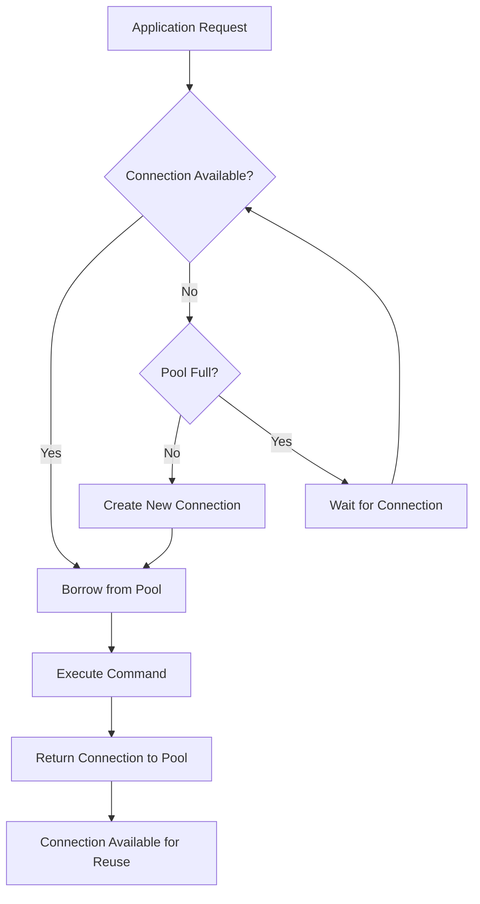

# How to Reuse Redis Connections in Applications

Author: [nawazdhandala](https://www.github.com/nawazdhandala)

Tags: Redis, Connection Pooling, Performance, Python, Node.js, Best Practices

Description: Learn how to efficiently reuse Redis connections using connection pooling, singleton patterns, and proper connection management to avoid common pitfalls.

---

Creating a new Redis connection for every request is expensive and can exhaust server resources. Connection reuse through pooling or singleton patterns dramatically improves performance and prevents connection leaks. This guide covers connection management strategies for different languages and frameworks.

## The Problem with New Connections

Each Redis connection requires a TCP handshake, and possibly TLS negotiation and authentication. Creating connections on every request adds latency and resource consumption.

```python
import redis
import time

# BAD: Creating new connection for each operation
def get_user_bad(user_id):
    # New connection created and destroyed each call
    r = redis.Redis(host='localhost', port=6379, db=0)
    user = r.get(f'user:{user_id}')
    r.close()  # Connection closed
    return user

# Measure the overhead
start = time.time()
for i in range(1000):
    get_user_bad(1)
print(f"New connections: {time.time() - start:.2f}s")

# GOOD: Reuse connection
r = redis.Redis(host='localhost', port=6379, db=0)

def get_user_good(user_id):
    return r.get(f'user:{user_id}')

start = time.time()
for i in range(1000):
    get_user_good(1)
print(f"Reused connection: {time.time() - start:.2f}s")

# Typical results:
# New connections: 2.34s
# Reused connection: 0.12s
```

## Connection Pooling in Python

The redis-py library includes built-in connection pooling. The pool maintains a set of reusable connections.

```python
import redis
from redis import ConnectionPool

# Create a connection pool
pool = ConnectionPool(
    host='localhost',
    port=6379,
    db=0,
    max_connections=50,  # Maximum connections in pool
    socket_timeout=5,    # Timeout for socket operations
    socket_connect_timeout=5,
    retry_on_timeout=True,
    health_check_interval=30  # Check connection health periodically
)

# Create Redis client using the pool
r = redis.Redis(connection_pool=pool)

def get_user(user_id):
    # Connection is borrowed from pool, used, then returned
    return r.get(f'user:{user_id}')

def set_user(user_id, data):
    return r.set(f'user:{user_id}', data)

# Pool statistics
print(f"Pool size: {len(pool._available_connections)}")
print(f"In use: {len(pool._in_use_connections)}")
```

## Singleton Pattern for Connection Management

Create a module-level singleton to ensure consistent connection reuse:

```python
# redis_client.py
import redis
from functools import lru_cache

class RedisClient:
    _instance = None
    _pool = None

    def __new__(cls):
        if cls._instance is None:
            cls._instance = super().__new__(cls)
            cls._pool = redis.ConnectionPool(
                host='localhost',
                port=6379,
                db=0,
                max_connections=50,
                decode_responses=True  # Auto decode bytes to strings
            )
            cls._instance._client = redis.Redis(connection_pool=cls._pool)
        return cls._instance

    @property
    def client(self):
        return self._client

    def get(self, key):
        return self._client.get(key)

    def set(self, key, value, ex=None):
        return self._client.set(key, value, ex=ex)

# Alternative: Simple function with lru_cache
@lru_cache(maxsize=1)
def get_redis_client():
    pool = redis.ConnectionPool(
        host='localhost',
        port=6379,
        db=0,
        max_connections=50
    )
    return redis.Redis(connection_pool=pool)

# Usage in any module
from redis_client import RedisClient, get_redis_client

# Singleton class approach
client = RedisClient()
client.set('key', 'value')

# Cached function approach
r = get_redis_client()
r.set('key', 'value')
```

## Node.js Connection Management

ioredis handles connection pooling internally and supports connection reuse:

```javascript
// redisClient.js
const Redis = require('ioredis');

// Singleton instance
let client = null;

function getRedisClient() {
    if (!client) {
        client = new Redis({
            host: 'localhost',
            port: 6379,
            db: 0,
            // Connection pool settings
            maxRetriesPerRequest: 3,
            enableReadyCheck: true,
            // Auto reconnect
            retryStrategy(times) {
                const delay = Math.min(times * 50, 2000);
                return delay;
            },
            // Reconnect on error
            reconnectOnError(err) {
                const targetError = 'READONLY';
                if (err.message.includes(targetError)) {
                    return true;
                }
                return false;
            }
        });

        client.on('connect', () => {
            console.log('Redis connected');
        });

        client.on('error', (err) => {
            console.error('Redis error:', err);
        });

        client.on('close', () => {
            console.log('Redis connection closed');
        });
    }

    return client;
}

// For cluster mode
function getRedisCluster() {
    return new Redis.Cluster([
        { host: 'redis-1', port: 6379 },
        { host: 'redis-2', port: 6379 },
        { host: 'redis-3', port: 6379 }
    ], {
        redisOptions: {
            password: process.env.REDIS_PASSWORD
        },
        // Cluster-specific settings
        clusterRetryStrategy(times) {
            return Math.min(times * 100, 3000);
        }
    });
}

module.exports = { getRedisClient, getRedisCluster };

// Usage
const { getRedisClient } = require('./redisClient');

async function getUser(userId) {
    const redis = getRedisClient();
    return await redis.get(`user:${userId}`);
}
```

## Flask Application Integration

```python
# app.py
from flask import Flask, g
import redis

app = Flask(__name__)

# Create pool at module level (shared across workers)
redis_pool = redis.ConnectionPool(
    host='localhost',
    port=6379,
    db=0,
    max_connections=50
)

def get_redis():
    """Get Redis connection for current request context"""
    if 'redis' not in g:
        g.redis = redis.Redis(connection_pool=redis_pool)
    return g.redis

@app.teardown_appcontext
def close_redis(exception):
    """Return connection to pool at end of request"""
    redis_client = g.pop('redis', None)
    # Connection automatically returned to pool when client goes out of scope

@app.route('/user/<int:user_id>')
def get_user(user_id):
    r = get_redis()
    user = r.get(f'user:{user_id}')
    return {'user': user.decode() if user else None}

@app.route('/user/<int:user_id>', methods=['POST'])
def create_user(user_id):
    r = get_redis()
    r.set(f'user:{user_id}', request.json['name'])
    return {'status': 'created'}
```

## Django Integration

```python
# settings.py
CACHES = {
    'default': {
        'BACKEND': 'django_redis.cache.RedisCache',
        'LOCATION': 'redis://localhost:6379/0',
        'OPTIONS': {
            'CLIENT_CLASS': 'django_redis.client.DefaultClient',
            'CONNECTION_POOL_KWARGS': {
                'max_connections': 50,
                'retry_on_timeout': True
            }
        }
    }
}

# Usage in views
from django.core.cache import cache
from django_redis import get_redis_connection

def get_user(request, user_id):
    # Using Django's cache framework
    user = cache.get(f'user:{user_id}')

    # Or get raw Redis connection for advanced operations
    r = get_redis_connection('default')
    user = r.hgetall(f'user:{user_id}')

    return JsonResponse({'user': user})
```

## Connection Pool Sizing

Choose pool size based on your workload and Redis server capacity:

```python
import redis
import os

# Calculate pool size based on workers and concurrency
workers = int(os.getenv('WEB_WORKERS', 4))
threads_per_worker = int(os.getenv('THREADS_PER_WORKER', 4))

# Each thread might need a connection
# Add buffer for background tasks
max_connections = (workers * threads_per_worker) + 10

pool = redis.ConnectionPool(
    host='localhost',
    port=6379,
    db=0,
    max_connections=max_connections
)

# Monitor pool usage
def check_pool_health():
    available = len(pool._available_connections)
    in_use = len(pool._in_use_connections)
    total = available + in_use

    print(f"Pool status: {in_use}/{total} connections in use")

    if in_use > max_connections * 0.8:
        print("WARNING: Pool nearly exhausted")

    return {
        'available': available,
        'in_use': in_use,
        'max': max_connections
    }
```

## Handling Connection Failures

```python
import redis
from redis.exceptions import ConnectionError, TimeoutError
import time

class ResilientRedisClient:
    def __init__(self, **kwargs):
        self.pool = redis.ConnectionPool(**kwargs)
        self.client = redis.Redis(connection_pool=self.pool)
        self.max_retries = 3
        self.retry_delay = 0.1

    def execute_with_retry(self, method, *args, **kwargs):
        """Execute Redis command with automatic retry on connection errors"""
        last_error = None

        for attempt in range(self.max_retries):
            try:
                func = getattr(self.client, method)
                return func(*args, **kwargs)
            except (ConnectionError, TimeoutError) as e:
                last_error = e
                print(f"Attempt {attempt + 1} failed: {e}")

                # Reset pool on connection errors
                if attempt < self.max_retries - 1:
                    self.pool.reset()
                    time.sleep(self.retry_delay * (attempt + 1))

        raise last_error

    def get(self, key):
        return self.execute_with_retry('get', key)

    def set(self, key, value, **kwargs):
        return self.execute_with_retry('set', key, value, **kwargs)

# Usage
client = ResilientRedisClient(
    host='localhost',
    port=6379,
    socket_timeout=5,
    socket_connect_timeout=5
)

value = client.get('my_key')
```

## Connection Lifecycle Diagram



## Summary

| Approach | Use Case | Complexity |
|----------|----------|------------|
| Connection pooling | Multi-threaded apps | Low |
| Singleton pattern | Simple apps | Low |
| Framework integration | Web applications | Medium |
| Resilient client | Production systems | Medium |

Key practices:
- Always use connection pooling in production
- Size pools based on concurrent requests
- Handle connection errors gracefully
- Monitor pool utilization
- Use framework-specific integrations when available
- Return connections promptly (avoid holding during long operations)
