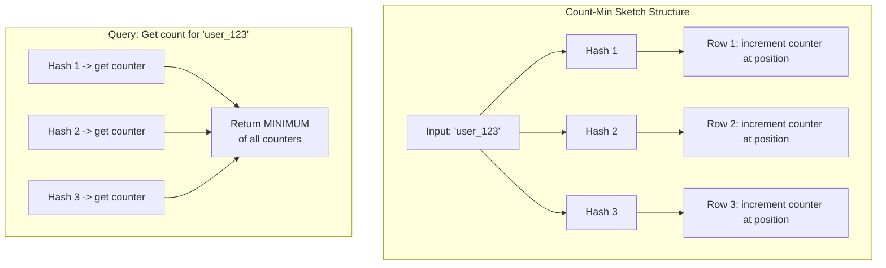

# How to Use Count-Min Sketch in Redis

Author: [nawazdhandala](https://www.github.com/nawazdhandala)

Tags: Redis, Count-Min Sketch, Probabilistic Data Structures, Streaming Analytics, RedisBloom

Description: Learn how to use Count-Min Sketch in Redis for memory-efficient frequency counting. This guide covers CMS fundamentals, practical applications for analytics and rate limiting, and tuning for accuracy vs memory tradeoffs.

---

> Count-Min Sketch (CMS) is a probabilistic data structure that estimates the frequency of elements in a data stream using sublinear space. Redis provides CMS through the RedisBloom module, making it easy to count billions of events with just megabytes of memory.

When you need to count how many times each item appears in a massive stream of data, storing exact counts for every unique item becomes impractical. Count-Min Sketch trades perfect accuracy for dramatic memory savings, making it ideal for analytics, rate limiting, and trend detection at scale.

---

## Understanding Count-Min Sketch

### How It Works

CMS uses multiple hash functions and a 2D array of counters:



The key insight: CMS can overcount (due to hash collisions) but never undercount. Taking the minimum across all hash functions minimizes the overcount error.

### Error Bounds

CMS provides probabilistic guarantees:

- **Width (w)**: Number of counters per row, controls error magnitude
- **Depth (d)**: Number of rows/hash functions, controls error probability
- Error bound: With probability (1 - delta), the estimate is at most (epsilon * N) above the true count
- Where: w = ceil(e / epsilon) and d = ceil(ln(1/delta))

---

## Setting Up RedisBloom

### Installation

RedisBloom provides CMS along with other probabilistic data structures:

```bash
# Using Docker with Redis Stack (includes RedisBloom)
docker run -p 6379:6379 redis/redis-stack:latest

# Or load RedisBloom module into existing Redis
redis-server --loadmodule /path/to/redisbloom.so

# Verify the module is loaded
redis-cli MODULE LIST
# Should show "bf" (bloom filter) module which includes CMS
```

### Python Client Setup

```python
# pip install redis

import redis

# Connect to Redis
r = redis.Redis(host='localhost', port=6379, decode_responses=True)

# Verify CMS commands are available
try:
    r.execute_command('CMS.INITBYPROB', 'test_cms', 0.001, 0.01)
    r.delete('test_cms')
    print("Count-Min Sketch commands available")
except redis.ResponseError as e:
    print(f"RedisBloom not loaded: {e}")
```

---

## Basic CMS Operations

### Creating a Count-Min Sketch

Two ways to initialize CMS with different parameters:

```python
# Method 1: Initialize by desired error rate and probability
# error_rate: maximum overcount as fraction of total count
# probability: chance of exceeding error_rate
# Lower values = more accuracy = more memory

r.execute_command('CMS.INITBYPROB', 'page_views', 0.001, 0.01)
# This creates a CMS where:
# - Error is at most 0.1% of total count, 99% of the time

# Method 2: Initialize by dimensions directly
# width: number of counters per row
# depth: number of hash functions (rows)

r.execute_command('CMS.INITBYDIM', 'api_calls', 2000, 5)
# Creates CMS with 2000 counters x 5 hash functions
# Memory usage: roughly 2000 * 5 * 4 bytes = 40KB
```

### Adding and Querying Counts

```python
def track_page_view(redis_client, cms_key, page_url):
    """
    Increment the count for a page view.
    Returns the estimated count after increment.
    """
    # INCRBY increments and returns the new estimated count
    result = redis_client.execute_command(
        'CMS.INCRBY', cms_key, page_url, 1
    )
    return result[0]

def get_page_views(redis_client, cms_key, page_urls):
    """
    Query counts for multiple pages at once.
    Returns list of estimated counts.
    """
    # QUERY returns estimates for multiple items efficiently
    counts = redis_client.execute_command(
        'CMS.QUERY', cms_key, *page_urls
    )
    return dict(zip(page_urls, counts))

# Usage example
cms_key = 'page_views_today'

# Track some page views
track_page_view(r, cms_key, '/home')
track_page_view(r, cms_key, '/products')
track_page_view(r, cms_key, '/home')
track_page_view(r, cms_key, '/checkout')
track_page_view(r, cms_key, '/home')

# Query counts
pages = ['/home', '/products', '/checkout', '/about']
counts = get_page_views(r, cms_key, pages)

for page, count in counts.items():
    print(f"{page}: {count} views")
# Output:
# /home: 3 views
# /products: 1 views
# /checkout: 1 views
# /about: 0 views
```

### Bulk Operations

For high-volume scenarios, batch your operations:

```python
def batch_increment(redis_client, cms_key, items_with_counts):
    """
    Increment multiple items in a single command.

    items_with_counts: dict of item -> increment value
    Example: {'page_a': 5, 'page_b': 3, 'page_c': 1}
    """
    # Flatten dict to alternating item, count format
    args = []
    for item, count in items_with_counts.items():
        args.extend([item, count])

    if args:
        result = redis_client.execute_command(
            'CMS.INCRBY', cms_key, *args
        )
        return dict(zip(items_with_counts.keys(), result))
    return {}

# Batch increment example
page_counts = {
    '/home': 100,
    '/products': 45,
    '/checkout': 23,
    '/cart': 67
}

new_totals = batch_increment(r, 'page_views_today', page_counts)
print("Updated counts:", new_totals)
```

---

## Practical Application: Rate Limiting

CMS works well for approximate rate limiting where exact counts are not critical:

```python
import time

class CMSRateLimiter:
    """
    Rate limiter using Count-Min Sketch for memory-efficient tracking.

    Good for scenarios where:
    - You have millions of unique keys (IPs, user IDs)
    - Approximate rate limiting is acceptable
    - Memory efficiency is important
    """

    def __init__(self, redis_client, window_seconds=60, max_requests=100):
        self.redis = redis_client
        self.window_seconds = window_seconds
        self.max_requests = max_requests

    def _get_window_key(self):
        """Generate key for current time window"""
        window = int(time.time() / self.window_seconds)
        return f"ratelimit:cms:{window}"

    def _ensure_cms_exists(self, key):
        """Create CMS if it doesn't exist for this window"""
        try:
            # Check if key exists
            if not self.redis.exists(key):
                # Create with reasonable error bounds for rate limiting
                # 0.1% error, 1% probability of exceeding
                self.redis.execute_command(
                    'CMS.INITBYPROB', key, 0.001, 0.01
                )
                # Set expiry slightly longer than window
                self.redis.expire(key, self.window_seconds + 10)
        except Exception:
            # CMS might already exist from concurrent request
            pass

    def is_allowed(self, identifier):
        """
        Check if request is allowed and increment counter.

        Returns tuple: (allowed: bool, current_count: int)
        """
        key = self._get_window_key()
        self._ensure_cms_exists(key)

        # Increment and get new count
        result = self.redis.execute_command(
            'CMS.INCRBY', key, identifier, 1
        )
        current_count = result[0]

        allowed = current_count <= self.max_requests
        return allowed, current_count

    def get_remaining(self, identifier):
        """Get remaining requests for identifier in current window"""
        key = self._get_window_key()

        try:
            counts = self.redis.execute_command(
                'CMS.QUERY', key, identifier
            )
            current = counts[0]
            return max(0, self.max_requests - current)
        except Exception:
            return self.max_requests

# Usage
limiter = CMSRateLimiter(r, window_seconds=60, max_requests=100)

# Simulate requests from an IP
test_ip = "192.168.1.100"

for i in range(105):
    allowed, count = limiter.is_allowed(test_ip)
    if not allowed:
        print(f"Request {i+1}: BLOCKED (count: {count})")
    elif i % 20 == 0:
        print(f"Request {i+1}: allowed (count: {count})")

# Check remaining
remaining = limiter.get_remaining(test_ip)
print(f"Remaining requests: {remaining}")
```

---

## Practical Application: Trending Detection

Find trending items by comparing counts across time windows:

```python
class TrendingDetector:
    """
    Detect trending items by comparing frequency across time windows.
    Uses CMS for memory-efficient counting of potentially millions of items.
    """

    def __init__(self, redis_client, window_minutes=5):
        self.redis = redis_client
        self.window_minutes = window_minutes

    def _get_window_key(self, offset_windows=0):
        """Get CMS key for a time window"""
        window = int(time.time() / (self.window_minutes * 60)) - offset_windows
        return f"trending:cms:{window}"

    def record_event(self, item_id):
        """Record an event for an item in the current window"""
        key = self._get_window_key()

        # Create CMS if needed
        if not self.redis.exists(key):
            self.redis.execute_command(
                'CMS.INITBYPROB', key, 0.001, 0.01
            )
            # Expire after 3 windows to save memory
            self.redis.expire(key, self.window_minutes * 60 * 3)

        self.redis.execute_command('CMS.INCRBY', key, item_id, 1)

    def get_trend_score(self, item_id):
        """
        Calculate trend score by comparing current vs previous window.
        Higher score = more trending.
        """
        current_key = self._get_window_key(0)
        previous_key = self._get_window_key(1)

        current_count = 0
        previous_count = 0

        try:
            if self.redis.exists(current_key):
                result = self.redis.execute_command(
                    'CMS.QUERY', current_key, item_id
                )
                current_count = result[0]
        except Exception:
            pass

        try:
            if self.redis.exists(previous_key):
                result = self.redis.execute_command(
                    'CMS.QUERY', previous_key, item_id
                )
                previous_count = result[0]
        except Exception:
            pass

        # Calculate trend score
        # Avoid division by zero, add smoothing factor
        smoothing = 10
        score = (current_count + smoothing) / (previous_count + smoothing)

        return {
            'item_id': item_id,
            'current_count': current_count,
            'previous_count': previous_count,
            'trend_score': round(score, 2)
        }

    def check_multiple_trends(self, item_ids):
        """Check trend scores for multiple items"""
        trends = [self.get_trend_score(item_id) for item_id in item_ids]
        # Sort by trend score descending
        trends.sort(key=lambda x: x['trend_score'], reverse=True)
        return trends

# Usage
detector = TrendingDetector(r, window_minutes=5)

# Simulate events
import random

products = ['product_a', 'product_b', 'product_c', 'product_d']

# Record some events
for _ in range(1000):
    # product_a is "trending" - more events
    if random.random() < 0.4:
        detector.record_event('product_a')
    else:
        detector.record_event(random.choice(products))

# Check trends
trends = detector.check_multiple_trends(products)
print("Trending analysis:")
for t in trends:
    print(f"  {t['item_id']}: score={t['trend_score']} "
          f"(current={t['current_count']}, prev={t['previous_count']})")
```

---

## Memory and Accuracy Tuning

### Understanding the Tradeoffs

```python
def calculate_cms_size(error_rate, error_probability):
    """
    Calculate CMS dimensions and memory usage.

    error_rate: maximum overcount as fraction of total (e.g., 0.01 = 1%)
    error_probability: probability of exceeding error (e.g., 0.01 = 1%)
    """
    import math

    # Width = ceil(e / error_rate) where e is Euler's number
    width = math.ceil(math.e / error_rate)

    # Depth = ceil(ln(1 / error_probability))
    depth = math.ceil(math.log(1 / error_probability))

    # Memory: width * depth * 4 bytes (32-bit counters)
    memory_bytes = width * depth * 4

    return {
        'width': width,
        'depth': depth,
        'memory_bytes': memory_bytes,
        'memory_kb': round(memory_bytes / 1024, 2),
        'memory_mb': round(memory_bytes / (1024 * 1024), 4)
    }

# Compare different configurations
configs = [
    (0.01, 0.01),    # 1% error, 99% confidence
    (0.001, 0.01),   # 0.1% error, 99% confidence
    (0.0001, 0.01),  # 0.01% error, 99% confidence
    (0.001, 0.001),  # 0.1% error, 99.9% confidence
]

print("CMS Size Comparison:")
print("-" * 60)
for error, prob in configs:
    size = calculate_cms_size(error, prob)
    print(f"Error: {error*100}%, Prob: {prob*100}%")
    print(f"  Dimensions: {size['width']} x {size['depth']}")
    print(f"  Memory: {size['memory_kb']} KB")
    print()
```

### Getting CMS Info

```python
def get_cms_info(redis_client, cms_key):
    """Get information about a CMS structure"""
    try:
        info = redis_client.execute_command('CMS.INFO', cms_key)
        # Parse the flat list into a dict
        info_dict = {}
        for i in range(0, len(info), 2):
            info_dict[info[i]] = info[i+1]
        return info_dict
    except Exception as e:
        return {'error': str(e)}

# Check CMS info
info = get_cms_info(r, 'page_views_today')
print("CMS Info:", info)
# Output: {'width': 2720, 'depth': 7, 'count': 235}
```

---

## Merging Count-Min Sketches

Combine counts from multiple CMS structures:

```python
def merge_cms(redis_client, destination, sources, weights=None):
    """
    Merge multiple CMS into one.

    Useful for combining counts from different time periods
    or different data sources.
    """
    if weights is None:
        weights = [1] * len(sources)

    # Build arguments: dest, numkeys, src1, src2, ..., WEIGHTS, w1, w2, ...
    args = [destination, len(sources)] + sources

    if any(w != 1 for w in weights):
        args.extend(['WEIGHTS'] + weights)

    redis_client.execute_command('CMS.MERGE', *args)

# Create two CMS for different time periods
r.execute_command('CMS.INITBYDIM', 'hourly:10', 2000, 5)
r.execute_command('CMS.INITBYDIM', 'hourly:11', 2000, 5)

# Add some counts
r.execute_command('CMS.INCRBY', 'hourly:10', 'item_a', 50, 'item_b', 30)
r.execute_command('CMS.INCRBY', 'hourly:11', 'item_a', 70, 'item_b', 20)

# Merge into daily total
r.execute_command('CMS.INITBYDIM', 'daily', 2000, 5)
merge_cms(r, 'daily', ['hourly:10', 'hourly:11'])

# Query merged results
result = r.execute_command('CMS.QUERY', 'daily', 'item_a', 'item_b')
print(f"Daily totals - item_a: {result[0]}, item_b: {result[1]}")
# Output: Daily totals - item_a: 120, item_b: 50
```

---

## Conclusion

Count-Min Sketch in Redis provides a powerful way to count frequencies in streaming data with bounded memory usage. Key takeaways:

- CMS trades exact accuracy for massive memory savings
- Configure error rate and probability based on your accuracy needs
- Use for rate limiting, trending detection, and analytics
- Batch operations for high-throughput scenarios
- Merge sketches to combine counts across time windows

For applications processing millions of unique items, CMS lets you maintain frequency estimates that would otherwise require gigabytes of memory.

---

*Track your Redis memory usage and CMS accuracy with [OneUptime](https://oneuptime.com). Monitor probabilistic data structure performance alongside your application metrics.*

**Related Reading:**
- [How to Build Distributed Counters with Redis](https://oneuptime.com/blog/post/2026-01-27-redis-distributed-counters/view)
- [How to Debug Latency with Redis SLOWLOG](https://oneuptime.com/blog/post/2026-01-26-redis-slowlog-latency-debugging/view)
