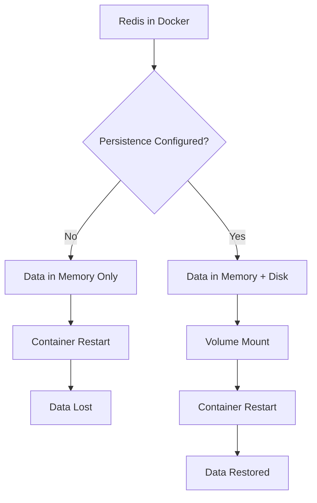

# How to Run Redis in Docker with Persistence

Author: [nawazdhandala](https://www.github.com/nawazdhandala)

Tags: Redis, Docker, Persistence, Containers, DevOps

Description: Learn how to run Redis in Docker with data persistence using RDB snapshots, AOF logs, and volume mounts for production-ready container deployments.

---

Running Redis in Docker is easy. Running it without losing data on container restarts requires proper configuration. This guide covers persistence options, volume configuration, and production-ready Docker setups for Redis.

## The Persistence Problem

By default, Redis stores everything in memory. When a container stops, all data is gone. Docker volumes solve the storage problem, but you also need Redis configured to write data to disk.



## Quick Start: Redis with Persistence

```bash
# Create a named volume for Redis data
docker volume create redis-data

# Run Redis with AOF persistence
docker run -d \
  --name redis \
  -p 6379:6379 \
  -v redis-data:/data \
  redis:7-alpine \
  redis-server --appendonly yes

# Verify data survives restart
docker exec redis redis-cli SET mykey "hello"
docker restart redis
docker exec redis redis-cli GET mykey
# Output: hello
```

## Understanding Redis Persistence Options

Redis offers two persistence mechanisms that can be used independently or together.

### RDB (Redis Database Backup)

RDB creates point-in-time snapshots at specified intervals. It's compact and fast to load but may lose data between snapshots.

```bash
# Run Redis with RDB persistence
# Saves snapshot every 60 seconds if at least 1 key changed
docker run -d \
  --name redis-rdb \
  -p 6379:6379 \
  -v redis-data:/data \
  redis:7-alpine \
  redis-server \
    --save 60 1 \
    --save 300 10 \
    --save 900 100
```

### AOF (Append Only File)

AOF logs every write operation. It's more durable but creates larger files and can be slower to load.

```bash
# Run Redis with AOF persistence
docker run -d \
  --name redis-aof \
  -p 6379:6379 \
  -v redis-data:/data \
  redis:7-alpine \
  redis-server \
    --appendonly yes \
    --appendfsync everysec
```

### Combined Persistence

For production, use both RDB and AOF. RDB provides fast restarts and backup snapshots, while AOF ensures minimal data loss.

```bash
# Run Redis with both RDB and AOF
docker run -d \
  --name redis-production \
  -p 6379:6379 \
  -v redis-data:/data \
  redis:7-alpine \
  redis-server \
    --appendonly yes \
    --appendfsync everysec \
    --save 900 1 \
    --save 300 10 \
    --save 60 10000
```

## Production Docker Compose Setup

```yaml
# docker-compose.yml
version: '3.8'

services:
  redis:
    image: redis:7-alpine
    container_name: redis
    restart: unless-stopped

    # Resource limits prevent runaway memory usage
    deploy:
      resources:
        limits:
          memory: 2G
        reservations:
          memory: 512M

    ports:
      - "6379:6379"

    volumes:
      # Named volume for data persistence
      - redis-data:/data
      # Custom config file (optional)
      - ./redis.conf:/usr/local/etc/redis/redis.conf:ro

    command: redis-server /usr/local/etc/redis/redis.conf

    # Health check ensures container is actually working
    healthcheck:
      test: ["CMD", "redis-cli", "ping"]
      interval: 10s
      timeout: 5s
      retries: 5
      start_period: 10s

    # Proper shutdown allows Redis to save data
    stop_grace_period: 30s

volumes:
  redis-data:
    driver: local
```

## Custom Redis Configuration File

```conf
# redis.conf - Production configuration

# Bind to all interfaces (use firewall for security)
bind 0.0.0.0

# Default port
port 6379

# Require password authentication
requirepass your-secure-password-here

# Memory limit - Redis will evict keys when this is reached
maxmemory 1gb
maxmemory-policy allkeys-lru

# RDB Persistence
# Save if at least 1 key changed in 900 seconds
save 900 1
# Save if at least 10 keys changed in 300 seconds
save 300 10
# Save if at least 10000 keys changed in 60 seconds
save 60 10000

# Stop accepting writes if RDB save fails
stop-writes-on-bgsave-error yes

# Compress RDB files
rdbcompression yes

# Checksum RDB files for corruption detection
rdbchecksum yes

# RDB filename
dbfilename dump.rdb

# Working directory for persistence files
dir /data

# AOF Persistence
appendonly yes

# Sync strategy: always, everysec, or no
# everysec is a good balance of performance and durability
appendfsync everysec

# Don't fsync during rewrite (faster but less safe)
no-appendfsync-on-rewrite no

# Rewrite AOF when it grows 100% from last rewrite
auto-aof-rewrite-percentage 100
auto-aof-rewrite-min-size 64mb

# Logging
loglevel notice
logfile ""

# Client timeout (0 = disabled)
timeout 0

# TCP keepalive
tcp-keepalive 300

# Max clients
maxclients 10000
```

## Dockerfile for Custom Redis Image

```dockerfile
# Dockerfile
FROM redis:7-alpine

# Copy custom configuration
COPY redis.conf /usr/local/etc/redis/redis.conf

# Create data directory with correct permissions
RUN mkdir -p /data && chown redis:redis /data

# Use redis user for security
USER redis

# Expose Redis port
EXPOSE 6379

# Health check
HEALTHCHECK --interval=10s --timeout=5s --start-period=10s --retries=5 \
  CMD redis-cli ping || exit 1

# Start Redis with custom config
CMD ["redis-server", "/usr/local/etc/redis/redis.conf"]
```

## Volume Best Practices

```bash
# Option 1: Named volumes (recommended for production)
# Docker manages the volume location
docker volume create redis-data
docker run -v redis-data:/data redis:7-alpine

# Option 2: Bind mounts (useful for development)
# You control the exact location on host
mkdir -p /var/lib/redis
docker run -v /var/lib/redis:/data redis:7-alpine

# Option 3: tmpfs (for testing, no persistence)
# Data only in memory, lost on container stop
docker run --tmpfs /data redis:7-alpine

# Check volume details
docker volume inspect redis-data

# Backup a volume
docker run --rm \
  -v redis-data:/data \
  -v $(pwd):/backup \
  alpine \
  tar cvf /backup/redis-backup.tar /data

# Restore a volume
docker run --rm \
  -v redis-data:/data \
  -v $(pwd):/backup \
  alpine \
  tar xvf /backup/redis-backup.tar -C /
```

## Handling Persistence in Kubernetes

```yaml
# kubernetes/redis-statefulset.yaml
apiVersion: apps/v1
kind: StatefulSet
metadata:
  name: redis
spec:
  serviceName: redis
  replicas: 1
  selector:
    matchLabels:
      app: redis
  template:
    metadata:
      labels:
        app: redis
    spec:
      containers:
      - name: redis
        image: redis:7-alpine
        command:
        - redis-server
        - --appendonly
        - "yes"
        - --appendfsync
        - everysec
        - --save
        - "900"
        - "1"
        - --save
        - "300"
        - "10"
        ports:
        - containerPort: 6379
          name: redis
        resources:
          requests:
            memory: "256Mi"
            cpu: "100m"
          limits:
            memory: "1Gi"
            cpu: "500m"
        volumeMounts:
        - name: redis-data
          mountPath: /data
        livenessProbe:
          exec:
            command:
            - redis-cli
            - ping
          initialDelaySeconds: 10
          periodSeconds: 10
        readinessProbe:
          exec:
            command:
            - redis-cli
            - ping
          initialDelaySeconds: 5
          periodSeconds: 5

  # Persistent volume claim template
  volumeClaimTemplates:
  - metadata:
      name: redis-data
    spec:
      accessModes: ["ReadWriteOnce"]
      storageClassName: fast-ssd
      resources:
        requests:
          storage: 10Gi
---
apiVersion: v1
kind: Service
metadata:
  name: redis
spec:
  ports:
  - port: 6379
    targetPort: 6379
  selector:
    app: redis
```

## Monitoring Persistence

```python
import redis

r = redis.Redis(host='localhost', port=6379, decode_responses=True)

def check_persistence_status():
    """
    Check Redis persistence configuration and status.
    Useful for monitoring and alerting.
    """
    info = r.info()

    status = {
        # RDB status
        'rdb_enabled': info.get('rdb_bgsave_in_progress', 0) is not None,
        'rdb_last_save_time': info.get('rdb_last_save_time', 0),
        'rdb_last_bgsave_status': info.get('rdb_last_bgsave_status', 'unknown'),
        'rdb_last_bgsave_time_sec': info.get('rdb_last_bgsave_time_sec', 0),
        'rdb_current_bgsave_time_sec': info.get('rdb_current_bgsave_time_sec', -1),

        # AOF status
        'aof_enabled': info.get('aof_enabled', 0) == 1,
        'aof_last_rewrite_status': info.get('aof_last_bgrewrite_status', 'unknown'),
        'aof_current_size': info.get('aof_current_size', 0),
        'aof_base_size': info.get('aof_base_size', 0),
        'aof_pending_rewrite': info.get('aof_pending_rewrite', 0),

        # Memory
        'used_memory_human': info.get('used_memory_human', '0'),
        'maxmemory_human': info.get('maxmemory_human', '0'),
    }

    return status


def check_persistence_health():
    """
    Return health status based on persistence metrics.
    """
    status = check_persistence_status()
    issues = []

    # Check RDB status
    if status['rdb_last_bgsave_status'] != 'ok':
        issues.append(f"RDB save failed: {status['rdb_last_bgsave_status']}")

    # Check if last save is too old (more than 1 hour)
    import time
    if time.time() - status['rdb_last_save_time'] > 3600:
        issues.append("RDB snapshot is more than 1 hour old")

    # Check AOF status
    if status['aof_enabled']:
        if status['aof_last_rewrite_status'] != 'ok':
            issues.append(f"AOF rewrite failed: {status['aof_last_rewrite_status']}")

        # Check AOF growth
        if status['aof_base_size'] > 0:
            growth = status['aof_current_size'] / status['aof_base_size']
            if growth > 2:
                issues.append(f"AOF has grown {growth:.1f}x since last rewrite")

    return {
        'healthy': len(issues) == 0,
        'issues': issues,
        'status': status,
    }


# Check and print status
health = check_persistence_health()
if health['healthy']:
    print("Persistence is healthy")
else:
    print("Persistence issues detected:")
    for issue in health['issues']:
        print(f"  - {issue}")
```

## Graceful Shutdown

Proper shutdown ensures Redis saves all data before the container stops.

```bash
# Docker stop sends SIGTERM, Redis saves data and exits cleanly
# Default timeout is 10 seconds, increase for large datasets
docker stop --time=30 redis

# Force immediate stop (may lose data!)
docker kill redis

# In docker-compose.yml, set stop_grace_period
# stop_grace_period: 30s
```

## Summary

| Persistence Mode | Durability | Performance | Use Case |
|------------------|------------|-------------|----------|
| **None** | Data lost on restart | Fastest | Caching only |
| **RDB only** | Up to N minutes of data loss | Fast | Periodic backups acceptable |
| **AOF everysec** | Up to 1 second of data loss | Good | Most production use |
| **AOF always** | No data loss | Slower | Maximum durability |
| **RDB + AOF** | Best of both | Good | Recommended for production |

Running Redis in Docker with persistence is straightforward once you understand the options. Use AOF with everysec fsync for most production deployments, add RDB for backup snapshots, and always use volumes to store the data directory.
