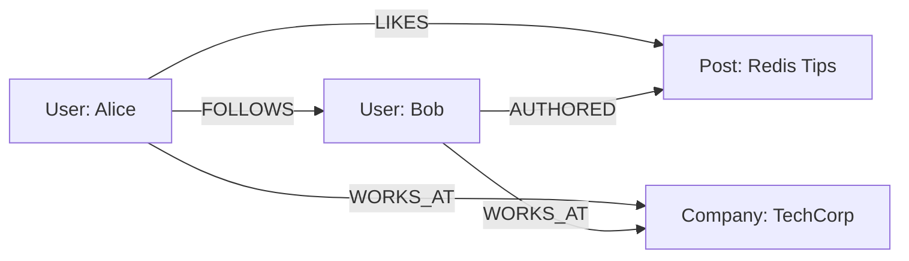

# How to Model Graph Data with RedisGraph

Author: [nawazdhandala](https://www.github.com/nawazdhandala)

Tags: Redis, RedisGraph, Graph Database, Data Modeling, Cypher, NoSQL

Description: Learn how to model and query graph data using RedisGraph. This guide covers node and relationship creation, Cypher query patterns, and practical examples for social networks, recommendation engines, and fraud detection systems.

---

> RedisGraph brings the power of graph databases to Redis, allowing you to model complex relationships and traverse connected data with the Cypher query language. For applications that need to represent networks, hierarchies, or any interconnected data, RedisGraph offers sub-millisecond query performance.

Graph databases excel at scenarios where relationships between entities matter as much as the entities themselves. Social networks, recommendation systems, fraud detection, and knowledge graphs all benefit from graph data modeling. RedisGraph combines the speed of Redis with the expressiveness of property graphs.

---

## Understanding Graph Data Models

Before diving into RedisGraph, let's understand the core concepts of graph databases.

### Nodes, Relationships, and Properties

A property graph consists of three main components:



- **Nodes**: Entities in your domain (users, products, locations)
- **Relationships**: Connections between nodes with direction and type
- **Properties**: Key-value attributes on both nodes and relationships

---

## Setting Up RedisGraph

### Installation

RedisGraph runs as a Redis module. You can load it into an existing Redis instance or use Docker:

```bash
# Using Docker - the simplest way to get started
docker run -p 6379:6379 redis/redis-stack:latest

# Or load the module into existing Redis
# Download the module from https://redis.io/docs/stack/graph/
redis-server --loadmodule /path/to/redisgraph.so
```

### Python Client Setup

Install the required packages and set up the connection:

```python
# Install the redis client with graph support
# pip install redis

import redis
from redis.commands.graph import Graph

# Connect to Redis
r = redis.Redis(host='localhost', port=6379, decode_responses=True)

# Create a graph instance - this is your primary interface
# The graph name acts as a namespace for all nodes and relationships
social_graph = r.graph('social_network')
```

---

## Creating Nodes and Relationships

### Basic Node Creation

Nodes are created using the CREATE clause in Cypher:

```python
# Create individual nodes with labels and properties
# Labels categorize nodes (User, Post, Company)
# Properties store data about each node

create_users = """
CREATE
    (alice:User {name: 'Alice', age: 28, city: 'San Francisco'}),
    (bob:User {name: 'Bob', age: 32, city: 'New York'}),
    (charlie:User {name: 'Charlie', age: 25, city: 'San Francisco'}),
    (diana:User {name: 'Diana', age: 30, city: 'Seattle'})
"""

# Execute the query to create nodes
social_graph.query(create_users)
print("Created user nodes")
```

### Creating Relationships

Relationships connect nodes and can have their own properties:

```python
# Create relationships between existing nodes
# MATCH finds existing nodes, CREATE adds the relationship
# Relationship properties like 'since' store metadata

create_follows = """
MATCH (a:User {name: 'Alice'}), (b:User {name: 'Bob'})
CREATE (a)-[:FOLLOWS {since: '2024-01-15'}]->(b)
"""
social_graph.query(create_follows)

# Create multiple relationships in one query
create_more_follows = """
MATCH (a:User {name: 'Alice'}), (c:User {name: 'Charlie'})
CREATE (a)-[:FOLLOWS {since: '2024-03-20'}]->(c)
"""
social_graph.query(create_more_follows)

# Bidirectional relationships require two CREATE statements
create_mutual = """
MATCH (b:User {name: 'Bob'}), (d:User {name: 'Diana'})
CREATE (b)-[:FOLLOWS {since: '2023-11-10'}]->(d),
       (d)-[:FOLLOWS {since: '2023-12-05'}]->(b)
"""
social_graph.query(create_mutual)
```

---

## Querying Graph Data

### Basic Pattern Matching

The MATCH clause finds patterns in your graph:

```python
# Find all users that Alice follows
query = """
MATCH (alice:User {name: 'Alice'})-[:FOLLOWS]->(friend:User)
RETURN friend.name, friend.city
"""

result = social_graph.query(query)

# Process results - each row is a tuple of returned values
for record in result.result_set:
    name, city = record
    print(f"Alice follows {name} who lives in {city}")
```

### Traversing Multiple Hops

Graph queries can traverse multiple relationship levels:

```python
# Find friends of friends (2 hops away)
# This pattern matches Alice -> someone -> someone else
query = """
MATCH (alice:User {name: 'Alice'})-[:FOLLOWS]->(:User)-[:FOLLOWS]->(fof:User)
WHERE fof.name <> 'Alice'
RETURN DISTINCT fof.name as friend_of_friend
"""

result = social_graph.query(query)

for record in result.result_set:
    print(f"Friend of friend: {record[0]}")
```

### Variable Length Paths

For flexible path lengths, use variable-length patterns:

```python
# Find all users connected to Alice within 1 to 3 hops
# The *1..3 syntax means minimum 1, maximum 3 relationships
query = """
MATCH (alice:User {name: 'Alice'})-[:FOLLOWS*1..3]->(connected:User)
RETURN DISTINCT connected.name,
       length(shortestPath((alice)-[:FOLLOWS*]->(connected))) as distance
ORDER BY distance
"""

result = social_graph.query(query)

for record in result.result_set:
    name, distance = record
    print(f"{name} is {distance} hop(s) from Alice")
```

---

## Practical Example: Recommendation Engine

Let's build a simple "people you may know" feature:

```python
def get_friend_recommendations(graph, user_name, limit=5):
    """
    Recommend new connections based on mutual friends.

    The algorithm:
    1. Find all friends of the user's friends
    2. Exclude people already connected to the user
    3. Rank by number of mutual connections
    """

    query = """
    MATCH (user:User {name: $name})-[:FOLLOWS]->(friend:User)-[:FOLLOWS]->(recommendation:User)
    WHERE NOT (user)-[:FOLLOWS]->(recommendation)
      AND recommendation.name <> $name
    RETURN recommendation.name as suggested_friend,
           COUNT(friend) as mutual_friends,
           COLLECT(friend.name) as mutual_friend_names
    ORDER BY mutual_friends DESC
    LIMIT $limit
    """

    # Parameters prevent injection and improve query caching
    params = {'name': user_name, 'limit': limit}
    result = graph.query(query, params)

    recommendations = []
    for record in result.result_set:
        recommendations.append({
            'name': record[0],
            'mutual_count': record[1],
            'mutual_friends': record[2]
        })

    return recommendations

# Usage
recs = get_friend_recommendations(social_graph, 'Alice')
for rec in recs:
    print(f"Suggested: {rec['name']} ({rec['mutual_count']} mutual friends)")
    print(f"  Mutual friends: {', '.join(rec['mutual_friends'])}")
```

---

## Modeling Complex Domains

### E-commerce Product Graph

Here's how to model products, categories, and purchase history:

```python
# Create product catalog with categories
setup_catalog = """
CREATE
    (electronics:Category {name: 'Electronics'}),
    (laptops:Category {name: 'Laptops'}),
    (phones:Category {name: 'Phones'}),

    (macbook:Product {name: 'MacBook Pro', price: 2499, sku: 'MBP-001'}),
    (iphone:Product {name: 'iPhone 15', price: 999, sku: 'IPH-015'}),
    (pixel:Product {name: 'Pixel 8', price: 699, sku: 'PIX-008'}),

    (laptops)-[:SUBCATEGORY_OF]->(electronics),
    (phones)-[:SUBCATEGORY_OF]->(electronics),
    (macbook)-[:IN_CATEGORY]->(laptops),
    (iphone)-[:IN_CATEGORY]->(phones),
    (pixel)-[:IN_CATEGORY]->(phones)
"""

product_graph = r.graph('ecommerce')
product_graph.query(setup_catalog)

# Add customer purchase history
add_purchase = """
MATCH (c:Customer {id: $customer_id}), (p:Product {sku: $sku})
CREATE (c)-[:PURCHASED {date: $date, quantity: $qty}]->(p)
"""

# Record purchases
product_graph.query(add_purchase, {
    'customer_id': 'C001',
    'sku': 'MBP-001',
    'date': '2024-01-20',
    'qty': 1
})
```

### Collaborative Filtering Query

Find products purchased by similar customers:

```python
def get_product_recommendations(graph, customer_id, limit=5):
    """
    Recommend products based on what similar customers purchased.

    Similar customers are those who bought the same products.
    """

    query = """
    MATCH (customer:Customer {id: $cid})-[:PURCHASED]->(product:Product)
          <-[:PURCHASED]-(similar:Customer)-[:PURCHASED]->(rec:Product)
    WHERE NOT (customer)-[:PURCHASED]->(rec)
    RETURN rec.name, rec.price, COUNT(similar) as score
    ORDER BY score DESC
    LIMIT $limit
    """

    result = graph.query(query, {'cid': customer_id, 'limit': limit})
    return result.result_set

# Get recommendations for customer C001
recommendations = get_product_recommendations(product_graph, 'C001')
```

---

## Performance Optimization

### Indexing Nodes

Create indexes on frequently queried properties:

```python
# Create an index on the User label for the name property
# This dramatically speeds up lookups like MATCH (u:User {name: 'Alice'})
social_graph.query("CREATE INDEX FOR (u:User) ON (u.name)")

# Create an index for product SKUs
product_graph.query("CREATE INDEX FOR (p:Product) ON (p.sku)")

# List existing indexes
indexes = social_graph.query("CALL db.indexes()")
print("Active indexes:", indexes.result_set)
```

### Query Profiling

Use EXPLAIN and PROFILE to understand query execution:

```python
# EXPLAIN shows the query plan without executing
explain_result = social_graph.query("""
EXPLAIN MATCH (a:User)-[:FOLLOWS*2]->(b:User)
RETURN a.name, b.name
""")

# PROFILE executes and shows actual timing
profile_result = social_graph.query("""
PROFILE MATCH (a:User {name: 'Alice'})-[:FOLLOWS]->(b:User)
RETURN b.name
""")

# Check execution statistics
print(f"Nodes created: {profile_result.nodes_created}")
print(f"Query time: {profile_result.run_time_ms}ms")
```

---

## Deleting and Updating Data

### Removing Nodes and Relationships

```python
# Delete a specific relationship
delete_follow = """
MATCH (a:User {name: 'Alice'})-[r:FOLLOWS]->(b:User {name: 'Bob'})
DELETE r
"""
social_graph.query(delete_follow)

# Delete a node and all its relationships
# DETACH DELETE removes the node and any connected relationships
delete_user = """
MATCH (u:User {name: 'Charlie'})
DETACH DELETE u
"""
social_graph.query(delete_user)
```

### Updating Properties

```python
# Update node properties with SET
update_user = """
MATCH (u:User {name: 'Alice'})
SET u.city = 'Los Angeles', u.updated_at = timestamp()
RETURN u.name, u.city
"""
social_graph.query(update_user)

# Update relationship properties
update_relationship = """
MATCH (a:User {name: 'Alice'})-[r:FOLLOWS]->(b:User)
SET r.interaction_count = COALESCE(r.interaction_count, 0) + 1
"""
social_graph.query(update_relationship)
```

---

## Conclusion

RedisGraph provides a powerful way to model and query connected data with the familiarity of Redis and the expressiveness of Cypher. Key takeaways:

- Use nodes for entities and relationships for connections between them
- Properties on both nodes and relationships store your data attributes
- Cypher's pattern matching makes complex traversals readable
- Indexes are essential for production performance
- Variable-length paths enable flexible graph exploration

For applications dealing with social networks, recommendations, fraud detection, or any domain with rich relationships, RedisGraph offers an excellent balance of speed and functionality.

---

*Need to monitor your Redis and RedisGraph performance? [OneUptime](https://oneuptime.com) provides comprehensive observability for your entire stack, including Redis metrics and alerting.*

**Related Reading:**
- [How to Build Message Queues with Redis Lists](https://oneuptime.com/blog/post/2026-01-26-redis-message-queues-lists/view)
- [How to Tune Redis for High Write Throughput](https://oneuptime.com/blog/post/2026-01-25-redis-high-write-throughput/view)
