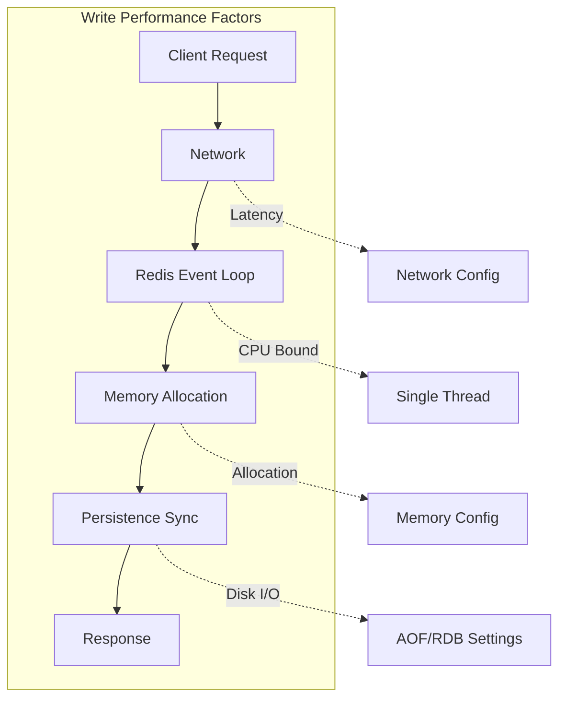

# How to Tune Redis for High Write Throughput

Author: [nawazdhandala](https://www.github.com/nawazdhandala)

Tags: Redis, Performance Tuning, Write Throughput, AOF, RDB, Memory Optimization

Description: A comprehensive guide to tuning Redis for maximum write throughput. Learn about persistence configuration, memory management, pipelining, and kernel-level optimizations to handle millions of writes per second.

---

> Redis is famous for its speed, but achieving maximum write throughput requires careful tuning. Default configurations prioritize data safety over raw performance. This guide shows you how to configure Redis for write-heavy workloads while understanding the tradeoffs.

When your application needs to ingest millions of events per second, store real-time metrics, or handle high-velocity data streams, Redis configuration becomes critical. The difference between default settings and optimized configuration can be 10x or more in write throughput.

---

## Understanding Redis Write Performance

### What Affects Write Speed

Several factors impact how fast Redis can accept writes:



Key bottlenecks:
1. **Persistence writes**: Syncing data to disk
2. **Memory allocation**: How Redis manages memory for new keys
3. **Network round trips**: Command/response cycles
4. **CPU**: Redis is single-threaded for commands

---

## Persistence Configuration

### Understanding AOF and RDB

Redis offers two persistence mechanisms:

```bash
# redis.conf

# RDB (snapshotting) - periodic full dumps
# Good for backups, minimal write impact
save 900 1      # Save if 1 key changed in 900 seconds
save 300 10     # Save if 10 keys changed in 300 seconds
save 60 10000   # Save if 10000 keys changed in 60 seconds

# AOF (Append Only File) - logs every write
# Better durability, higher write overhead
appendonly yes
appendfsync everysec  # Sync once per second
```

### High Write Throughput Configuration

For maximum write speed with reduced durability:

```bash
# Disable RDB persistence entirely for pure write speed
save ""

# Or reduce frequency significantly
# save 3600 1  # Only save once per hour if any changes

# AOF with relaxed sync (accepts some data loss on crash)
appendonly yes
appendfsync no  # Let OS decide when to sync

# Alternative: keep appendfsync everysec for balance
# appendfsync everysec  # Max 1 second of data loss
```

### AOF Rewrite Configuration

AOF files grow over time. Configure background rewrites:

```bash
# Trigger rewrite when AOF is 100% larger than last rewrite
auto-aof-rewrite-percentage 100

# Minimum AOF size before considering rewrite
auto-aof-rewrite-min-size 64mb

# During rewrite, don't fsync to reduce I/O contention
no-appendfsync-on-rewrite yes
```

---

## Memory Configuration

### Efficient Memory Allocation

```bash
# Use jemalloc (default on most systems, very efficient)
# Compile with: make MALLOC=jemalloc

# Set maximum memory limit
maxmemory 8gb

# Eviction policy for write-heavy workloads
# volatile-lru: Only evict keys with TTL set
# allkeys-lru: Evict any key when memory is full
maxmemory-policy allkeys-lru

# Sampling for eviction decisions
# Higher = more accurate but slower
maxmemory-samples 10
```

### Memory Defragmentation

Enable active defragmentation to maintain memory efficiency:

```bash
# Enable active defragmentation
activedefrag yes

# Start defrag when fragmentation exceeds 10%
active-defrag-ignore-bytes 100mb
active-defrag-threshold-lower 10

# Stop defrag when fragmentation is below 5%
active-defrag-threshold-upper 100

# CPU usage limits for defrag
active-defrag-cycle-min 1
active-defrag-cycle-max 25
```

---

## Client-Side Optimizations

### Pipelining

Pipelining dramatically reduces network round trips:

```python
import redis
import time

r = redis.Redis(host='localhost', port=6379)

def write_without_pipeline(count):
    """Write keys one at a time - slow due to network round trips"""
    start = time.time()
    for i in range(count):
        r.set(f"key:{i}", f"value:{i}")
    elapsed = time.time() - start
    return count / elapsed

def write_with_pipeline(count, batch_size=1000):
    """
    Write keys in batches using pipeline.
    Each batch sends multiple commands before waiting for responses.
    """
    start = time.time()

    for batch_start in range(0, count, batch_size):
        # Create a pipeline for this batch
        pipe = r.pipeline(transaction=False)

        batch_end = min(batch_start + batch_size, count)
        for i in range(batch_start, batch_end):
            pipe.set(f"key:{i}", f"value:{i}")

        # Execute all commands in the batch
        pipe.execute()

    elapsed = time.time() - start
    return count / elapsed

# Compare performance
count = 100000

print("Writing without pipeline...")
ops_no_pipe = write_without_pipeline(count)
print(f"  Throughput: {ops_no_pipe:.0f} ops/sec")

r.flushall()

print("Writing with pipeline (batch=1000)...")
ops_pipe = write_with_pipeline(count, batch_size=1000)
print(f"  Throughput: {ops_pipe:.0f} ops/sec")

print(f"\nPipeline speedup: {ops_pipe/ops_no_pipe:.1f}x")
```

### Connection Pooling

Maintain persistent connections to avoid connection overhead:

```python
import redis
from redis.connection import ConnectionPool

# Create a connection pool with enough connections for your load
pool = ConnectionPool(
    host='localhost',
    port=6379,
    max_connections=50,  # Adjust based on your concurrency needs
    socket_keepalive=True,
    socket_timeout=5.0
)

def get_redis_client():
    """Get a Redis client from the pool"""
    return redis.Redis(connection_pool=pool)

# Multi-threaded usage
from concurrent.futures import ThreadPoolExecutor
import threading

write_count = [0]
lock = threading.Lock()

def write_batch(thread_id, iterations):
    """Write function for each thread"""
    client = get_redis_client()

    for batch in range(iterations):
        pipe = client.pipeline(transaction=False)
        for i in range(1000):
            key = f"thread:{thread_id}:batch:{batch}:key:{i}"
            pipe.set(key, f"value-{i}")
        pipe.execute()

        with lock:
            write_count[0] += 1000

# Run concurrent writes
start = time.time()
with ThreadPoolExecutor(max_workers=10) as executor:
    futures = [
        executor.submit(write_batch, i, 100)
        for i in range(10)
    ]
    for f in futures:
        f.result()

elapsed = time.time() - start
print(f"Total writes: {write_count[0]}")
print(f"Throughput: {write_count[0]/elapsed:.0f} ops/sec")
```

---

## Kernel-Level Optimizations

### TCP and Network Settings

```bash
# /etc/sysctl.conf

# Increase TCP buffer sizes
net.core.rmem_max = 16777216
net.core.wmem_max = 16777216
net.ipv4.tcp_rmem = 4096 87380 16777216
net.ipv4.tcp_wmem = 4096 65536 16777216

# Increase connection backlog
net.core.somaxconn = 65535
net.ipv4.tcp_max_syn_backlog = 65535

# Reduce TIME_WAIT connections
net.ipv4.tcp_tw_reuse = 1

# Apply changes
sudo sysctl -p
```

### Redis-Specific Kernel Settings

```bash
# Disable Transparent Huge Pages (THP)
# THP causes latency spikes during memory operations
echo never > /sys/kernel/mm/transparent_hugepage/enabled
echo never > /sys/kernel/mm/transparent_hugepage/defrag

# Or add to /etc/rc.local for persistence

# Increase file descriptor limits
# /etc/security/limits.conf
redis soft nofile 65535
redis hard nofile 65535

# Overcommit memory (allows fork for persistence)
echo 1 > /proc/sys/vm/overcommit_memory
```

### Redis Configuration for High Connections

```bash
# redis.conf

# Maximum client connections
maxclients 10000

# TCP backlog (match kernel setting)
tcp-backlog 65535

# TCP keepalive interval (seconds)
tcp-keepalive 300

# Disable TCP Nagle's algorithm for lower latency
# (This is default behavior, just documenting)
```

---

## Benchmarking Your Configuration

### Using redis-benchmark

```bash
# Test SET operations with pipelining
redis-benchmark -t set -n 1000000 -P 50 -q
# SET: 890000+ ops/sec with pipelining

# Test without pipelining for comparison
redis-benchmark -t set -n 100000 -q
# SET: 50000-80000 ops/sec without pipelining

# Test with specific data sizes
redis-benchmark -t set -n 1000000 -P 50 -d 1024 -q
# Test with 1KB values

# Multi-threaded benchmark (Redis 6.0+)
redis-benchmark -t set -n 1000000 -P 50 --threads 4 -q
```

### Custom Benchmark Script

```python
import redis
import time
import statistics
from concurrent.futures import ThreadPoolExecutor

def benchmark_writes(host, port, num_threads, ops_per_thread, batch_size):
    """
    Comprehensive write benchmark with statistics.
    """
    results = {
        'total_ops': 0,
        'total_time': 0,
        'thread_throughputs': [],
        'latencies': []
    }

    def thread_benchmark(thread_id):
        r = redis.Redis(host=host, port=port)
        latencies = []

        for batch in range(ops_per_thread // batch_size):
            start = time.time()

            pipe = r.pipeline(transaction=False)
            for i in range(batch_size):
                key = f"bench:{thread_id}:{batch}:{i}"
                pipe.set(key, "x" * 100)
            pipe.execute()

            latency = (time.time() - start) * 1000  # ms
            latencies.append(latency)

        return latencies

    global_start = time.time()

    with ThreadPoolExecutor(max_workers=num_threads) as executor:
        futures = [
            executor.submit(thread_benchmark, i)
            for i in range(num_threads)
        ]

        all_latencies = []
        for f in futures:
            all_latencies.extend(f.result())

    total_time = time.time() - global_start
    total_ops = num_threads * ops_per_thread

    print(f"\n=== Benchmark Results ===")
    print(f"Configuration:")
    print(f"  Threads: {num_threads}")
    print(f"  Ops per thread: {ops_per_thread}")
    print(f"  Batch size: {batch_size}")
    print(f"\nPerformance:")
    print(f"  Total operations: {total_ops:,}")
    print(f"  Total time: {total_time:.2f}s")
    print(f"  Throughput: {total_ops/total_time:,.0f} ops/sec")
    print(f"\nLatency (per {batch_size} ops):")
    print(f"  Min: {min(all_latencies):.2f}ms")
    print(f"  Max: {max(all_latencies):.2f}ms")
    print(f"  Avg: {statistics.mean(all_latencies):.2f}ms")
    print(f"  p50: {statistics.median(all_latencies):.2f}ms")
    print(f"  p99: {sorted(all_latencies)[int(len(all_latencies)*0.99)]:.2f}ms")

# Run benchmark
benchmark_writes(
    host='localhost',
    port=6379,
    num_threads=8,
    ops_per_thread=100000,
    batch_size=1000
)
```

---

## Redis Configuration Summary

Here's a complete high-write-throughput configuration:

```bash
# redis.conf for high write throughput

# Network
bind 0.0.0.0
port 6379
tcp-backlog 65535
tcp-keepalive 300
timeout 0

# Memory
maxmemory 8gb
maxmemory-policy allkeys-lru
maxmemory-samples 10

# Persistence - Minimal for max speed
save ""
appendonly yes
appendfsync no
no-appendfsync-on-rewrite yes
auto-aof-rewrite-percentage 100
auto-aof-rewrite-min-size 256mb

# Performance
activedefrag yes
active-defrag-threshold-lower 10
active-defrag-threshold-upper 100
active-defrag-cycle-min 1
active-defrag-cycle-max 25

# Connections
maxclients 10000

# Disable slow operations logging for benchmarks
slowlog-log-slower-than 10000
slowlog-max-len 128

# Lazy freeing - async memory reclamation
lazyfree-lazy-eviction yes
lazyfree-lazy-expire yes
lazyfree-lazy-server-del yes
```

---

## Monitoring Write Performance

Track these metrics to identify bottlenecks:

```python
import redis

def monitor_write_performance(redis_client):
    """
    Collect key metrics for write performance analysis.
    """
    info = redis_client.info()

    metrics = {
        # Throughput
        'instantaneous_ops_per_sec': info.get('instantaneous_ops_per_sec'),
        'total_commands_processed': info.get('total_commands_processed'),

        # Memory
        'used_memory_human': info.get('used_memory_human'),
        'used_memory_peak_human': info.get('used_memory_peak_human'),
        'mem_fragmentation_ratio': info.get('mem_fragmentation_ratio'),

        # Persistence
        'rdb_last_bgsave_status': info.get('rdb_last_bgsave_status'),
        'aof_last_rewrite_time_sec': info.get('aof_last_rewrite_time_sec'),
        'aof_current_size': info.get('aof_current_size'),

        # Clients
        'connected_clients': info.get('connected_clients'),
        'blocked_clients': info.get('blocked_clients'),

        # CPU
        'used_cpu_sys': info.get('used_cpu_sys'),
        'used_cpu_user': info.get('used_cpu_user'),
    }

    return metrics

r = redis.Redis(host='localhost', port=6379)
metrics = monitor_write_performance(r)

for key, value in metrics.items():
    print(f"{key}: {value}")
```

---

## Conclusion

Tuning Redis for high write throughput involves multiple layers of optimization:

1. **Persistence**: Use `appendfsync no` or `everysec` based on durability needs
2. **Memory**: Configure proper limits and enable defragmentation
3. **Client**: Use pipelining and connection pooling
4. **Kernel**: Tune TCP settings and disable THP
5. **Monitor**: Track throughput, latency, and memory fragmentation

Remember that these optimizations trade durability for speed. Always understand the tradeoffs and choose configurations that match your application's requirements.

---

*Monitor your Redis write performance in real-time with [OneUptime](https://oneuptime.com). Set up alerts for throughput drops, memory pressure, and persistence issues before they impact your users.*

**Related Reading:**
- [How to Debug Latency with Redis SLOWLOG](https://oneuptime.com/blog/post/2026-01-26-redis-slowlog-latency-debugging/view)
- [How to Build Message Queues with Redis Lists](https://oneuptime.com/blog/post/2026-01-26-redis-message-queues-lists/view)
