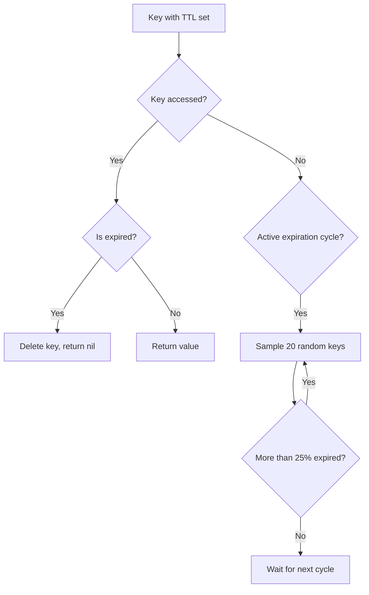

# How to Use Redis Key Expiration Effectively

Author: [nawazdhandala](https://www.github.com/nawazdhandala)

Tags: Redis, TTL, Caching, Performance, Best Practices

Description: Master Redis key expiration strategies including TTL management, lazy vs active expiration, handling cache stampedes, and implementing sliding expiration windows.

---

Key expiration is one of Redis's most useful features for managing memory and implementing time-sensitive data patterns. However, using it effectively requires understanding how Redis handles expiration internally and choosing the right strategies for your use case.

## How Redis Expiration Works

Redis uses two mechanisms to expire keys:

1. **Passive expiration** - A key is checked for expiration when accessed. If expired, it is deleted and returns nil.

2. **Active expiration** - Redis periodically samples random keys with expiration and deletes those that are expired.



This means expired keys might exist in memory briefly until either accessed or sampled.

## Basic Expiration Commands

```bash
# Set key with expiration in seconds
SET session:12345 "user_data" EX 3600

# Set key with expiration in milliseconds
SET cache:item "data" PX 500

# Set expiration on existing key
EXPIRE mykey 3600
PEXPIRE mykey 3600000

# Set absolute expiration time (Unix timestamp)
EXPIREAT mykey 1735689600
PEXPIREAT mykey 1735689600000

# Get remaining TTL
TTL mykey      # Returns seconds (-1 if no expiry, -2 if not exists)
PTTL mykey     # Returns milliseconds

# Remove expiration
PERSIST mykey

# Set only if key has expiration (Redis 7+)
SET mykey "value" XX GET EXAT 1735689600
```

## Expiration Patterns

### 1. Simple Cache with TTL

```python
import redis
import json

r = redis.Redis()

def get_cached_data(key: str, fetch_func, ttl_seconds: int = 300):
    """Get data from cache or fetch and cache it."""
    cached = r.get(key)
    if cached:
        return json.loads(cached)

    # Fetch fresh data
    data = fetch_func()

    # Cache with expiration
    r.setex(key, ttl_seconds, json.dumps(data))

    return data

# Usage
def fetch_user_profile(user_id):
    # Expensive database query
    return {"id": user_id, "name": "John Doe"}

profile = get_cached_data(
    f"user:profile:{user_id}",
    lambda: fetch_user_profile(user_id),
    ttl_seconds=600
)
```

### 2. Sliding Expiration Window

Reset the expiration each time a key is accessed:

```python
class SlidingWindowCache:
    """Cache with sliding expiration window."""

    def __init__(self, redis_client, default_ttl: int = 300):
        self.r = redis_client
        self.default_ttl = default_ttl

    def get(self, key: str, extend_ttl: bool = True) -> any:
        """Get value and optionally reset TTL."""
        pipe = self.r.pipeline()
        pipe.get(key)
        if extend_ttl:
            pipe.expire(key, self.default_ttl)
        results = pipe.execute()
        return results[0]

    def set(self, key: str, value: str, ttl: int = None):
        """Set value with expiration."""
        self.r.setex(key, ttl or self.default_ttl, value)

# Usage
cache = SlidingWindowCache(r, default_ttl=300)
cache.set("session:abc123", json.dumps(session_data))

# Each access resets the 5-minute window
data = cache.get("session:abc123")
```

### 3. Touch on Write Only

Keep frequently written keys alive without resetting on read:

```python
class WriteExtendCache:
    """Extend TTL only on writes, not reads."""

    def __init__(self, redis_client, ttl: int = 3600):
        self.r = redis_client
        self.ttl = ttl

    def get(self, key: str):
        """Read without extending TTL."""
        return self.r.get(key)

    def set(self, key: str, value: str):
        """Write and extend TTL."""
        self.r.setex(key, self.ttl, value)

    def increment(self, key: str):
        """Increment counter and extend TTL."""
        pipe = self.r.pipeline()
        pipe.incr(key)
        pipe.expire(key, self.ttl)
        results = pipe.execute()
        return results[0]
```

### 4. Staggered Expiration to Prevent Thundering Herd

When many keys expire at once, your backend gets hammered with requests:

```python
import random

class StaggeredCache:
    """Cache with randomized TTL to prevent mass expiration."""

    def __init__(self, redis_client, base_ttl: int = 300, jitter: float = 0.1):
        self.r = redis_client
        self.base_ttl = base_ttl
        self.jitter = jitter

    def _get_ttl(self) -> int:
        """Get TTL with random jitter."""
        variance = int(self.base_ttl * self.jitter)
        return self.base_ttl + random.randint(-variance, variance)

    def set(self, key: str, value: str):
        """Set with randomized TTL."""
        ttl = self._get_ttl()
        self.r.setex(key, ttl, value)

    def set_many(self, data: dict):
        """Set multiple keys with different TTLs."""
        pipe = self.r.pipeline()
        for key, value in data.items():
            ttl = self._get_ttl()
            pipe.setex(key, ttl, value)
        pipe.execute()

# Keys expire between 270-330 seconds instead of all at 300
cache = StaggeredCache(r, base_ttl=300, jitter=0.1)
```

### 5. Early Expiration with Background Refresh

Refresh cache before it expires to avoid cache misses:

```python
import threading
import time

class EarlyRefreshCache:
    """Refresh cache before expiration."""

    def __init__(self, redis_client, ttl: int = 300, refresh_threshold: float = 0.2):
        self.r = redis_client
        self.ttl = ttl
        self.refresh_threshold = refresh_threshold
        self.refresh_in_progress = set()

    def get(self, key: str, fetch_func):
        """Get value, triggering background refresh if near expiration."""
        pipe = self.r.pipeline()
        pipe.get(key)
        pipe.ttl(key)
        value, remaining_ttl = pipe.execute()

        if value is None:
            # Cache miss - fetch synchronously
            return self._fetch_and_cache(key, fetch_func)

        # Check if we should refresh
        if remaining_ttl > 0 and remaining_ttl < self.ttl * self.refresh_threshold:
            self._background_refresh(key, fetch_func)

        return value

    def _fetch_and_cache(self, key: str, fetch_func):
        """Fetch data and cache it."""
        data = fetch_func()
        self.r.setex(key, self.ttl, json.dumps(data))
        return json.dumps(data)

    def _background_refresh(self, key: str, fetch_func):
        """Refresh cache in background thread."""
        if key in self.refresh_in_progress:
            return

        self.refresh_in_progress.add(key)

        def refresh():
            try:
                self._fetch_and_cache(key, fetch_func)
            finally:
                self.refresh_in_progress.discard(key)

        thread = threading.Thread(target=refresh)
        thread.daemon = True
        thread.start()

# Cache refreshes when TTL drops below 60 seconds (20% of 300)
cache = EarlyRefreshCache(r, ttl=300, refresh_threshold=0.2)
```

## Handling Large Numbers of Expirations

When you have millions of keys expiring, Redis needs to work harder.

### Monitor Expiration Activity

```bash
# Check expired keys stats
redis-cli INFO stats | grep expired

# Sample output:
# expired_keys:1234567      # Total keys expired since start
# expired_stale_perc:0.02   # Percentage of stale keys
# expired_time_cap_reached_count:0

# Monitor in real-time
redis-cli --stat
```

### Configure Active Expiration

```bash
# In redis.conf

# How aggressive to be with expiration (1-10, default 1)
# Higher = more CPU, faster cleanup
active-expire-effort 2

# If using Redis 7+, you can set memory limits for expired keys
# to trigger more aggressive cleanup
```

### Batch Expiration with SCAN

For bulk operations, set expirations in batches:

```python
def set_expiration_batch(pattern: str, ttl: int, batch_size: int = 1000):
    """Set expiration on many keys matching a pattern."""
    cursor = 0
    total = 0

    while True:
        cursor, keys = r.scan(cursor, match=pattern, count=batch_size)

        if keys:
            pipe = r.pipeline()
            for key in keys:
                pipe.expire(key, ttl)
            pipe.execute()
            total += len(keys)

        if cursor == 0:
            break

    return total

# Set 1-hour expiration on all session keys
expired_count = set_expiration_batch("session:*", 3600)
print(f"Set expiration on {expired_count} keys")
```

## Key Expiration Events

Redis can notify you when keys expire using Keyspace Notifications:

```bash
# Enable notifications in redis.conf
notify-keyspace-events Ex

# Or at runtime
CONFIG SET notify-keyspace-events Ex
```

Subscribe to expiration events:

```python
import redis

r = redis.Redis()
pubsub = r.pubsub()

# Subscribe to expiration events
pubsub.psubscribe('__keyevent@0__:expired')

def handle_expiration():
    for message in pubsub.listen():
        if message['type'] == 'pmessage':
            expired_key = message['data'].decode('utf-8')
            print(f"Key expired: {expired_key}")
            # Take action based on expired key
            if expired_key.startswith('session:'):
                cleanup_session(expired_key)

# Run in background thread
import threading
thread = threading.Thread(target=handle_expiration)
thread.daemon = True
thread.start()
```

## Common Pitfalls

### 1. Forgetting to Set Expiration

```python
# Bad - key lives forever
r.set("temp:data", "value")

# Good - always set TTL for temporary data
r.setex("temp:data", 3600, "value")
```

### 2. Overwriting Removes Expiration

```python
# Key has 1 hour TTL
r.setex("mykey", 3600, "value1")

# This removes the TTL!
r.set("mykey", "value2")

# Preserve TTL with KEEPTTL (Redis 6+)
r.set("mykey", "value2", keepttl=True)
```

### 3. GETSET Removes Expiration

```python
# Key has TTL
r.setex("counter", 3600, "10")

# GETSET removes TTL
old_value = r.getset("counter", "20")

# Use GET + SET with KEEPTTL instead
old_value = r.get("counter")
r.set("counter", "20", keepttl=True)
```

### 4. Hash Fields Cannot Expire Individually

```python
# You cannot expire individual hash fields
r.hset("user:123", "name", "John")
# r.expire("user:123", "name", 3600)  # NOT POSSIBLE

# Workaround: Use separate keys with a naming convention
r.setex("user:123:session", 3600, "session_data")
r.set("user:123:profile", "profile_data")  # No expiration
```

## Best Practices Summary

1. **Always set TTL on temporary data** - Prevent memory leaks
2. **Use jitter for mass caching** - Prevent thundering herd
3. **Consider early refresh** - Maintain cache freshness
4. **Monitor expiration metrics** - Track expired_keys in INFO
5. **Use KEEPTTL when updating** - Preserve existing expiration
6. **Be aware of command side effects** - Some commands remove TTL

---

Effective key expiration management is crucial for running Redis in production. By understanding how expiration works internally and choosing appropriate patterns for your use case, you can maintain a healthy Redis instance that manages memory efficiently while serving your application's caching needs.
