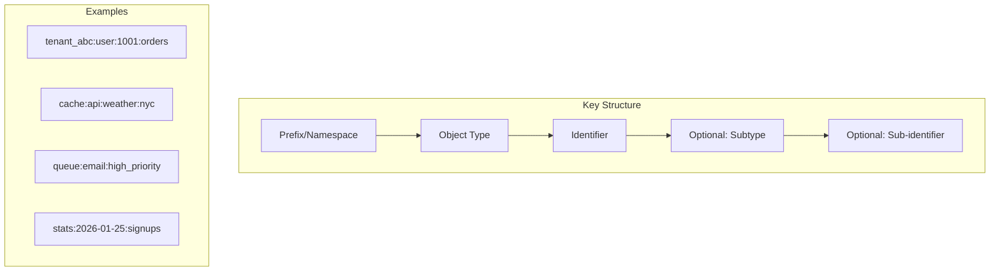

# How to Implement Key Naming Conventions in Redis

Author: [nawazdhandala](https://www.github.com/nawazdhandala)

Tags: Redis, Best Practices, Database Design, Architecture, DevOps

Description: Learn Redis key naming conventions and patterns that improve code readability, enable efficient key discovery, and prevent naming collisions in large applications.

---

A well-designed key naming convention makes Redis data easier to understand, manage, and debug. Without conventions, key names become inconsistent, collisions occur, and operational tasks like finding related keys become difficult. This guide covers proven naming patterns for Redis.

## The Standard Convention

The most widely adopted convention uses colons as separators, creating a hierarchical namespace:

```
object-type:id:field
```

```python
import redis

r = redis.Redis(host='localhost', port=6379, db=0)

# Standard naming pattern: type:id
r.set('user:1001', '{"name": "Alice", "email": "alice@example.com"}')
r.set('user:1002', '{"name": "Bob", "email": "bob@example.com"}')

# Extended pattern: type:id:subtype
r.set('user:1001:profile', '{"bio": "Developer"}')
r.set('user:1001:settings', '{"theme": "dark"}')

# Collection keys
r.sadd('user:1001:followers', 1002, 1003, 1004)
r.sadd('user:1001:following', 1005, 1006)

# Relationships
r.set('order:5001:user', '1001')
r.sadd('user:1001:orders', 5001, 5002, 5003)

# This enables easy pattern matching
user_keys = r.keys('user:1001:*')
print(f"All keys for user 1001: {user_keys}")
```

## Key Naming Patterns

Here are common patterns for different use cases:

```python
import redis
import time
import json

r = redis.Redis(host='localhost', port=6379, db=0)

# 1. Basic entity: type:id
r.hset('user:1001', mapping={'name': 'Alice', 'email': 'alice@example.com'})
r.hset('product:2001', mapping={'name': 'Widget', 'price': '19.99'})

# 2. Namespaced entity: namespace:type:id
# Useful for multi-tenant applications
r.hset('tenant_abc:user:1001', mapping={'name': 'Alice'})
r.hset('tenant_xyz:user:1001', mapping={'name': 'Bob'})  # Same ID, different tenant

# 3. Composite keys: type:id:subtype:subid
r.set('order:5001:item:1', '{"product_id": 2001, "quantity": 2}')
r.set('order:5001:item:2', '{"product_id": 2002, "quantity": 1}')

# 4. Index keys: type:field:value -> id
r.set('user:email:alice@example.com', '1001')  # Secondary index
r.sadd('user:role:admin', 1001, 1002)          # Role index

# 5. Counter keys: type:id:counter_name
r.set('user:1001:login_count', 0)
r.incr('user:1001:login_count')

# 6. Time-based keys: type:date:metric
today = time.strftime('%Y-%m-%d')
r.incr(f'stats:{today}:page_views')
r.incr(f'stats:{today}:signups')

# 7. Queue keys: queue:name
r.lpush('queue:emails', json.dumps({'to': 'user@example.com', 'subject': 'Welcome'}))
r.lpush('queue:notifications', json.dumps({'user_id': 1001, 'type': 'alert'}))

# 8. Cache keys: cache:source:identifier
r.setex('cache:api:weather:new_york', 3600, '{"temp": 72}')
r.setex('cache:db:user:1001', 300, '{"name": "Alice"}')

# 9. Lock keys: lock:resource
r.set('lock:order:5001', 'worker_1', nx=True, ex=30)

# 10. Session keys: session:token
r.setex('session:abc123xyz', 86400, json.dumps({'user_id': 1001}))
```

## Building a Key Generator

Create a utility class to enforce consistent naming:

```python
import redis
from typing import Optional, List, Union

class RedisKeyBuilder:
    """
    Generates consistent Redis keys following naming conventions.
    """

    def __init__(self, prefix: Optional[str] = None):
        self.prefix = prefix

    def _build(self, *parts: Union[str, int]) -> str:
        """Build key from parts"""
        # Filter out None values and convert to strings
        key_parts = [str(p) for p in parts if p is not None]

        if self.prefix:
            key_parts.insert(0, self.prefix)

        return ':'.join(key_parts)

    # Entity keys
    def entity(self, type_name: str, id: Union[str, int]) -> str:
        return self._build(type_name, id)

    def entity_field(self, type_name: str, id: Union[str, int], field: str) -> str:
        return self._build(type_name, id, field)

    # Index keys
    def index(self, type_name: str, field: str, value: str) -> str:
        return self._build(type_name, field, value)

    # Cache keys
    def cache(self, source: str, identifier: str) -> str:
        return self._build('cache', source, identifier)

    # Queue keys
    def queue(self, name: str) -> str:
        return self._build('queue', name)

    # Lock keys
    def lock(self, resource: str) -> str:
        return self._build('lock', resource)

    # Stats keys
    def stats(self, date: str, metric: str) -> str:
        return self._build('stats', date, metric)

    # Session keys
    def session(self, token: str) -> str:
        return self._build('session', token)

# Usage
keys = RedisKeyBuilder()

print(keys.entity('user', 1001))           # user:1001
print(keys.entity_field('user', 1001, 'profile'))  # user:1001:profile
print(keys.index('user', 'email', 'alice@example.com'))  # user:email:alice@example.com
print(keys.cache('api', 'weather'))        # cache:api:weather
print(keys.queue('emails'))                # queue:emails
print(keys.lock('order:5001'))             # lock:order:5001

# With prefix for multi-tenant
tenant_keys = RedisKeyBuilder(prefix='tenant_abc')
print(tenant_keys.entity('user', 1001))    # tenant_abc:user:1001
```

## Key Naming Diagram



## Anti-Patterns to Avoid

```python
import redis
import json

r = redis.Redis(host='localhost', port=6379, db=0)

# BAD: Inconsistent separators
# user_1001 vs user-1001 vs user.1001
r.set('user_1001', 'data')  # Avoid
r.set('user-1001', 'data')  # Avoid

# GOOD: Consistent colon separators
r.set('user:1001', 'data')

# BAD: No namespace/type prefix
r.set('1001', 'data')  # What is 1001?
r.set('alice@example.com', 'data')  # Email as key?

# GOOD: Clear type prefixes
r.set('user:1001', 'data')
r.set('user:email:alice@example.com', '1001')

# BAD: Including spaces or special characters
r.set('user profile:1001', 'data')  # Spaces
r.set('user:1001:full name', 'data')  # Spaces

# GOOD: Use underscores within segments if needed
r.set('user:1001:full_name', 'data')

# BAD: Overly long keys (wastes memory)
r.set('application:production:database:cache:user:profile:settings:preferences:1001', 'data')

# GOOD: Balanced depth
r.set('cache:user:1001:prefs', 'data')

# BAD: Embedding large data in key names
r.set(f'search:{json.dumps({"query": "long query", "filters": [1,2,3]})}', 'results')

# GOOD: Hash the complex query
import hashlib
query_hash = hashlib.md5(json.dumps({"query": "long query", "filters": [1,2,3]}).encode()).hexdigest()[:8]
r.set(f'search:{query_hash}', 'results')
```

## Environment and Version Prefixes

Separate data by environment or application version:

```python
import redis
import os

class EnvironmentAwareKeys:
    """Key builder with environment awareness"""

    def __init__(self, redis_client):
        self.r = redis_client
        self.env = os.getenv('ENVIRONMENT', 'dev')
        self.version = os.getenv('APP_VERSION', 'v1')

    def key(self, *parts):
        """Build key with environment prefix"""
        return f'{self.env}:{":".join(str(p) for p in parts)}'

    def versioned_key(self, *parts):
        """Build key with environment and version prefix"""
        return f'{self.env}:{self.version}:{":".join(str(p) for p in parts)}'

    def get(self, *parts):
        return self.r.get(self.key(*parts))

    def set(self, *parts, value, **kwargs):
        return self.r.set(self.key(*parts), value, **kwargs)

# Usage
r = redis.Redis(host='localhost', port=6379, db=0)
keys = EnvironmentAwareKeys(r)

# In development: dev:user:1001
# In production: prod:user:1001
keys.set('user', 1001, value='data')

# Version-specific caching
# staging:v2:cache:feature_flags
versioned_cache = keys.versioned_key('cache', 'feature_flags')
print(f"Cache key: {versioned_cache}")
```

## Documentation Template

Document your key conventions for team reference:

```markdown
# Redis Key Naming Convention

## Format
`[prefix:]type:id[:subtype[:subid]]`

## Prefixes (Optional)
- `dev:`, `staging:`, `prod:` - Environment
- `v1:`, `v2:` - API/Schema version
- `tenant_xxx:` - Multi-tenant isolation

## Entity Keys
| Pattern | Example | Description |
|---------|---------|-------------|
| user:ID | user:1001 | User entity |
| user:ID:profile | user:1001:profile | User's profile |
| user:ID:followers | user:1001:followers | Set of follower IDs |

## Index Keys
| Pattern | Example | Description |
|---------|---------|-------------|
| user:email:VALUE | user:email:a@b.com | Email to user ID lookup |
| user:role:VALUE | user:role:admin | Set of users with role |

## Cache Keys
| Pattern | TTL | Description |
|---------|-----|-------------|
| cache:api:RESOURCE | 1h | External API responses |
| cache:db:TABLE:ID | 5m | Database query results |

## Operational Keys
| Pattern | Example | Description |
|---------|---------|-------------|
| lock:RESOURCE | lock:order:5001 | Distributed lock |
| queue:NAME | queue:emails | Task queue |
| stats:DATE:METRIC | stats:2026-01-25:signups | Daily counters |
```

## Summary

| Aspect | Recommendation |
|--------|----------------|
| Separator | Use colons (:) consistently |
| Format | type:id:field |
| Length | Keep keys reasonably short |
| Characters | Avoid spaces and special chars |
| Prefixes | Use for environment/tenant separation |
| Documentation | Document patterns for your team |

Good naming conventions:
- Make keys self-documenting
- Enable efficient pattern matching with SCAN
- Prevent naming collisions
- Simplify debugging and operations
- Support multi-tenant architectures
