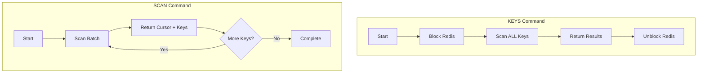

# How to Get All Keys Matching a Pattern in Redis

Author: [nawazdhandala](https://www.github.com/nawazdhandala)

Tags: Redis, Database, Pattern Matching, Performance, Best Practices

Description: Learn how to find Redis keys matching patterns using KEYS and SCAN commands, understand their performance implications, and implement production-safe key discovery.

---

Finding keys that match a pattern is a common Redis operation, whether you need to invalidate cache entries, audit data, or perform bulk operations. Redis provides two main approaches: the KEYS command and the SCAN command. Understanding when to use each is critical for production systems.

## The KEYS Command

KEYS returns all keys matching a glob-style pattern. It is simple but dangerous in production because it blocks Redis while scanning all keys.

```python
import redis

r = redis.Redis(host='localhost', port=6379, db=0)

# Add some test data
for i in range(100):
    r.set(f'user:{i}', f'data_{i}')
    r.set(f'session:{i}', f'session_{i}')
    r.set(f'cache:user:{i}', f'cached_{i}')

# Find all user keys
user_keys = r.keys('user:*')
print(f"Found {len(user_keys)} user keys")

# Find all cache keys
cache_keys = r.keys('cache:*')
print(f"Found {len(cache_keys)} cache keys")

# Pattern matching examples
# * matches any sequence of characters
# ? matches exactly one character
# [abc] matches a, b, or c

# Keys starting with 'user:' followed by single digit
single_digit = r.keys('user:?')
print(f"Single digit users: {single_digit}")

# Keys with specific character ranges
r.set('item:a', 1)
r.set('item:b', 2)
r.set('item:c', 3)
r.set('item:d', 4)

# Match item:a, item:b, or item:c
abc_items = r.keys('item:[abc]')
print(f"Items a-c: {abc_items}")
```

## Why KEYS is Dangerous in Production

The KEYS command blocks Redis while it scans the entire keyspace. With millions of keys, this can block for seconds or more:

```python
import redis
import time

r = redis.Redis(host='localhost', port=6379, db=0)

# Simulate large dataset
print("Creating test data...")
pipe = r.pipeline()
for i in range(100000):
    pipe.set(f'test:key:{i}', f'value_{i}')
    if i % 10000 == 0:
        pipe.execute()
        pipe = r.pipeline()
pipe.execute()

print(f"Total keys: {r.dbsize()}")

# KEYS blocks the entire server
start = time.time()
keys = r.keys('test:key:*')
duration = time.time() - start

print(f"KEYS found {len(keys)} keys in {duration:.3f}s")
print("During this time, Redis was BLOCKED for all clients!")

# In production with millions of keys, this could be 5-10 seconds
# All other clients wait, timeouts occur, applications fail
```

## The SCAN Command

SCAN iterates through keys incrementally without blocking. It returns a cursor and a batch of keys on each call.

```python
import redis

r = redis.Redis(host='localhost', port=6379, db=0)

def scan_keys(pattern, count=100):
    """
    Iterate through all keys matching pattern.
    Non-blocking, safe for production use.
    """
    cursor = 0
    all_keys = []

    while True:
        # SCAN returns (new_cursor, keys)
        cursor, keys = r.scan(cursor, match=pattern, count=count)

        all_keys.extend(keys)

        # Cursor 0 means iteration complete
        if cursor == 0:
            break

    return all_keys

# Safe iteration
keys = scan_keys('user:*')
print(f"Found {len(keys)} user keys")

# With progress reporting
def scan_with_progress(pattern, count=1000):
    """Scan with progress updates"""
    cursor = 0
    total_found = 0

    while True:
        cursor, keys = r.scan(cursor, match=pattern, count=count)
        total_found += len(keys)

        if total_found % 10000 == 0:
            print(f"Progress: {total_found} keys found...")

        yield from keys

        if cursor == 0:
            break

# Process keys as they are found
for key in scan_with_progress('test:*'):
    # Process each key
    pass
```

## SCAN Parameters Explained

```python
import redis

r = redis.Redis(host='localhost', port=6379, db=0)

# cursor: Starting position (0 for new scan)
# match: Glob pattern to filter keys
# count: Hint for how many keys to return per call (not guaranteed)
# type: Filter by key type (Redis 6.0+)

# Basic scan
cursor, keys = r.scan(0, match='user:*', count=100)
print(f"Next cursor: {cursor}, Found: {len(keys)} keys")

# Continue from where we left off
cursor, more_keys = r.scan(cursor, match='user:*', count=100)

# Filter by type (Redis 6.0+)
# Only return string keys
cursor, string_keys = r.scan(0, match='*', count=100, _type='string')

# Only return hash keys
cursor, hash_keys = r.scan(0, match='*', count=100, _type='hash')

# Only return set keys
cursor, set_keys = r.scan(0, match='*', count=100, _type='set')
```

## Type-Specific SCAN Commands

Redis provides specialized scan commands for different data structures:

```python
import redis

r = redis.Redis(host='localhost', port=6379, db=0)

# SSCAN - scan set members
r.sadd('myset', *[f'member:{i}' for i in range(1000)])

cursor = 0
members = []
while True:
    cursor, batch = r.sscan('myset', cursor, match='member:1*', count=100)
    members.extend(batch)
    if cursor == 0:
        break

print(f"Set members matching 'member:1*': {len(members)}")

# HSCAN - scan hash fields
r.hset('myhash', mapping={f'field:{i}': f'value:{i}' for i in range(1000)})

cursor = 0
fields = {}
while True:
    cursor, batch = r.hscan('myhash', cursor, match='field:5*', count=100)
    fields.update(batch)
    if cursor == 0:
        break

print(f"Hash fields matching 'field:5*': {len(fields)}")

# ZSCAN - scan sorted set members
r.zadd('myzset', {f'item:{i}': i for i in range(1000)})

cursor = 0
items = []
while True:
    cursor, batch = r.zscan('myzset', cursor, match='item:9*', count=100)
    items.extend(batch)
    if cursor == 0:
        break

print(f"Sorted set items matching 'item:9*': {len(items)}")
```

## Production-Safe Key Operations

```python
import redis
import time

r = redis.Redis(host='localhost', port=6379, db=0)

class SafeKeyScanner:
    """Production-safe key scanning with rate limiting"""

    def __init__(self, redis_client, batch_size=1000, delay=0.01):
        self.r = redis_client
        self.batch_size = batch_size
        self.delay = delay  # Delay between batches to reduce load

    def find_keys(self, pattern):
        """Find all keys matching pattern with rate limiting"""
        cursor = 0
        keys = []

        while True:
            cursor, batch = self.r.scan(
                cursor,
                match=pattern,
                count=self.batch_size
            )
            keys.extend(batch)

            # Rate limit to prevent overloading Redis
            if self.delay > 0:
                time.sleep(self.delay)

            if cursor == 0:
                break

        return keys

    def delete_keys(self, pattern, dry_run=True):
        """
        Delete keys matching pattern with safety checks.
        Use dry_run=True to preview what would be deleted.
        """
        cursor = 0
        deleted = 0

        while True:
            cursor, keys = self.r.scan(
                cursor,
                match=pattern,
                count=self.batch_size
            )

            if keys:
                if dry_run:
                    print(f"Would delete: {[k.decode() for k in keys[:5]]}...")
                else:
                    self.r.delete(*keys)

                deleted += len(keys)

            if self.delay > 0:
                time.sleep(self.delay)

            if cursor == 0:
                break

        return deleted

    def count_keys(self, pattern):
        """Count keys matching pattern without loading all into memory"""
        cursor = 0
        count = 0

        while True:
            cursor, keys = self.r.scan(
                cursor,
                match=pattern,
                count=self.batch_size
            )
            count += len(keys)

            if cursor == 0:
                break

        return count

# Usage
scanner = SafeKeyScanner(r, batch_size=500, delay=0.01)

# Count keys
cache_count = scanner.count_keys('cache:*')
print(f"Cache keys: {cache_count}")

# Preview deletion
scanner.delete_keys('old:*', dry_run=True)

# Actually delete (with confirmation)
# scanner.delete_keys('old:*', dry_run=False)
```

## Pattern Matching Reference

```python
import redis

r = redis.Redis(host='localhost', port=6379, db=0)

# Setup test data
test_keys = [
    'user:123', 'user:456', 'user:789',
    'users:list', 'user_count',
    'cache:user:123', 'cache:user:456',
    'item:a1', 'item:b2', 'item:c3',
    'log:2026:01:25', 'log:2026:01:26'
]
for key in test_keys:
    r.set(key, 'value')

# Pattern examples
patterns = {
    'user:*': 'Keys starting with "user:"',
    'user*': 'Keys starting with "user"',
    '*user*': 'Keys containing "user"',
    'user:???': 'user: followed by exactly 3 characters',
    'item:[abc]*': 'item: followed by a, b, or c',
    'log:2026:01:*': 'Logs from January 2026',
    '*:123': 'Keys ending with :123',
}

for pattern, description in patterns.items():
    keys = r.keys(pattern)
    print(f"{pattern}: {description}")
    print(f"  Matches: {[k.decode() for k in keys]}\n")
```

## KEYS vs SCAN Comparison



## Summary

| Aspect | KEYS | SCAN |
|--------|------|------|
| Blocking | Yes - blocks entire server | No - incremental |
| Performance | O(N) single operation | O(N) spread over time |
| Production safe | No | Yes |
| Guaranteed complete | Yes | Yes (may have duplicates) |
| Use case | Development only | Production use |

Key recommendations:
- Never use KEYS in production with large datasets
- Always use SCAN for production key discovery
- Add rate limiting to prevent Redis overload
- Consider the COUNT parameter to tune batch sizes
- Use type-specific SCAN for sets, hashes, and sorted sets
- Implement progress reporting for long-running scans
