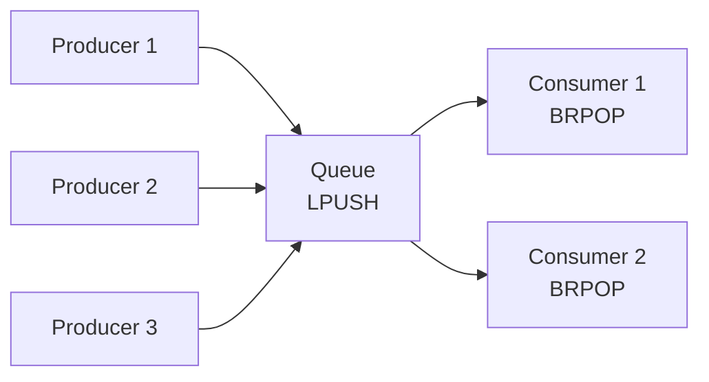

# How to Use Redis Lists for Message Queues

Author: [nawazdhandala](https://www.github.com/nawazdhandala)

Tags: Redis, Lists, Message Queues, Background Jobs, Asynchronous, Backend

Description: Build reliable message queues with Redis lists. Learn LPUSH/BRPOP patterns, reliable queue implementations, and when to choose lists over streams.

---

Redis lists provide simple yet powerful building blocks for message queues. With blocking operations like BRPOP and atomic commands like RPOPLPUSH, you can build anything from basic task queues to reliable message delivery systems. This guide covers practical queue patterns.

## Basic Queue Operations

```python
import redis
import json
import time

r = redis.Redis(host='localhost', port=6379, db=0, decode_responses=True)

# Producer: Add messages to queue
def enqueue(queue_name, message):
    """Add message to end of queue"""
    payload = json.dumps({
        'data': message,
        'timestamp': time.time()
    })
    r.lpush(queue_name, payload)

# Consumer: Get messages from queue
def dequeue(queue_name, timeout=0):
    """
    Get message from queue.
    timeout=0 means block forever
    """
    result = r.brpop(queue_name, timeout=timeout)
    if result:
        queue, payload = result
        return json.loads(payload)
    return None

# Producer side
enqueue('tasks', {'type': 'email', 'to': 'user@example.com'})
enqueue('tasks', {'type': 'resize', 'image_id': 123})

# Consumer side (blocking)
while True:
    message = dequeue('tasks', timeout=5)
    if message:
        print(f"Processing: {message}")
    else:
        print("No messages, waiting...")
```

## Queue Patterns



## Reliable Queue with Processing List

Prevent message loss if worker crashes during processing:

```python
import redis
import json
import time
import uuid

r = redis.Redis(host='localhost', port=6379, db=0, decode_responses=True)

class ReliableQueue:
    """
    Queue with acknowledgment to prevent message loss.
    Messages move from queue -> processing -> done/failed
    """

    def __init__(self, name):
        self.queue = f'queue:{name}'
        self.processing = f'queue:{name}:processing'
        self.failed = f'queue:{name}:failed'

    def enqueue(self, data, priority=0):
        """Add message to queue"""
        message = {
            'id': str(uuid.uuid4()),
            'data': data,
            'created_at': time.time(),
            'attempts': 0
        }

        if priority > 0:
            # High priority goes to front
            r.rpush(self.queue, json.dumps(message))
        else:
            # Normal priority goes to back
            r.lpush(self.queue, json.dumps(message))

        return message['id']

    def dequeue(self, timeout=0):
        """
        Get message and move to processing list.
        Uses BRPOPLPUSH for atomicity.
        """
        # BRPOPLPUSH atomically moves item
        result = r.brpoplpush(self.queue, self.processing, timeout=timeout)

        if result:
            message = json.loads(result)
            message['attempts'] += 1
            message['started_at'] = time.time()

            # Update in processing list
            r.lrem(self.processing, 1, result)
            r.lpush(self.processing, json.dumps(message))

            return message

        return None

    def ack(self, message_id):
        """Acknowledge successful processing"""
        # Find and remove from processing list
        items = r.lrange(self.processing, 0, -1)
        for item in items:
            msg = json.loads(item)
            if msg['id'] == message_id:
                r.lrem(self.processing, 1, item)
                return True
        return False

    def nack(self, message_id, requeue=True):
        """Negative acknowledge - processing failed"""
        items = r.lrange(self.processing, 0, -1)
        for item in items:
            msg = json.loads(item)
            if msg['id'] == message_id:
                r.lrem(self.processing, 1, item)

                if requeue and msg['attempts'] < 3:
                    # Requeue for retry
                    r.rpush(self.queue, json.dumps(msg))
                else:
                    # Move to failed queue
                    r.lpush(self.failed, json.dumps(msg))
                return True
        return False

    def recover_stale(self, timeout_seconds=300):
        """Recover messages stuck in processing"""
        items = r.lrange(self.processing, 0, -1)
        recovered = 0

        for item in items:
            msg = json.loads(item)
            if time.time() - msg.get('started_at', 0) > timeout_seconds:
                r.lrem(self.processing, 1, item)
                r.rpush(self.queue, item)
                recovered += 1

        return recovered

    def stats(self):
        """Get queue statistics"""
        return {
            'pending': r.llen(self.queue),
            'processing': r.llen(self.processing),
            'failed': r.llen(self.failed)
        }

# Usage
queue = ReliableQueue('emails')

# Producer
message_id = queue.enqueue({
    'to': 'user@example.com',
    'subject': 'Welcome!',
    'template': 'welcome_email'
})

# Consumer
message = queue.dequeue(timeout=5)
if message:
    try:
        # Process message
        send_email(message['data'])
        queue.ack(message['id'])
    except Exception as e:
        queue.nack(message['id'], requeue=True)
```

## Priority Queue

```python
import redis
import json
import time

r = redis.Redis(host='localhost', port=6379, db=0, decode_responses=True)

class PriorityQueue:
    """
    Multiple queues for different priorities.
    BRPOP checks them in order.
    """

    def __init__(self, name):
        self.queues = {
            'high': f'queue:{name}:high',
            'normal': f'queue:{name}:normal',
            'low': f'queue:{name}:low'
        }

    def enqueue(self, data, priority='normal'):
        """Add message with priority"""
        message = json.dumps({
            'data': data,
            'priority': priority,
            'timestamp': time.time()
        })

        queue = self.queues.get(priority, self.queues['normal'])
        r.lpush(queue, message)

    def dequeue(self, timeout=0):
        """
        Get highest priority message available.
        BRPOP checks queues in order given.
        """
        queue_list = [
            self.queues['high'],
            self.queues['normal'],
            self.queues['low']
        ]

        result = r.brpop(queue_list, timeout=timeout)
        if result:
            queue, payload = result
            return json.loads(payload)
        return None

# Usage
pq = PriorityQueue('tasks')

pq.enqueue({'task': 'background_job'}, priority='low')
pq.enqueue({'task': 'user_request'}, priority='normal')
pq.enqueue({'task': 'urgent_alert'}, priority='high')

# Consumer gets high priority first
while True:
    msg = pq.dequeue(timeout=1)
    if msg:
        print(f"Processing {msg['priority']}: {msg['data']}")
```

## Delayed Queue

```python
import redis
import json
import time

r = redis.Redis(host='localhost', port=6379, db=0, decode_responses=True)

class DelayedQueue:
    """
    Queue messages for future delivery using sorted sets.
    Score = timestamp when message should be delivered.
    """

    def __init__(self, name):
        self.delayed = f'queue:{name}:delayed'
        self.ready = f'queue:{name}:ready'

    def enqueue(self, data, delay_seconds=0):
        """Add message with optional delay"""
        message = json.dumps({
            'data': data,
            'created_at': time.time()
        })

        if delay_seconds > 0:
            # Add to delayed set with delivery time as score
            deliver_at = time.time() + delay_seconds
            r.zadd(self.delayed, {message: deliver_at})
        else:
            # Add directly to ready queue
            r.lpush(self.ready, message)

    def move_ready(self):
        """Move due messages from delayed to ready queue"""
        now = time.time()

        # Get messages due for delivery
        messages = r.zrangebyscore(
            self.delayed,
            '-inf',
            now,
            start=0,
            num=100
        )

        moved = 0
        for msg in messages:
            # Atomic move using transaction
            pipe = r.pipeline()
            pipe.zrem(self.delayed, msg)
            pipe.lpush(self.ready, msg)
            pipe.execute()
            moved += 1

        return moved

    def dequeue(self, timeout=0):
        """Get message from ready queue"""
        # First, move any due delayed messages
        self.move_ready()

        result = r.brpop(self.ready, timeout=min(timeout, 1))
        if result:
            queue, payload = result
            return json.loads(payload)

        return None

# Usage
dq = DelayedQueue('notifications')

# Send immediately
dq.enqueue({'type': 'welcome'})

# Send in 1 hour
dq.enqueue({'type': 'followup'}, delay_seconds=3600)

# Send tomorrow
dq.enqueue({'type': 'reminder'}, delay_seconds=86400)

# Consumer
while True:
    msg = dq.dequeue(timeout=1)
    if msg:
        print(f"Delivering: {msg}")
```

## Worker Pool Pattern

```python
import redis
import json
import time
import threading
import signal

r = redis.Redis(host='localhost', port=6379, db=0, decode_responses=True)

class Worker:
    """Single worker that processes queue messages"""

    def __init__(self, queue_name, handler, worker_id=None):
        self.queue = queue_name
        self.handler = handler
        self.worker_id = worker_id or f'worker_{threading.current_thread().name}'
        self.running = True

    def run(self):
        """Main worker loop"""
        print(f"{self.worker_id} starting...")

        while self.running:
            try:
                result = r.brpop(self.queue, timeout=1)
                if result:
                    queue, payload = result
                    message = json.loads(payload)

                    try:
                        self.handler(message)
                    except Exception as e:
                        print(f"{self.worker_id} error: {e}")
                        # Optionally requeue or log

            except Exception as e:
                print(f"{self.worker_id} connection error: {e}")
                time.sleep(1)

        print(f"{self.worker_id} stopped")

    def stop(self):
        self.running = False


class WorkerPool:
    """Pool of workers processing the same queue"""

    def __init__(self, queue_name, handler, num_workers=4):
        self.workers = []
        self.threads = []

        for i in range(num_workers):
            worker = Worker(queue_name, handler, f'worker_{i}')
            self.workers.append(worker)

    def start(self):
        """Start all workers"""
        for worker in self.workers:
            thread = threading.Thread(target=worker.run)
            thread.start()
            self.threads.append(thread)

    def stop(self):
        """Stop all workers gracefully"""
        for worker in self.workers:
            worker.stop()

        for thread in self.threads:
            thread.join(timeout=5)

# Usage
def process_task(message):
    print(f"Processing: {message['data']}")
    time.sleep(0.5)  # Simulate work

pool = WorkerPool('tasks', process_task, num_workers=4)

# Handle shutdown gracefully
def shutdown(signum, frame):
    print("Shutting down...")
    pool.stop()

signal.signal(signal.SIGINT, shutdown)
signal.signal(signal.SIGTERM, shutdown)

pool.start()
```

## When to Use Streams Instead

Redis Streams (XADD/XREAD) offer advantages over lists:

| Feature | Lists | Streams |
|---------|-------|---------|
| Consumer groups | Manual | Built-in |
| Message acknowledgment | Manual | Built-in |
| Message persistence | Yes | Yes with IDs |
| Message replay | No | Yes |
| Multiple consumers | Competing | Group support |

Use lists for:
- Simple FIFO queues
- When message loss is acceptable
- Compatibility with older Redis

Use streams for:
- Consumer groups
- Message replay
- Guaranteed delivery

## Summary

| Pattern | Use Case |
|---------|----------|
| LPUSH/BRPOP | Basic task queue |
| BRPOPLPUSH | Reliable delivery |
| Multiple lists + BRPOP | Priority queue |
| Sorted set + list | Delayed queue |

Key points:
- BRPOP blocks efficiently without polling
- BRPOPLPUSH provides atomic move for reliability
- Use processing list to handle worker crashes
- Consider Redis Streams for advanced features
- Implement retry logic with attempt counters
