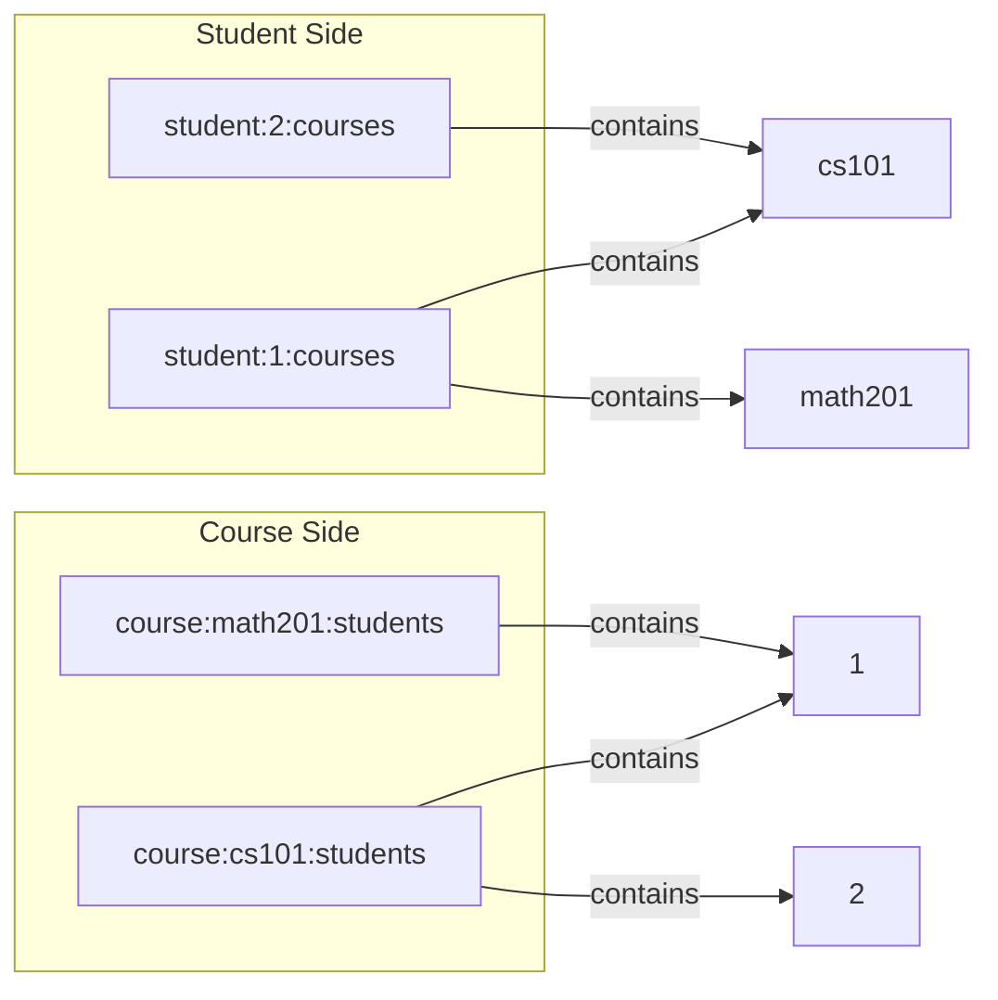

# How to Model Many-to-Many Relations in Redis

Author: [nawazdhandala](https://www.github.com/nawazdhandala)

Tags: Redis, Data Modeling, Database Design, NoSQL, Backend

Description: Learn to model many-to-many relationships in Redis using sets, sorted sets, and bidirectional indexes with practical examples for tags, followers, and permissions.

---

Many-to-many relationships are common in applications: users follow other users, products have multiple tags, students enroll in multiple courses. While Redis is not a relational database, you can model these relationships efficiently using sets and maintain bidirectional references for fast lookups from either direction.

## Basic Pattern with Sets

The fundamental pattern uses two sets for each relationship: one set per entity on each side.

```python
import redis

r = redis.Redis(host='localhost', port=6379, db=0)

# Example: Students and Courses (many-to-many)
# A student can enroll in many courses
# A course can have many students

def enroll_student(student_id, course_id):
    """Create bidirectional relationship"""
    # Add course to student's enrolled courses
    r.sadd(f'student:{student_id}:courses', course_id)

    # Add student to course's enrolled students
    r.sadd(f'course:{course_id}:students', student_id)

def unenroll_student(student_id, course_id):
    """Remove bidirectional relationship"""
    r.srem(f'student:{student_id}:courses', course_id)
    r.srem(f'course:{course_id}:students', student_id)

def get_student_courses(student_id):
    """Get all courses a student is enrolled in"""
    return r.smembers(f'student:{student_id}:courses')

def get_course_students(course_id):
    """Get all students in a course"""
    return r.smembers(f'course:{course_id}:students')

def is_enrolled(student_id, course_id):
    """Check if student is enrolled in course"""
    return r.sismember(f'student:{student_id}:courses', course_id)

# Usage
enroll_student(1, 'cs101')
enroll_student(1, 'math201')
enroll_student(1, 'phys101')
enroll_student(2, 'cs101')
enroll_student(3, 'cs101')
enroll_student(3, 'math201')

print(f"Student 1 courses: {get_student_courses(1)}")
print(f"CS101 students: {get_course_students('cs101')}")
print(f"Is student 1 in CS101? {is_enrolled(1, 'cs101')}")
```

## Follower/Following Pattern

The classic social media follow relationship:

```python
import redis
import time

r = redis.Redis(host='localhost', port=6379, db=0)

class SocialGraph:
    """Manage follow relationships between users"""

    def follow(self, follower_id, followed_id):
        """User A follows User B"""
        if follower_id == followed_id:
            return False  # Cannot follow self

        # Add to follower's following set
        r.sadd(f'user:{follower_id}:following', followed_id)

        # Add to followed's followers set
        r.sadd(f'user:{followed_id}:followers', follower_id)

        return True

    def unfollow(self, follower_id, followed_id):
        """User A unfollows User B"""
        r.srem(f'user:{follower_id}:following', followed_id)
        r.srem(f'user:{followed_id}:followers', follower_id)

    def get_followers(self, user_id):
        """Get all users who follow this user"""
        return r.smembers(f'user:{user_id}:followers')

    def get_following(self, user_id):
        """Get all users this user follows"""
        return r.smembers(f'user:{user_id}:following')

    def get_follower_count(self, user_id):
        """Get follower count"""
        return r.scard(f'user:{user_id}:followers')

    def get_following_count(self, user_id):
        """Get following count"""
        return r.scard(f'user:{user_id}:following')

    def is_following(self, follower_id, followed_id):
        """Check if A follows B"""
        return r.sismember(f'user:{follower_id}:following', followed_id)

    def get_mutual_followers(self, user_a, user_b):
        """Get users who follow both A and B"""
        return r.sinter(
            f'user:{user_a}:followers',
            f'user:{user_b}:followers'
        )

    def get_common_following(self, user_a, user_b):
        """Get users that both A and B follow"""
        return r.sinter(
            f'user:{user_a}:following',
            f'user:{user_b}:following'
        )

    def suggest_follows(self, user_id, limit=10):
        """Suggest users to follow based on mutual connections"""
        following = self.get_following(user_id)

        # Find friends of friends
        suggestions = set()
        for followed_id in following:
            # Get who they follow
            their_following = r.smembers(f'user:{followed_id.decode()}:following')
            suggestions.update(their_following)

        # Remove already following and self
        suggestions.discard(str(user_id).encode())
        suggestions -= following

        return list(suggestions)[:limit]

# Usage
graph = SocialGraph()

graph.follow(1, 2)
graph.follow(1, 3)
graph.follow(2, 1)
graph.follow(2, 3)
graph.follow(3, 1)

print(f"User 1 followers: {graph.get_followers(1)}")
print(f"User 1 following: {graph.get_following(1)}")
print(f"Mutual followers of 1 and 2: {graph.get_mutual_followers(1, 2)}")
```

## Product Tags Pattern

Products with multiple tags, allowing queries from both directions:

```python
import redis
import json

r = redis.Redis(host='localhost', port=6379, db=0)

class TagSystem:
    """Many-to-many tagging system"""

    def add_tag(self, item_id, tag):
        """Add tag to item"""
        tag_lower = tag.lower()

        # Add tag to item's tag set
        r.sadd(f'item:{item_id}:tags', tag_lower)

        # Add item to tag's item set
        r.sadd(f'tag:{tag_lower}:items', item_id)

        # Track all tags
        r.sadd('tags:all', tag_lower)

    def remove_tag(self, item_id, tag):
        """Remove tag from item"""
        tag_lower = tag.lower()
        r.srem(f'item:{item_id}:tags', tag_lower)
        r.srem(f'tag:{tag_lower}:items', item_id)

    def get_item_tags(self, item_id):
        """Get all tags for an item"""
        return r.smembers(f'item:{item_id}:tags')

    def get_items_by_tag(self, tag):
        """Get all items with a specific tag"""
        return r.smembers(f'tag:{tag.lower()}:items')

    def get_items_by_all_tags(self, tags):
        """Get items that have ALL specified tags"""
        keys = [f'tag:{tag.lower()}:items' for tag in tags]
        return r.sinter(keys)

    def get_items_by_any_tag(self, tags):
        """Get items that have ANY of the specified tags"""
        keys = [f'tag:{tag.lower()}:items' for tag in tags]
        return r.sunion(keys)

    def get_related_tags(self, tag, limit=10):
        """Find tags commonly used with this tag"""
        items = self.get_items_by_tag(tag)

        tag_counts = {}
        for item_id in items:
            item_tags = self.get_item_tags(item_id.decode())
            for t in item_tags:
                t_str = t.decode()
                if t_str != tag.lower():
                    tag_counts[t_str] = tag_counts.get(t_str, 0) + 1

        # Sort by count
        sorted_tags = sorted(tag_counts.items(), key=lambda x: x[1], reverse=True)
        return sorted_tags[:limit]

    def get_all_tags(self):
        """Get all tags in the system"""
        return r.smembers('tags:all')

# Usage
tags = TagSystem()

# Add products with tags
tags.add_tag('product:1', 'electronics')
tags.add_tag('product:1', 'smartphone')
tags.add_tag('product:1', 'apple')

tags.add_tag('product:2', 'electronics')
tags.add_tag('product:2', 'laptop')
tags.add_tag('product:2', 'apple')

tags.add_tag('product:3', 'electronics')
tags.add_tag('product:3', 'smartphone')
tags.add_tag('product:3', 'samsung')

print(f"Product 1 tags: {tags.get_item_tags('product:1')}")
print(f"Electronics items: {tags.get_items_by_tag('electronics')}")
print(f"Apple smartphones: {tags.get_items_by_all_tags(['apple', 'smartphone'])}")
print(f"Related to electronics: {tags.get_related_tags('electronics')}")
```

## Relationship Diagram



## Permissions and Roles

Model user-role-permission relationships:

```python
import redis

r = redis.Redis(host='localhost', port=6379, db=0)

class RBAC:
    """Role-Based Access Control using Redis"""

    def assign_role(self, user_id, role):
        """Assign role to user"""
        r.sadd(f'user:{user_id}:roles', role)
        r.sadd(f'role:{role}:users', user_id)

    def revoke_role(self, user_id, role):
        """Remove role from user"""
        r.srem(f'user:{user_id}:roles', role)
        r.srem(f'role:{role}:users', user_id)

    def add_permission(self, role, permission):
        """Add permission to role"""
        r.sadd(f'role:{role}:permissions', permission)
        r.sadd(f'permission:{permission}:roles', role)

    def remove_permission(self, role, permission):
        """Remove permission from role"""
        r.srem(f'role:{role}:permissions', permission)
        r.srem(f'permission:{permission}:roles', role)

    def get_user_roles(self, user_id):
        """Get all roles for a user"""
        return r.smembers(f'user:{user_id}:roles')

    def get_role_permissions(self, role):
        """Get all permissions for a role"""
        return r.smembers(f'role:{role}:permissions')

    def get_user_permissions(self, user_id):
        """Get all permissions for a user (through roles)"""
        roles = self.get_user_roles(user_id)

        if not roles:
            return set()

        # Get permissions from all roles
        permission_keys = [f'role:{role.decode()}:permissions' for role in roles]
        return r.sunion(permission_keys)

    def has_permission(self, user_id, permission):
        """Check if user has specific permission"""
        permissions = self.get_user_permissions(user_id)
        return permission.encode() in permissions

    def get_users_with_permission(self, permission):
        """Get all users who have a permission"""
        roles = r.smembers(f'permission:{permission}:roles')

        if not roles:
            return set()

        user_keys = [f'role:{role.decode()}:users' for role in roles]
        return r.sunion(user_keys)

# Usage
rbac = RBAC()

# Setup roles and permissions
rbac.add_permission('admin', 'users:create')
rbac.add_permission('admin', 'users:delete')
rbac.add_permission('admin', 'posts:delete')

rbac.add_permission('editor', 'posts:create')
rbac.add_permission('editor', 'posts:edit')
rbac.add_permission('editor', 'posts:delete')

rbac.add_permission('viewer', 'posts:read')

# Assign roles to users
rbac.assign_role(1, 'admin')
rbac.assign_role(2, 'editor')
rbac.assign_role(3, 'viewer')
rbac.assign_role(3, 'editor')  # User can have multiple roles

print(f"User 1 permissions: {rbac.get_user_permissions(1)}")
print(f"User 3 permissions: {rbac.get_user_permissions(3)}")
print(f"Can user 2 delete posts? {rbac.has_permission(2, 'posts:delete')}")
```

## Using Sorted Sets for Ordered Relationships

When order matters (like by timestamp or score):

```python
import redis
import time

r = redis.Redis(host='localhost', port=6379, db=0)

class OrderedRelationship:
    """Many-to-many with ordering"""

    def add_with_score(self, from_type, from_id, to_type, to_id, score=None):
        """Add relationship with optional score/timestamp"""
        if score is None:
            score = time.time()

        # Bidirectional sorted sets
        r.zadd(f'{from_type}:{from_id}:{to_type}s', {to_id: score})
        r.zadd(f'{to_type}:{to_id}:{from_type}s', {from_id: score})

    def get_ordered(self, type_name, id, relation, limit=10, desc=True):
        """Get related items ordered by score"""
        key = f'{type_name}:{id}:{relation}'

        if desc:
            return r.zrevrange(key, 0, limit - 1, withscores=True)
        else:
            return r.zrange(key, 0, limit - 1, withscores=True)

    def get_by_score_range(self, type_name, id, relation, min_score, max_score):
        """Get related items within score range"""
        key = f'{type_name}:{id}:{relation}'
        return r.zrangebyscore(key, min_score, max_score, withscores=True)

# Usage: Playlist tracks with play order
rel = OrderedRelationship()

# Add tracks to playlist with position
rel.add_with_score('playlist', 1, 'track', 101, score=1)
rel.add_with_score('playlist', 1, 'track', 102, score=2)
rel.add_with_score('playlist', 1, 'track', 103, score=3)

# Get tracks in order
tracks = rel.get_ordered('playlist', 1, 'tracks', desc=False)
print(f"Playlist tracks: {tracks}")

# Usage: User likes with timestamp
rel.add_with_score('user', 1, 'post', 501)  # Uses current timestamp
time.sleep(0.1)
rel.add_with_score('user', 1, 'post', 502)

# Get recent likes
likes = rel.get_ordered('user', 1, 'posts', limit=10)
print(f"Recent likes: {likes}")
```

## Summary

| Pattern | Data Structure | Use Case |
|---------|---------------|----------|
| Basic bidirectional | Sets on both sides | Tags, categories |
| Social follow | Sets with counts | Followers/following |
| Ordered relationships | Sorted sets | Playlists, feeds |
| Multi-level (roles) | Chained sets | RBAC permissions |

Key principles:
- Always maintain bidirectional indexes
- Use sets for unordered many-to-many
- Use sorted sets when order or ranking matters
- Use SINTER for AND queries, SUNION for OR queries
- Consider memory vs query speed tradeoffs
