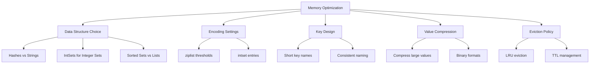

# How to Optimize Redis Memory Usage

Author: [nawazdhandala](https://www.github.com/nawazdhandala)

Tags: Redis, Performance, Memory, Optimization, DevOps

Description: Learn techniques to reduce Redis memory consumption including data structure optimization, compression, encoding configurations, and memory analysis tools.

---

Redis stores all data in memory, making memory optimization critical for cost efficiency and performance. A few configuration changes and data modeling decisions can reduce memory usage by 50% or more. This guide covers practical techniques to minimize Redis memory footprint.

## Analyzing Current Memory Usage

Start by understanding where memory is being used:

```python
import redis
import json

r = redis.Redis(host='localhost', port=6379, db=0)

def analyze_memory():
    """Get detailed memory statistics"""
    info = r.info('memory')

    print("Memory Overview:")
    print(f"  Used memory: {info['used_memory_human']}")
    print(f"  Peak memory: {info['used_memory_peak_human']}")
    print(f"  RSS memory: {info['used_memory_rss_human']}")
    print(f"  Fragmentation ratio: {info['mem_fragmentation_ratio']:.2f}")
    print(f"  Memory allocator: {info['mem_allocator']}")

    # Memory breakdown by category
    print("\nMemory by Category:")
    for key in ['used_memory_dataset', 'used_memory_overhead',
                'used_memory_startup', 'used_memory_scripts']:
        if key in info:
            print(f"  {key}: {info[key]:,} bytes")

    return info

def sample_key_sizes(pattern='*', sample_size=100):
    """Sample key sizes to find large keys"""
    cursor = 0
    sizes = []

    while len(sizes) < sample_size:
        cursor, keys = r.scan(cursor, match=pattern, count=100)
        for key in keys:
            mem = r.memory_usage(key)
            if mem:
                sizes.append((key.decode(), mem))

        if cursor == 0:
            break

    # Sort by size descending
    sizes.sort(key=lambda x: x[1], reverse=True)

    print(f"\nTop {min(10, len(sizes))} keys by memory:")
    for key, size in sizes[:10]:
        print(f"  {key}: {size:,} bytes")

    return sizes

analyze_memory()
sample_key_sizes()
```

## Choosing Efficient Data Structures

Different data structures have different memory overhead:

```python
import redis
import json

r = redis.Redis(host='localhost', port=6379, db=0)

# Clean up
r.flushdb()

# Scenario: Store user data for 1000 users

# Method 1: Individual string keys (INEFFICIENT)
for i in range(1000):
    r.set(f'user:{i}:name', f'User {i}')
    r.set(f'user:{i}:email', f'user{i}@example.com')
    r.set(f'user:{i}:age', str(20 + i % 50))

method1_memory = r.info('memory')['used_memory']
r.flushdb()

# Method 2: JSON in single key (MODERATE)
for i in range(1000):
    r.set(f'user:{i}', json.dumps({
        'name': f'User {i}',
        'email': f'user{i}@example.com',
        'age': 20 + i % 50
    }))

method2_memory = r.info('memory')['used_memory']
r.flushdb()

# Method 3: Hashes (EFFICIENT)
for i in range(1000):
    r.hset(f'user:{i}', mapping={
        'name': f'User {i}',
        'email': f'user{i}@example.com',
        'age': 20 + i % 50
    })

method3_memory = r.info('memory')['used_memory']

print("Memory comparison:")
print(f"  Individual strings: {method1_memory:,} bytes")
print(f"  JSON strings: {method2_memory:,} bytes")
print(f"  Hashes: {method3_memory:,} bytes")
print(f"\nHashes use {method3_memory/method1_memory*100:.0f}% of individual strings")
```

## Hash Encoding Optimization

Redis uses memory-efficient encodings for small hashes. Configure thresholds in redis.conf:

```bash
# redis.conf
# Use ziplist encoding for hashes with few fields
hash-max-ziplist-entries 512
hash-max-ziplist-value 64

# Similar settings for other types
list-max-ziplist-size -2
set-max-intset-entries 512
zset-max-ziplist-entries 128
zset-max-ziplist-value 64
```

```python
import redis

r = redis.Redis(host='localhost', port=6379, db=0)

def check_encoding(key):
    """Check the internal encoding of a key"""
    encoding = r.object('encoding', key)
    return encoding.decode() if encoding else None

# Small hash uses ziplist (memory efficient)
r.hset('small_hash', mapping={f'field{i}': f'value{i}' for i in range(10)})
print(f"Small hash encoding: {check_encoding('small_hash')}")  # ziplist or listpack

# Large hash uses hashtable (more memory)
r.hset('large_hash', mapping={f'field{i}': f'value{i}' for i in range(1000)})
print(f"Large hash encoding: {check_encoding('large_hash')}")  # hashtable

# Memory comparison
small_mem = r.memory_usage('small_hash')
large_mem = r.memory_usage('large_hash')
print(f"Small hash: {small_mem} bytes, Large hash: {large_mem} bytes")
```

## Integer Encoding for Sets

Sets of integers use a compact encoding:

```python
import redis

r = redis.Redis(host='localhost', port=6379, db=0)

# Integer set uses intset encoding (very compact)
r.sadd('int_set', *range(100))
print(f"Integer set encoding: {check_encoding('int_set')}")
print(f"Integer set memory: {r.memory_usage('int_set')} bytes")

# String set uses hashtable
r.sadd('string_set', *[f'item_{i}' for i in range(100)])
print(f"String set encoding: {check_encoding('string_set')}")
print(f"String set memory: {r.memory_usage('string_set')} bytes")

# Use integers when possible for massive memory savings
```

## Key Name Optimization

Shorter key names save memory when you have millions of keys:

```python
import redis

r = redis.Redis(host='localhost', port=6379, db=0)

# Long key names add up
# 'user:profile:settings:notification:email' = 41 bytes per key

# Abbreviated keys save memory
# 'u:p:s:n:e' = 9 bytes per key

# With 10 million keys, this saves 320MB of RAM

# Create a key mapping for readability
KEY_MAP = {
    'u': 'user',
    'p': 'profile',
    's': 'settings',
    'o': 'order',
    'c': 'cache',
}

def short_key(*parts):
    """Generate short key from parts"""
    abbreviated = []
    for part in parts:
        if part in KEY_MAP.values():
            # Find abbreviation
            for short, full in KEY_MAP.items():
                if full == part:
                    abbreviated.append(short)
                    break
        else:
            abbreviated.append(str(part))
    return ':'.join(abbreviated)

# Usage
key = short_key('user', 1001, 'profile')  # u:1001:p
r.set(key, 'data')
```

## Compression for Large Values

Compress large values before storing:

```python
import redis
import zlib
import json

r = redis.Redis(host='localhost', port=6379, db=0)

def set_compressed(key, data, threshold=1000):
    """Store data with optional compression"""
    serialized = json.dumps(data)

    if len(serialized) > threshold:
        compressed = zlib.compress(serialized.encode(), level=6)
        r.set(key, compressed)
        r.set(f'{key}:compressed', '1')
        return len(compressed)
    else:
        r.set(key, serialized)
        r.delete(f'{key}:compressed')
        return len(serialized)

def get_compressed(key):
    """Retrieve potentially compressed data"""
    data = r.get(key)
    if data is None:
        return None

    is_compressed = r.get(f'{key}:compressed')
    if is_compressed:
        decompressed = zlib.decompress(data).decode()
        return json.loads(decompressed)
    else:
        return json.loads(data)

# Test with large data
large_data = {'items': [{'id': i, 'data': 'x' * 100} for i in range(1000)]}

# Without compression
uncompressed_size = len(json.dumps(large_data))
print(f"Uncompressed size: {uncompressed_size:,} bytes")

# With compression
compressed_size = set_compressed('large_data', large_data)
print(f"Compressed size: {compressed_size:,} bytes")
print(f"Compression ratio: {uncompressed_size/compressed_size:.1f}x")
```

## Memory Eviction Policies

Configure how Redis handles memory limits:

```bash
# redis.conf

# Maximum memory limit
maxmemory 2gb

# Eviction policy when maxmemory is reached
# Options: noeviction, allkeys-lru, volatile-lru, allkeys-random, etc.
maxmemory-policy allkeys-lru

# Sample size for LRU algorithm (higher = more accurate but slower)
maxmemory-samples 10
```

```python
import redis

r = redis.Redis(host='localhost', port=6379, db=0)

# Check current configuration
config = r.config_get('maxmemory*')
print("Memory configuration:")
for key, value in config.items():
    print(f"  {key}: {value}")

# Monitor evictions
info = r.info('stats')
print(f"\nEvicted keys: {info['evicted_keys']}")
```

## Memory Optimization Diagram



## Expiration and TTL Management

Use TTL to automatically clean up temporary data:

```python
import redis
import time

r = redis.Redis(host='localhost', port=6379, db=0)

# Set TTL when creating keys
r.setex('cache:item:1', 3600, 'cached data')  # Expires in 1 hour

# Add TTL to existing key
r.set('temp:data', 'value')
r.expire('temp:data', 300)  # Expires in 5 minutes

# Use EXPIREAT for specific timestamp
future = int(time.time()) + 86400  # Tomorrow
r.set('daily:report', 'data')
r.expireat('daily:report', future)

# Check TTL
ttl = r.ttl('cache:item:1')
print(f"TTL remaining: {ttl} seconds")

# Scan for keys without TTL (potential memory leak)
def find_keys_without_ttl(pattern='*', sample=1000):
    """Find keys that might need TTL"""
    cursor = 0
    no_ttl = []

    while len(no_ttl) < sample:
        cursor, keys = r.scan(cursor, match=pattern, count=100)
        for key in keys:
            if r.ttl(key) == -1:  # No TTL set
                no_ttl.append(key.decode())

        if cursor == 0:
            break

    return no_ttl

keys_without_ttl = find_keys_without_ttl('cache:*')
print(f"Cache keys without TTL: {len(keys_without_ttl)}")
```

## Memory-Efficient Patterns

```python
import redis
import msgpack  # More compact than JSON

r = redis.Redis(host='localhost', port=6379, db=0)

# 1. Use MessagePack instead of JSON
data = {'name': 'Alice', 'scores': [95, 87, 92], 'active': True}
json_size = len(json.dumps(data))
msgpack_size = len(msgpack.packb(data))
print(f"JSON: {json_size} bytes, MessagePack: {msgpack_size} bytes")

# 2. Store timestamps as integers, not strings
import time
# Bad: '2026-01-25T10:30:00Z' = 20 bytes
# Good: 1737805800 = 10 bytes (as string) or 8 bytes (as integer)

# 3. Use bitfields for flags
r.setbit('user:1:flags', 0, 1)  # Active
r.setbit('user:1:flags', 1, 0)  # Verified
r.setbit('user:1:flags', 2, 1)  # Premium
# Single key stores many boolean flags efficiently

# 4. Aggregate small values into hashes
# Instead of: session:1:user, session:1:ip, session:1:time
# Use: HSET session:1 user 1001 ip 192.168.1.1 time 1737805800
```

## Summary

| Technique | Memory Savings | Effort |
|-----------|---------------|--------|
| Use hashes for objects | 30-50% | Low |
| Optimize encoding thresholds | 10-20% | Low |
| Shorten key names | 5-15% | Medium |
| Compress large values | 50-80% | Medium |
| Use TTL aggressively | Varies | Low |
| Use MessagePack | 15-25% | Medium |
| Use integer sets | 80%+ for ints | Low |

Key recommendations:
- Profile memory usage before optimizing
- Use hashes for object storage
- Configure encoding thresholds appropriately
- Compress values over 1KB
- Set TTL on all temporary data
- Monitor memory fragmentation
- Use MEMORY DOCTOR for recommendations
