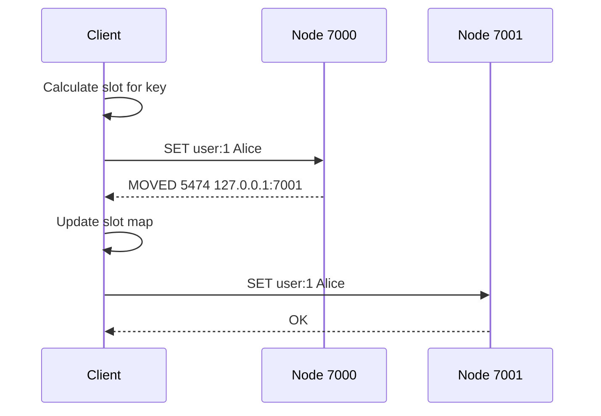

# How to Fix 'MOVED' Errors in Redis Cluster

Author: [nawazdhandala](https://www.github.com/nawazdhandala)

Tags: Redis, Cluster, Troubleshooting, Client Configuration, DevOps

Description: Resolve Redis Cluster MOVED errors by using cluster-aware clients, understanding hash slot redirection, and properly configuring your application for cluster mode.

---

The "MOVED" error in Redis Cluster is not really an error - it is a redirection response telling your client that the key lives on a different node. However, if you see MOVED errors reaching your application, it means your client is not properly handling cluster redirection. This guide explains how to fix this.

## Understanding the MOVED Response

```bash
# When you send a command to the wrong node:
redis-cli -p 7000 SET user:1 "Alice"
# -> (error) MOVED 5474 127.0.0.1:7001

# This means:
# - Key 'user:1' hashes to slot 5474
# - Slot 5474 is served by node at 127.0.0.1:7001
# - You should resend the command there
```

## The Problem: Non-Cluster-Aware Client

```python
import redis

# Using regular Redis client with cluster
r = redis.Redis(host='localhost', port=7000)

try:
    r.set('user:1', 'Alice')
except redis.ResponseError as e:
    print(f"Error: {e}")
    # MOVED 5474 127.0.0.1:7001

# The regular client does not follow redirections
```

## Solution: Use Cluster-Aware Client

```python
from redis.cluster import RedisCluster

# Cluster client automatically handles MOVED
rc = RedisCluster(
    host='localhost',
    port=7000,
    decode_responses=True
)

# This works automatically
rc.set('user:1', 'Alice')
print(rc.get('user:1'))  # Alice

# The client:
# 1. Maintains a map of slots to nodes
# 2. Routes commands to the correct node
# 3. Handles MOVED by updating its slot map and retrying
```

## Node.js Configuration

```javascript
const Redis = require('ioredis');

// Wrong: Regular client
// const redis = new Redis({ host: 'localhost', port: 7000 });

// Correct: Cluster client
const cluster = new Redis.Cluster([
    { host: 'localhost', port: 7000 },
    { host: 'localhost', port: 7001 },
    { host: 'localhost', port: 7002 },
], {
    // Options
    redisOptions: {
        password: process.env.REDIS_PASSWORD,
    },
    // Automatically handle redirections
    clusterRetryStrategy: (times) => {
        return Math.min(times * 100, 3000);
    },
    // Enable reading from replicas
    scaleReads: 'slave',
});

// Now MOVED is handled automatically
cluster.set('user:1', 'Alice');
cluster.get('user:1').then(console.log);
```

## Java/Jedis Configuration

```java
import redis.clients.jedis.JedisCluster;
import redis.clients.jedis.HostAndPort;

import java.util.HashSet;
import java.util.Set;

public class RedisClusterExample {
    public static void main(String[] args) {
        Set<HostAndPort> nodes = new HashSet<>();
        nodes.add(new HostAndPort("localhost", 7000));
        nodes.add(new HostAndPort("localhost", 7001));
        nodes.add(new HostAndPort("localhost", 7002));

        // JedisCluster handles MOVED automatically
        JedisCluster cluster = new JedisCluster(nodes);

        cluster.set("user:1", "Alice");
        String value = cluster.get("user:1");
        System.out.println(value);

        cluster.close();
    }
}
```

## How Cluster Clients Handle MOVED



## Handling Cluster Topology Changes

During resharding or failover, you may see more MOVED responses:

```python
from redis.cluster import RedisCluster
import time

def get_resilient_cluster():
    """Create cluster client with retry logic"""
    return RedisCluster(
        host='localhost',
        port=7000,
        decode_responses=True,
        # Retry configuration
        cluster_error_retry_attempts=3,
        # Skip checking if all slots are covered
        skip_full_coverage_check=True,
    )

def execute_with_retry(cluster, method, *args, max_retries=3, **kwargs):
    """Execute command with retry on cluster errors"""
    for attempt in range(max_retries):
        try:
            func = getattr(cluster, method)
            return func(*args, **kwargs)
        except Exception as e:
            if 'MOVED' in str(e) or 'CLUSTERDOWN' in str(e):
                print(f"Cluster topology change, retry {attempt + 1}")
                time.sleep(0.5)
                continue
            raise

    raise Exception(f"Failed after {max_retries} attempts")

# Usage
rc = get_resilient_cluster()
result = execute_with_retry(rc, 'get', 'my_key')
```

## Debugging MOVED Issues

```python
from redis.cluster import RedisCluster

rc = RedisCluster(host='localhost', port=7000)

def debug_key_location(key):
    """Find which node serves a key"""
    slot = rc.cluster_keyslot(key)
    slots_info = rc.cluster_slots()

    for slot_range in slots_info:
        start, end = slot_range[0], slot_range[1]
        if start <= slot <= end:
            master = slot_range[2]
            print(f"Key '{key}':")
            print(f"  Slot: {slot}")
            print(f"  Node: {master[0]}:{master[1]}")
            return

    print(f"No node found for slot {slot}")

debug_key_location('user:1')
debug_key_location('user:2')

# Check cluster slot distribution
def show_cluster_topology():
    """Display cluster slot distribution"""
    nodes = rc.cluster_nodes()

    for node_id, info in nodes.items():
        if 'master' in info.get('flags', ''):
            slots = info.get('slots', [])
            slot_count = sum(
                (s[1] - s[0] + 1) if isinstance(s, list) else 1
                for s in slots
            )
            print(f"Master {info['host']}:{info['port']}: {slot_count} slots")

show_cluster_topology()
```

## ASK vs MOVED

MOVED indicates a permanent slot assignment. ASK indicates temporary redirection during migration:

```python
from redis.cluster import RedisCluster

rc = RedisCluster(host='localhost', port=7000)

# MOVED: Slot permanently on different node
# Client should update its slot map and redirect

# ASK: Slot temporarily on different node (during migration)
# Client should send ASKING command first, then the real command
# Do not update slot map

# Both are handled automatically by cluster-aware clients
```

## Common Causes of Excessive MOVED

1. **Using non-cluster client**: Switch to cluster-aware client
2. **Stale slot cache**: Client needs to refresh slot map
3. **Ongoing resharding**: Normal during cluster operations
4. **Network issues**: Client cannot reach correct node

```python
from redis.cluster import RedisCluster

# Force refresh slot cache
rc = RedisCluster(host='localhost', port=7000)

# If you suspect stale cache
rc.cluster_slots()  # Refresh slot information

# Check if nodes are reachable
for node in rc.get_nodes():
    try:
        r = node.redis_connection
        r.ping()
        print(f"{node.host}:{node.port} - OK")
    except Exception as e:
        print(f"{node.host}:{node.port} - FAILED: {e}")
```

## Summary

| Client | Cluster Support | Handles MOVED |
|--------|----------------|---------------|
| redis-py Redis | No | No |
| redis-py RedisCluster | Yes | Yes |
| ioredis (regular) | No | No |
| ioredis.Cluster | Yes | Yes |
| Jedis | No | No |
| JedisCluster | Yes | Yes |

Key points:
- MOVED is normal cluster behavior, not an error
- Use cluster-aware clients that handle redirection
- Clients maintain slot-to-node mappings
- Slot maps update automatically on MOVED
- Expect more MOVED during resharding operations
- ASK is temporary, MOVED is permanent
