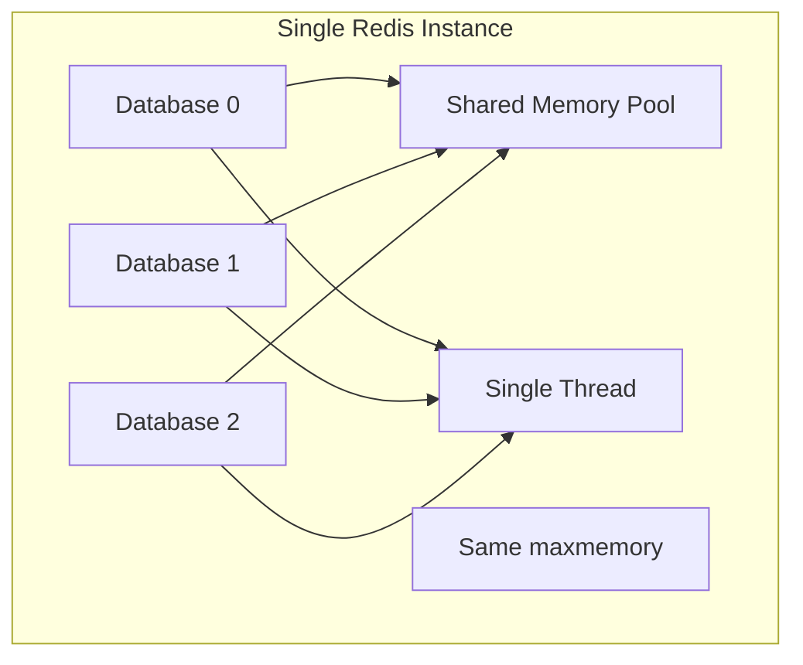

# How to Use Multiple Redis Databases Effectively

Author: [nawazdhandala](https://www.github.com/nawazdhandala)

Tags: Redis, Database, Architecture, Best Practices, DevOps

Description: Learn how to use Redis multiple databases (SELECT command), understand their limitations, and discover when to use them versus separate Redis instances.

---

Redis supports 16 databases by default, numbered 0 through 15. You can switch between them using the SELECT command. While this feature seems convenient for separating data, it comes with important limitations you should understand before using it in production.

## Understanding Redis Databases

Each Redis database is a separate keyspace within the same Redis instance. They share the same server process, memory, and configuration.

```python
import redis

# Connect to database 0 (default)
r0 = redis.Redis(host='localhost', port=6379, db=0)

# Connect to database 1
r1 = redis.Redis(host='localhost', port=6379, db=1)

# Data in db=0
r0.set('user:1', 'Alice')

# Data in db=1
r1.set('user:1', 'Bob')

# Same key, different values in different databases
print(r0.get('user:1'))  # b'Alice'
print(r1.get('user:1'))  # b'Bob'

# Keys are completely separate
print(r0.keys('*'))  # [b'user:1']
print(r1.keys('*'))  # [b'user:1']
```

## Using SELECT Command

Within a single connection, you can switch databases with SELECT:

```python
import redis

r = redis.Redis(host='localhost', port=6379, db=0)

# Start in database 0
r.set('key', 'value in db 0')

# Switch to database 1
r.select(1)
r.set('key', 'value in db 1')

# Switch back to database 0
r.select(0)
print(r.get('key'))  # b'value in db 0'

# Using execute_command for explicit SELECT
r.execute_command('SELECT', 2)
r.set('key', 'value in db 2')
```

## Configuration Options

Configure the number of databases in redis.conf:

```bash
# redis.conf
# Set maximum number of databases (default is 16)
databases 16

# To reduce memory overhead, set to actual number needed
databases 4
```

View current database count:

```python
import redis

r = redis.Redis(host='localhost', port=6379, db=0)

# Get server configuration
config = r.config_get('databases')
print(f"Number of databases: {config['databases']}")

# Get keyspace info for all databases with data
info = r.info('keyspace')
for db, stats in info.items():
    print(f"{db}: {stats['keys']} keys")
```

## Practical Use Cases

Here are scenarios where multiple databases make sense:

### Separating Environments in Development

```python
import redis
import os

# Use different databases for different environments
# Only recommended for development/testing
DB_MAPPING = {
    'development': 0,
    'test': 1,
    'staging': 2,
}

env = os.getenv('APP_ENV', 'development')
db_number = DB_MAPPING.get(env, 0)

r = redis.Redis(host='localhost', port=6379, db=db_number)

# Now each environment has isolated data
r.set('config:api_url', f'https://api.{env}.example.com')
```

### Separating Data Types

```python
import redis

# Use separate databases for different data types
# Makes it easier to flush specific data categories

cache_db = redis.Redis(host='localhost', port=6379, db=0)
sessions_db = redis.Redis(host='localhost', port=6379, db=1)
queues_db = redis.Redis(host='localhost', port=6379, db=2)

# Cache operations
cache_db.setex('product:123', 3600, '{"name": "Widget"}')

# Session operations
sessions_db.setex('session:abc123', 86400, '{"user_id": 1}')

# Queue operations
queues_db.lpush('jobs:email', '{"to": "user@example.com"}')

# Flush only the cache without affecting sessions
cache_db.flushdb()  # Clears only db=0
```

### Testing with Database Isolation

```python
import redis
import pytest

class TestRedisOperations:
    @pytest.fixture
    def redis_client(self):
        """Use a dedicated test database"""
        r = redis.Redis(host='localhost', port=6379, db=15)
        r.flushdb()  # Clean before each test
        yield r
        r.flushdb()  # Clean after each test

    def test_user_creation(self, redis_client):
        redis_client.hset('user:1', mapping={
            'name': 'Test User',
            'email': 'test@example.com'
        })

        user = redis_client.hgetall('user:1')
        assert user[b'name'] == b'Test User'

    def test_counter_increment(self, redis_client):
        redis_client.set('counter', 0)
        redis_client.incr('counter')

        assert redis_client.get('counter') == b'1'
```

## Limitations and Gotchas

Multiple databases have significant limitations:



### No Per-Database Memory Limits

```python
import redis

r = redis.Redis(host='localhost', port=6379, db=0)

# This affects ALL databases, not just one
info = r.info('memory')
print(f"Total used memory: {info['used_memory_human']}")

# maxmemory is shared across all databases
config = r.config_get('maxmemory')
print(f"Max memory: {config['maxmemory']}")

# You cannot set per-database limits
# A memory-hungry db=0 can cause evictions in db=1
```

### No Per-Database Authentication

```python
import redis

# Redis authentication applies to the entire instance
# You cannot have different passwords per database

# This authenticates for all databases
r = redis.Redis(
    host='localhost',
    port=6379,
    password='your_password',
    db=0
)

# Same credentials work for any database
r.select(1)  # No additional auth needed
```

### Cluster Mode Does Not Support SELECT

```python
import redis
from redis.cluster import RedisCluster

# Redis Cluster does not support multiple databases
# This will fail
try:
    rc = RedisCluster(host='localhost', port=7000)
    rc.select(1)  # Raises error
except Exception as e:
    print(f"Error: {e}")
    # redis.exceptions.ResponseError: SELECT is not allowed in cluster mode

# In Cluster mode, you must use key prefixes instead
rc.set('db1:user:1', 'data')
rc.set('db2:user:1', 'other data')
```

### MOVE Command Limitations

```python
import redis

r = redis.Redis(host='localhost', port=6379, db=0)

# MOVE transfers a key to another database
r.set('mykey', 'myvalue')
r.move('mykey', 1)  # Move to database 1

# Verify the move
print(r.get('mykey'))  # None (not in db 0 anymore)

r.select(1)
print(r.get('mykey'))  # b'myvalue' (now in db 1)

# MOVE fails if key exists in destination
r.select(0)
r.set('existing', 'in db 0')
r.select(1)
r.set('existing', 'in db 1')
r.select(0)

result = r.move('existing', 1)  # Returns False, key not moved
print(f"Move successful: {result}")  # False
```

## When to Use Separate Instances Instead

For production systems, separate Redis instances often work better than multiple databases:

```python
import redis

# Instead of multiple databases in one instance
# Use separate instances with dedicated resources

class RedisConnections:
    def __init__(self):
        # Each instance has dedicated memory, CPU, and can be on different servers
        self.cache = redis.Redis(
            host='redis-cache.example.com',
            port=6379,
            db=0
        )

        self.sessions = redis.Redis(
            host='redis-sessions.example.com',
            port=6379,
            db=0
        )

        self.queues = redis.Redis(
            host='redis-queues.example.com',
            port=6379,
            db=0
        )

    def get_cache(self):
        return self.cache

    def get_sessions(self):
        return self.sessions

    def get_queues(self):
        return self.queues

# Benefits of separate instances:
# - Independent memory limits per service
# - Failures are isolated
# - Can scale independently
# - Can use different Redis configurations
# - Works with Redis Cluster
```

## Alternative: Key Prefixes

Instead of multiple databases, use key prefixes to namespace your data:

```python
import redis

r = redis.Redis(host='localhost', port=6379, db=0)

# Use prefixes to separate logical databases
# This approach works everywhere, including Redis Cluster

class PrefixedRedis:
    def __init__(self, client, prefix):
        self.client = client
        self.prefix = prefix

    def _key(self, key):
        return f'{self.prefix}:{key}'

    def set(self, key, value, **kwargs):
        return self.client.set(self._key(key), value, **kwargs)

    def get(self, key):
        return self.client.get(self._key(key))

    def delete(self, *keys):
        prefixed_keys = [self._key(k) for k in keys]
        return self.client.delete(*prefixed_keys)

    def keys(self, pattern='*'):
        full_pattern = self._key(pattern)
        keys = self.client.keys(full_pattern)
        prefix_len = len(self.prefix) + 1
        return [k[prefix_len:] for k in keys]

# Usage
cache = PrefixedRedis(r, 'cache')
sessions = PrefixedRedis(r, 'sessions')
queues = PrefixedRedis(r, 'queues')

# Each has isolated keyspace via prefix
cache.set('user:1', 'cached data')      # Stored as cache:user:1
sessions.set('user:1', 'session data')  # Stored as sessions:user:1

print(cache.get('user:1'))     # b'cached data'
print(sessions.get('user:1'))  # b'session data'
```

## Summary

| Feature | Multiple DBs | Separate Instances | Key Prefixes |
|---------|-------------|-------------------|--------------|
| Memory isolation | No | Yes | No |
| Auth isolation | No | Yes | No |
| Cluster support | No | Yes | Yes |
| Setup complexity | Low | High | Low |
| Resource efficiency | High | Lower | High |

Use multiple databases for:
- Development and testing environments
- Simple separation of concerns
- Easy bulk operations (FLUSHDB)

Use separate instances for:
- Production workloads requiring isolation
- Different scaling requirements
- Critical data separation

Use key prefixes for:
- Cluster-compatible namespacing
- Simple logical separation
- Maximum compatibility
