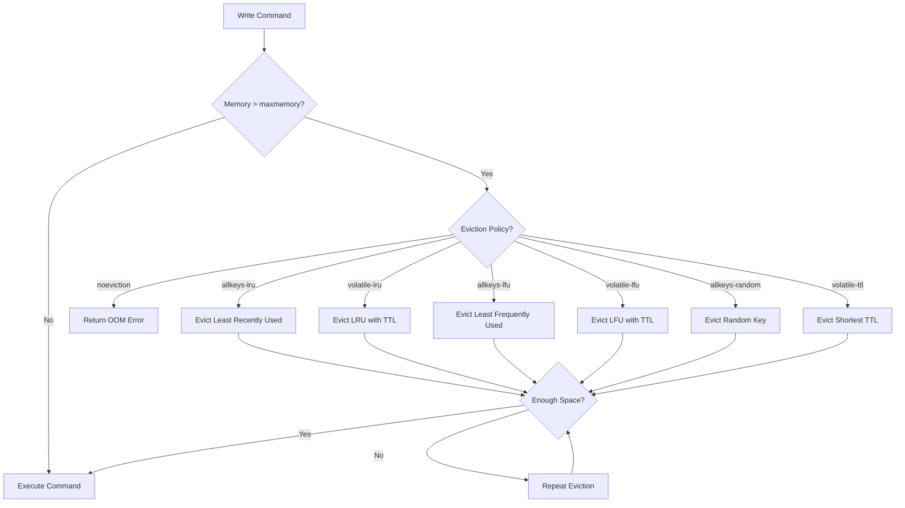

# How to Fix 'OOM command not allowed' Errors

Author: [nawazdhandala](https://www.github.com/nawazdhandala)

Tags: Redis, Memory, Troubleshooting, DevOps, Performance

Description: Resolve Redis OOM (Out of Memory) errors by understanding memory limits, configuring eviction policies, and implementing proper memory management strategies.

---

The "OOM command not allowed when used memory > 'maxmemory'" error occurs when Redis has reached its memory limit and cannot allocate more memory for write operations. This guide explains how to diagnose the issue, configure memory settings, and prevent future OOM errors.

## Understanding the Error

```python
# Error message variants:
# OOM command not allowed when used memory > 'maxmemory'
# -OOM command not allowed when used memory > 'maxmemory'

import redis
from redis.exceptions import ResponseError

r = redis.Redis(host='localhost', port=6379, db=0)

try:
    r.set('key', 'value')
except ResponseError as e:
    if 'OOM' in str(e):
        print("Redis is out of memory!")
        print(f"Error: {e}")
```

## Diagnosing the Problem

```python
import redis

r = redis.Redis(host='localhost', port=6379, db=0)

def check_memory_status():
    """Get detailed memory information"""
    info = r.info('memory')

    print("Memory Status:")
    print(f"  Used memory: {info['used_memory_human']}")
    print(f"  Peak memory: {info['used_memory_peak_human']}")
    print(f"  Max memory: {info.get('maxmemory_human', 'unlimited')}")
    print(f"  Max memory policy: {info.get('maxmemory_policy', 'noeviction')}")

    # Calculate usage percentage
    used = info['used_memory']
    maxmem = info.get('maxmemory', 0)
    if maxmem > 0:
        pct = (used / maxmem) * 100
        print(f"  Usage: {pct:.1f}%")

    print(f"\n  Fragmentation ratio: {info['mem_fragmentation_ratio']:.2f}")
    print(f"  RSS memory: {info['used_memory_rss_human']}")

    return info

def find_memory_hogs(sample_size=100):
    """Find keys consuming the most memory"""
    cursor = 0
    sizes = []

    while len(sizes) < sample_size:
        cursor, keys = r.scan(cursor, count=100)
        for key in keys:
            try:
                mem = r.memory_usage(key)
                if mem:
                    sizes.append((key.decode(), mem))
            except Exception:
                pass

        if cursor == 0:
            break

    sizes.sort(key=lambda x: x[1], reverse=True)

    print(f"\nTop {min(10, len(sizes))} memory consumers:")
    for key, size in sizes[:10]:
        print(f"  {key}: {size:,} bytes")

check_memory_status()
find_memory_hogs()
```

## Immediate Solutions

### 1. Increase maxmemory

```bash
# Check current limit
redis-cli CONFIG GET maxmemory

# Increase temporarily (in bytes)
redis-cli CONFIG SET maxmemory 4294967296  # 4GB

# Or human readable (Redis 7+)
redis-cli CONFIG SET maxmemory 4gb

# Make permanent in redis.conf
maxmemory 4gb
```

### 2. Enable Eviction Policy

```bash
# Check current policy
redis-cli CONFIG GET maxmemory-policy

# Set eviction policy
redis-cli CONFIG SET maxmemory-policy allkeys-lru

# Available policies:
# noeviction      - Return errors on write (default)
# allkeys-lru     - Evict least recently used keys
# volatile-lru    - Evict LRU keys with TTL set
# allkeys-random  - Evict random keys
# volatile-random - Evict random keys with TTL
# volatile-ttl    - Evict keys with shortest TTL
# allkeys-lfu     - Evict least frequently used (Redis 4+)
# volatile-lfu    - Evict LFU keys with TTL (Redis 4+)
```

### 3. Delete Unnecessary Data

```python
import redis

r = redis.Redis(host='localhost', port=6379, db=0)

def delete_old_keys(pattern, older_than_days=30):
    """Delete keys that are too old"""
    import time

    threshold = time.time() - (older_than_days * 86400)
    deleted = 0

    cursor = 0
    while True:
        cursor, keys = r.scan(cursor, match=pattern, count=100)

        for key in keys:
            # Check last access time
            idle_time = r.object('idletime', key)
            if idle_time and idle_time > (older_than_days * 86400):
                r.delete(key)
                deleted += 1

        if cursor == 0:
            break

    print(f"Deleted {deleted} old keys")

def flush_cache_keys():
    """Remove all cache keys"""
    cursor = 0
    deleted = 0

    while True:
        cursor, keys = r.scan(cursor, match='cache:*', count=1000)
        if keys:
            r.delete(*keys)
            deleted += len(keys)
        if cursor == 0:
            break

    print(f"Deleted {deleted} cache keys")

# Emergency cleanup
flush_cache_keys()
```

## Configure Memory Settings

```bash
# redis.conf recommended settings

# Set maximum memory
maxmemory 2gb

# Choose appropriate eviction policy
# For cache: allkeys-lru or allkeys-lfu
# For mixed use: volatile-lru
maxmemory-policy allkeys-lru

# LRU/LFU sample size (higher = more accurate but slower)
maxmemory-samples 10

# Eviction strategy
# lazy-free: delete in background thread
lazyfree-lazy-eviction yes
lazyfree-lazy-expire yes
```

## Memory-Efficient Data Patterns

```python
import redis
import json
import zlib

r = redis.Redis(host='localhost', port=6379, db=0)

# 1. Use appropriate data structures
# BAD: Separate keys for each field
r.set('user:1:name', 'Alice')
r.set('user:1:email', 'alice@example.com')
r.set('user:1:age', '30')

# GOOD: Use hash for related fields
r.hset('user:1', mapping={
    'name': 'Alice',
    'email': 'alice@example.com',
    'age': 30
})

# 2. Compress large values
def set_compressed(key, data, threshold=1000):
    """Compress values over threshold"""
    serialized = json.dumps(data)
    if len(serialized) > threshold:
        compressed = zlib.compress(serialized.encode())
        r.set(key, compressed)
        r.set(f'{key}:z', '1')  # Flag as compressed
    else:
        r.set(key, serialized)
        r.delete(f'{key}:z')

# 3. Set TTL on temporary data
r.setex('session:123', 3600, 'session_data')  # Expires in 1 hour
r.setex('cache:query:abc', 300, 'result')     # Expires in 5 minutes

# 4. Use shorter key names
# BAD: 'application:production:user:profile:settings'
# GOOD: 'app:u:1:s' with documented abbreviations

# 5. Store integers as integers
r.set('counter', 0)  # Stored as integer internally
r.incr('counter')    # Efficient integer operations
```

## Monitoring and Alerting

```python
import redis
import time

r = redis.Redis(host='localhost', port=6379, db=0)

def monitor_memory(threshold_pct=80, check_interval=60):
    """Monitor memory and alert when threshold exceeded"""
    while True:
        info = r.info('memory')
        used = info['used_memory']
        maxmem = info.get('maxmemory', 0)

        if maxmem > 0:
            pct = (used / maxmem) * 100

            if pct > threshold_pct:
                alert_high_memory(pct, info)

            if pct > 95:
                # Emergency action
                emergency_cleanup()

            print(f"Memory: {pct:.1f}% ({info['used_memory_human']})")

        time.sleep(check_interval)

def alert_high_memory(pct, info):
    """Send alert for high memory usage"""
    print(f"WARNING: Memory at {pct:.1f}%!")
    print(f"  Used: {info['used_memory_human']}")
    print(f"  Evicted keys: {info.get('evicted_keys', 0)}")
    # Send to monitoring system, Slack, etc.

def emergency_cleanup():
    """Emergency memory cleanup"""
    print("EMERGENCY: Running cleanup...")

    # Delete expired keys aggressively
    r.execute_command('DEBUG', 'QUICKLIST-FORCE-FREE')

    # Clear cache namespace
    cursor = 0
    while True:
        cursor, keys = r.scan(cursor, match='cache:*', count=1000)
        if keys:
            r.delete(*keys)
        if cursor == 0:
            break
```

## Eviction Policy Comparison



## Application-Level Handling

```python
import redis
from redis.exceptions import ResponseError
import time

class ResilientRedisClient:
    def __init__(self, **kwargs):
        self.client = redis.Redis(**kwargs)
        self.max_retries = 3

    def set(self, key, value, **kwargs):
        """Set with OOM handling"""
        for attempt in range(self.max_retries):
            try:
                return self.client.set(key, value, **kwargs)
            except ResponseError as e:
                if 'OOM' in str(e):
                    if attempt < self.max_retries - 1:
                        print(f"OOM error, attempt {attempt + 1}")
                        self._handle_oom()
                        time.sleep(1)
                    else:
                        raise
                else:
                    raise

    def _handle_oom(self):
        """Handle OOM by cleaning up"""
        # Option 1: Delete old cache entries
        self._cleanup_cache()

        # Option 2: Request more memory (if possible)
        # Option 3: Alert operations team

    def _cleanup_cache(self):
        """Remove least important cached data"""
        cursor = 0
        deleted = 0
        max_delete = 1000

        while deleted < max_delete:
            cursor, keys = self.client.scan(
                cursor, match='cache:*', count=100
            )
            if keys:
                self.client.delete(*keys)
                deleted += len(keys)
            if cursor == 0:
                break

        print(f"Cleaned up {deleted} cache entries")

# Usage
client = ResilientRedisClient(host='localhost', port=6379)
client.set('key', 'value')
```

## Summary

| Solution | When to Use |
|----------|-------------|
| Increase maxmemory | Have available system RAM |
| Enable eviction | Data can be recreated or is cache |
| Delete old data | Have data that is no longer needed |
| Compress values | Large string values |
| Use efficient structures | Reduce per-key overhead |
| Set TTLs | Temporary data |

Prevention strategies:
- Set appropriate maxmemory from the start
- Choose correct eviction policy for your use case
- Monitor memory usage with alerts
- Use TTLs on all temporary data
- Implement application-level memory management
- Review and optimize data structures regularly
