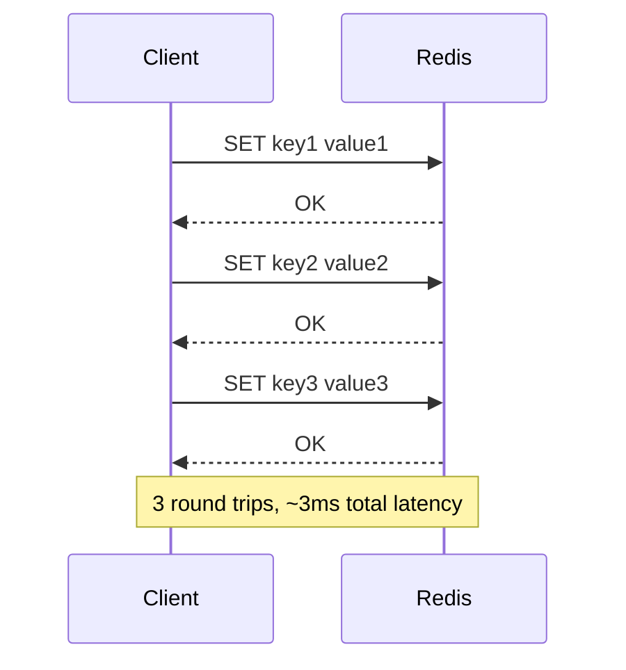
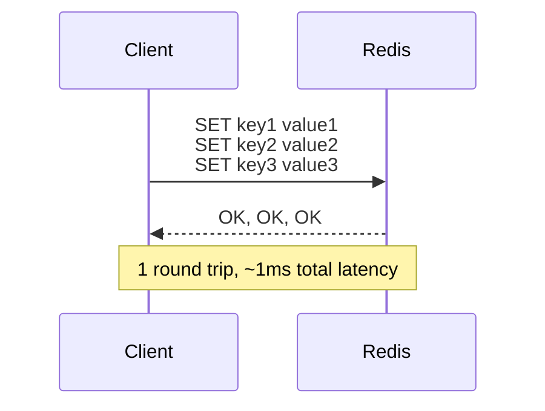

# How to Use Redis Pipelines for Performance

Author: [nawazdhandala](https://www.github.com/nawazdhandala)

Tags: Redis, Performance, Pipelines, Optimization, Latency

Description: Learn how to use Redis pipelines to dramatically improve performance by batching commands, reducing network round trips, and handling bulk operations efficiently.

---

Every Redis command requires a network round trip. When you need to execute hundreds or thousands of commands, these round trips add up quickly. Pipelines let you send multiple commands in one network request and get all responses back together, dramatically improving performance.

## Understanding the Problem

Without pipelines, each command follows this pattern:



With pipelines:



## Basic Pipeline Usage

### Python (redis-py)

```python
import redis
import time

r = redis.Redis()

# Without pipeline - slow
start = time.time()
for i in range(1000):
    r.set(f'key:{i}', f'value:{i}')
without_pipeline = time.time() - start
print(f"Without pipeline: {without_pipeline:.3f}s")

# With pipeline - fast
start = time.time()
pipe = r.pipeline()
for i in range(1000):
    pipe.set(f'key:{i}', f'value:{i}')
pipe.execute()
with_pipeline = time.time() - start
print(f"With pipeline: {with_pipeline:.3f}s")
print(f"Speedup: {without_pipeline/with_pipeline:.1f}x")

# Typical output:
# Without pipeline: 1.234s
# With pipeline: 0.045s
# Speedup: 27.4x
```

### Node.js (ioredis)

```javascript
const Redis = require('ioredis');
const redis = new Redis();

async function withoutPipeline() {
  const start = Date.now();
  for (let i = 0; i < 1000; i++) {
    await redis.set(`key:${i}`, `value:${i}`);
  }
  return Date.now() - start;
}

async function withPipeline() {
  const start = Date.now();
  const pipeline = redis.pipeline();
  for (let i = 0; i < 1000; i++) {
    pipeline.set(`key:${i}`, `value:${i}`);
  }
  await pipeline.exec();
  return Date.now() - start;
}

// Compare performance
const withoutTime = await withoutPipeline();
const withTime = await withPipeline();
console.log(`Without: ${withoutTime}ms, With: ${withTime}ms`);
```

### Java (Jedis)

```java
import redis.clients.jedis.Jedis;
import redis.clients.jedis.Pipeline;

try (Jedis jedis = new Jedis("localhost")) {
    // With pipeline
    Pipeline pipeline = jedis.pipelined();
    for (int i = 0; i < 1000; i++) {
        pipeline.set("key:" + i, "value:" + i);
    }
    pipeline.sync();
}
```

## Getting Pipeline Results

Pipelines return results in order:

```python
import redis

r = redis.Redis()
pipe = r.pipeline()

# Queue commands
pipe.set('name', 'Alice')
pipe.get('name')
pipe.incr('counter')
pipe.hset('user:1', 'email', 'alice@example.com')
pipe.hgetall('user:1')

# Execute and get results
results = pipe.execute()

# Results are in the same order as commands
set_result = results[0]        # True
get_result = results[1]        # b'Alice'
incr_result = results[2]       # 1
hset_result = results[3]       # 1
hgetall_result = results[4]    # {b'email': b'alice@example.com'}
```

## Pipeline with Transactions

Pipelines can be combined with MULTI/EXEC for atomic operations:

```python
import redis

r = redis.Redis()

# Transaction pipeline (atomic)
pipe = r.pipeline(transaction=True)  # Default is True
pipe.set('balance:alice', 100)
pipe.set('balance:bob', 50)
pipe.decrby('balance:alice', 30)
pipe.incrby('balance:bob', 30)
results = pipe.execute()

# All commands execute atomically
# If any fails, all are rolled back

# Non-transactional pipeline (just batching)
pipe = r.pipeline(transaction=False)
pipe.get('balance:alice')
pipe.get('balance:bob')
results = pipe.execute()
# Commands may interleave with other clients
```

## Chunking Large Pipelines

Very large pipelines can consume memory. Chunk them:

```python
def chunked_pipeline(redis_client, items, chunk_size=1000):
    """Execute pipeline in chunks to manage memory."""
    all_results = []

    for i in range(0, len(items), chunk_size):
        chunk = items[i:i + chunk_size]
        pipe = redis_client.pipeline()

        for item in chunk:
            pipe.set(item['key'], item['value'])

        results = pipe.execute()
        all_results.extend(results)

    return all_results

# Usage
items = [{'key': f'k:{i}', 'value': f'v:{i}'} for i in range(100000)]
results = chunked_pipeline(r, items, chunk_size=5000)
```

## Common Pipeline Patterns

### Bulk Get Operations

```python
def bulk_get(redis_client, keys):
    """Get multiple keys efficiently."""
    if not keys:
        return {}

    pipe = redis_client.pipeline()
    for key in keys:
        pipe.get(key)

    values = pipe.execute()

    return dict(zip(keys, values))

# Usage
user_ids = ['user:1', 'user:2', 'user:3']
users = bulk_get(r, user_ids)
```

### Bulk Increment with Expiry

```python
def bulk_increment(redis_client, keys, ttl=3600):
    """Increment multiple counters and set expiry."""
    pipe = redis_client.pipeline()

    for key in keys:
        pipe.incr(key)
        pipe.expire(key, ttl)

    results = pipe.execute()

    # Results alternate: incr result, expire result
    counts = [results[i] for i in range(0, len(results), 2)]
    return dict(zip(keys, counts))

# Usage
event_keys = ['events:page_view', 'events:click', 'events:signup']
counts = bulk_increment(r, event_keys)
```

### Check-and-Set Pattern

```python
def bulk_set_if_not_exists(redis_client, data, ttl=None):
    """Set multiple keys only if they do not exist."""
    pipe = redis_client.pipeline()

    for key, value in data.items():
        if ttl:
            pipe.set(key, value, nx=True, ex=ttl)
        else:
            pipe.setnx(key, value)

    results = pipe.execute()

    # Return keys that were set (True) vs skipped (False)
    return {key: bool(result) for key, result in zip(data.keys(), results)}

# Usage
data = {'cache:a': 'value1', 'cache:b': 'value2'}
set_results = bulk_set_if_not_exists(r, data, ttl=300)
```

### Hash Operations in Bulk

```python
def bulk_hmset(redis_client, hash_data, ttl=None):
    """Set multiple hashes efficiently."""
    pipe = redis_client.pipeline()

    for key, fields in hash_data.items():
        pipe.hset(key, mapping=fields)
        if ttl:
            pipe.expire(key, ttl)

    pipe.execute()

def bulk_hmget(redis_client, hash_keys, fields):
    """Get specific fields from multiple hashes."""
    pipe = redis_client.pipeline()

    for key in hash_keys:
        pipe.hmget(key, fields)

    results = pipe.execute()

    return {
        key: dict(zip(fields, values))
        for key, values in zip(hash_keys, results)
    }

# Usage
users = {
    'user:1': {'name': 'Alice', 'email': 'alice@example.com'},
    'user:2': {'name': 'Bob', 'email': 'bob@example.com'},
}
bulk_hmset(r, users, ttl=3600)

# Get names and emails for all users
results = bulk_hmget(r, ['user:1', 'user:2'], ['name', 'email'])
```

## Error Handling in Pipelines

Pipelines can contain failed commands. Handle them properly:

```python
import redis
from redis.exceptions import ResponseError

def safe_pipeline_execute(pipe):
    """Execute pipeline with error handling."""
    try:
        results = pipe.execute()
    except redis.exceptions.ConnectionError:
        raise

    # Check for individual command errors
    errors = []
    for i, result in enumerate(results):
        if isinstance(result, Exception):
            errors.append((i, result))

    if errors:
        print(f"Pipeline had {len(errors)} errors:")
        for idx, err in errors:
            print(f"  Command {idx}: {err}")

    return results

# Usage
pipe = r.pipeline()
pipe.set('valid', 'value')
pipe.incr('string_value')  # Will fail if string_value is not a number
pipe.get('valid')

results = safe_pipeline_execute(pipe)
# results[1] will be a ResponseError if 'string_value' cannot be incremented
```

## Pipeline Best Practices

### 1. Do Not Pipeline Everything

Some operations should not be pipelined:

```python
# Good for pipeline: independent operations
pipe = r.pipeline()
pipe.get('key1')
pipe.get('key2')
pipe.get('key3')
results = pipe.execute()

# Bad for pipeline: dependent operations
# If key2's value depends on key1, you cannot pipeline them
value1 = r.get('key1')
# Process value1...
r.set('key2', processed_value)
```

### 2. Monitor Pipeline Sizes

Very large pipelines can cause issues:

```python
class MonitoredPipeline:
    """Pipeline wrapper with size monitoring."""

    def __init__(self, redis_client, warn_threshold=10000):
        self.r = redis_client
        self.warn_threshold = warn_threshold
        self.pipe = redis_client.pipeline()
        self.command_count = 0

    def add(self, method_name, *args, **kwargs):
        method = getattr(self.pipe, method_name)
        method(*args, **kwargs)
        self.command_count += 1

        if self.command_count >= self.warn_threshold:
            print(f"Warning: Pipeline has {self.command_count} commands")

    def execute(self):
        results = self.pipe.execute()
        self.command_count = 0
        return results

# Usage
mp = MonitoredPipeline(r, warn_threshold=5000)
for i in range(10000):
    mp.add('set', f'key:{i}', f'value:{i}')
results = mp.execute()
```

### 3. Use Pipeline Context Manager

```python
# Automatic execution and cleanup
with r.pipeline() as pipe:
    pipe.set('key1', 'value1')
    pipe.set('key2', 'value2')
    results = pipe.execute()
```

### 4. Consider Network Latency

Pipelines help most when network latency is high:

```python
import time

def measure_pipeline_benefit(redis_client, num_commands):
    """Measure actual pipeline benefit in your environment."""

    # Without pipeline
    start = time.time()
    for i in range(num_commands):
        redis_client.set(f'test:{i}', 'x')
    without_time = time.time() - start

    # With pipeline
    start = time.time()
    pipe = redis_client.pipeline()
    for i in range(num_commands):
        pipe.set(f'test:{i}', 'x')
    pipe.execute()
    with_time = time.time() - start

    # Cleanup
    redis_client.delete(*[f'test:{i}' for i in range(num_commands)])

    return {
        'commands': num_commands,
        'without_pipeline_ms': without_time * 1000,
        'with_pipeline_ms': with_time * 1000,
        'speedup': without_time / with_time,
        'time_per_command_without_ms': (without_time / num_commands) * 1000,
        'time_per_command_with_ms': (with_time / num_commands) * 1000
    }

# Test
stats = measure_pipeline_benefit(r, 1000)
print(f"Speedup: {stats['speedup']:.1f}x")
```

---

Redis pipelines are one of the simplest and most effective optimizations you can make. Any time you find yourself making multiple Redis calls in a loop, consider whether a pipeline would work. The performance improvement is often dramatic, especially when network latency is a factor. Just remember to handle errors properly and chunk very large pipelines to manage memory usage.
