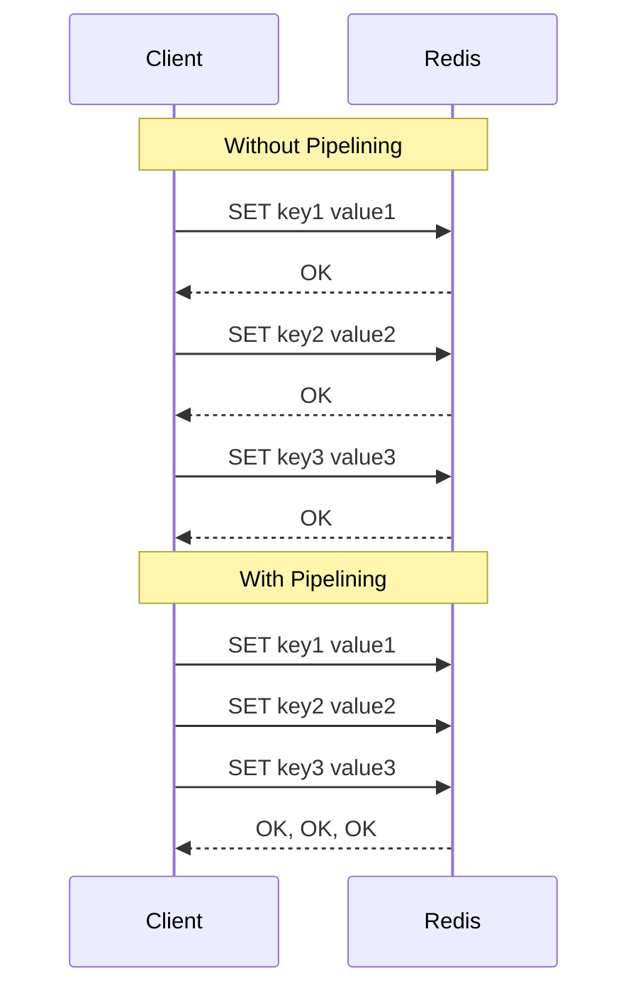

# How to Improve Throughput with Redis Pipelining

Author: [nawazdhandala](https://www.github.com/nawazdhandala)

Tags: Redis, Pipelining, Performance, Throughput, Optimization

Description: Learn how to use Redis pipelining to dramatically improve throughput by batching multiple commands into a single network round trip.

---

Every Redis command involves a network round trip: send command, wait for response. When you need to execute many commands, these round trips add up. Pipelining sends multiple commands at once without waiting for individual responses, reducing latency from milliseconds to microseconds. This guide shows you how to use pipelining effectively.

## Why Pipelining Matters

A typical Redis command takes 0.1ms of actual processing time but 1-2ms of network latency. Executing 1000 commands sequentially takes 1-2 seconds. With pipelining, those same 1000 commands complete in 10-20ms.



## Basic Pipelining in Python

```python
import redis
import time

r = redis.Redis(host='localhost', port=6379, decode_responses=True)

def without_pipeline():
    """
    Execute 1000 SET commands without pipelining.
    Each command waits for a response before sending the next.
    """
    start = time.time()

    for i in range(1000):
        r.set(f"key:{i}", f"value:{i}")

    elapsed = time.time() - start
    return elapsed


def with_pipeline():
    """
    Execute 1000 SET commands with pipelining.
    All commands are sent in batch, responses collected at the end.
    """
    start = time.time()

    # Create a pipeline object
    pipe = r.pipeline()

    for i in range(1000):
        # Commands are queued, not executed immediately
        pipe.set(f"key:{i}", f"value:{i}")

    # Execute all commands and get results
    results = pipe.execute()

    elapsed = time.time() - start
    return elapsed, results


# Compare performance
no_pipe_time = without_pipeline()
pipe_time, _ = with_pipeline()

print(f"Without pipeline: {no_pipe_time:.3f}s")
print(f"With pipeline: {pipe_time:.3f}s")
print(f"Speedup: {no_pipe_time / pipe_time:.1f}x")

# Typical output:
# Without pipeline: 1.234s
# With pipeline: 0.015s
# Speedup: 82.3x
```

## Pipeline with Mixed Commands

```python
def batch_operations():
    """
    Pipeline works with any combination of Redis commands.
    Results are returned in the same order as commands.
    """
    pipe = r.pipeline()

    # Queue different types of commands
    pipe.set('user:1:name', 'Alice')
    pipe.set('user:1:email', 'alice@example.com')
    pipe.incr('user:1:visits')
    pipe.hset('user:1:profile', mapping={'age': 28, 'city': 'Seattle'})
    pipe.sadd('user:1:roles', 'admin', 'editor')
    pipe.get('user:1:name')
    pipe.hgetall('user:1:profile')

    # Execute and unpack results
    results = pipe.execute()

    # Results correspond to commands in order
    set_result_1 = results[0]      # True
    set_result_2 = results[1]      # True
    visit_count = results[2]       # Integer (new count)
    hset_result = results[3]       # Number of fields added
    sadd_result = results[4]       # Number of members added
    name = results[5]              # 'Alice'
    profile = results[6]           # {'age': '28', 'city': 'Seattle'}

    return {
        'name': name,
        'visits': visit_count,
        'profile': profile,
    }
```

## Pipeline as Context Manager

```python
def pipeline_context_manager():
    """
    Use pipeline as a context manager for cleaner code.
    Execute is called automatically when exiting the block.
    """
    with r.pipeline() as pipe:
        pipe.set('counter', 0)
        pipe.incr('counter')
        pipe.incr('counter')
        pipe.incr('counter')
        pipe.get('counter')

        # Results available after execute
        results = pipe.execute()

    # counter is now '3'
    final_value = results[-1]
    return final_value


def pipeline_with_transaction():
    """
    Pipeline with transaction=True (default) wraps commands in MULTI/EXEC.
    This ensures atomicity - all commands succeed or none do.
    """
    with r.pipeline(transaction=True) as pipe:
        pipe.set('balance:checking', 1000)
        pipe.set('balance:savings', 5000)
        pipe.decrby('balance:checking', 200)
        pipe.incrby('balance:savings', 200)
        results = pipe.execute()

    return results


def pipeline_without_transaction():
    """
    Pipeline with transaction=False sends commands in batch but without MULTI/EXEC.
    Slightly faster but not atomic - some commands might fail while others succeed.
    Use this when atomicity isn't required.
    """
    with r.pipeline(transaction=False) as pipe:
        for i in range(1000):
            pipe.set(f"temp:{i}", i)
        results = pipe.execute()

    return len(results)
```

## Handling Errors in Pipelines

```python
def pipeline_error_handling():
    """
    When a command in a pipeline fails, other commands still execute.
    Failed commands return an exception object in the results list.
    """
    pipe = r.pipeline()

    pipe.set('key1', 'value1')           # Will succeed
    pipe.incr('key1')                     # Will fail (value is not a number)
    pipe.set('key2', 'value2')           # Will succeed
    pipe.get('key2')                      # Will succeed

    # By default, execute() raises the first exception
    # Use raise_on_error=False to get all results
    results = pipe.execute(raise_on_error=False)

    processed_results = []
    for i, result in enumerate(results):
        if isinstance(result, Exception):
            print(f"Command {i} failed: {result}")
            processed_results.append(None)
        else:
            processed_results.append(result)

    return processed_results


def pipeline_with_validation():
    """
    Validate results after pipeline execution.
    Useful for checking if specific operations succeeded.
    """
    pipe = r.pipeline()

    # Try to increment user scores
    users = ['user:1', 'user:2', 'user:3']
    for user in users:
        pipe.zincrby('leaderboard', 10, user)

    results = pipe.execute(raise_on_error=False)

    # Check results
    successful = []
    failed = []

    for user, result in zip(users, results):
        if isinstance(result, Exception):
            failed.append((user, str(result)))
        else:
            successful.append((user, result))

    return {'successful': successful, 'failed': failed}
```

## Chunked Pipelines for Large Operations

```python
def chunked_pipeline(items, chunk_size=1000):
    """
    For very large operations, split into chunks to avoid memory issues.
    Very large pipelines can consume significant memory on both client and server.
    """
    results = []

    for i in range(0, len(items), chunk_size):
        chunk = items[i:i + chunk_size]

        with r.pipeline() as pipe:
            for key, value in chunk:
                pipe.set(key, value)
            chunk_results = pipe.execute()

        results.extend(chunk_results)

    return results


def batch_get_with_chunks(keys, chunk_size=1000):
    """
    Fetch many keys in batches to avoid overwhelming Redis.
    """
    all_values = []

    for i in range(0, len(keys), chunk_size):
        chunk = keys[i:i + chunk_size]

        with r.pipeline() as pipe:
            for key in chunk:
                pipe.get(key)
            values = pipe.execute()

        all_values.extend(values)

    return dict(zip(keys, all_values))


# Example: fetch 100,000 keys efficiently
keys = [f"user:{i}:name" for i in range(100000)]
results = batch_get_with_chunks(keys, chunk_size=5000)
```

## Pipelining in Node.js

```javascript
const Redis = require('ioredis');
const redis = new Redis();

async function withoutPipeline() {
  const start = Date.now();

  for (let i = 0; i < 1000; i++) {
    await redis.set(`key:${i}`, `value:${i}`);
  }

  return Date.now() - start;
}

async function withPipeline() {
  const start = Date.now();

  // Create a pipeline
  const pipeline = redis.pipeline();

  for (let i = 0; i < 1000; i++) {
    // Commands are queued, not awaited
    pipeline.set(`key:${i}`, `value:${i}`);
  }

  // Execute all commands
  const results = await pipeline.exec();

  return {
    elapsed: Date.now() - start,
    results: results,
  };
}

async function mixedOperations() {
  const pipeline = redis.pipeline();

  // Queue various commands
  pipeline.set('user:1:name', 'Alice');
  pipeline.hset('user:1:profile', 'age', '28', 'city', 'Seattle');
  pipeline.sadd('user:1:tags', 'developer', 'admin');
  pipeline.get('user:1:name');
  pipeline.hgetall('user:1:profile');
  pipeline.smembers('user:1:tags');

  // Execute and process results
  // Each result is [error, value]
  const results = await pipeline.exec();

  return {
    name: results[3][1],
    profile: results[4][1],
    tags: results[5][1],
  };
}

// Compare performance
(async () => {
  const noPipeTime = await withoutPipeline();
  const { elapsed: pipeTime } = await withPipeline();

  console.log(`Without pipeline: ${noPipeTime}ms`);
  console.log(`With pipeline: ${pipeTime}ms`);
  console.log(`Speedup: ${(noPipeTime / pipeTime).toFixed(1)}x`);
})();
```

## Practical Example: Batch User Loading

```python
class UserCache:
    """
    Cache layer for user data with efficient batch operations.
    """

    def __init__(self, redis_client, ttl=3600):
        self.r = redis_client
        self.ttl = ttl

    def get_users(self, user_ids):
        """
        Fetch multiple users in a single round trip.
        Returns dict of user_id -> user_data, None for missing users.
        """
        if not user_ids:
            return {}

        # Build keys
        keys = [f"user:{uid}" for uid in user_ids]

        # Fetch all with pipeline
        with self.r.pipeline() as pipe:
            for key in keys:
                pipe.hgetall(key)
            results = pipe.execute()

        # Map results back to user IDs
        users = {}
        for uid, data in zip(user_ids, results):
            users[uid] = data if data else None

        return users

    def set_users(self, users_dict):
        """
        Cache multiple users in a single round trip.
        users_dict: {user_id: user_data_dict}
        """
        with self.r.pipeline() as pipe:
            for user_id, data in users_dict.items():
                key = f"user:{user_id}"
                pipe.hset(key, mapping=data)
                pipe.expire(key, self.ttl)
            pipe.execute()

    def delete_users(self, user_ids):
        """Delete multiple user caches in a single round trip."""
        if not user_ids:
            return

        keys = [f"user:{uid}" for uid in user_ids]

        with self.r.pipeline() as pipe:
            for key in keys:
                pipe.delete(key)
            pipe.execute()

    def increment_visit_counts(self, user_ids):
        """Increment visit count for multiple users atomically."""
        with self.r.pipeline() as pipe:
            for uid in user_ids:
                pipe.hincrby(f"user:{uid}", 'visits', 1)
            results = pipe.execute()

        return dict(zip(user_ids, results))


# Usage
cache = UserCache(r)

# Batch fetch
users = cache.get_users(['user1', 'user2', 'user3'])

# Batch update
cache.set_users({
    'user1': {'name': 'Alice', 'email': 'alice@example.com'},
    'user2': {'name': 'Bob', 'email': 'bob@example.com'},
})

# Batch increment
new_counts = cache.increment_visit_counts(['user1', 'user2'])
```

## When Not to Use Pipelining

Pipelining is not suitable for every scenario.

```python
def when_pipeline_helps():
    """
    Use pipelining when:
    - Executing many independent commands
    - Bulk loading data
    - Batch reads/writes
    - Commands don't depend on each other's results
    """
    pass


def when_pipeline_doesnt_help():
    """
    Don't use pipelining when:
    - Commands depend on previous results
    - You need real-time responses
    - Single command operations
    """
    # This CAN'T be pipelined - each command depends on previous result
    value = r.get('counter')
    if int(value or 0) < 100:
        r.incr('counter')

    # Use Lua scripts for dependent operations instead
    lua_script = """
    local value = redis.call('GET', KEYS[1]) or 0
    if tonumber(value) < 100 then
        return redis.call('INCR', KEYS[1])
    end
    return value
    """
    r.eval(lua_script, 1, 'counter')
```

## Summary

| Scenario | Without Pipeline | With Pipeline | Speedup |
|----------|------------------|---------------|---------|
| 100 GETs | ~100ms | ~2ms | 50x |
| 1,000 SETs | ~1,000ms | ~15ms | 67x |
| 10,000 INCRs | ~10,000ms | ~100ms | 100x |

Pipelining is one of the easiest Redis optimizations with the highest impact. Any time you execute multiple commands that don't depend on each other's results, use a pipeline. The speedup is dramatic, especially over high-latency connections.
