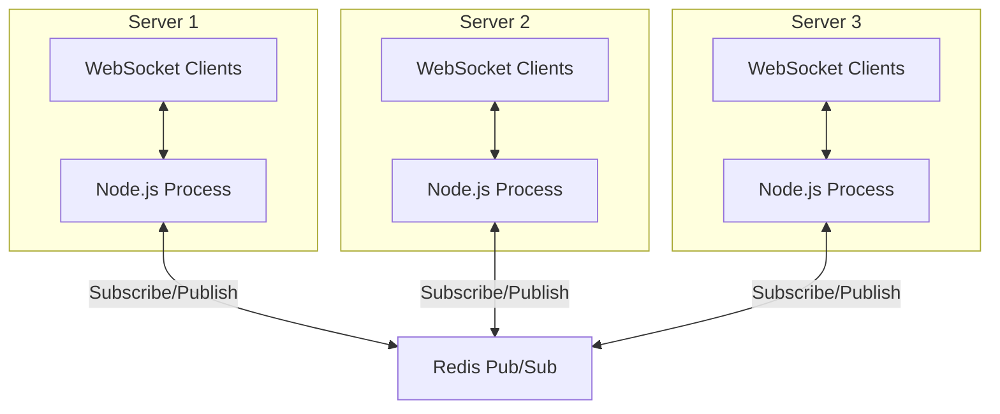

# How to Use Redis Pub/Sub with Node.js

Author: [nawazdhandala](https://www.github.com/nawazdhandala)

Tags: Redis, Node.js, Pub/Sub, Real-time, Messaging, WebSocket

Description: Implement real-time messaging with Redis Pub/Sub in Node.js applications. Learn patterns for chat systems, notifications, and event broadcasting with practical examples.

---

Redis Pub/Sub provides a simple messaging system where publishers send messages to channels and subscribers receive them in real-time. This pattern is perfect for real-time features like chat, notifications, and live updates. This guide shows how to implement Pub/Sub effectively in Node.js.

## Basic Pub/Sub Setup

Redis Pub/Sub requires separate connections for subscribing and publishing because a subscribed connection enters a special mode and cannot execute other commands.

```javascript
const Redis = require('ioredis');

// Create separate connections for pub and sub
// A subscribed connection cannot run other commands
const publisher = new Redis();
const subscriber = new Redis();

// Subscribe to a channel
subscriber.subscribe('notifications', (err, count) => {
    if (err) {
        console.error('Failed to subscribe:', err);
        return;
    }
    console.log(`Subscribed to ${count} channel(s)`);
});

// Handle incoming messages
subscriber.on('message', (channel, message) => {
    console.log(`Received on ${channel}: ${message}`);
});

// Publish messages from the publisher connection
setInterval(() => {
    const notification = JSON.stringify({
        type: 'alert',
        text: 'New notification',
        timestamp: Date.now()
    });

    publisher.publish('notifications', notification);
}, 5000);
```

## Pattern Subscriptions

Use pattern subscriptions to receive messages from multiple channels matching a glob pattern:

```javascript
const Redis = require('ioredis');

const subscriber = new Redis();
const publisher = new Redis();

// Subscribe to all channels matching a pattern
// * matches any characters
subscriber.psubscribe('user:*:events', (err, count) => {
    if (err) {
        console.error('Failed to psubscribe:', err);
        return;
    }
    console.log(`Pattern subscribed to ${count} pattern(s)`);
});

// Handle pattern-matched messages
// Note: use 'pmessage' event, not 'message'
subscriber.on('pmessage', (pattern, channel, message) => {
    console.log(`Pattern: ${pattern}`);
    console.log(`Channel: ${channel}`);
    console.log(`Message: ${message}`);
});

// Publish to different user channels
publisher.publish('user:123:events', JSON.stringify({
    type: 'login',
    userId: 123
}));

publisher.publish('user:456:events', JSON.stringify({
    type: 'purchase',
    userId: 456,
    amount: 99.99
}));
```

## Real-Time Chat System

Here is a complete chat system using Redis Pub/Sub with Express and WebSocket:

```javascript
const express = require('express');
const { createServer } = require('http');
const { WebSocketServer } = require('ws');
const Redis = require('ioredis');

const app = express();
const server = createServer(app);
const wss = new WebSocketServer({ server });

// Redis connections
const publisher = new Redis();
const subscriber = new Redis();

// Store connected clients by room
const rooms = new Map();

// Subscribe to all chat rooms
subscriber.psubscribe('chat:*');

// Route Redis messages to WebSocket clients
subscriber.on('pmessage', (pattern, channel, message) => {
    const roomId = channel.replace('chat:', '');
    const clients = rooms.get(roomId) || new Set();

    // Broadcast to all clients in the room
    for (const client of clients) {
        if (client.readyState === 1) {  // WebSocket.OPEN
            client.send(message);
        }
    }
});

// Handle WebSocket connections
wss.on('connection', (ws, req) => {
    let currentRoom = null;
    let userId = null;

    ws.on('message', async (data) => {
        const message = JSON.parse(data);

        switch (message.type) {
            case 'join':
                // Leave previous room
                if (currentRoom) {
                    const oldClients = rooms.get(currentRoom);
                    if (oldClients) {
                        oldClients.delete(ws);
                    }
                }

                // Join new room
                currentRoom = message.room;
                userId = message.userId;

                if (!rooms.has(currentRoom)) {
                    rooms.set(currentRoom, new Set());
                }
                rooms.get(currentRoom).add(ws);

                // Announce join
                await publisher.publish(`chat:${currentRoom}`, JSON.stringify({
                    type: 'system',
                    text: `${userId} joined the room`,
                    timestamp: Date.now()
                }));
                break;

            case 'message':
                if (!currentRoom) {
                    ws.send(JSON.stringify({ error: 'Not in a room' }));
                    return;
                }

                // Publish message to Redis
                // This broadcasts to all server instances
                await publisher.publish(`chat:${currentRoom}`, JSON.stringify({
                    type: 'message',
                    userId: userId,
                    text: message.text,
                    timestamp: Date.now()
                }));
                break;

            case 'typing':
                if (currentRoom) {
                    await publisher.publish(`chat:${currentRoom}`, JSON.stringify({
                        type: 'typing',
                        userId: userId
                    }));
                }
                break;
        }
    });

    ws.on('close', async () => {
        if (currentRoom) {
            const clients = rooms.get(currentRoom);
            if (clients) {
                clients.delete(ws);
            }

            // Announce leave
            await publisher.publish(`chat:${currentRoom}`, JSON.stringify({
                type: 'system',
                text: `${userId} left the room`,
                timestamp: Date.now()
            }));
        }
    });
});

server.listen(3000, () => {
    console.log('Chat server running on port 3000');
});
```

## Scaling Across Multiple Servers

The main benefit of Redis Pub/Sub is enabling real-time communication across multiple server instances:



```javascript
const cluster = require('cluster');
const numCPUs = require('os').cpus().length;

if (cluster.isMaster) {
    // Fork workers
    for (let i = 0; i < numCPUs; i++) {
        cluster.fork();
    }
} else {
    // Each worker runs the chat server
    // Redis Pub/Sub connects them all
    const Redis = require('ioredis');
    const express = require('express');

    const app = express();
    const publisher = new Redis();
    const subscriber = new Redis();

    subscriber.subscribe('global:notifications');

    subscriber.on('message', (channel, message) => {
        // All workers receive this message
        console.log(`Worker ${process.pid} received: ${message}`);
    });

    // Publishing from any worker reaches all workers
    app.post('/notify', express.json(), (req, res) => {
        publisher.publish('global:notifications', JSON.stringify(req.body));
        res.json({ success: true });
    });

    app.listen(3000);
}
```

## Notification System

Build a user notification system with Pub/Sub:

```javascript
const Redis = require('ioredis');

const publisher = new Redis();
const subscriber = new Redis();

class NotificationService {
    constructor() {
        this.handlers = new Map();

        // Subscribe to user notification channels dynamically
        subscriber.on('pmessage', (pattern, channel, message) => {
            const userId = channel.replace('notifications:', '');
            const handler = this.handlers.get(userId);

            if (handler) {
                handler(JSON.parse(message));
            }
        });

        subscriber.psubscribe('notifications:*');
    }

    // Register a handler for a user's notifications
    registerUser(userId, callback) {
        this.handlers.set(userId, callback);
    }

    // Unregister when user disconnects
    unregisterUser(userId) {
        this.handlers.delete(userId);
    }

    // Send notification to a specific user
    async notify(userId, notification) {
        const message = JSON.stringify({
            ...notification,
            id: `notif_${Date.now()}_${Math.random().toString(36).substr(2, 9)}`,
            timestamp: Date.now(),
            read: false
        });

        // Publish for real-time delivery
        await publisher.publish(`notifications:${userId}`, message);

        // Also store in list for persistence
        await publisher.lpush(`user:${userId}:notifications`, message);
        await publisher.ltrim(`user:${userId}:notifications`, 0, 99);
    }

    // Broadcast to multiple users
    async broadcast(userIds, notification) {
        const promises = userIds.map(userId => this.notify(userId, notification));
        await Promise.all(promises);
    }

    // Get unread notifications
    async getUnread(userId, limit = 20) {
        const notifications = await publisher.lrange(
            `user:${userId}:notifications`,
            0,
            limit - 1
        );

        return notifications
            .map(n => JSON.parse(n))
            .filter(n => !n.read);
    }
}

// Usage
const notificationService = new NotificationService();

// When user connects via WebSocket
notificationService.registerUser('user123', (notification) => {
    console.log('Real-time notification:', notification);
    // Send to user's WebSocket connection
});

// Send notifications from anywhere in your app
notificationService.notify('user123', {
    type: 'mention',
    title: 'You were mentioned',
    body: '@alice mentioned you in a comment',
    link: '/posts/456#comment-789'
});
```

## Error Handling and Reconnection

Handle connection failures gracefully:

```javascript
const Redis = require('ioredis');

function createResilientSubscriber() {
    const subscriber = new Redis({
        retryStrategy(times) {
            // Reconnect after delay
            const delay = Math.min(times * 50, 2000);
            console.log(`Reconnecting in ${delay}ms...`);
            return delay;
        },
        maxRetriesPerRequest: null  // Keep retrying
    });

    // Track subscribed channels
    const channels = new Set();
    const patterns = new Set();

    subscriber.on('connect', () => {
        console.log('Connected to Redis');
    });

    subscriber.on('ready', () => {
        // Resubscribe after reconnection
        if (channels.size > 0) {
            subscriber.subscribe(...channels);
        }
        if (patterns.size > 0) {
            subscriber.psubscribe(...patterns);
        }
    });

    subscriber.on('error', (err) => {
        console.error('Redis error:', err);
    });

    subscriber.on('close', () => {
        console.log('Connection closed');
    });

    // Wrap subscribe to track channels
    const originalSubscribe = subscriber.subscribe.bind(subscriber);
    subscriber.subscribe = (...args) => {
        args.forEach(ch => channels.add(ch));
        return originalSubscribe(...args);
    };

    const originalPsubscribe = subscriber.psubscribe.bind(subscriber);
    subscriber.psubscribe = (...args) => {
        args.forEach(p => patterns.add(p));
        return originalPsubscribe(...args);
    };

    return subscriber;
}

const subscriber = createResilientSubscriber();
```

## Performance Considerations

```javascript
const Redis = require('ioredis');

// 1. Use connection pooling for publishers
const publisher = new Redis.Cluster([
    { host: 'redis-1', port: 6379 },
    { host: 'redis-2', port: 6379 },
]);

// 2. Batch messages when possible
class BatchPublisher {
    constructor(channel, flushInterval = 100) {
        this.channel = channel;
        this.buffer = [];
        this.publisher = new Redis();

        // Flush periodically
        setInterval(() => this.flush(), flushInterval);
    }

    add(message) {
        this.buffer.push(message);
    }

    async flush() {
        if (this.buffer.length === 0) return;

        const messages = this.buffer;
        this.buffer = [];

        // Send as single batched message
        await this.publisher.publish(
            this.channel,
            JSON.stringify(messages)
        );
    }
}

// 3. Limit message size
function publishWithSizeLimit(channel, data, maxSize = 1024 * 1024) {
    const message = JSON.stringify(data);

    if (message.length > maxSize) {
        // Store large payloads separately
        const key = `message:${Date.now()}`;
        publisher.setex(key, 60, message);
        return publisher.publish(channel, JSON.stringify({ ref: key }));
    }

    return publisher.publish(channel, message);
}
```

## Summary

| Aspect | Recommendation |
|--------|----------------|
| Connections | Separate publisher and subscriber |
| Patterns | Use psubscribe for dynamic channels |
| Scaling | Redis Pub/Sub works across server instances |
| Persistence | Store messages separately if needed |
| Errors | Implement reconnection logic |
| Message size | Keep messages small, reference large data |

Redis Pub/Sub is ideal for:
- Real-time chat and messaging
- Live notifications
- Broadcasting events across servers
- Presence detection
- Live dashboards

Remember that Pub/Sub is fire-and-forget. If you need guaranteed delivery or message persistence, consider Redis Streams instead.
