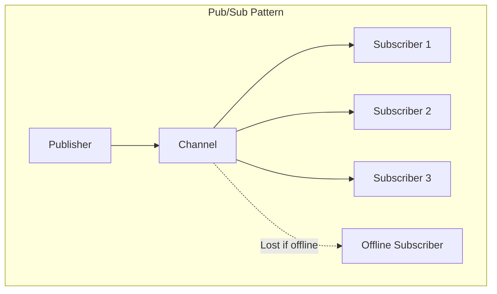
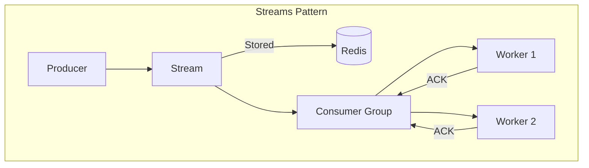
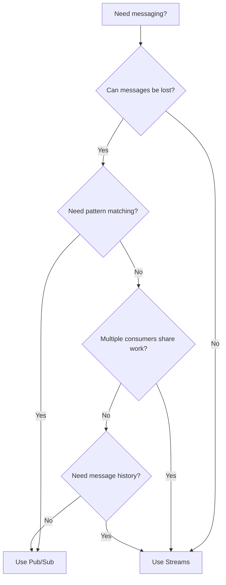

# How to Choose Between Pub/Sub and Streams in Redis

Author: [nawazdhandala](https://www.github.com/nawazdhandala)

Tags: Redis, Pub/Sub, Streams, Messaging, Architecture, Real-time

Description: Compare Redis Pub/Sub and Streams to choose the right messaging pattern. Learn when to use each, their tradeoffs, and how to implement both for different use cases.

---

Redis offers two messaging patterns: Pub/Sub for fire-and-forget broadcasting and Streams for persistent, acknowledgeable message processing. Choosing the wrong one can lead to lost messages or unnecessary complexity. This guide compares both approaches and helps you decide which to use.

## Quick Comparison

| Feature | Pub/Sub | Streams |
|---------|---------|---------|
| Message persistence | No | Yes |
| Consumer groups | No | Yes |
| Message acknowledgment | No | Yes |
| Historical replay | No | Yes |
| At-most-once delivery | Yes | No (at-least-once) |
| Blocking reads | Yes | Yes |
| Pattern subscriptions | Yes | No |
| Memory usage | Low | Higher |
| Complexity | Low | Medium |

## When to Use Pub/Sub

Use Pub/Sub when:
- Messages are ephemeral and losing some is acceptable
- You need real-time broadcasting to many subscribers
- Subscribers are always online
- You want simple fire-and-forget messaging

```python
import redis
import threading
import time

# Pub/Sub example: Real-time notifications

publisher = redis.Redis(host='localhost', port=6379, db=0)
subscriber = redis.Redis(host='localhost', port=6379, db=0)

def notification_listener():
    """Listen for real-time notifications"""
    pubsub = subscriber.pubsub()
    pubsub.subscribe('notifications')

    print("Listening for notifications...")
    for message in pubsub.listen():
        if message['type'] == 'message':
            print(f"Notification: {message['data'].decode()}")

# Start listener in background
listener_thread = threading.Thread(target=notification_listener, daemon=True)
listener_thread.start()

time.sleep(0.1)  # Let subscriber connect

# Publish notifications
# These are delivered to all connected subscribers
# If no one is listening, messages are lost
publisher.publish('notifications', 'User John logged in')
publisher.publish('notifications', 'New order received')
publisher.publish('notifications', 'Server CPU at 90%')

time.sleep(1)
```

## When to Use Streams

Use Streams when:
- Messages must not be lost
- You need consumer groups for load distribution
- Failed processing should be retried
- You need to replay historical messages
- Multiple independent consumers process the same stream

```python
import redis
import time

r = redis.Redis(host='localhost', port=6379, db=0)

# Streams example: Order processing queue

def add_order(order_data):
    """Add order to processing stream"""
    entry_id = r.xadd('orders:stream', order_data)
    print(f"Added order {entry_id}")
    return entry_id

def process_orders(consumer_name, group_name='order_processors'):
    """Process orders with acknowledgment"""
    # Create consumer group if not exists
    try:
        r.xgroup_create('orders:stream', group_name, id='0', mkstream=True)
    except redis.ResponseError as e:
        if 'BUSYGROUP' not in str(e):
            raise

    while True:
        # Read new messages for this consumer
        messages = r.xreadgroup(
            group_name,
            consumer_name,
            {'orders:stream': '>'},  # '>' means only new messages
            count=10,
            block=5000  # Block for 5 seconds if no messages
        )

        if not messages:
            continue

        for stream_name, entries in messages:
            for entry_id, data in entries:
                try:
                    print(f"{consumer_name} processing order {entry_id}: {data}")

                    # Process the order
                    process_single_order(data)

                    # Acknowledge successful processing
                    r.xack('orders:stream', group_name, entry_id)
                    print(f"Acknowledged {entry_id}")

                except Exception as e:
                    print(f"Failed to process {entry_id}: {e}")
                    # Message will be redelivered to another consumer

def process_single_order(data):
    """Simulate order processing"""
    time.sleep(0.1)

# Add some orders
add_order({'product': 'widget', 'quantity': '5', 'customer': 'alice'})
add_order({'product': 'gadget', 'quantity': '2', 'customer': 'bob'})

# Process with acknowledgment
# Run in separate threads/processes for real parallelism
process_orders('worker_1')
```

## Architecture Comparison





## Hybrid Approach

Sometimes you need both: immediate notification via Pub/Sub and reliable processing via Streams:

```python
import redis
import json
import threading

r = redis.Redis(host='localhost', port=6379, db=0)

class EventBus:
    """
    Hybrid messaging: Pub/Sub for real-time + Streams for durability
    """

    def __init__(self):
        self.pubsub = r.pubsub()

    def publish(self, event_type, data, durable=True):
        """
        Publish event to both Pub/Sub and Stream
        """
        message = json.dumps({
            'type': event_type,
            'data': data,
            'timestamp': time.time()
        })

        # Real-time notification via Pub/Sub
        r.publish(f'events:{event_type}', message)

        # Persistent storage via Streams
        if durable:
            r.xadd(
                f'stream:{event_type}',
                {'message': message},
                maxlen=10000  # Keep last 10k messages
            )

    def subscribe_realtime(self, event_type, callback):
        """Subscribe to real-time events (fire and forget)"""
        def listener():
            pubsub = r.pubsub()
            pubsub.subscribe(f'events:{event_type}')

            for message in pubsub.listen():
                if message['type'] == 'message':
                    data = json.loads(message['data'])
                    callback(data)

        thread = threading.Thread(target=listener, daemon=True)
        thread.start()
        return thread

    def process_stream(self, event_type, group_name, consumer_name, callback):
        """Process events from stream with acknowledgment"""
        stream_key = f'stream:{event_type}'

        try:
            r.xgroup_create(stream_key, group_name, id='0', mkstream=True)
        except redis.ResponseError:
            pass

        while True:
            messages = r.xreadgroup(
                group_name,
                consumer_name,
                {stream_key: '>'},
                count=10,
                block=5000
            )

            if not messages:
                continue

            for stream_name, entries in messages:
                for entry_id, data in entries:
                    try:
                        event = json.loads(data[b'message'])
                        callback(event)
                        r.xack(stream_key, group_name, entry_id)
                    except Exception as e:
                        print(f"Error processing {entry_id}: {e}")

# Usage
bus = EventBus()

# Real-time dashboard updates (ok to miss some)
def update_dashboard(event):
    print(f"Dashboard update: {event['type']}")

bus.subscribe_realtime('order', update_dashboard)

# Reliable order processing (must not miss any)
def process_order(event):
    print(f"Processing order: {event['data']}")

# Run in separate process
# bus.process_stream('order', 'processors', 'worker_1', process_order)

# Publish events
bus.publish('order', {'id': 1, 'amount': 99.99})
```

## Performance Characteristics

```python
import redis
import time

r = redis.Redis(host='localhost', port=6379, db=0)

def benchmark_pubsub(count=10000):
    """Measure Pub/Sub throughput"""
    received = []

    def listener():
        pubsub = r.pubsub()
        pubsub.subscribe('benchmark')
        for msg in pubsub.listen():
            if msg['type'] == 'message':
                received.append(msg)
                if len(received) >= count:
                    break

    import threading
    t = threading.Thread(target=listener)
    t.start()
    time.sleep(0.1)

    start = time.time()
    for i in range(count):
        r.publish('benchmark', f'message_{i}')

    t.join(timeout=10)
    duration = time.time() - start

    return count / duration

def benchmark_streams(count=10000):
    """Measure Streams throughput"""
    r.delete('benchmark:stream')

    start = time.time()
    pipe = r.pipeline()
    for i in range(count):
        pipe.xadd('benchmark:stream', {'data': f'message_{i}'})
        if i % 1000 == 0:
            pipe.execute()
            pipe = r.pipeline()
    pipe.execute()

    write_duration = time.time() - start

    # Read benchmark
    start = time.time()
    r.xrange('benchmark:stream', count=count)
    read_duration = time.time() - start

    return count / write_duration, count / read_duration

print("Benchmarks:")
print(f"Pub/Sub: {benchmark_pubsub():,.0f} messages/sec")
write_rate, read_rate = benchmark_streams()
print(f"Streams write: {write_rate:,.0f} messages/sec")
print(f"Streams read: {read_rate:,.0f} messages/sec")
```

## Consumer Group Features

Streams consumer groups provide features not available in Pub/Sub:

```python
import redis

r = redis.Redis(host='localhost', port=6379, db=0)

# Setup stream with data
r.delete('mystream')
for i in range(100):
    r.xadd('mystream', {'data': f'message_{i}'})

# Create consumer group
try:
    r.xgroup_create('mystream', 'mygroup', id='0')
except redis.ResponseError:
    pass

# 1. Pending messages (messages read but not acknowledged)
pending = r.xpending('mystream', 'mygroup')
print(f"Pending messages: {pending}")

# 2. Claim stuck messages from failed consumers
# If a consumer dies, another can take over its messages
claimed = r.xclaim(
    'mystream',
    'mygroup',
    'new_consumer',
    min_idle_time=60000,  # Claim messages idle for 60s
    message_ids=['1234567890-0']  # Would be actual message IDs
)

# 3. Read message history
# Unlike Pub/Sub, can read old messages
history = r.xrange('mystream', '-', '+', count=10)
print(f"Historical messages: {len(history)}")

# 4. Stream info
info = r.xinfo_stream('mystream')
print(f"Stream length: {info['length']}")
print(f"First entry: {info['first-entry']}")
print(f"Last entry: {info['last-entry']}")

# 5. Consumer group info
groups = r.xinfo_groups('mystream')
for group in groups:
    print(f"Group {group['name']}: {group['consumers']} consumers, {group['pending']} pending")
```

## Decision Flowchart



## Summary

**Use Pub/Sub for:**
- Real-time notifications and broadcasts
- Chat messages between online users
- Live dashboard updates
- Events where missing some is acceptable

**Use Streams for:**
- Task queues and job processing
- Event sourcing and audit logs
- Reliable message delivery
- Multiple workers processing same queue
- Replaying historical events

**Use Both for:**
- Systems needing immediate notification AND guaranteed processing
- Real-time UI updates with background reliable processing
