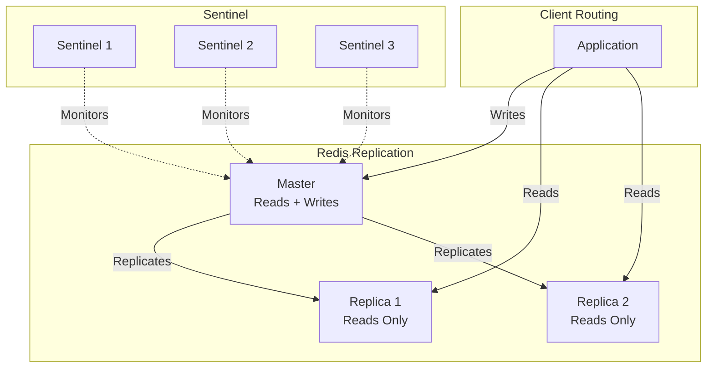

# How to Fix "READONLY You can't write against a read only replica"

Author: [nawazdhandala](https://www.github.com/nawazdhandala)

Tags: Redis, Replication, Troubleshooting, High Availability, DevOps

Description: Resolve the READONLY replica error by understanding Redis replication topology, properly routing writes to masters, and configuring client failover.

---

The "READONLY You can't write against a read only replica" error occurs when your application tries to write to a Redis replica instead of the master. This is a protective feature - replicas are read-only by default to maintain data consistency. This guide explains how to diagnose and fix this issue.

## Understanding the Error

```python
# Error appears as:
# redis.exceptions.ReadOnlyError: READONLY You can't write against a read only replica.
# redis.exceptions.ResponseError: READONLY You can't write against a read only replica.

import redis
from redis.exceptions import ReadOnlyError

r = redis.Redis(host='replica-host', port=6379)

try:
    r.set('key', 'value')
except ReadOnlyError as e:
    print(f"Cannot write: {e}")
    # This is a replica, writes go to master only
```

## Diagnosing the Issue

```python
import redis

def check_node_role(host, port):
    """Check if Redis node is master or replica"""
    r = redis.Redis(host=host, port=port)

    info = r.info('replication')
    role = info['role']

    print(f"{host}:{port} - Role: {role}")

    if role == 'slave':
        print(f"  Master: {info['master_host']}:{info['master_port']}")
        print(f"  Link status: {info['master_link_status']}")
        print(f"  Read-only: {info.get('slave_read_only', 'yes')}")
    elif role == 'master':
        print(f"  Connected replicas: {info['connected_slaves']}")

    return info

# Check your nodes
check_node_role('redis-1', 6379)
check_node_role('redis-2', 6379)
```

```bash
# CLI check
redis-cli -h redis-host INFO replication

# Key fields:
# role:master or role:slave
# master_host, master_port (for replicas)
# connected_slaves (for master)
```

## Common Causes

### 1. Connecting to Wrong Host

```python
import redis
import os

# Wrong: Hardcoded replica address
# r = redis.Redis(host='redis-replica', port=6379)

# Right: Connect to master
r = redis.Redis(host='redis-master', port=6379)

# Better: Use environment variables
REDIS_HOST = os.getenv('REDIS_HOST', 'redis-master')
r = redis.Redis(host=REDIS_HOST, port=6379)
```

### 2. Failover Occurred

After a failover, the old master becomes a replica:

```python
import redis
from redis.exceptions import ReadOnlyError
import time

class FailoverAwareClient:
    """Client that handles master/replica topology changes"""

    def __init__(self, hosts):
        self.hosts = hosts  # List of (host, port) tuples
        self._master = None
        self._find_master()

    def _find_master(self):
        """Find current master among known hosts"""
        for host, port in self.hosts:
            try:
                r = redis.Redis(host=host, port=port, socket_timeout=2)
                info = r.info('replication')
                if info['role'] == 'master':
                    self._master = r
                    print(f"Found master at {host}:{port}")
                    return
            except Exception as e:
                print(f"Cannot connect to {host}:{port}: {e}")

        raise Exception("No master found")

    def execute(self, method, *args, **kwargs):
        """Execute command with automatic failover detection"""
        try:
            func = getattr(self._master, method)
            return func(*args, **kwargs)
        except ReadOnlyError:
            print("Master is now read-only, finding new master...")
            self._find_master()
            func = getattr(self._master, method)
            return func(*args, **kwargs)

# Usage
client = FailoverAwareClient([
    ('redis-1', 6379),
    ('redis-2', 6379),
    ('redis-3', 6379),
])

client.execute('set', 'key', 'value')
```

### 3. Redis Sentinel Not Configured

Use Sentinel for automatic master discovery:

```python
from redis.sentinel import Sentinel

# Connect to Sentinel
sentinel = Sentinel([
    ('sentinel-1', 26379),
    ('sentinel-2', 26379),
    ('sentinel-3', 26379),
], socket_timeout=0.5)

# Get master connection (automatically updated on failover)
master = sentinel.master_for('mymaster', socket_timeout=0.5)

# Get replica connection for reads
replica = sentinel.slave_for('mymaster', socket_timeout=0.5)

# Writes go to master
master.set('key', 'value')

# Reads can go to replica
value = replica.get('key')

# Master connection automatically reconnects to new master after failover
```

## Redis Sentinel Setup

```bash
# sentinel.conf
sentinel monitor mymaster redis-master 6379 2
sentinel down-after-milliseconds mymaster 5000
sentinel failover-timeout mymaster 60000
sentinel parallel-syncs mymaster 1

# Start sentinel
redis-sentinel /path/to/sentinel.conf
```

```python
from redis.sentinel import Sentinel

class SentinelRedisClient:
    """Redis client using Sentinel for automatic failover"""

    def __init__(self, sentinels, master_name='mymaster'):
        self.sentinel = Sentinel(sentinels, socket_timeout=0.5)
        self.master_name = master_name

    @property
    def master(self):
        """Get current master connection"""
        return self.sentinel.master_for(
            self.master_name,
            socket_timeout=0.5,
            retry_on_timeout=True
        )

    @property
    def replica(self):
        """Get replica connection for reads"""
        return self.sentinel.slave_for(
            self.master_name,
            socket_timeout=0.5
        )

    def get(self, key):
        """Read from replica"""
        return self.replica.get(key)

    def set(self, key, value, **kwargs):
        """Write to master"""
        return self.master.set(key, value, **kwargs)

    def get_master_info(self):
        """Get current master address"""
        return self.sentinel.discover_master(self.master_name)

# Usage
client = SentinelRedisClient([
    ('sentinel-1', 26379),
    ('sentinel-2', 26379),
    ('sentinel-3', 26379),
])

client.set('key', 'value')  # Goes to master
value = client.get('key')   # Goes to replica
print(f"Current master: {client.get_master_info()}")
```

## Temporary Write to Replica (Not Recommended)

In rare cases, you might need to temporarily allow writes to a replica:

```bash
# Allow writes on replica (DANGEROUS - can cause data inconsistency)
redis-cli CONFIG SET replica-read-only no

# Revert to safe mode
redis-cli CONFIG SET replica-read-only yes
```

This is almost never the right solution. Use it only for:
- Emergency data recovery
- Promoting a replica manually

## Read/Write Splitting

Properly split reads and writes for better performance:

```python
import redis
from redis.sentinel import Sentinel

class ReadWriteRedisClient:
    """Client that routes reads to replicas, writes to master"""

    def __init__(self, sentinels, master_name):
        self.sentinel = Sentinel(sentinels)
        self.master_name = master_name

    def _get_master(self):
        return self.sentinel.master_for(self.master_name)

    def _get_replica(self):
        try:
            return self.sentinel.slave_for(self.master_name)
        except Exception:
            # Fall back to master if no replica available
            return self._get_master()

    # Write operations go to master
    def set(self, *args, **kwargs):
        return self._get_master().set(*args, **kwargs)

    def delete(self, *args, **kwargs):
        return self._get_master().delete(*args, **kwargs)

    def incr(self, *args, **kwargs):
        return self._get_master().incr(*args, **kwargs)

    # Read operations go to replica
    def get(self, *args, **kwargs):
        return self._get_replica().get(*args, **kwargs)

    def mget(self, *args, **kwargs):
        return self._get_replica().mget(*args, **kwargs)

    def keys(self, *args, **kwargs):
        return self._get_replica().keys(*args, **kwargs)
```

## Cluster Mode Considerations

In Redis Cluster, each shard has its own master and replicas:

```python
from redis.cluster import RedisCluster

rc = RedisCluster(
    host='redis-cluster-node',
    port=6379,
    read_from_replicas=True  # Enable reading from replicas
)

# Writes automatically go to the correct master
rc.set('key', 'value')

# Reads can go to replicas
value = rc.get('key')
```

## Replication Topology Diagram



## Summary

| Cause | Solution |
|-------|----------|
| Wrong host | Connect to master |
| Failover occurred | Use Sentinel for auto-discovery |
| No failover handling | Implement master detection logic |
| Cluster mode | Use cluster-aware client |

Best practices:
- Always use Sentinel or Cluster for production
- Implement proper read/write splitting
- Handle ReadOnlyError gracefully
- Monitor replication lag
- Test failover scenarios regularly
