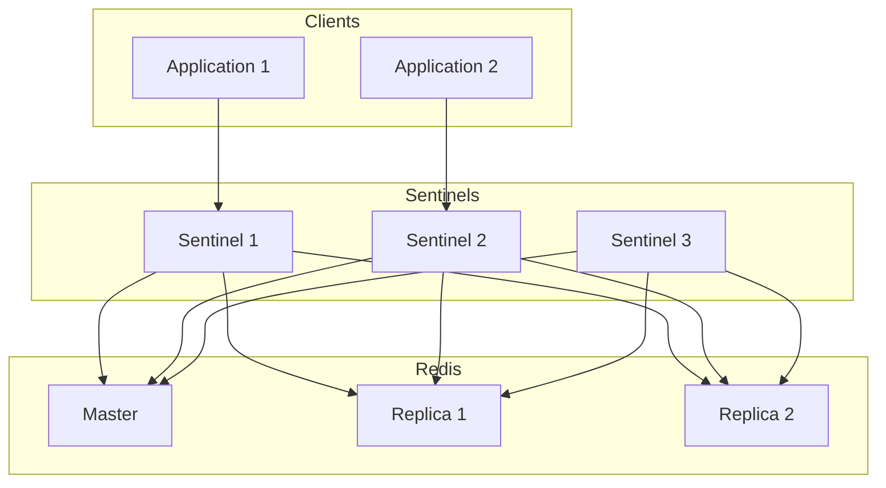

# How to Use Redis Sentinel for Failover

Author: [nawazdhandala](https://www.github.com/nawazdhandala)

Tags: Redis, Sentinel, High Availability, Failover, DevOps

Description: Learn how to set up Redis Sentinel for automatic failover, configure monitoring, implement client-side failover handling, and maintain high availability in production.

---

Redis Sentinel provides high availability for Redis by monitoring your master and replica instances, automatically promoting a replica when the master fails. Without Sentinel, a master failure requires manual intervention to restore service. Let us explore how to set up and use Sentinel effectively.

## Sentinel Architecture

A typical Sentinel deployment includes:



## Basic Setup

### Configure the Master

```bash
# redis-master.conf
bind 0.0.0.0
port 6379
requirepass your-secure-password
masterauth your-secure-password
```

### Configure Replicas

```bash
# redis-replica.conf
bind 0.0.0.0
port 6379
replicaof master-host 6379
requirepass your-secure-password
masterauth your-secure-password
```

### Configure Sentinel

Create sentinel.conf for each Sentinel instance:

```bash
# sentinel.conf
port 26379
bind 0.0.0.0

# Monitor the master with a quorum of 2
sentinel monitor mymaster 192.168.1.10 6379 2

# Authentication
sentinel auth-pass mymaster your-secure-password

# After 5 seconds of no response, consider master down
sentinel down-after-milliseconds mymaster 5000

# Timeout for failover
sentinel failover-timeout mymaster 60000

# How many replicas can sync simultaneously during failover
sentinel parallel-syncs mymaster 1

# Sentinel password (Redis 6.2+)
requirepass sentinel-password
```

### Start Services

```bash
# Start Redis master
redis-server /etc/redis/redis-master.conf

# Start Redis replicas
redis-server /etc/redis/redis-replica.conf

# Start Sentinels (at least 3 for quorum)
redis-sentinel /etc/redis/sentinel.conf
```

## Docker Compose Setup

```yaml
version: '3.8'

services:
  redis-master:
    image: redis:7-alpine
    command: redis-server --requirepass ${REDIS_PASSWORD} --masterauth ${REDIS_PASSWORD}
    ports:
      - "6379:6379"
    networks:
      - redis-net

  redis-replica-1:
    image: redis:7-alpine
    command: redis-server --replicaof redis-master 6379 --requirepass ${REDIS_PASSWORD} --masterauth ${REDIS_PASSWORD}
    depends_on:
      - redis-master
    networks:
      - redis-net

  redis-replica-2:
    image: redis:7-alpine
    command: redis-server --replicaof redis-master 6379 --requirepass ${REDIS_PASSWORD} --masterauth ${REDIS_PASSWORD}
    depends_on:
      - redis-master
    networks:
      - redis-net

  sentinel-1:
    image: redis:7-alpine
    command: redis-sentinel /etc/redis/sentinel.conf
    volumes:
      - ./sentinel.conf:/etc/redis/sentinel.conf
    depends_on:
      - redis-master
      - redis-replica-1
      - redis-replica-2
    ports:
      - "26379:26379"
    networks:
      - redis-net

  sentinel-2:
    image: redis:7-alpine
    command: redis-sentinel /etc/redis/sentinel.conf
    volumes:
      - ./sentinel.conf:/etc/redis/sentinel.conf
    depends_on:
      - redis-master
    ports:
      - "26380:26379"
    networks:
      - redis-net

  sentinel-3:
    image: redis:7-alpine
    command: redis-sentinel /etc/redis/sentinel.conf
    volumes:
      - ./sentinel.conf:/etc/redis/sentinel.conf
    depends_on:
      - redis-master
    ports:
      - "26381:26379"
    networks:
      - redis-net

networks:
  redis-net:
    driver: bridge
```

## Client Configuration

### Python (redis-py)

```python
from redis.sentinel import Sentinel
import redis

# Connect to Sentinels
sentinel = Sentinel([
    ('sentinel-1', 26379),
    ('sentinel-2', 26379),
    ('sentinel-3', 26379)
], socket_timeout=0.5, password='sentinel-password')

# Get connection to master for writes
master = sentinel.master_for(
    'mymaster',
    socket_timeout=0.5,
    password='your-secure-password'
)

# Get connection to replica for reads
replica = sentinel.slave_for(
    'mymaster',
    socket_timeout=0.5,
    password='your-secure-password'
)

# Use like normal Redis clients
master.set('key', 'value')
value = replica.get('key')

# During failover, master_for() automatically follows the new master
```

### Node.js (ioredis)

```javascript
const Redis = require('ioredis');

const redis = new Redis({
  sentinels: [
    { host: 'sentinel-1', port: 26379 },
    { host: 'sentinel-2', port: 26379 },
    { host: 'sentinel-3', port: 26379 }
  ],
  name: 'mymaster',
  password: 'your-secure-password',
  sentinelPassword: 'sentinel-password',
  role: 'master'  // or 'slave' for read replicas
});

redis.on('error', (err) => {
  console.error('Redis error:', err);
});

redis.on('+failover-end', () => {
  console.log('Failover completed');
});

// Usage
await redis.set('key', 'value');
const value = await redis.get('key');
```

### Java (Jedis)

```java
import redis.clients.jedis.JedisSentinelPool;
import redis.clients.jedis.Jedis;
import java.util.HashSet;
import java.util.Set;

Set<String> sentinels = new HashSet<>();
sentinels.add("sentinel-1:26379");
sentinels.add("sentinel-2:26379");
sentinels.add("sentinel-3:26379");

JedisSentinelPool pool = new JedisSentinelPool(
    "mymaster",
    sentinels,
    "your-secure-password"
);

try (Jedis jedis = pool.getResource()) {
    jedis.set("key", "value");
    String value = jedis.get("key");
}
```

## Monitoring Sentinel

### Check Sentinel Status

```bash
# Connect to a Sentinel
redis-cli -p 26379 -a sentinel-password

# Get master info
SENTINEL MASTER mymaster

# Get replicas info
SENTINEL REPLICAS mymaster

# Get Sentinels info
SENTINEL SENTINELS mymaster

# Get current master address
SENTINEL GET-MASTER-ADDR-BY-NAME mymaster

# Check if master is down
SENTINEL IS-MASTER-DOWN-BY-ADDR 192.168.1.10 6379 0 *
```

### Monitoring Script

```python
from redis.sentinel import Sentinel
import time

def monitor_sentinel_cluster():
    """Monitor Sentinel cluster health."""
    sentinel = Sentinel([
        ('sentinel-1', 26379),
        ('sentinel-2', 26379),
        ('sentinel-3', 26379)
    ], password='sentinel-password')

    while True:
        try:
            # Get master info
            master = sentinel.discover_master('mymaster')
            print(f"Current master: {master[0]}:{master[1]}")

            # Get replica info
            replicas = sentinel.discover_slaves('mymaster')
            print(f"Replicas: {len(replicas)}")
            for replica in replicas:
                print(f"  - {replica[0]}:{replica[1]}")

            # Check master health
            master_conn = sentinel.master_for('mymaster')
            info = master_conn.info('replication')
            print(f"Connected replicas: {info['connected_slaves']}")

        except Exception as e:
            print(f"Error: {e}")

        time.sleep(10)

monitor_sentinel_cluster()
```

## Handling Failover in Applications

### Failover Events

```python
import redis

def failover_aware_client():
    """Redis client that handles failover gracefully."""
    sentinel = Sentinel([
        ('sentinel-1', 26379),
        ('sentinel-2', 26379),
        ('sentinel-3', 26379)
    ])

    def get_master():
        return sentinel.master_for('mymaster')

    def execute_with_failover(func, *args, max_retries=3, **kwargs):
        """Execute command with failover handling."""
        last_error = None

        for attempt in range(max_retries):
            try:
                master = get_master()
                return func(master, *args, **kwargs)
            except redis.ConnectionError as e:
                last_error = e
                print(f"Connection error, retry {attempt + 1}/{max_retries}")
                time.sleep(1)
            except redis.ReadOnlyError:
                # Master became a replica (failover in progress)
                print("Master is now read-only, waiting for failover...")
                time.sleep(2)

        raise last_error

    # Usage
    def do_set(client, key, value):
        return client.set(key, value)

    def do_get(client, key):
        return client.get(key)

    execute_with_failover(do_set, 'mykey', 'myvalue')
    value = execute_with_failover(do_get, 'mykey')
    return value
```

### Read/Write Splitting

```python
class ReadWriteRedis:
    """Redis client with read/write splitting."""

    def __init__(self, sentinel_hosts, master_name, password=None):
        self.sentinel = Sentinel(sentinel_hosts)
        self.master_name = master_name
        self.password = password

    def _get_master(self):
        return self.sentinel.master_for(
            self.master_name,
            password=self.password
        )

    def _get_replica(self):
        return self.sentinel.slave_for(
            self.master_name,
            password=self.password
        )

    def write(self, key, value, **kwargs):
        """Write to master."""
        master = self._get_master()
        return master.set(key, value, **kwargs)

    def read(self, key, prefer_replica=True):
        """Read from replica (or master if prefer_replica=False)."""
        if prefer_replica:
            try:
                replica = self._get_replica()
                return replica.get(key)
            except redis.ConnectionError:
                # Fall back to master if no replica available
                pass

        master = self._get_master()
        return master.get(key)

# Usage
rw_redis = ReadWriteRedis(
    sentinel_hosts=[('sentinel-1', 26379), ('sentinel-2', 26379)],
    master_name='mymaster',
    password='your-password'
)

rw_redis.write('user:123', 'data')
data = rw_redis.read('user:123')  # Reads from replica
```

## Manual Failover

Sometimes you need to trigger failover manually (for maintenance):

```bash
# Force failover (use with caution)
redis-cli -p 26379 -a sentinel-password SENTINEL FAILOVER mymaster

# Monitor failover progress
redis-cli -p 26379 -a sentinel-password SENTINEL MASTER mymaster
```

## Best Practices

1. **Use odd number of Sentinels** - 3 or 5 Sentinels work well for quorum

2. **Spread Sentinels across failure domains** - Different racks, availability zones

3. **Set appropriate timeouts**
   ```bash
   # Aggressive detection (faster failover, more false positives)
   sentinel down-after-milliseconds mymaster 3000

   # Conservative (slower failover, fewer false positives)
   sentinel down-after-milliseconds mymaster 10000
   ```

4. **Configure parallel-syncs carefully** - Higher values speed up failover but increase load

5. **Monitor Sentinel logs** - They show the decision-making process

6. **Test failover regularly** - Chaos engineering practices help ensure resilience

---

Redis Sentinel transforms a single point of failure into a resilient system. With proper configuration and client-side handling, your applications can survive master failures with minimal disruption. The key is understanding the failover process and implementing appropriate retry logic in your clients. Test your failover procedures regularly to ensure everything works when you need it most.
