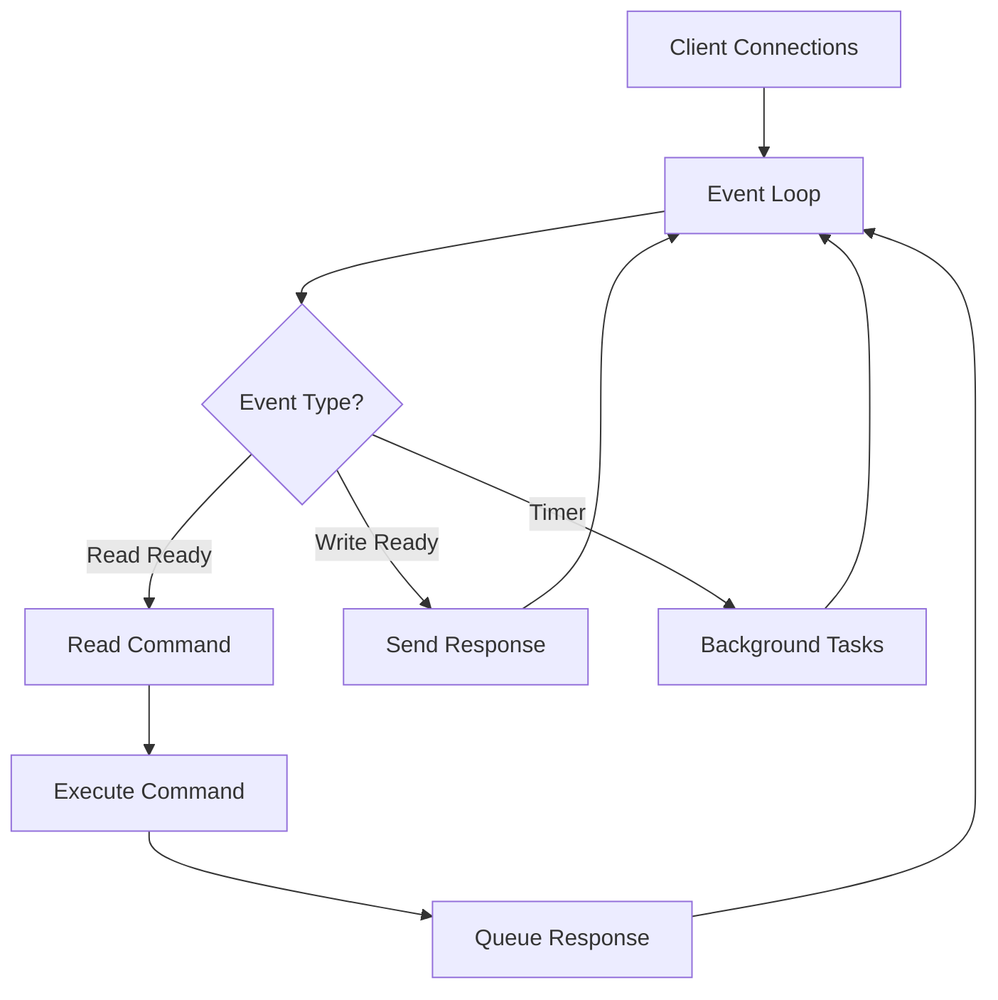
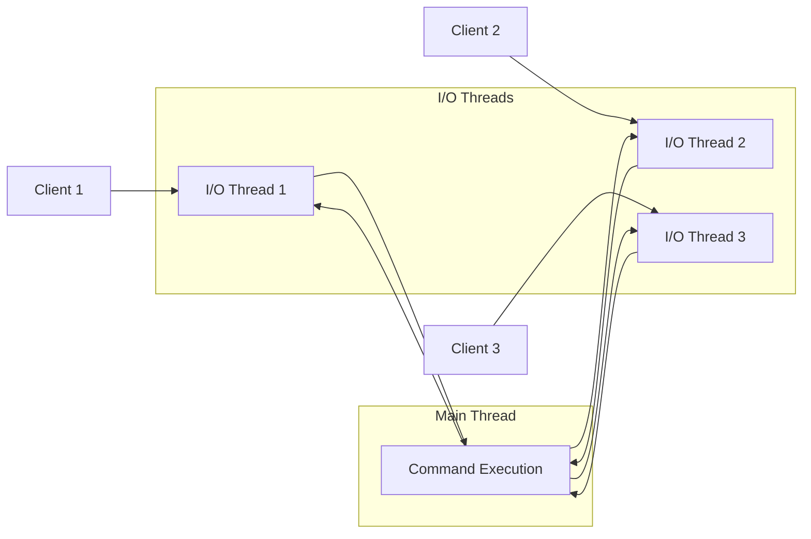

# How to Understand Redis Single-Threaded I/O Model

Author: [nawazdhandala](https://www.github.com/nawazdhandala)

Tags: Redis, Performance, Architecture, Database, Backend

Description: Learn how Redis achieves exceptional performance with its single-threaded I/O model, understand event loops, and discover when this architecture helps or hinders your application.

---

Redis processes commands using a single thread, yet it handles millions of operations per second. This might seem counterintuitive in an era of multi-core processors, but the single-threaded design is actually one of Redis's greatest strengths. Understanding this architecture will help you write better Redis applications and avoid common pitfalls.

## Why Single-Threaded?

Redis chose a single-threaded model for several compelling reasons:

| Benefit | Explanation |
|---------|-------------|
| **No locking overhead** | No mutexes, no deadlocks, no race conditions |
| **Simpler code** | Easier to maintain and debug |
| **Predictable latency** | No thread contention or context switching |
| **CPU cache efficiency** | Single thread keeps data in L1/L2 cache |

The key insight is that Redis is memory-bound, not CPU-bound. Network I/O and memory access are the bottlenecks, not computation. A single thread can saturate network bandwidth before hitting CPU limits.

## The Event Loop Architecture

Redis uses an event-driven architecture with non-blocking I/O. The main thread runs an event loop that handles all client connections and commands.



Here is a simplified view of how Redis processes commands:

```c
// Simplified Redis event loop pseudocode
// This runs continuously in the main thread
while (server_is_running) {
    // Wait for events on file descriptors
    // Returns when sockets are ready for read/write
    events = poll_for_events(timeout);

    for (event in events) {
        if (event.type == READABLE) {
            // Client sent data, read the command
            command = read_command(event.client);

            // Execute immediately in the same thread
            result = execute_command(command);

            // Queue response for sending
            queue_response(event.client, result);
        }

        if (event.type == WRITABLE) {
            // Socket ready to send data
            send_queued_responses(event.client);
        }
    }

    // Process time-based events (expiration, etc.)
    process_time_events();
}
```

## What Happens During Command Execution

When a client sends a command, Redis processes it atomically. No other command can interrupt an in-progress operation. This provides natural transaction semantics for individual commands.

```python
import redis
import time
import threading

# Connect to Redis
r = redis.Redis(host='localhost', port=6379, db=0)

def increment_counter(thread_id, iterations):
    """
    Even with multiple threads incrementing,
    each INCR is atomic in Redis
    """
    for i in range(iterations):
        # INCR is atomic, no race conditions
        r.incr('counter')

# Reset counter
r.set('counter', 0)

# Start multiple threads
threads = []
for i in range(10):
    t = threading.Thread(target=increment_counter, args=(i, 1000))
    threads.append(t)
    t.start()

# Wait for all threads
for t in threads:
    t.join()

# Counter will always be exactly 10000
# No lost increments due to race conditions
print(f"Final counter value: {r.get('counter').decode()}")
```

## The I/O Threading Model (Redis 6+)

Starting with Redis 6, I/O operations can use multiple threads while command execution remains single-threaded. This separates network I/O from command processing.



Enable I/O threading in redis.conf:

```bash
# redis.conf settings for I/O threading
# Enable threaded I/O for reads
io-threads 4

# Also use threads for writes (recommended)
io-threads-do-reads yes
```

The main thread still executes all commands sequentially. I/O threads only handle reading requests from sockets and writing responses back. This provides better throughput on multi-core systems without sacrificing atomicity.

## Commands That Block the Event Loop

Some operations are expensive and block the event loop. While these run, no other client can execute commands.

```python
import redis
import time

r = redis.Redis(host='localhost', port=6379, db=0)

# DANGER: These commands block the entire server

# 1. KEYS pattern - scans all keys
# Never use in production with large datasets
start = time.time()
keys = r.keys('user:*')  # Blocks until complete
print(f"KEYS took {time.time() - start:.3f}s")

# 2. Large SORT operations
r.rpush('big_list', *range(100000))
start = time.time()
r.sort('big_list')  # Blocks during sort
print(f"SORT took {time.time() - start:.3f}s")

# 3. Lua scripts that run too long
lua_script = """
local sum = 0
for i = 1, 10000000 do
    sum = sum + i
end
return sum
"""
# This blocks for several seconds
r.eval(lua_script, 0)

# BETTER ALTERNATIVES:

# Instead of KEYS, use SCAN (non-blocking iteration)
cursor = 0
all_keys = []
while True:
    cursor, keys = r.scan(cursor, match='user:*', count=100)
    all_keys.extend(keys)
    if cursor == 0:
        break

# Instead of large SORT, use sorted sets with ZRANGE
# Instead of slow Lua, break into smaller operations
```

## Measuring Single-Thread Impact

You can observe the single-threaded behavior with latency monitoring:

```python
import redis
import time
import threading
from statistics import mean, stdev

r = redis.Redis(host='localhost', port=6379, db=0)

def measure_latency(iterations=1000):
    """Measure round-trip latency for simple commands"""
    latencies = []
    for _ in range(iterations):
        start = time.perf_counter()
        r.ping()
        latencies.append((time.perf_counter() - start) * 1000)
    return latencies

# Baseline latency with no load
baseline = measure_latency()
print(f"Baseline - Mean: {mean(baseline):.3f}ms, StdDev: {stdev(baseline):.3f}ms")

# Now run a blocking command in another thread
def run_blocking_command():
    # DEBUG SLEEP simulates a slow command
    r.execute_command('DEBUG', 'SLEEP', '0.5')

blocking_thread = threading.Thread(target=run_blocking_command)

# Measure latency while blocking command runs
blocking_thread.start()
time.sleep(0.1)  # Let blocking command start

during_block = measure_latency(100)
print(f"During block - Mean: {mean(during_block):.3f}ms")

blocking_thread.join()
```

## Optimizing for Single-Threaded Execution

To get the best performance from Redis's single-threaded model:

```python
import redis

r = redis.Redis(host='localhost', port=6379, db=0)

# 1. Use pipelining to reduce round trips
# Bad: 1000 round trips
for i in range(1000):
    r.set(f'key:{i}', f'value:{i}')

# Good: 1 round trip with pipeline
pipe = r.pipeline()
for i in range(1000):
    pipe.set(f'key:{i}', f'value:{i}')
pipe.execute()  # All commands sent at once

# 2. Use appropriate data structures
# Bad: Multiple keys for related data
r.set('user:1:name', 'Alice')
r.set('user:1:email', 'alice@example.com')
r.set('user:1:age', 30)

# Good: Single hash for related data
r.hset('user:1', mapping={
    'name': 'Alice',
    'email': 'alice@example.com',
    'age': 30
})

# 3. Avoid O(N) operations on large datasets
# Bad: Get all members of a large set
all_members = r.smembers('large_set')  # Blocks

# Good: Iterate with SSCAN
cursor = 0
while True:
    cursor, members = r.sscan('large_set', cursor, count=100)
    process_batch(members)
    if cursor == 0:
        break

# 4. Use MGET/MSET for multiple keys
# Bad: Multiple round trips
values = []
for key in keys:
    values.append(r.get(key))

# Good: Single round trip
values = r.mget(keys)
```

## When Single-Threaded Becomes a Problem

The single-threaded model has limits. Watch for these warning signs:

```python
import redis

r = redis.Redis(host='localhost', port=6379, db=0)

# Check server statistics
info = r.info()

# High CPU on one core while others idle
# indicates you are hitting single-thread limits
print(f"Connected clients: {info['connected_clients']}")
print(f"Commands processed: {info['total_commands_processed']}")
print(f"Instantaneous ops/sec: {info['instantaneous_ops_per_sec']}")

# Check for slow commands
slowlog = r.slowlog_get(10)
for entry in slowlog:
    print(f"Slow command: {entry['command']} took {entry['duration']}us")

# If you are hitting limits, consider:
# 1. Redis Cluster to shard across multiple instances
# 2. Read replicas for read-heavy workloads
# 3. Client-side caching to reduce Redis load
```

## Summary

Redis's single-threaded model provides simplicity, atomicity, and predictable performance. The event loop handles thousands of concurrent connections efficiently by using non-blocking I/O. Commands execute atomically without locks.

Key takeaways:
- Single-threaded does not mean slow; Redis is memory-bound, not CPU-bound
- Every command blocks the event loop briefly, so avoid slow operations
- Use SCAN instead of KEYS, pipelines instead of individual commands
- Redis 6+ adds I/O threading for network operations while keeping command execution single-threaded
- When you hit single-thread limits, scale with clustering or read replicas

Understanding this model helps you write Redis applications that work with the architecture rather than against it.
