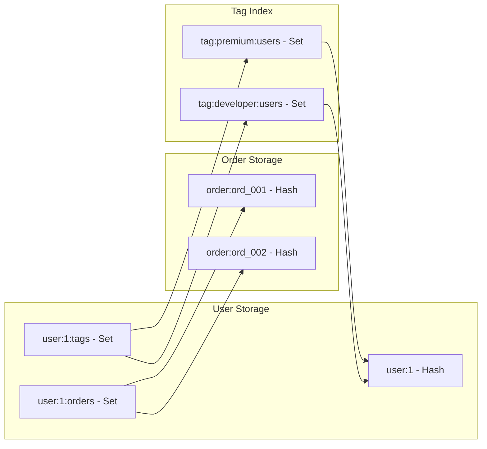

# How to Store Related Objects in Redis

Author: [nawazdhandala](https://www.github.com/nawazdhandala)

Tags: Redis, Data Modeling, Database Design, Backend, NoSQL

Description: Learn patterns for storing related objects in Redis including hashes for entities, sets for relationships, and denormalization strategies for optimal performance.

---

Redis is not a relational database, but you can model relationships between objects effectively. The key is choosing the right data structures and understanding the tradeoffs between normalization and denormalization. This guide covers practical patterns for storing related objects.

## Storing Objects with Hashes

Redis hashes are ideal for storing objects with multiple fields. Each hash is a key containing field-value pairs.

```python
import redis
import json

r = redis.Redis(host='localhost', port=6379, db=0)

# Store a user object as a hash
user_data = {
    'name': 'Alice Johnson',
    'email': 'alice@example.com',
    'role': 'admin',
    'created_at': '2026-01-25T10:00:00Z'
}

# HSET stores multiple fields at once
r.hset('user:1', mapping=user_data)

# Retrieve all fields
user = r.hgetall('user:1')
print(user)
# {b'name': b'Alice Johnson', b'email': b'alice@example.com', ...}

# Retrieve specific fields (more efficient)
name = r.hget('user:1', 'name')
email, role = r.hmget('user:1', ['email', 'role'])

# Update specific fields without rewriting the entire object
r.hset('user:1', 'role', 'superadmin')
```

## One-to-Many Relationships

Use sets or lists to represent one-to-many relationships. For example, a user having many orders:

```python
import redis
import json
import time

r = redis.Redis(host='localhost', port=6379, db=0)

def create_user(user_id, name, email):
    """Create a user with their order index"""
    r.hset(f'user:{user_id}', mapping={
        'name': name,
        'email': email,
        'created_at': str(time.time())
    })
    # Initialize empty orders set
    # The set will store order IDs belonging to this user

def create_order(order_id, user_id, total, items):
    """Create an order and link it to the user"""
    # Store the order
    r.hset(f'order:{order_id}', mapping={
        'user_id': user_id,
        'total': total,
        'items': json.dumps(items),
        'status': 'pending',
        'created_at': str(time.time())
    })

    # Add order ID to user's orders set
    r.sadd(f'user:{user_id}:orders', order_id)

def get_user_orders(user_id):
    """Get all orders for a user"""
    order_ids = r.smembers(f'user:{user_id}:orders')

    orders = []
    for order_id in order_ids:
        order_data = r.hgetall(f'order:{order_id.decode()}')
        if order_data:
            orders.append({
                'id': order_id.decode(),
                **{k.decode(): v.decode() for k, v in order_data.items()}
            })

    return orders

# Usage
create_user(1, 'Alice', 'alice@example.com')
create_order('ord_001', 1, 99.99, ['item1', 'item2'])
create_order('ord_002', 1, 49.99, ['item3'])

orders = get_user_orders(1)
for order in orders:
    print(f"Order {order['id']}: ${order['total']}")
```

## Many-to-Many Relationships

For many-to-many relationships, use sets on both sides. For example, users and tags:

```python
import redis

r = redis.Redis(host='localhost', port=6379, db=0)

def tag_user(user_id, tag):
    """Add a tag to a user (bidirectional)"""
    # Add tag to user's tag set
    r.sadd(f'user:{user_id}:tags', tag)

    # Add user to tag's user set
    r.sadd(f'tag:{tag}:users', user_id)

def untag_user(user_id, tag):
    """Remove a tag from a user"""
    r.srem(f'user:{user_id}:tags', tag)
    r.srem(f'tag:{tag}:users', user_id)

def get_user_tags(user_id):
    """Get all tags for a user"""
    return r.smembers(f'user:{user_id}:tags')

def get_users_with_tag(tag):
    """Get all users with a specific tag"""
    return r.smembers(f'tag:{tag}:users')

def get_users_with_all_tags(tags):
    """Get users who have ALL specified tags"""
    keys = [f'tag:{tag}:users' for tag in tags]
    return r.sinter(keys)

def get_users_with_any_tag(tags):
    """Get users who have ANY of the specified tags"""
    keys = [f'tag:{tag}:users' for tag in tags]
    return r.sunion(keys)

# Usage
tag_user(1, 'premium')
tag_user(1, 'developer')
tag_user(2, 'premium')
tag_user(2, 'designer')
tag_user(3, 'developer')

# Find users with specific tags
premium_users = get_users_with_tag('premium')
print(f"Premium users: {premium_users}")  # {b'1', b'2'}

# Find users who are both premium AND developers
premium_devs = get_users_with_all_tags(['premium', 'developer'])
print(f"Premium developers: {premium_devs}")  # {b'1'}
```

## Relationship Diagram



## Denormalization for Performance

In Redis, it is often better to denormalize data for faster reads. Store redundant data to avoid multiple lookups.

```python
import redis
import json
import time

r = redis.Redis(host='localhost', port=6379, db=0)

def create_post(post_id, author_id, title, content):
    """
    Create a post with denormalized author data.
    This avoids a second lookup when displaying posts.
    """
    # Get author data
    author = r.hgetall(f'user:{author_id}')
    author_name = author.get(b'name', b'Unknown').decode()
    author_avatar = author.get(b'avatar', b'').decode()

    # Store post with embedded author info
    r.hset(f'post:{post_id}', mapping={
        'title': title,
        'content': content,
        'author_id': author_id,
        # Denormalized author data
        'author_name': author_name,
        'author_avatar': author_avatar,
        'created_at': str(time.time()),
        'likes': 0,
        'comments_count': 0
    })

    # Add to author's posts
    r.zadd(f'user:{author_id}:posts', {post_id: time.time()})

    # Add to global feed
    r.zadd('posts:recent', {post_id: time.time()})

def update_author_name(author_id, new_name):
    """
    When author name changes, update denormalized copies.
    This is the tradeoff of denormalization.
    """
    # Update canonical source
    r.hset(f'user:{author_id}', 'name', new_name)

    # Find all posts by this author and update them
    post_ids = r.zrange(f'user:{author_id}:posts', 0, -1)

    pipe = r.pipeline()
    for post_id in post_ids:
        pipe.hset(f'post:{post_id.decode()}', 'author_name', new_name)
    pipe.execute()

def get_recent_posts(limit=20):
    """
    Get recent posts with author info in single query.
    No additional lookups needed thanks to denormalization.
    """
    post_ids = r.zrevrange('posts:recent', 0, limit - 1)

    pipe = r.pipeline()
    for post_id in post_ids:
        pipe.hgetall(f'post:{post_id.decode()}')

    results = pipe.execute()

    posts = []
    for post_data in results:
        if post_data:
            posts.append({
                k.decode(): v.decode() for k, v in post_data.items()
            })

    return posts
```

## Embedding vs Referencing

Decide between embedding related data and referencing based on access patterns:

```python
import redis
import json

r = redis.Redis(host='localhost', port=6379, db=0)

# EMBEDDING: Store related data directly in the parent
# Good when: data is small, always accessed together, rarely changes

def create_order_embedded(order_id, user_id, items):
    """
    Store line items embedded in the order.
    Efficient when you always need items with order.
    """
    r.hset(f'order:{order_id}', mapping={
        'user_id': user_id,
        'status': 'pending',
        # Items embedded as JSON
        'items': json.dumps(items),
        'total': sum(item['price'] * item['quantity'] for item in items)
    })

def get_order_with_items(order_id):
    """Single lookup gets everything"""
    order = r.hgetall(f'order:{order_id}')
    order_dict = {k.decode(): v.decode() for k, v in order.items()}
    order_dict['items'] = json.loads(order_dict['items'])
    return order_dict


# REFERENCING: Store IDs and lookup separately
# Good when: data is large, accessed independently, frequently updated

def create_order_referenced(order_id, user_id, item_ids):
    """
    Store references to items instead of embedding.
    Better when items are shared or updated frequently.
    """
    r.hset(f'order:{order_id}', mapping={
        'user_id': user_id,
        'status': 'pending'
    })

    # Store item references
    r.sadd(f'order:{order_id}:items', *item_ids)

def get_order_with_referenced_items(order_id):
    """Multiple lookups but fresher data"""
    order = r.hgetall(f'order:{order_id}')

    item_ids = r.smembers(f'order:{order_id}:items')

    # Batch lookup items
    pipe = r.pipeline()
    for item_id in item_ids:
        pipe.hgetall(f'item:{item_id.decode()}')
    items = pipe.execute()

    return {
        'order': {k.decode(): v.decode() for k, v in order.items()},
        'items': items
    }
```

## Sorted Relationships

Use sorted sets when order matters (timestamps, rankings, scores):

```python
import redis
import time
import json

r = redis.Redis(host='localhost', port=6379, db=0)

def add_follower(user_id, follower_id):
    """
    Store follow relationships with timestamps.
    Allows queries like 'most recent followers'.
    """
    timestamp = time.time()

    # Who follows this user (sorted by when)
    r.zadd(f'user:{user_id}:followers', {follower_id: timestamp})

    # Who this user follows (sorted by when)
    r.zadd(f'user:{follower_id}:following', {user_id: timestamp})

def get_recent_followers(user_id, limit=10):
    """Get most recent followers"""
    return r.zrevrange(
        f'user:{user_id}:followers',
        0, limit - 1,
        withscores=True
    )

def get_follower_count(user_id):
    """Get total follower count"""
    return r.zcard(f'user:{user_id}:followers')

def get_mutual_followers(user_a, user_b):
    """Find users who follow both A and B"""
    return r.zinter(
        [f'user:{user_a}:followers', f'user:{user_b}:followers'],
        aggregate='MIN'
    )

# Activity feeds using sorted sets
def post_activity(user_id, activity_type, target_id):
    """Add activity to user's feed"""
    activity = json.dumps({
        'type': activity_type,
        'target_id': target_id,
        'timestamp': time.time()
    })

    # Add to user's activity feed
    r.zadd(f'user:{user_id}:activity', {activity: time.time()})

    # Trim old activities (keep last 1000)
    r.zremrangebyrank(f'user:{user_id}:activity', 0, -1001)

def get_activity_feed(user_id, limit=50):
    """Get user's recent activity"""
    activities = r.zrevrange(
        f'user:{user_id}:activity',
        0, limit - 1
    )
    return [json.loads(a) for a in activities]
```

## Summary

| Pattern | Data Structure | Use Case |
|---------|---------------|----------|
| Object storage | Hash | User profiles, product details |
| One-to-many | Set/List | User's orders, post's comments |
| Many-to-many | Sets on both sides | Users and tags, follows |
| Sorted relationships | Sorted Set | Feeds, leaderboards, timelines |
| Embedded data | Hash with JSON | Small, static related data |
| Referenced data | Separate hashes | Large, shared, frequently updated |

Key principles:
- Design for your read patterns, not normalization
- Denormalize when reads are frequent and writes are rare
- Use sets for unordered relationships, sorted sets for ordered
- Pipeline multiple lookups to reduce round trips
- Consider embedding small, stable related data
