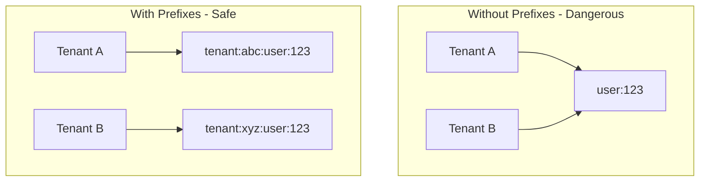

# How to Isolate Tenant Data with Redis Key Prefixes

Author: [nawazdhandala](https://www.github.com/nawazdhandala)

Tags: Redis, Multi-tenancy, SaaS, Data Isolation, Architecture

Description: Learn how to safely isolate tenant data in Redis using key prefixes, separate databases, and namespacing strategies for multi-tenant SaaS applications.

---

Multi-tenant applications serve multiple customers from a single deployment. When using Redis for caching or session storage, you need to ensure one tenant cannot access another tenant's data. Key prefixing is the most common and practical approach to achieve this isolation. This guide covers implementation patterns and gotchas.

## Why Key Prefixes Matter

In a multi-tenant system, the same cache key names will exist for different tenants. Without proper namespacing, tenant A could read tenant B's cached user profile if both use the key `user:123`.



## Basic Key Prefix Implementation

Wrap all Redis operations with a tenant-aware client that automatically adds prefixes.

```python
import redis
import json

class TenantRedisClient:
    """
    Redis client wrapper that enforces tenant isolation via key prefixes.
    All keys are automatically prefixed with the tenant identifier.
    """

    def __init__(self, redis_client, tenant_id):
        self.r = redis_client
        self.tenant_id = tenant_id
        # Prefix format: tenant:{id}:
        # The trailing colon makes keys more readable
        self.prefix = f"tenant:{tenant_id}:"

    def _prefixed(self, key):
        """Add tenant prefix to a key."""
        return f"{self.prefix}{key}"

    def _prefixed_keys(self, keys):
        """Add tenant prefix to multiple keys."""
        return [self._prefixed(k) for k in keys]

    def get(self, key):
        """Get a value, automatically adding tenant prefix."""
        return self.r.get(self._prefixed(key))

    def set(self, key, value, ex=None):
        """Set a value with tenant prefix."""
        return self.r.set(self._prefixed(key), value, ex=ex)

    def delete(self, *keys):
        """Delete keys with tenant prefix."""
        prefixed = self._prefixed_keys(keys)
        return self.r.delete(*prefixed)

    def exists(self, *keys):
        """Check if keys exist with tenant prefix."""
        prefixed = self._prefixed_keys(keys)
        return self.r.exists(*prefixed)

    def mget(self, keys):
        """Get multiple keys with tenant prefix."""
        prefixed = self._prefixed_keys(keys)
        return self.r.mget(prefixed)

    def mset(self, mapping):
        """Set multiple key-value pairs with tenant prefix."""
        prefixed_mapping = {self._prefixed(k): v for k, v in mapping.items()}
        return self.r.mset(prefixed_mapping)

    def hset(self, name, key=None, value=None, mapping=None):
        """Hash set with tenant-prefixed hash name."""
        return self.r.hset(self._prefixed(name), key=key, value=value, mapping=mapping)

    def hget(self, name, key):
        """Hash get with tenant-prefixed hash name."""
        return self.r.hget(self._prefixed(name), key)

    def hgetall(self, name):
        """Get all hash fields with tenant-prefixed hash name."""
        return self.r.hgetall(self._prefixed(name))

    def sadd(self, name, *values):
        """Add to set with tenant-prefixed set name."""
        return self.r.sadd(self._prefixed(name), *values)

    def smembers(self, name):
        """Get set members with tenant-prefixed set name."""
        return self.r.smembers(self._prefixed(name))

    def scan_iter(self, match=None, count=100):
        """
        Scan keys matching a pattern, but only within tenant namespace.
        The pattern is prefixed automatically.
        """
        pattern = f"{self.prefix}{match}" if match else f"{self.prefix}*"
        for key in self.r.scan_iter(match=pattern, count=count):
            # Return key without prefix for consistency
            yield key.replace(self.prefix, '', 1)


# Usage in a web application
def get_tenant_redis(tenant_id):
    """Factory function to get tenant-specific Redis client."""
    base_client = redis.Redis(host='localhost', port=6379, db=0, decode_responses=True)
    return TenantRedisClient(base_client, tenant_id)


# Example: In a Flask request handler
def get_user_cache(tenant_id, user_id):
    cache = get_tenant_redis(tenant_id)

    # This actually accesses: tenant:{tenant_id}:user:{user_id}
    cached = cache.get(f"user:{user_id}")
    if cached:
        return json.loads(cached)

    user = fetch_user_from_db(user_id)
    cache.set(f"user:{user_id}", json.dumps(user), ex=300)
    return user
```

## Thread-Local Tenant Context

In web applications, the tenant is typically determined by the request. Use thread-local storage to avoid passing tenant ID everywhere.

```python
import threading
from contextlib import contextmanager

# Thread-local storage for current tenant
_tenant_context = threading.local()

def get_current_tenant():
    """Get the current tenant ID from thread-local context."""
    tenant_id = getattr(_tenant_context, 'tenant_id', None)
    if tenant_id is None:
        raise RuntimeError("No tenant context set. Call set_tenant() first.")
    return tenant_id

def set_current_tenant(tenant_id):
    """Set the current tenant ID in thread-local context."""
    _tenant_context.tenant_id = tenant_id

@contextmanager
def tenant_context(tenant_id):
    """
    Context manager for tenant scope.
    Ensures tenant is always set correctly within the block.
    """
    old_tenant = getattr(_tenant_context, 'tenant_id', None)
    _tenant_context.tenant_id = tenant_id
    try:
        yield
    finally:
        _tenant_context.tenant_id = old_tenant


class TenantAwareRedis:
    """
    Redis client that automatically uses current tenant context.
    No need to pass tenant ID to every method call.
    """

    def __init__(self, redis_client):
        self.r = redis_client

    def _prefixed(self, key):
        tenant_id = get_current_tenant()
        return f"tenant:{tenant_id}:{key}"

    def get(self, key):
        return self.r.get(self._prefixed(key))

    def set(self, key, value, ex=None):
        return self.r.set(self._prefixed(key), value, ex=ex)

    def delete(self, *keys):
        prefixed = [self._prefixed(k) for k in keys]
        return self.r.delete(*prefixed)


# Flask middleware example
from flask import Flask, request, g

app = Flask(__name__)
redis_client = TenantAwareRedis(redis.Redis(host='localhost', port=6379, db=0))

@app.before_request
def set_tenant_from_request():
    """
    Extract tenant from request and set in context.
    Tenant could come from subdomain, header, or JWT token.
    """
    # Option 1: From subdomain (acme.myapp.com)
    subdomain = request.host.split('.')[0]

    # Option 2: From header
    # tenant_id = request.headers.get('X-Tenant-ID')

    # Option 3: From JWT token
    # tenant_id = decode_jwt(request.headers.get('Authorization'))['tenant_id']

    set_current_tenant(subdomain)

@app.route('/api/users/<user_id>')
def get_user(user_id):
    # No need to pass tenant ID - it's in context
    cached = redis_client.get(f"user:{user_id}")
    # ...
```

## Bulk Operations for a Tenant

Sometimes you need to clear all cached data for a specific tenant, such as when they cancel their subscription or request data deletion.

```python
class TenantCacheManager:
    """
    Manage tenant-specific cache operations including bulk deletion.
    """

    def __init__(self, redis_client):
        self.r = redis_client

    def clear_tenant_cache(self, tenant_id):
        """
        Delete all cached data for a tenant.
        Uses SCAN to avoid blocking Redis with KEYS command.
        """
        pattern = f"tenant:{tenant_id}:*"
        deleted_count = 0

        # Use SCAN to iterate through keys safely
        cursor = 0
        while True:
            cursor, keys = self.r.scan(cursor, match=pattern, count=100)
            if keys:
                self.r.delete(*keys)
                deleted_count += len(keys)
            if cursor == 0:
                break

        return deleted_count

    def get_tenant_memory_usage(self, tenant_id):
        """
        Calculate approximate memory used by a tenant's cache.
        Useful for monitoring and capacity planning.
        """
        pattern = f"tenant:{tenant_id}:*"
        total_bytes = 0
        key_count = 0

        cursor = 0
        while True:
            cursor, keys = self.r.scan(cursor, match=pattern, count=100)
            for key in keys:
                # MEMORY USAGE returns bytes used by the key
                usage = self.r.memory_usage(key)
                if usage:
                    total_bytes += usage
                    key_count += 1
            if cursor == 0:
                break

        return {
            'tenant_id': tenant_id,
            'key_count': key_count,
            'total_bytes': total_bytes,
            'total_mb': round(total_bytes / (1024 * 1024), 2)
        }

    def list_tenant_keys(self, tenant_id, pattern="*"):
        """
        List all cache keys for a tenant, optionally filtered by pattern.
        """
        full_pattern = f"tenant:{tenant_id}:{pattern}"
        keys = []

        cursor = 0
        while True:
            cursor, batch = self.r.scan(cursor, match=full_pattern, count=100)
            # Remove tenant prefix from returned keys for readability
            prefix = f"tenant:{tenant_id}:"
            keys.extend([k.replace(prefix, '', 1) for k in batch])
            if cursor == 0:
                break

        return keys
```

## Alternative: Separate Redis Databases

Redis supports multiple databases (0-15 by default). You could assign each tenant to a different database number. However, this approach has limitations.

```python
class DatabasePerTenant:
    """
    Alternative isolation strategy using separate Redis databases.

    Pros:
    - Complete isolation at database level
    - Easy to clear all tenant data (FLUSHDB)
    - No prefix overhead in key names

    Cons:
    - Limited to 16 databases by default
    - No cross-database operations
    - Harder to manage connections
    """

    def __init__(self, host='localhost', port=6379):
        self.host = host
        self.port = port
        # Map tenant IDs to database numbers
        self.tenant_db_map = {}
        self.next_db = 0

    def get_client(self, tenant_id):
        """Get Redis client for a specific tenant's database."""
        if tenant_id not in self.tenant_db_map:
            if self.next_db >= 16:
                raise RuntimeError("No more databases available")
            self.tenant_db_map[tenant_id] = self.next_db
            self.next_db += 1

        db_number = self.tenant_db_map[tenant_id]
        return redis.Redis(host=self.host, port=self.port, db=db_number)

    def clear_tenant_data(self, tenant_id):
        """Clear all data for a tenant using FLUSHDB."""
        client = self.get_client(tenant_id)
        return client.flushdb()
```

For most SaaS applications, key prefixes are the better choice. They scale beyond 16 tenants and allow cross-tenant operations when needed (for admin dashboards, for example).

## Security Considerations

Key prefixes provide logical isolation, not security isolation. A bug in your code could still leak data. Add these safeguards.

```python
class SecureTenantRedis:
    """
    Redis client with additional security checks for tenant isolation.
    """

    def __init__(self, redis_client, tenant_id):
        self.r = redis_client
        self.tenant_id = self._validate_tenant_id(tenant_id)
        self.prefix = f"tenant:{self.tenant_id}:"

    def _validate_tenant_id(self, tenant_id):
        """
        Validate tenant ID format to prevent injection attacks.
        A malicious tenant ID like 'abc:user:admin' could bypass isolation.
        """
        if not tenant_id:
            raise ValueError("Tenant ID cannot be empty")

        # Only allow alphanumeric and hyphens
        if not tenant_id.replace('-', '').isalnum():
            raise ValueError("Invalid tenant ID format")

        # Prevent overly long IDs
        if len(tenant_id) > 64:
            raise ValueError("Tenant ID too long")

        return tenant_id

    def _validate_key(self, key):
        """
        Validate key format to prevent accessing other tenants.
        Reject keys that try to escape the tenant namespace.
        """
        # Prevent null bytes or path traversal attempts
        if '\x00' in key or '..' in key:
            raise ValueError("Invalid key format")

        # Prevent keys that look like they include a tenant prefix
        if key.startswith('tenant:'):
            raise ValueError("Key cannot start with tenant prefix")

        return key

    def get(self, key):
        key = self._validate_key(key)
        return self.r.get(f"{self.prefix}{key}")

    def set(self, key, value, ex=None):
        key = self._validate_key(key)
        return self.r.set(f"{self.prefix}{key}", value, ex=ex)
```

## Summary

| Approach | Scalability | Isolation Level | Complexity |
|----------|-------------|-----------------|------------|
| **Key prefixes** | Unlimited tenants | Logical | Low |
| **Separate databases** | 16 tenants max | Database level | Medium |
| **Separate Redis instances** | Unlimited | Physical | High |

Key prefixing is the standard approach for multi-tenant Redis usage. It scales well, keeps your infrastructure simple, and provides sufficient isolation when combined with proper validation. Use the tenant-aware client pattern to ensure prefixes are consistently applied throughout your application.
