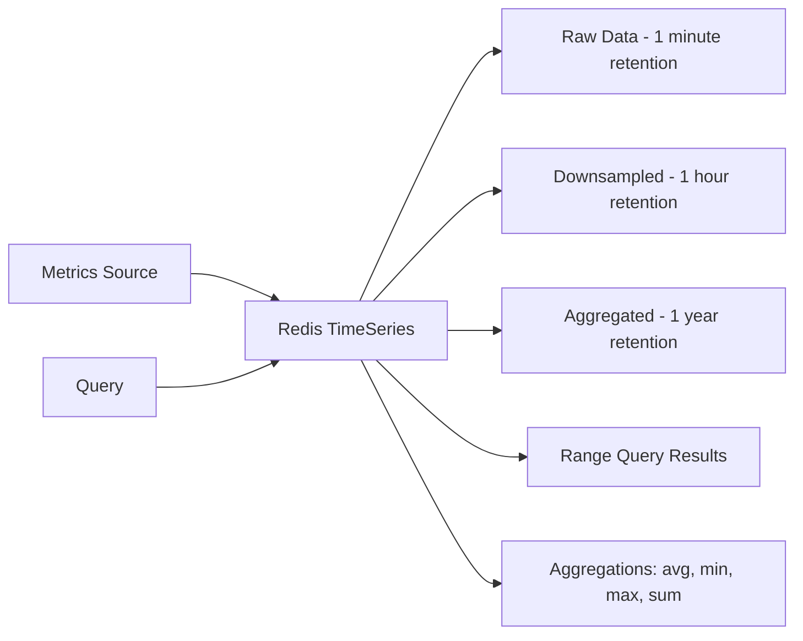

# How to Store Time Series Data with Redis TimeSeries

Author: [nawazdhandala](https://www.github.com/nawazdhandala)

Tags: Redis, TimeSeries, Metrics, Monitoring, IoT

Description: Learn how to store, query, and aggregate time series data using Redis TimeSeries module for metrics collection, IoT sensor data, and real-time analytics.

---

Time series data is everywhere: server metrics, IoT sensor readings, stock prices, user activity logs. Redis TimeSeries is a Redis module purpose-built for this workload. It provides efficient storage with automatic downsampling, aggregation queries, and retention policies. This guide covers practical usage patterns for production systems.

## Why Redis TimeSeries?

Standard Redis data structures can store time series data, but they lack native aggregation, compaction, and efficient range queries. Redis TimeSeries adds these features while maintaining Redis's performance characteristics.



## Setting Up Redis TimeSeries

Redis TimeSeries requires the RedisTimeSeries module. Using Docker is the easiest way to get started.

```bash
# Run Redis with TimeSeries module
docker run -d --name redis-ts -p 6379:6379 redislabs/redistimeseries:latest

# Or with persistence
docker run -d --name redis-ts \
  -p 6379:6379 \
  -v redis-ts-data:/data \
  redislabs/redistimeseries:latest \
  --appendonly yes
```

## Creating Time Series and Adding Data

```python
import redis
import time

# Connect to Redis with TimeSeries support
r = redis.Redis(host='localhost', port=6379, decode_responses=True)

def create_cpu_metric():
    """
    Create a time series for CPU usage metrics.
    Labels allow filtering and grouping in queries.
    """
    try:
        # TS.CREATE creates a new time series key
        # RETENTION: how long to keep data (ms) - 1 hour = 3600000ms
        # LABELS: key-value pairs for filtering
        r.execute_command(
            'TS.CREATE', 'cpu:usage:server1',
            'RETENTION', 3600000,          # Keep raw data for 1 hour
            'LABELS', 'metric', 'cpu', 'host', 'server1', 'region', 'us-east'
        )
        print("Created time series: cpu:usage:server1")
    except redis.exceptions.ResponseError as e:
        if "already exists" in str(e).lower():
            print("Time series already exists")
        else:
            raise


def add_metric(key, value, timestamp=None):
    """
    Add a data point to a time series.
    If timestamp is None, Redis uses current time automatically.
    """
    if timestamp is None:
        timestamp = '*'  # Auto-generate timestamp

    # TS.ADD adds a sample to the time series
    # Returns the timestamp of the added sample
    result = r.execute_command('TS.ADD', key, timestamp, value)
    return result


def add_metrics_bulk(key, samples):
    """
    Add multiple data points efficiently using TS.MADD.
    samples is a list of (timestamp, value) tuples.
    """
    # Build the MADD command arguments
    # Format: TS.MADD key1 ts1 val1 key2 ts2 val2 ...
    args = []
    for timestamp, value in samples:
        args.extend([key, timestamp, value])

    return r.execute_command('TS.MADD', *args)


# Usage example
create_cpu_metric()

# Add current CPU reading
add_metric('cpu:usage:server1', 45.5)

# Simulate adding historical data
now = int(time.time() * 1000)  # Current time in milliseconds
historical_samples = [
    (now - 60000, 42.0),   # 1 minute ago
    (now - 120000, 38.5),  # 2 minutes ago
    (now - 180000, 51.2),  # 3 minutes ago
]
add_metrics_bulk('cpu:usage:server1', historical_samples)
```

## Querying Time Series Data

```python
def query_range(key, from_time, to_time, aggregation=None, bucket_size=None):
    """
    Query data points within a time range.
    Optionally aggregate values into buckets.
    """
    args = ['TS.RANGE', key, from_time, to_time]

    if aggregation and bucket_size:
        # AGGREGATION reduces data points by applying a function over time buckets
        # Common aggregations: avg, sum, min, max, count, first, last, std.p, std.s
        args.extend(['AGGREGATION', aggregation, bucket_size])

    result = r.execute_command(*args)

    # Result is a list of [timestamp, value] pairs
    return [(int(ts), float(val)) for ts, val in result]


def get_latest(key):
    """Get the most recent data point from a time series."""
    result = r.execute_command('TS.GET', key)
    if result:
        return {'timestamp': int(result[0]), 'value': float(result[1])}
    return None


# Query examples
now = int(time.time() * 1000)
one_hour_ago = now - 3600000

# Get all raw data points from the last hour
raw_data = query_range('cpu:usage:server1', one_hour_ago, now)
print(f"Raw data points: {len(raw_data)}")

# Get 5-minute averages for the last hour
# bucket_size is in milliseconds: 5 minutes = 300000ms
averaged = query_range(
    'cpu:usage:server1',
    one_hour_ago,
    now,
    aggregation='avg',
    bucket_size=300000
)
print(f"5-minute averages: {averaged}")

# Get the peak CPU usage in the last hour
peak = query_range(
    'cpu:usage:server1',
    one_hour_ago,
    now,
    aggregation='max',
    bucket_size=3600000  # Single bucket for the whole hour
)
print(f"Peak CPU: {peak[0][1] if peak else 'N/A'}%")
```

## Automatic Downsampling with Compaction Rules

For long-term storage, downsample high-resolution data into lower-resolution aggregates. Compaction rules do this automatically.

```python
def setup_metrics_with_compaction():
    """
    Create a metrics pipeline with automatic downsampling.
    Raw data is compacted into hourly and daily aggregates.
    """
    # Create the raw data time series (1 second resolution)
    # Keep raw data for 24 hours
    r.execute_command(
        'TS.CREATE', 'metrics:requests:raw',
        'RETENTION', 86400000,  # 24 hours in ms
        'LABELS', 'type', 'requests', 'resolution', 'raw'
    )

    # Create hourly aggregates time series
    # Keep for 30 days
    r.execute_command(
        'TS.CREATE', 'metrics:requests:hourly',
        'RETENTION', 2592000000,  # 30 days in ms
        'LABELS', 'type', 'requests', 'resolution', 'hourly'
    )

    # Create daily aggregates time series
    # Keep for 1 year
    r.execute_command(
        'TS.CREATE', 'metrics:requests:daily',
        'RETENTION', 31536000000,  # 365 days in ms
        'LABELS', 'type', 'requests', 'resolution', 'daily'
    )

    # Create compaction rules
    # TS.CREATERULE source dest AGGREGATION type bucket

    # Aggregate raw data into hourly sums
    r.execute_command(
        'TS.CREATERULE', 'metrics:requests:raw', 'metrics:requests:hourly',
        'AGGREGATION', 'sum', 3600000  # 1 hour buckets
    )

    # Aggregate raw data into daily sums
    r.execute_command(
        'TS.CREATERULE', 'metrics:requests:raw', 'metrics:requests:daily',
        'AGGREGATION', 'sum', 86400000  # 24 hour buckets
    )

    print("Created metrics pipeline with automatic compaction")


def record_request():
    """Record a request to the raw time series."""
    # Data automatically flows through compaction rules
    r.execute_command('TS.ADD', 'metrics:requests:raw', '*', 1)
```

## Multi-Series Queries with Labels

Labels let you query across multiple time series using filters.

```python
def create_multi_host_metrics():
    """Create time series for multiple servers with labels."""
    hosts = ['web1', 'web2', 'web3', 'db1', 'db2']

    for host in hosts:
        # Determine host type from name prefix
        host_type = 'web' if host.startswith('web') else 'database'

        r.execute_command(
            'TS.CREATE', f'cpu:{host}',
            'RETENTION', 86400000,
            'LABELS',
            'metric', 'cpu',
            'host', host,
            'type', host_type,
            'env', 'production'
        )
        print(f"Created time series for {host}")


def query_by_labels(metric, filters, from_time, to_time, aggregation='avg', bucket_size=60000):
    """
    Query multiple time series by label filters.

    filters is a list like ['type=web', 'env=production']
    """
    args = ['TS.MRANGE', from_time, to_time]

    # Add aggregation
    args.extend(['AGGREGATION', aggregation, bucket_size])

    # Add filter
    # FILTER takes label conditions
    args.append('FILTER')
    args.extend(filters)

    result = r.execute_command(*args)

    # Result format: [[key, labels, [[ts, val], ...]], ...]
    parsed = []
    for series in result:
        key = series[0]
        labels = dict(zip(series[1][::2], series[1][1::2]))
        data = [(int(ts), float(val)) for ts, val in series[2]]
        parsed.append({
            'key': key,
            'labels': labels,
            'data': data
        })

    return parsed


# Query all web server CPU metrics
now = int(time.time() * 1000)
one_hour_ago = now - 3600000

web_cpu = query_by_labels(
    'cpu',
    ['metric=cpu', 'type=web'],
    one_hour_ago,
    now,
    aggregation='avg',
    bucket_size=300000  # 5 minute buckets
)

for series in web_cpu:
    host = series['labels']['host']
    avg_cpu = sum(d[1] for d in series['data']) / len(series['data']) if series['data'] else 0
    print(f"{host}: avg CPU = {avg_cpu:.1f}%")
```

## Practical Example: Application Metrics Collector

```python
import time
import threading
from collections import defaultdict

class MetricsCollector:
    """
    Collect and store application metrics using Redis TimeSeries.
    Supports counters, gauges, and histograms.
    """

    def __init__(self, redis_client, app_name, retention_hours=24):
        self.r = redis_client
        self.app_name = app_name
        self.retention_ms = retention_hours * 3600000
        self.created_series = set()

    def _ensure_series(self, name, labels_dict):
        """Create time series if it doesn't exist."""
        key = f"{self.app_name}:{name}"

        if key not in self.created_series:
            labels = []
            for k, v in labels_dict.items():
                labels.extend([k, v])

            try:
                args = ['TS.CREATE', key, 'RETENTION', self.retention_ms]
                if labels:
                    args.append('LABELS')
                    args.extend(labels)
                self.r.execute_command(*args)
            except redis.exceptions.ResponseError:
                pass  # Series already exists

            self.created_series.add(key)

        return key

    def gauge(self, name, value, labels=None):
        """
        Record a gauge metric (current value, can go up or down).
        Example: current memory usage, active connections.
        """
        labels = labels or {}
        labels['type'] = 'gauge'
        key = self._ensure_series(name, labels)
        self.r.execute_command('TS.ADD', key, '*', value)

    def counter(self, name, value=1, labels=None):
        """
        Increment a counter metric.
        Example: request count, error count.
        """
        labels = labels or {}
        labels['type'] = 'counter'
        key = self._ensure_series(name, labels)

        # For counters, we add the increment value
        # Use TS.INCRBY for atomic increments
        self.r.execute_command('TS.ADD', key, '*', value)

    def timing(self, name, duration_ms, labels=None):
        """
        Record a timing metric.
        Example: request latency, database query time.
        """
        labels = labels or {}
        labels['type'] = 'timing'
        key = self._ensure_series(name, labels)
        self.r.execute_command('TS.ADD', key, '*', duration_ms)

    def get_rate(self, name, window_seconds=60):
        """
        Calculate the rate of a counter over a time window.
        Returns events per second.
        """
        key = f"{self.app_name}:{name}"
        now = int(time.time() * 1000)
        window_start = now - (window_seconds * 1000)

        # Get sum over the window
        result = self.r.execute_command(
            'TS.RANGE', key, window_start, now,
            'AGGREGATION', 'sum', window_seconds * 1000
        )

        if result:
            total = float(result[0][1])
            return total / window_seconds
        return 0

    def get_percentile(self, name, percentile, window_seconds=300):
        """
        Calculate approximate percentile for timing metrics.
        Note: Redis TimeSeries doesn't have native percentile,
        so we fetch raw data and calculate locally.
        """
        key = f"{self.app_name}:{name}"
        now = int(time.time() * 1000)
        window_start = now - (window_seconds * 1000)

        result = self.r.execute_command('TS.RANGE', key, window_start, now)

        if not result:
            return 0

        values = sorted([float(point[1]) for point in result])
        index = int(len(values) * percentile / 100)
        return values[min(index, len(values) - 1)]


# Usage
metrics = MetricsCollector(r, 'myapp', retention_hours=24)

# Record metrics during request handling
def handle_request(request):
    start = time.time()

    # Process request...
    metrics.counter('requests', labels={'endpoint': '/api/users', 'method': 'GET'})

    # Record response time
    duration_ms = (time.time() - start) * 1000
    metrics.timing('request_latency', duration_ms, labels={'endpoint': '/api/users'})

# Periodically record system metrics
def collect_system_metrics():
    import psutil

    metrics.gauge('cpu_percent', psutil.cpu_percent())
    metrics.gauge('memory_percent', psutil.virtual_memory().percent)
    metrics.gauge('active_connections', get_active_connection_count())
```

## Summary

| Feature | Use Case | Command |
|---------|----------|---------|
| **Add data** | Record metrics | `TS.ADD` |
| **Range query** | Historical analysis | `TS.RANGE` |
| **Aggregation** | Reduce data points | `AGGREGATION avg/sum/max` |
| **Compaction** | Long-term storage | `TS.CREATERULE` |
| **Multi-series** | Query by labels | `TS.MRANGE` with `FILTER` |

Redis TimeSeries excels at high-volume metric ingestion with minimal latency. Its automatic compaction keeps storage costs manageable while retaining the ability to query historical data at different resolutions.
