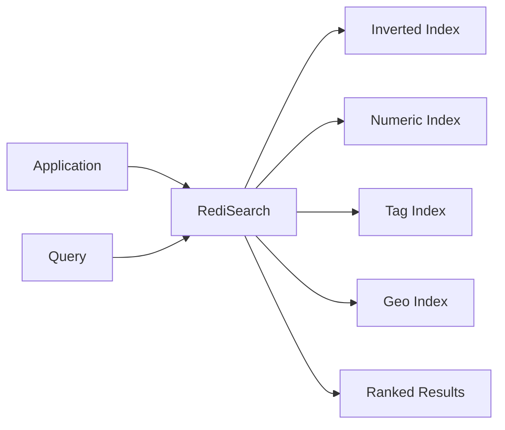

# How to Build Full-Text Search with RediSearch

Author: [nawazdhandala](https://www.github.com/nawazdhandala)

Tags: Redis, RediSearch, Full-Text Search, Search Engine, Performance

Description: Learn how to implement fast full-text search using RediSearch, including index creation, query syntax, faceted search, and auto-complete suggestions.

---

RediSearch is a Redis module that turns Redis into a full-text search engine. It provides real-time indexing, complex queries, faceted search, and auto-complete - all with sub-millisecond latency. This guide covers practical implementation patterns for adding search to your application.

## Why RediSearch?

Traditional search engines like Elasticsearch are powerful but complex to operate. RediSearch gives you similar capabilities with simpler deployment - it runs as a Redis module. For many use cases, especially when data already lives in Redis, RediSearch is the faster path to production.



## Setting Up RediSearch

Run Redis with the RediSearch module using Docker.

```bash
# Run Redis with RediSearch module
docker run -d --name redis-search \
  -p 6379:6379 \
  redislabs/redisearch:latest

# Or with persistence
docker run -d --name redis-search \
  -p 6379:6379 \
  -v redis-search-data:/data \
  redislabs/redisearch:latest \
  redis-server --appendonly yes --loadmodule /usr/lib/redis/modules/redisearch.so
```

## Creating a Search Index

```python
import redis

r = redis.Redis(host='localhost', port=6379, decode_responses=True)

def create_product_index():
    """
    Create a search index for products.
    Define which fields to index and how to index them.
    """
    try:
        # FT.CREATE creates a new search index
        # ON HASH means we're indexing Redis Hash data structures
        # PREFIX specifies which keys to include in the index
        r.execute_command(
            'FT.CREATE', 'idx:products',
            'ON', 'HASH',
            'PREFIX', '1', 'product:',
            'SCHEMA',
            # TEXT fields support full-text search with stemming and fuzzy matching
            'name', 'TEXT', 'WEIGHT', '5.0',        # Higher weight = more important in ranking
            'description', 'TEXT', 'WEIGHT', '1.0',
            # TAG fields are for exact matching (categories, status)
            'category', 'TAG', 'SEPARATOR', ',',
            'brand', 'TAG',
            # NUMERIC fields support range queries
            'price', 'NUMERIC', 'SORTABLE',
            'stock', 'NUMERIC',
            # GEO fields support location queries
            'location', 'GEO',
        )
        print("Created product search index")
    except redis.exceptions.ResponseError as e:
        if "Index already exists" in str(e):
            print("Index already exists")
        else:
            raise


def add_product(product_id, product_data):
    """
    Add a product to Redis. It's automatically indexed by RediSearch.
    """
    key = f"product:{product_id}"

    # Store as Hash for RediSearch indexing
    r.hset(key, mapping={
        'name': product_data['name'],
        'description': product_data['description'],
        'category': ','.join(product_data.get('categories', [])),
        'brand': product_data.get('brand', ''),
        'price': product_data['price'],
        'stock': product_data.get('stock', 0),
        'location': f"{product_data.get('longitude', 0)},{product_data.get('latitude', 0)}",
    })

    return key


# Create index and add sample data
create_product_index()

products = [
    {
        'name': 'Wireless Bluetooth Headphones',
        'description': 'High quality over-ear headphones with noise cancellation and 30 hour battery life',
        'categories': ['electronics', 'audio'],
        'brand': 'AudioTech',
        'price': 149.99,
        'stock': 50,
    },
    {
        'name': 'USB-C Fast Charger',
        'description': 'Compact 65W charger compatible with laptops and phones',
        'categories': ['electronics', 'accessories'],
        'brand': 'PowerMax',
        'price': 39.99,
        'stock': 200,
    },
    {
        'name': 'Mechanical Keyboard',
        'description': 'RGB backlit mechanical keyboard with Cherry MX switches',
        'categories': ['electronics', 'computer-accessories'],
        'brand': 'KeyMaster',
        'price': 129.99,
        'stock': 75,
    },
]

for i, product in enumerate(products):
    add_product(i + 1, product)
```

## Basic Search Queries

```python
def search_products(query, filters=None, offset=0, limit=10):
    """
    Search products with full-text query and optional filters.
    """
    # Build the search query
    search_query = query

    if filters:
        filter_parts = []

        # Category filter (TAG field)
        if 'category' in filters:
            filter_parts.append(f"@category:{{{filters['category']}}}")

        # Brand filter (TAG field)
        if 'brand' in filters:
            filter_parts.append(f"@brand:{{{filters['brand']}}}")

        # Price range filter (NUMERIC field)
        if 'min_price' in filters or 'max_price' in filters:
            min_p = filters.get('min_price', '-inf')
            max_p = filters.get('max_price', '+inf')
            filter_parts.append(f"@price:[{min_p} {max_p}]")

        # Combine query with filters
        if filter_parts:
            search_query = f"({query}) {' '.join(filter_parts)}"

    # Execute search
    # FT.SEARCH returns results with scores and field values
    result = r.execute_command(
        'FT.SEARCH', 'idx:products',
        search_query,
        'WITHSCORES',           # Include relevance scores
        'LIMIT', offset, limit,
        'SORTBY', 'price', 'ASC',  # Sort by price ascending
    )

    return parse_search_results(result)


def parse_search_results(raw_result):
    """
    Parse FT.SEARCH results into a structured format.
    """
    # First element is total count
    total = raw_result[0]
    results = []

    # Results come in groups: [doc_id, score, [field, value, ...]]
    i = 1
    while i < len(raw_result):
        doc_id = raw_result[i]
        score = float(raw_result[i + 1])
        fields = raw_result[i + 2]

        # Convert field list to dict
        doc = {'id': doc_id, 'score': score}
        for j in range(0, len(fields), 2):
            doc[fields[j]] = fields[j + 1]

        results.append(doc)
        i += 3

    return {'total': total, 'results': results}


# Search examples
# Basic text search
results = search_products('wireless headphones')
print(f"Found {results['total']} products")

# Search with filters
results = search_products(
    'charger',
    filters={
        'category': 'electronics',
        'max_price': 50,
    }
)

# Search for products under $100
results = search_products('*', filters={'max_price': 100})
```

## Advanced Query Syntax

RediSearch supports complex query expressions.

```python
def advanced_search_examples():
    """
    Examples of advanced RediSearch query syntax.
    """
    # Exact phrase match (words must appear together in order)
    r.execute_command('FT.SEARCH', 'idx:products', '"noise cancellation"')

    # OR query (match either term)
    r.execute_command('FT.SEARCH', 'idx:products', 'wireless | bluetooth')

    # NOT query (exclude results containing term)
    r.execute_command('FT.SEARCH', 'idx:products', 'headphones -cheap')

    # Prefix search (match words starting with...)
    r.execute_command('FT.SEARCH', 'idx:products', 'wire*')

    # Fuzzy search (match with up to 1 character difference)
    # %% = 1 char distance, %%% = 2 char distance
    r.execute_command('FT.SEARCH', 'idx:products', '%%headpones%%')

    # Field-specific search
    r.execute_command('FT.SEARCH', 'idx:products', '@name:keyboard @brand:{KeyMaster}')

    # Numeric range
    r.execute_command('FT.SEARCH', 'idx:products', '@price:[50 150]')

    # Multiple TAG values (OR within the same field)
    r.execute_command('FT.SEARCH', 'idx:products', '@category:{electronics | accessories}')

    # Geo radius search (within 10km of coordinates)
    r.execute_command(
        'FT.SEARCH', 'idx:products',
        '@location:[-122.4194 37.7749 10 km]'
    )


def search_with_highlighting(query):
    """
    Search with highlighted matching terms in results.
    """
    result = r.execute_command(
        'FT.SEARCH', 'idx:products',
        query,
        'HIGHLIGHT',                    # Enable highlighting
        'FIELDS', '2', 'name', 'description',  # Fields to highlight
        'TAGS', '<b>', '</b>',         # HTML tags for highlights
    )

    return parse_search_results(result)


# Search and highlight matching terms
results = search_with_highlighting('wireless headphones')
# Results will have <b>wireless</b> and <b>headphones</b> highlighted
```

## Faceted Search

Faceted search shows aggregated counts for filtering options (like "Electronics (15)" in an e-commerce sidebar).

```python
def search_with_facets(query):
    """
    Search with faceted results for filtering UI.
    Uses FT.AGGREGATE to get counts by category and brand.
    """
    # First, run the search to get results
    search_results = search_products(query)

    # Then get facet counts using aggregation
    # Category facets
    category_facets = r.execute_command(
        'FT.AGGREGATE', 'idx:products',
        query,
        'GROUPBY', '1', '@category',
        'REDUCE', 'COUNT', '0', 'AS', 'count',
        'SORTBY', '2', '@count', 'DESC',
        'LIMIT', '0', '10',
    )

    # Brand facets
    brand_facets = r.execute_command(
        'FT.AGGREGATE', 'idx:products',
        query,
        'GROUPBY', '1', '@brand',
        'REDUCE', 'COUNT', '0', 'AS', 'count',
        'SORTBY', '2', '@count', 'DESC',
        'LIMIT', '0', '10',
    )

    # Price range histogram
    price_ranges = r.execute_command(
        'FT.AGGREGATE', 'idx:products',
        query,
        'APPLY', 'floor(@price/50)*50', 'AS', 'price_bucket',
        'GROUPBY', '1', '@price_bucket',
        'REDUCE', 'COUNT', '0', 'AS', 'count',
        'SORTBY', '2', '@price_bucket', 'ASC',
    )

    return {
        'results': search_results,
        'facets': {
            'categories': parse_facets(category_facets),
            'brands': parse_facets(brand_facets),
            'price_ranges': parse_facets(price_ranges),
        }
    }


def parse_facets(raw_facets):
    """Parse aggregation results into facet list."""
    facets = []
    # Skip first element (result count)
    for i in range(1, len(raw_facets)):
        item = raw_facets[i]
        # Convert list of key-value pairs to dict
        facet = {}
        for j in range(0, len(item), 2):
            facet[item[j]] = item[j + 1]
        facets.append(facet)
    return facets
```

## Auto-Complete Suggestions

RediSearch provides a separate data structure for fast auto-complete.

```python
def setup_autocomplete():
    """
    Add product names to auto-complete suggestion dictionary.
    """
    products = [
        ('Wireless Bluetooth Headphones', 100),  # (suggestion, score)
        ('Wireless Earbuds', 95),
        ('Wireless Charger', 80),
        ('Wired Headphones', 70),
        ('USB-C Cable', 60),
        ('USB Hub', 55),
    ]

    for suggestion, score in products:
        # FT.SUGADD adds a suggestion to the dictionary
        r.execute_command(
            'FT.SUGADD', 'autocomplete:products',
            suggestion,
            score,
            'INCR',  # Increment score if suggestion exists
        )


def get_suggestions(prefix, max_results=5, fuzzy=False):
    """
    Get auto-complete suggestions for a prefix.
    """
    args = ['FT.SUGGET', 'autocomplete:products', prefix, 'MAX', max_results]

    if fuzzy:
        # Allow 1-character typos
        args.append('FUZZY')

    args.append('WITHSCORES')

    result = r.execute_command(*args)

    suggestions = []
    for i in range(0, len(result), 2):
        suggestions.append({
            'text': result[i],
            'score': float(result[i + 1]),
        })

    return suggestions


# Setup and test auto-complete
setup_autocomplete()

# Type-ahead suggestions
suggestions = get_suggestions('wire')
# Returns: Wireless Bluetooth Headphones, Wireless Earbuds, Wireless Charger, Wired Headphones

# Fuzzy matching handles typos
suggestions = get_suggestions('wireles', fuzzy=True)
# Still returns Wireless products despite missing 's'
```

## Indexing Strategies

```python
def create_article_index():
    """
    Create an index optimized for article/blog content search.
    """
    r.execute_command(
        'FT.CREATE', 'idx:articles',
        'ON', 'HASH',
        'PREFIX', '1', 'article:',
        'SCHEMA',
        # Title is most important for ranking
        'title', 'TEXT', 'WEIGHT', '10.0', 'SORTABLE',
        # Full article body
        'body', 'TEXT', 'WEIGHT', '1.0',
        # Author for filtering
        'author', 'TAG', 'SORTABLE',
        # Multiple tags per article
        'tags', 'TAG', 'SEPARATOR', ',',
        # Publication date for sorting and filtering
        'published_at', 'NUMERIC', 'SORTABLE',
        # View count for popularity sorting
        'views', 'NUMERIC', 'SORTABLE',
    )


def search_articles(query, sort_by='relevance', filters=None):
    """
    Search articles with flexible sorting options.
    """
    search_query = query if query else '*'

    if filters:
        if 'author' in filters:
            search_query += f" @author:{{{filters['author']}}}"
        if 'tags' in filters:
            tags = '|'.join(filters['tags'])
            search_query += f" @tags:{{{tags}}}"

    # Build command based on sort preference
    cmd = ['FT.SEARCH', 'idx:articles', search_query]

    if sort_by == 'date':
        cmd.extend(['SORTBY', 'published_at', 'DESC'])
    elif sort_by == 'popularity':
        cmd.extend(['SORTBY', 'views', 'DESC'])
    # 'relevance' uses default scoring

    cmd.extend(['LIMIT', '0', '20'])

    return r.execute_command(*cmd)
```

## Summary

| Feature | Use Case | Query Example |
|---------|----------|---------------|
| **Full-text search** | Find matching documents | `wireless headphones` |
| **Exact phrase** | Match specific phrases | `"noise cancellation"` |
| **Field search** | Search specific fields | `@name:keyboard` |
| **Tag filter** | Exact category matching | `@category:{electronics}` |
| **Numeric range** | Price/date filtering | `@price:[50 150]` |
| **Geo search** | Location-based queries | `@location:[-122.4 37.7 10 km]` |
| **Facets** | Aggregated counts | `FT.AGGREGATE ... GROUPBY` |
| **Auto-complete** | Type-ahead suggestions | `FT.SUGGET prefix` |

RediSearch provides search engine capabilities with Redis's simplicity and speed. For applications already using Redis, it eliminates the need for a separate search infrastructure while delivering sub-millisecond query performance.
