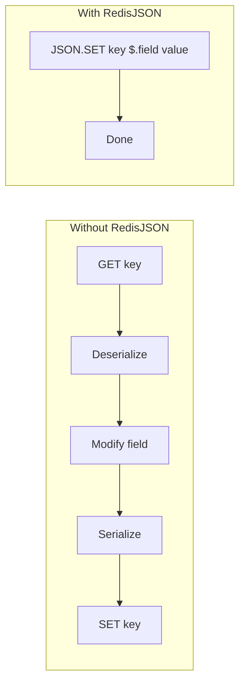

# How to Store JSON Documents with RedisJSON

Author: [nawazdhandala](https://www.github.com/nawazdhandala)

Tags: Redis, RedisJSON, JSON, Document Store, NoSQL

Description: Learn how to use RedisJSON to store, query, and manipulate JSON documents in Redis with native support for nested data, partial updates, and JSONPath queries.

---

RedisJSON extends Redis with native JSON support. Instead of serializing JSON to strings, you can store structured documents and query or update specific fields without fetching the entire document. This makes Redis a capable document store for use cases that don't need a full database.

## Why RedisJSON?

Without RedisJSON, storing JSON in Redis means serializing to a string and deserializing on every read. Updating a single field requires fetching the entire document, modifying it, and writing it back. RedisJSON provides atomic operations on JSON paths, reducing network traffic and simplifying your code.



## Setting Up RedisJSON

```bash
# Run Redis with RedisJSON module
docker run -d --name redis-json \
  -p 6379:6379 \
  redislabs/rejson:latest

# Or with both RedisJSON and RediSearch for querying
docker run -d --name redis-stack \
  -p 6379:6379 \
  redis/redis-stack:latest
```

## Basic JSON Operations

```python
import redis
import json

r = redis.Redis(host='localhost', port=6379, decode_responses=True)

def store_user(user_id, user_data):
    """
    Store a user document as JSON.
    JSON.SET stores the entire document at a key.
    """
    key = f"user:{user_id}"

    # JSON.SET key path value
    # Path '$' means the root of the document
    r.execute_command('JSON.SET', key, '$', json.dumps(user_data))

    return key


def get_user(user_id):
    """
    Retrieve a complete user document.
    """
    key = f"user:{user_id}"

    # JSON.GET returns the document as a JSON string
    result = r.execute_command('JSON.GET', key)

    if result:
        return json.loads(result)
    return None


def get_user_field(user_id, path):
    """
    Get a specific field from a user document.
    Path uses JSONPath syntax: $.fieldname, $.nested.field, etc.
    """
    key = f"user:{user_id}"

    result = r.execute_command('JSON.GET', key, path)

    if result:
        # Result is a JSON array of matching values
        values = json.loads(result)
        return values[0] if len(values) == 1 else values
    return None


# Store a user document
user = {
    'name': 'Alice Johnson',
    'email': 'alice@example.com',
    'age': 28,
    'address': {
        'street': '123 Main St',
        'city': 'Seattle',
        'state': 'WA',
        'zip': '98101'
    },
    'tags': ['developer', 'python', 'redis'],
    'settings': {
        'notifications': True,
        'theme': 'dark'
    }
}

store_user('alice123', user)

# Get the full document
full_user = get_user('alice123')
print(full_user['name'])  # Alice Johnson

# Get just the email
email = get_user_field('alice123', '$.email')
print(email)  # alice@example.com

# Get nested field
city = get_user_field('alice123', '$.address.city')
print(city)  # Seattle
```

## Updating Specific Fields

```python
def update_user_field(user_id, path, value):
    """
    Update a specific field without touching the rest of the document.
    Much more efficient than GET-modify-SET for large documents.
    """
    key = f"user:{user_id}"

    # JSON.SET with a specific path updates only that field
    r.execute_command('JSON.SET', key, path, json.dumps(value))


def increment_numeric_field(user_id, path, amount=1):
    """
    Atomically increment a numeric field.
    Returns the new value.
    """
    key = f"user:{user_id}"

    # JSON.NUMINCRBY atomically increments a number
    result = r.execute_command('JSON.NUMINCRBY', key, path, amount)
    return json.loads(result)[0]


def append_to_array(user_id, path, *values):
    """
    Append values to a JSON array.
    """
    key = f"user:{user_id}"

    # JSON.ARRAPPEND adds values to the end of an array
    args = [json.dumps(v) for v in values]
    r.execute_command('JSON.ARRAPPEND', key, path, *args)


def remove_from_array(user_id, path, index):
    """
    Remove an element from a JSON array by index.
    Index -1 removes the last element.
    """
    key = f"user:{user_id}"

    # JSON.ARRPOP removes and returns an element
    result = r.execute_command('JSON.ARRPOP', key, path, index)
    return json.loads(result) if result else None


# Update examples
# Change user's city
update_user_field('alice123', '$.address.city', 'Portland')

# Increment age
new_age = increment_numeric_field('alice123', '$.age', 1)
print(f"New age: {new_age}")  # 29

# Add a new tag
append_to_array('alice123', '$.tags', 'docker')

# Remove first tag
removed = remove_from_array('alice123', '$.tags', 0)
print(f"Removed tag: {removed}")  # developer
```

## Working with Nested Objects

```python
def set_nested_field(key, path, value):
    """
    Set a field at any nesting level.
    Creates intermediate objects if they don't exist (with NX option).
    """
    r.execute_command('JSON.SET', key, path, json.dumps(value))


def merge_object(key, path, data):
    """
    Merge data into an existing object.
    Similar to Object.assign() in JavaScript.
    """
    # JSON.MERGE combines objects (Redis 7.2+)
    # For older versions, use JSON.SET for each field
    try:
        r.execute_command('JSON.MERGE', key, path, json.dumps(data))
    except redis.exceptions.ResponseError:
        # Fallback: set each field individually
        for field, value in data.items():
            field_path = f"{path}.{field}"
            r.execute_command('JSON.SET', key, field_path, json.dumps(value))


# Store a product with nested inventory
product = {
    'sku': 'WIDGET-001',
    'name': 'Premium Widget',
    'price': 29.99,
    'inventory': {
        'warehouse_a': 100,
        'warehouse_b': 50,
    },
    'metadata': {
        'created_at': '2026-01-01',
        'updated_at': '2026-01-25'
    }
}

r.execute_command('JSON.SET', 'product:widget001', '$', json.dumps(product))

# Update inventory for one warehouse
set_nested_field('product:widget001', '$.inventory.warehouse_a', 95)

# Add a new warehouse
set_nested_field('product:widget001', '$.inventory.warehouse_c', 200)

# Update multiple metadata fields at once
merge_object('product:widget001', '$.metadata', {
    'updated_at': '2026-01-25',
    'last_sold': '2026-01-24'
})
```

## JSONPath Queries

RedisJSON supports JSONPath for querying documents.

```python
def query_json(key, path):
    """
    Query a document using JSONPath expressions.
    Returns all matching values.
    """
    result = r.execute_command('JSON.GET', key, path)
    return json.loads(result) if result else []


# Sample document with array of orders
customer = {
    'name': 'Bob Smith',
    'orders': [
        {'id': 1, 'total': 150.00, 'status': 'shipped'},
        {'id': 2, 'total': 75.50, 'status': 'pending'},
        {'id': 3, 'total': 200.00, 'status': 'shipped'},
        {'id': 4, 'total': 50.00, 'status': 'delivered'},
    ]
}

r.execute_command('JSON.SET', 'customer:bob', '$', json.dumps(customer))

# Get all order totals
totals = query_json('customer:bob', '$.orders[*].total')
print(totals)  # [150.0, 75.5, 200.0, 50.0]

# Get shipped order totals (filter by status)
shipped = query_json('customer:bob', '$.orders[?(@.status=="shipped")].total')
print(shipped)  # [150.0, 200.0]

# Get orders over $100
large_orders = query_json('customer:bob', '$.orders[?(@.total>100)]')
print(large_orders)  # [{id: 1, ...}, {id: 3, ...}]

# Get the first order
first_order = query_json('customer:bob', '$.orders[0]')
print(first_order)  # [{id: 1, total: 150.0, status: 'shipped'}]

# Get the last order
last_order = query_json('customer:bob', '$.orders[-1]')
print(last_order)  # [{id: 4, total: 50.0, status: 'delivered'}]
```

## Practical Example: Session Storage

```python
class SessionStore:
    """
    Use RedisJSON for user session storage.
    Supports partial updates and expiration.
    """

    def __init__(self, redis_client, default_ttl=3600):
        self.r = redis_client
        self.default_ttl = default_ttl

    def create_session(self, session_id, user_data):
        """
        Create a new session with user data.
        """
        key = f"session:{session_id}"

        session = {
            'user': user_data,
            'created_at': int(time.time()),
            'last_activity': int(time.time()),
            'data': {},
        }

        # Store session as JSON
        self.r.execute_command('JSON.SET', key, '$', json.dumps(session))

        # Set expiration
        self.r.expire(key, self.default_ttl)

        return session_id

    def get_session(self, session_id):
        """Get full session data."""
        key = f"session:{session_id}"
        result = self.r.execute_command('JSON.GET', key)
        return json.loads(result) if result else None

    def get_user(self, session_id):
        """Get just the user data from session."""
        key = f"session:{session_id}"
        result = self.r.execute_command('JSON.GET', key, '$.user')
        if result:
            data = json.loads(result)
            return data[0] if data else None
        return None

    def set_session_data(self, session_id, data_key, value):
        """
        Set a key in the session's data object.
        Updates only the specific field, not the whole session.
        """
        key = f"session:{session_id}"
        path = f"$.data.{data_key}"

        self.r.execute_command('JSON.SET', key, path, json.dumps(value))

        # Update last activity timestamp
        self.r.execute_command(
            'JSON.SET', key, '$.last_activity',
            str(int(time.time()))
        )

        # Refresh TTL
        self.r.expire(key, self.default_ttl)

    def get_session_data(self, session_id, data_key):
        """Get a specific key from session data."""
        key = f"session:{session_id}"
        path = f"$.data.{data_key}"

        result = self.r.execute_command('JSON.GET', key, path)
        if result:
            data = json.loads(result)
            return data[0] if data else None
        return None

    def touch(self, session_id):
        """Update last activity and refresh TTL."""
        key = f"session:{session_id}"

        if self.r.exists(key):
            self.r.execute_command(
                'JSON.SET', key, '$.last_activity',
                str(int(time.time()))
            )
            self.r.expire(key, self.default_ttl)
            return True
        return False

    def destroy(self, session_id):
        """Delete a session."""
        key = f"session:{session_id}"
        return self.r.delete(key) > 0


# Usage
import time
import uuid

sessions = SessionStore(r, default_ttl=3600)

# Create session after login
session_id = str(uuid.uuid4())
sessions.create_session(session_id, {
    'id': 'user123',
    'name': 'Alice',
    'role': 'admin'
})

# Store shopping cart in session
sessions.set_session_data(session_id, 'cart', {
    'items': [{'sku': 'ITEM1', 'qty': 2}],
    'total': 59.98
})

# Get cart later
cart = sessions.get_session_data(session_id, 'cart')
print(cart)  # {'items': [...], 'total': 59.98}

# Get user info without loading cart
user = sessions.get_user(session_id)
print(user['name'])  # Alice
```

## Memory Efficiency

RedisJSON stores documents in a binary format that is more memory-efficient than storing serialized JSON strings.

```python
def compare_storage():
    """
    Compare memory usage between string and JSON storage.
    """
    # Large document
    doc = {
        'users': [
            {'id': i, 'name': f'User {i}', 'email': f'user{i}@example.com'}
            for i in range(1000)
        ]
    }

    # Store as string
    r.set('test:string', json.dumps(doc))

    # Store as JSON
    r.execute_command('JSON.SET', 'test:json', '$', json.dumps(doc))

    # Compare memory usage
    string_mem = r.memory_usage('test:string')
    json_mem = r.memory_usage('test:json')

    print(f"String storage: {string_mem} bytes")
    print(f"JSON storage: {json_mem} bytes")
    print(f"Ratio: {json_mem / string_mem:.2f}")

    # Cleanup
    r.delete('test:string', 'test:json')
```

## Summary

| Operation | Command | Use Case |
|-----------|---------|----------|
| Store document | `JSON.SET key $ doc` | Create or replace document |
| Get document | `JSON.GET key` | Retrieve full document |
| Get field | `JSON.GET key $.field` | Retrieve specific field |
| Update field | `JSON.SET key $.field value` | Modify single field |
| Increment number | `JSON.NUMINCRBY key $.count 1` | Atomic counter |
| Append to array | `JSON.ARRAPPEND key $.list value` | Add to array |
| Query with filter | `JSON.GET key $[?(@.x>5)]` | Filter array elements |

RedisJSON turns Redis into a flexible document store. For applications that need fast JSON operations without the complexity of a full document database, it provides an excellent middle ground.
