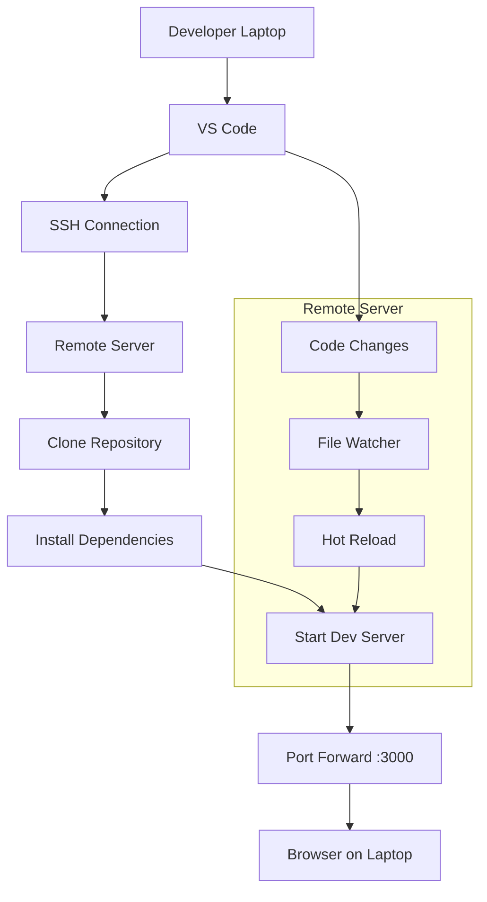

# How to Configure Remote Development Environments

Author: [nawazdhandala](https://www.github.com/nawazdhandala)

Tags: Remote Development, Developer Experience, VS Code, SSH, Cloud Development

Description: Learn how to set up remote development environments that let developers work on powerful cloud machines while using their local IDE, combining the best of both worlds.

---

Local development has limitations. Laptops lack the CPU for large builds, RAM for running multiple services, or storage for big datasets. Remote development solves this by running your code on powerful remote machines while you interact through your familiar local editor. This guide covers setting up remote development from VS Code to cloud servers.

## Why Remote Development?

Remote development offers several advantages:

- **Powerful hardware**: Access machines with more CPU, RAM, and GPU than your laptop
- **Consistent environments**: Everyone works on identical server configurations
- **Fast network**: Servers have high-bandwidth connections to cloud services
- **Data locality**: Keep large datasets on servers instead of downloading them
- **Security**: Sensitive code never leaves the corporate network

The trade-off is latency. Typing feels different when keystrokes travel to a remote server. Modern tools minimize this through smart caching and local UI rendering.

## VS Code Remote SSH Setup

VS Code's Remote SSH extension is the most popular solution:

```bash
# Install VS Code Remote SSH extension
code --install-extension ms-vscode-remote.remote-ssh

# Generate SSH key if you don't have one
ssh-keygen -t ed25519 -C "your-email@example.com"

# Copy public key to remote server
ssh-copy-id user@remote-server.example.com

# Test SSH connection
ssh user@remote-server.example.com
```

Configure SSH hosts in `~/.ssh/config`:

```
# ~/.ssh/config
Host dev-server
    HostName remote-server.example.com
    User developer
    IdentityFile ~/.ssh/id_ed25519
    # Keep connection alive
    ServerAliveInterval 60
    ServerAliveCountMax 3
    # Multiplex connections for speed
    ControlMaster auto
    ControlPath ~/.ssh/sockets/%r@%h-%p
    ControlPersist 600

Host dev-server-jump
    HostName internal-server.corp
    User developer
    # Use a jump host for internal servers
    ProxyJump bastion.example.com
    IdentityFile ~/.ssh/id_ed25519

Host gpu-server
    HostName gpu.example.com
    User mldev
    IdentityFile ~/.ssh/id_ed25519
    # Forward specific ports
    LocalForward 8888 localhost:8888
    LocalForward 6006 localhost:6006
```

Connect from VS Code:

1. Press `Cmd+Shift+P` (or `Ctrl+Shift+P`)
2. Type "Remote-SSH: Connect to Host"
3. Select your configured host
4. VS Code opens a new window connected to the remote

## Remote Server Configuration

Prepare the remote server for development:

```bash
#!/bin/bash
# setup-dev-server.sh - Run on the remote server

# Update system packages
sudo apt update && sudo apt upgrade -y

# Install development tools
sudo apt install -y \
    build-essential \
    git \
    curl \
    wget \
    vim \
    tmux \
    htop \
    jq \
    unzip

# Install Docker
curl -fsSL https://get.docker.com | sh
sudo usermod -aG docker $USER

# Install Node.js via nvm
curl -o- https://raw.githubusercontent.com/nvm-sh/nvm/v0.39.0/install.sh | bash
source ~/.bashrc
nvm install 20
nvm use 20

# Install Python
sudo apt install -y python3 python3-pip python3-venv

# Install mise for version management
curl https://mise.run | sh
echo 'eval "$(~/.local/bin/mise activate bash)"' >> ~/.bashrc

# Configure Git
git config --global user.name "Your Name"
git config --global user.email "your-email@example.com"

# Create workspace directory
mkdir -p ~/workspace

echo "Development server setup complete!"
```

## Port Forwarding

Access remote services locally:

```bash
# Forward a single port
ssh -L 3000:localhost:3000 dev-server

# Forward multiple ports
ssh -L 3000:localhost:3000 -L 5432:localhost:5432 dev-server

# Forward a range (requires multiple -L flags)
ssh -L 8000:localhost:8000 -L 8001:localhost:8001 dev-server
```

VS Code handles this automatically. Add to your workspace settings:

```json
// .vscode/settings.json
{
  "remote.SSH.defaultForwardedPorts": [
    { "localPort": 3000, "remotePort": 3000, "name": "Web Server" },
    { "localPort": 5432, "remotePort": 5432, "name": "PostgreSQL" },
    { "localPort": 6379, "remotePort": 6379, "name": "Redis" }
  ]
}
```

## Persistent Sessions with tmux

Keep processes running when you disconnect:

```bash
# Start a new tmux session
tmux new -s dev

# Run your development server
npm run dev

# Detach from session: Ctrl+B, then D

# Disconnect SSH - processes keep running

# Later, reconnect and reattach
ssh dev-server
tmux attach -t dev
```

Create a tmux configuration for development:

```bash
# ~/.tmux.conf on remote server

# Better prefix key
set -g prefix C-a
unbind C-b
bind C-a send-prefix

# Split panes with | and -
bind | split-window -h
bind - split-window -v

# Mouse support
set -g mouse on

# Start windows and panes at 1
set -g base-index 1
setw -g pane-base-index 1

# Increase history
set -g history-limit 10000

# Status bar
set -g status-style 'bg=#333333 fg=#ffffff'
set -g status-right '%Y-%m-%d %H:%M'
```

## Syncing Files with rsync

Sync files between local and remote:

```bash
# Sync local to remote
rsync -avz --progress \
    --exclude 'node_modules' \
    --exclude '.git' \
    --exclude 'dist' \
    ./project/ dev-server:~/workspace/project/

# Sync remote to local
rsync -avz --progress \
    dev-server:~/workspace/project/dist/ \
    ./dist/

# Watch and sync continuously
fswatch -o ./src | xargs -n1 -I{} rsync -avz ./src dev-server:~/workspace/project/
```

## Remote Development with JetBrains

JetBrains IDEs support remote development through Gateway:

1. Download JetBrains Gateway
2. Click "Connect via SSH"
3. Add your SSH configuration
4. Select IDE and project path
5. Gateway downloads the IDE backend to the server

Configure in `~/.ssh/config` as with VS Code.

## Cloud Development Environments

Use managed cloud development environments:

### AWS Cloud9

```bash
# Create Cloud9 environment via AWS CLI
aws cloud9 create-environment-ec2 \
    --name dev-environment \
    --instance-type t3.large \
    --image-id amazonlinux-2-x86_64 \
    --automatic-stop-time-minutes 30
```

### Google Cloud Workstations

```yaml
# workstation-config.yaml
apiVersion: workstations.googleapis.com/v1
kind: WorkstationConfig
metadata:
  name: dev-config
spec:
  idleTimeout: 1200s
  runningTimeout: 43200s
  host:
    gceInstance:
      machineType: n1-standard-4
      poolSize: 1
      bootDiskSizeGb: 50
      confidentialInstanceConfig:
        enableConfidentialCompute: false
  container:
    image: us-central1-docker.pkg.dev/cloud-workstations-images/predefined/code-oss:latest
```

## Remote Development Workflow

Here is a typical workflow:



## Security Considerations

Secure your remote development setup:

```bash
# Use SSH keys, disable password authentication
# /etc/ssh/sshd_config on server
PasswordAuthentication no
PubkeyAuthentication yes
PermitRootLogin no

# Restrict SSH access by IP
# /etc/ssh/sshd_config
AllowUsers developer@10.0.0.0/8

# Use a bastion host for private networks
# ~/.ssh/config
Host private-server
    HostName 10.0.1.50
    User developer
    ProxyJump bastion.example.com

# Set up firewall rules
sudo ufw allow from 10.0.0.0/8 to any port 22
sudo ufw enable
```

## Handling Latency

Minimize the impact of network latency:

```json
// VS Code settings for remote development
{
  // Reduce frequency of remote file system checks
  "remote.SSH.remotePlatform": {
    "dev-server": "linux"
  },
  // Increase timeout for slow connections
  "remote.SSH.connectTimeout": 60,
  // Enable local echo for faster typing feel
  "terminal.integrated.localEchoEnabled": "auto",
  // Reduce extension sync frequency
  "remote.SSH.maxReconnectionAttempts": 3
}
```

## Automated Environment Setup

Script the complete setup:

```bash
#!/bin/bash
# remote-dev-setup.sh

set -e

SERVER=${1:-dev-server}

echo "Setting up remote development on $SERVER..."

# Copy configuration files
scp ~/.gitconfig $SERVER:~/
scp ~/.tmux.conf $SERVER:~/

# Run setup script on remote
ssh $SERVER << 'EOF'
    # Install tools
    curl https://mise.run | sh
    echo 'eval "$(~/.local/bin/mise activate bash)"' >> ~/.bashrc
    source ~/.bashrc

    # Clone dotfiles
    git clone https://github.com/yourusername/dotfiles.git ~/.dotfiles
    cd ~/.dotfiles && ./install.sh

    # Set up workspace
    mkdir -p ~/workspace
    cd ~/workspace

    echo "Remote setup complete!"
EOF

echo "Opening VS Code..."
code --remote ssh-remote+$SERVER ~/workspace
```

## Best Practices

1. **Use SSH multiplexing**: Reuse connections to reduce connection overhead.

2. **Keep sessions alive**: Use tmux or screen to persist work across disconnections.

3. **Optimize for latency**: Disable unnecessary extensions and file watchers on remote.

4. **Automate setup**: Script server configuration so it can be recreated quickly.

5. **Monitor costs**: Cloud instances cost money. Set auto-shutdown policies.

Remote development combines the comfort of local tooling with the power of cloud infrastructure. Once configured properly, developers barely notice they are working on a remote machine, but they benefit from faster builds, more memory, and access to resources that would never fit on a laptop.
