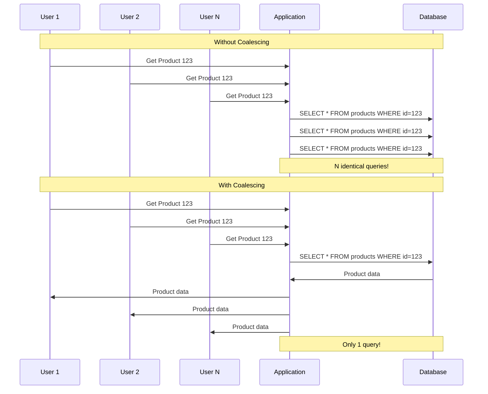

# How to Implement Request Coalescing

Author: [nawazdhandala](https://www.github.com/nawazdhandala)

Tags: Request Coalescing, Caching, Performance, Thundering Herd, Backend, Python, Go

Description: Learn how to implement request coalescing to prevent duplicate work and protect backend services. This guide covers singleflight patterns, cache stampede prevention, and deduplication strategies with practical examples.

---

> Request coalescing combines multiple identical requests into a single backend call, sharing the result among all requesters. When 100 users request the same resource simultaneously, coalescing ensures you make one database query, not 100. This guide shows you how to implement request coalescing effectively.

Request coalescing is essential for preventing thundering herd problems and protecting your backend services during cache misses or traffic spikes.

---

## The Thundering Herd Problem



---

## Python Request Coalescing

### Basic Singleflight Pattern

```python
# singleflight.py
import asyncio
from typing import Dict, Any, Callable, TypeVar, Awaitable
from dataclasses import dataclass
import logging

logger = logging.getLogger(__name__)

T = TypeVar('T')

@dataclass
class InFlightRequest:
    """Represents an in-flight request being processed"""
    future: asyncio.Future
    waiters: int = 1

class Singleflight:
    """
    Ensures only one execution of a function for a given key happens at a time.
    Other callers wait for and share the same result.
    """

    def __init__(self):
        self.in_flight: Dict[str, InFlightRequest] = {}
        self.lock = asyncio.Lock()

    async def do(self, key: str, fn: Callable[[], Awaitable[T]]) -> T:
        """
        Execute fn() for the given key, coalescing concurrent calls.

        If another call with the same key is already in progress,
        wait for it and return its result.
        """
        async with self.lock:
            if key in self.in_flight:
                # Request already in flight - wait for it
                self.in_flight[key].waiters += 1
                logger.debug(f"Coalescing request for key={key}, waiters={self.in_flight[key].waiters}")
            else:
                # First request - create future and start execution
                future = asyncio.get_event_loop().create_future()
                self.in_flight[key] = InFlightRequest(future=future)

                # Start the actual work
                asyncio.create_task(self._execute(key, fn, future))

        # Wait for result
        try:
            return await self.in_flight[key].future
        finally:
            async with self.lock:
                if key in self.in_flight:
                    self.in_flight[key].waiters -= 1
                    if self.in_flight[key].waiters == 0:
                        del self.in_flight[key]

    async def _execute(self, key: str, fn: Callable, future: asyncio.Future):
        """Execute the function and set the result"""
        try:
            result = await fn()
            future.set_result(result)
        except Exception as e:
            future.set_exception(e)


# Usage
singleflight = Singleflight()

async def get_product(product_id: int) -> dict:
    """Get product with request coalescing"""

    async def fetch():
        # This only runs once, even with concurrent requests
        logger.info(f"Fetching product {product_id} from database")
        return await db.fetch_one(
            "SELECT * FROM products WHERE id = $1",
            product_id
        )

    return await singleflight.do(f"product:{product_id}", fetch)


# Simulate concurrent requests
async def main():
    # All 100 requests will result in only 1 database query
    tasks = [get_product(123) for _ in range(100)]
    results = await asyncio.gather(*tasks)
    print(f"Got {len(results)} results from 1 query")

asyncio.run(main())
```

### Singleflight with Timeout and Caching

```python
# singleflight_advanced.py
import asyncio
from typing import Dict, Any, Callable, TypeVar, Optional, Awaitable
from dataclasses import dataclass, field
from datetime import datetime, timedelta
import logging

logger = logging.getLogger(__name__)

T = TypeVar('T')

@dataclass
class CachedResult:
    value: Any
    expires_at: datetime

@dataclass
class InFlightRequest:
    future: asyncio.Future
    started_at: datetime = field(default_factory=datetime.now)

class CoalescingCache:
    """
    Request coalescing with integrated caching.
    Prevents both cache stampede and thundering herd.
    """

    def __init__(self, default_ttl: int = 60):
        self.default_ttl = default_ttl
        self.cache: Dict[str, CachedResult] = {}
        self.in_flight: Dict[str, InFlightRequest] = {}
        self.lock = asyncio.Lock()

    async def get(
        self,
        key: str,
        fetch_fn: Callable[[], Awaitable[T]],
        ttl: Optional[int] = None,
        timeout: float = 30.0
    ) -> T:
        """
        Get value from cache or fetch with coalescing.

        Args:
            key: Cache key
            fetch_fn: Async function to fetch data if not cached
            ttl: Time-to-live in seconds (optional)
            timeout: Max time to wait for in-flight request
        """
        ttl = ttl or self.default_ttl

        # Check cache first (without lock for read)
        if key in self.cache:
            cached = self.cache[key]
            if cached.expires_at > datetime.now():
                logger.debug(f"Cache hit for {key}")
                return cached.value

        # Need to fetch - acquire lock
        async with self.lock:
            # Double-check cache after acquiring lock
            if key in self.cache:
                cached = self.cache[key]
                if cached.expires_at > datetime.now():
                    return cached.value

            # Check if request is already in flight
            if key in self.in_flight:
                in_flight = self.in_flight[key]
                logger.debug(f"Waiting for in-flight request: {key}")
            else:
                # Start new request
                future = asyncio.get_event_loop().create_future()
                self.in_flight[key] = InFlightRequest(future=future)
                asyncio.create_task(self._fetch_and_cache(key, fetch_fn, ttl, future))

        # Wait for result with timeout
        try:
            return await asyncio.wait_for(
                self.in_flight[key].future,
                timeout=timeout
            )
        except asyncio.TimeoutError:
            logger.error(f"Timeout waiting for {key}")
            raise

    async def _fetch_and_cache(
        self,
        key: str,
        fetch_fn: Callable,
        ttl: int,
        future: asyncio.Future
    ):
        """Fetch data, cache it, and resolve the future"""
        try:
            logger.info(f"Fetching {key}")
            result = await fetch_fn()

            # Cache the result
            self.cache[key] = CachedResult(
                value=result,
                expires_at=datetime.now() + timedelta(seconds=ttl)
            )

            future.set_result(result)
        except Exception as e:
            future.set_exception(e)
        finally:
            # Clean up in-flight tracking
            async with self.lock:
                if key in self.in_flight:
                    del self.in_flight[key]

    async def invalidate(self, key: str):
        """Invalidate a cache entry"""
        async with self.lock:
            if key in self.cache:
                del self.cache[key]

    def get_stats(self) -> dict:
        """Get cache statistics"""
        now = datetime.now()
        valid_entries = sum(1 for c in self.cache.values() if c.expires_at > now)
        return {
            'total_entries': len(self.cache),
            'valid_entries': valid_entries,
            'in_flight': len(self.in_flight)
        }


# Usage
cache = CoalescingCache(default_ttl=300)

async def get_user(user_id: int) -> dict:
    return await cache.get(
        key=f"user:{user_id}",
        fetch_fn=lambda: db.fetch_user(user_id),
        ttl=60
    )
```

---

## Go Singleflight

Go has a built-in singleflight package that's widely used.

```go
// singleflight_example.go
package main

import (
    "context"
    "fmt"
    "log"
    "sync"
    "time"

    "golang.org/x/sync/singleflight"
)

type ProductService struct {
    db     *Database
    group  singleflight.Group
    cache  sync.Map
}

func NewProductService(db *Database) *ProductService {
    return &ProductService{db: db}
}

func (s *ProductService) GetProduct(ctx context.Context, productID string) (*Product, error) {
    // Check cache first
    if cached, ok := s.cache.Load(productID); ok {
        return cached.(*Product), nil
    }

    // Use singleflight to deduplicate concurrent requests
    key := fmt.Sprintf("product:%s", productID)

    result, err, shared := s.group.Do(key, func() (interface{}, error) {
        log.Printf("Fetching product %s from database (shared=%v)", productID, shared)

        product, err := s.db.GetProduct(ctx, productID)
        if err != nil {
            return nil, err
        }

        // Cache the result
        s.cache.Store(productID, product)

        return product, nil
    })

    if err != nil {
        return nil, err
    }

    if shared {
        log.Printf("Request for %s was coalesced", productID)
    }

    return result.(*Product), nil
}

// Singleflight with timeout
func (s *ProductService) GetProductWithTimeout(ctx context.Context, productID string) (*Product, error) {
    key := fmt.Sprintf("product:%s", productID)

    // Create channel for result
    ch := s.group.DoChan(key, func() (interface{}, error) {
        return s.db.GetProduct(ctx, productID)
    })

    // Wait with timeout
    select {
    case result := <-ch:
        if result.Err != nil {
            return nil, result.Err
        }
        return result.Val.(*Product), nil
    case <-ctx.Done():
        return nil, ctx.Err()
    case <-time.After(5 * time.Second):
        return nil, fmt.Errorf("timeout waiting for product %s", productID)
    }
}

// Forget key to allow new request
func (s *ProductService) InvalidateProduct(productID string) {
    key := fmt.Sprintf("product:%s", productID)
    s.group.Forget(key)
    s.cache.Delete(productID)
}
```

### Singleflight with Caching Layer

```go
// cached_singleflight.go
package main

import (
    "context"
    "sync"
    "time"

    "golang.org/x/sync/singleflight"
)

type CachedValue struct {
    Value     interface{}
    ExpiresAt time.Time
}

type CachedSingleflight struct {
    group singleflight.Group
    cache sync.Map
    ttl   time.Duration
}

func NewCachedSingleflight(ttl time.Duration) *CachedSingleflight {
    cs := &CachedSingleflight{ttl: ttl}

    // Background cleanup
    go cs.cleanupLoop()

    return cs
}

func (cs *CachedSingleflight) Get(
    ctx context.Context,
    key string,
    fetchFn func() (interface{}, error),
) (interface{}, error) {

    // Check cache
    if cached, ok := cs.cache.Load(key); ok {
        cv := cached.(*CachedValue)
        if time.Now().Before(cv.ExpiresAt) {
            return cv.Value, nil
        }
        // Expired - delete and fetch
        cs.cache.Delete(key)
    }

    // Fetch with singleflight
    result, err, _ := cs.group.Do(key, func() (interface{}, error) {
        value, err := fetchFn()
        if err != nil {
            return nil, err
        }

        // Cache result
        cs.cache.Store(key, &CachedValue{
            Value:     value,
            ExpiresAt: time.Now().Add(cs.ttl),
        })

        return value, nil
    })

    return result, err
}

func (cs *CachedSingleflight) Invalidate(key string) {
    cs.cache.Delete(key)
    cs.group.Forget(key)
}

func (cs *CachedSingleflight) cleanupLoop() {
    ticker := time.NewTicker(time.Minute)
    defer ticker.Stop()

    for range ticker.C {
        now := time.Now()
        cs.cache.Range(func(key, value interface{}) bool {
            cv := value.(*CachedValue)
            if now.After(cv.ExpiresAt) {
                cs.cache.Delete(key)
            }
            return true
        })
    }
}
```

---

## HTTP Layer Coalescing

### Express.js Request Coalescing

```javascript
// request-coalescing.js
const express = require('express');

class RequestCoalescer {
  constructor() {
    this.inFlight = new Map();
  }

  async coalesce(key, fetchFn) {
    // Check if request is already in flight
    if (this.inFlight.has(key)) {
      console.log(`Coalescing request for ${key}`);
      return this.inFlight.get(key);
    }

    // Start new request
    const promise = fetchFn()
      .finally(() => {
        // Clean up after completion
        this.inFlight.delete(key);
      });

    this.inFlight.set(key, promise);
    return promise;
  }

  getStats() {
    return {
      inFlightCount: this.inFlight.size,
      inFlightKeys: Array.from(this.inFlight.keys())
    };
  }
}

const coalescer = new RequestCoalescer();

const app = express();

app.get('/api/products/:id', async (req, res) => {
  const productId = req.params.id;
  const key = `product:${productId}`;

  try {
    const product = await coalescer.coalesce(key, async () => {
      console.log(`Fetching product ${productId} from database`);
      return await db.getProduct(productId);
    });

    res.json(product);
  } catch (error) {
    res.status(500).json({ error: error.message });
  }
});

// Stats endpoint
app.get('/api/coalescer/stats', (req, res) => {
  res.json(coalescer.getStats());
});

app.listen(3000);
```

---

## Redis-Based Distributed Coalescing

For distributed systems, use Redis for cross-instance coalescing.

```python
# distributed_coalescing.py
import redis
import asyncio
import json
import uuid
import time
from typing import Any, Callable, Optional

class DistributedCoalescer:
    """
    Distributed request coalescing using Redis.
    Ensures only one instance fetches data across all app instances.
    """

    def __init__(self, redis_url: str, prefix: str = "coalesce"):
        self.redis = redis.from_url(redis_url)
        self.prefix = prefix
        self.instance_id = str(uuid.uuid4())[:8]

    async def get(
        self,
        key: str,
        fetch_fn: Callable,
        ttl: int = 60,
        lock_timeout: int = 30
    ) -> Any:
        """
        Get value with distributed coalescing.

        Uses Redis for:
        1. Caching the result
        2. Coordinating which instance fetches
        """
        cache_key = f"{self.prefix}:cache:{key}"
        lock_key = f"{self.prefix}:lock:{key}"
        result_key = f"{self.prefix}:result:{key}"

        # Check cache
        cached = self.redis.get(cache_key)
        if cached:
            return json.loads(cached)

        # Try to acquire lock
        acquired = self.redis.set(
            lock_key,
            self.instance_id,
            nx=True,  # Only if not exists
            ex=lock_timeout  # Auto-expire
        )

        if acquired:
            # We're the leader - fetch data
            try:
                result = await fetch_fn()

                # Cache result
                self.redis.setex(cache_key, ttl, json.dumps(result))

                # Publish result for waiting instances
                self.redis.publish(result_key, json.dumps(result))

                return result
            finally:
                # Release lock
                self.redis.delete(lock_key)
        else:
            # Another instance is fetching - wait for result
            pubsub = self.redis.pubsub()
            pubsub.subscribe(result_key)

            try:
                # Wait for result with timeout
                deadline = time.time() + lock_timeout
                while time.time() < deadline:
                    message = pubsub.get_message(timeout=1)
                    if message and message['type'] == 'message':
                        return json.loads(message['data'])

                    # Check cache in case we missed the publish
                    cached = self.redis.get(cache_key)
                    if cached:
                        return json.loads(cached)

                # Timeout - try to fetch ourselves
                return await fetch_fn()
            finally:
                pubsub.unsubscribe(result_key)
                pubsub.close()


# Usage
coalescer = DistributedCoalescer("redis://localhost:6379")

async def get_config():
    return await coalescer.get(
        key="app:config",
        fetch_fn=lambda: fetch_config_from_api(),
        ttl=300
    )
```

---

## Monitoring Request Coalescing

```python
# coalescing_metrics.py
from prometheus_client import Counter, Gauge, Histogram

# Metrics
coalesced_requests = Counter(
    'requests_coalesced_total',
    'Total coalesced requests',
    ['key_prefix']
)

cache_hits = Counter(
    'coalescing_cache_hits_total',
    'Cache hits',
    ['key_prefix']
)

in_flight_requests = Gauge(
    'coalescing_in_flight_requests',
    'Currently in-flight requests',
    ['key_prefix']
)

fetch_duration = Histogram(
    'coalescing_fetch_duration_seconds',
    'Time to fetch data',
    ['key_prefix'],
    buckets=[0.01, 0.05, 0.1, 0.25, 0.5, 1, 2.5, 5]
)

# Instrumented coalescer
class InstrumentedCoalescer(CoalescingCache):
    def __init__(self, key_prefix: str, **kwargs):
        super().__init__(**kwargs)
        self.key_prefix = key_prefix

    async def get(self, key: str, fetch_fn, **kwargs):
        # Check if will be coalesced
        if key in self.in_flight:
            coalesced_requests.labels(key_prefix=self.key_prefix).inc()

        in_flight_requests.labels(key_prefix=self.key_prefix).set(len(self.in_flight))

        start = time.perf_counter()
        try:
            result = await super().get(key, fetch_fn, **kwargs)

            if key in self.cache:
                cache_hits.labels(key_prefix=self.key_prefix).inc()

            return result
        finally:
            duration = time.perf_counter() - start
            fetch_duration.labels(key_prefix=self.key_prefix).observe(duration)
```

---

## Best Practices Summary

| Scenario | Approach | Key Consideration |
|----------|----------|------------------|
| Single instance | In-memory singleflight | Fast, simple |
| Multi-instance | Redis-based coalescing | Cross-instance coordination |
| Cache miss storms | Coalescing + cache | Prevent thundering herd |
| High cardinality | Short coalescing window | Memory management |

---

## Conclusion

Request coalescing is essential for preventing thundering herd problems:

1. **Use singleflight patterns**: One fetch per unique key
2. **Combine with caching**: Coalesce during cache misses
3. **Distribute when needed**: Use Redis for multi-instance
4. **Monitor coalescing rate**: Track how much work you are saving
5. **Set appropriate timeouts**: Do not wait forever for coalesced results

The goal is to do work once and share results, protecting your backend services from duplicate requests.

---

*Need to monitor your API performance? [OneUptime](https://oneuptime.com) provides request deduplication metrics, cache hit rates, and backend protection monitoring.*
