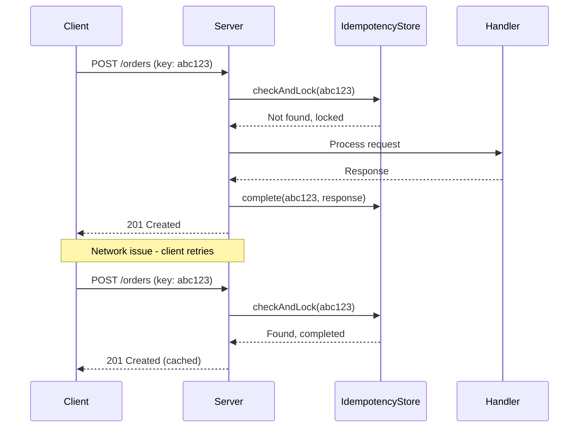

# How to Prevent Duplicate Requests with Deduplication in Node.js

Author: [nawazdhandala](https://www.github.com/nawazdhandala)

Tags: NodeJS, TypeScript, API, Performance, Reliability

Description: Learn how to implement request deduplication in Node.js to prevent duplicate processing, save resources, and ensure idempotent operations using various strategies including in-memory caching, Redis, and database-level deduplication.

---

Duplicate requests are a common problem in distributed systems. Users double-click buttons, retries send the same request multiple times, and network issues cause unintended repetition. Without deduplication, you might charge a customer twice, send duplicate emails, or corrupt data. This guide covers practical strategies to detect and handle duplicate requests in Node.js.

## Why Requests Get Duplicated

| Cause | Example |
|-------|---------|
| User behavior | Double-clicking submit button |
| Client retries | Automatic retry on timeout |
| Network issues | Request succeeds but response lost |
| Load balancer retries | Backend timeout triggers retry |
| Webhook delivery | Provider retries failed deliveries |

## Idempotency Key Pattern

The most reliable deduplication method uses client-provided idempotency keys. The client generates a unique key for each logical operation, and the server uses this key to detect duplicates.

```typescript
// IdempotencyService.ts
// Tracks and deduplicates requests using client-provided keys

interface IdempotencyRecord {
  key: string;
  status: 'processing' | 'completed' | 'failed';
  response?: any;
  statusCode?: number;
  createdAt: number;
  completedAt?: number;
}

export class IdempotencyService {
  private records: Map<string, IdempotencyRecord> = new Map();
  private ttl: number = 24 * 60 * 60 * 1000; // 24 hours

  // Check if request is duplicate and return cached response if available
  async checkAndLock(key: string): Promise<{
    isDuplicate: boolean;
    isProcessing: boolean;
    cachedResponse?: { body: any; statusCode: number };
  }> {
    const existing = this.records.get(key);

    if (!existing) {
      // New request - lock it
      this.records.set(key, {
        key,
        status: 'processing',
        createdAt: Date.now(),
      });
      return { isDuplicate: false, isProcessing: false };
    }

    // Request is already being processed
    if (existing.status === 'processing') {
      return { isDuplicate: true, isProcessing: true };
    }

    // Request completed - return cached response
    if (existing.status === 'completed' && existing.response !== undefined) {
      return {
        isDuplicate: true,
        isProcessing: false,
        cachedResponse: {
          body: existing.response,
          statusCode: existing.statusCode || 200,
        },
      };
    }

    // Previous request failed - allow retry
    this.records.set(key, {
      key,
      status: 'processing',
      createdAt: Date.now(),
    });
    return { isDuplicate: false, isProcessing: false };
  }

  // Mark request as completed with response
  complete(key: string, response: any, statusCode: number = 200): void {
    const record = this.records.get(key);
    if (record) {
      record.status = 'completed';
      record.response = response;
      record.statusCode = statusCode;
      record.completedAt = Date.now();

      // Schedule cleanup
      setTimeout(() => this.records.delete(key), this.ttl);
    }
  }

  // Mark request as failed
  fail(key: string): void {
    const record = this.records.get(key);
    if (record) {
      record.status = 'failed';
      record.completedAt = Date.now();
    }
  }

  // Release lock without completing (for errors that should allow retry)
  release(key: string): void {
    this.records.delete(key);
  }
}
```

## Express Middleware for Idempotency

Create middleware that automatically handles idempotency for POST, PUT, and PATCH requests.

```typescript
// idempotency.middleware.ts
import { Request, Response, NextFunction } from 'express';
import { IdempotencyService } from './IdempotencyService';

const idempotencyService = new IdempotencyService();

export function idempotencyMiddleware(
  req: Request,
  res: Response,
  next: NextFunction
): void {
  // Only apply to mutating requests
  if (!['POST', 'PUT', 'PATCH'].includes(req.method)) {
    return next();
  }

  // Get idempotency key from header
  const idempotencyKey = req.headers['idempotency-key'] as string;

  if (!idempotencyKey) {
    // Allow requests without idempotency key but warn
    console.warn(`Request to ${req.path} without idempotency key`);
    return next();
  }

  // Include path in the key to prevent cross-endpoint collisions
  const fullKey = `${req.method}:${req.path}:${idempotencyKey}`;

  idempotencyService
    .checkAndLock(fullKey)
    .then((result) => {
      if (result.isDuplicate) {
        if (result.isProcessing) {
          // Request is still being processed
          res.status(409).json({
            error: 'Conflict',
            message: 'Request with this idempotency key is still processing',
          });
          return;
        }

        if (result.cachedResponse) {
          // Return cached response
          res.status(result.cachedResponse.statusCode).json(result.cachedResponse.body);
          return;
        }
      }

      // Store key in request for later use
      (req as any).idempotencyKey = fullKey;

      // Intercept response to cache it
      const originalJson = res.json.bind(res);
      res.json = (body: any) => {
        idempotencyService.complete(fullKey, body, res.statusCode);
        return originalJson(body);
      };

      // Handle errors
      res.on('error', () => {
        idempotencyService.fail(fullKey);
      });

      next();
    })
    .catch((error) => {
      console.error('Idempotency check failed:', error);
      next();
    });
}
```

## Request Flow with Deduplication



## Redis-Based Deduplication

For distributed systems, use Redis for shared state across instances.

```typescript
// RedisIdempotencyService.ts
import Redis from 'ioredis';

interface IdempotencyData {
  status: 'processing' | 'completed' | 'failed';
  response?: string; // JSON stringified
  statusCode?: number;
  createdAt: number;
}

export class RedisIdempotencyService {
  private redis: Redis;
  private ttl: number = 86400; // 24 hours in seconds
  private lockTimeout: number = 30; // 30 seconds for processing lock

  constructor(redis: Redis) {
    this.redis = redis;
  }

  async checkAndLock(key: string): Promise<{
    isDuplicate: boolean;
    isProcessing: boolean;
    cachedResponse?: { body: any; statusCode: number };
  }> {
    const prefixedKey = `idempotency:${key}`;

    // Try to get existing record
    const existing = await this.redis.get(prefixedKey);

    if (existing) {
      const data: IdempotencyData = JSON.parse(existing);

      if (data.status === 'processing') {
        // Check if lock expired
        const age = Date.now() - data.createdAt;
        if (age < this.lockTimeout * 1000) {
          return { isDuplicate: true, isProcessing: true };
        }
        // Lock expired, allow retry
      } else if (data.status === 'completed' && data.response) {
        return {
          isDuplicate: true,
          isProcessing: false,
          cachedResponse: {
            body: JSON.parse(data.response),
            statusCode: data.statusCode || 200,
          },
        };
      }
    }

    // Set lock with short TTL
    const lockData: IdempotencyData = {
      status: 'processing',
      createdAt: Date.now(),
    };

    // Use NX to prevent race conditions
    const acquired = await this.redis.set(
      prefixedKey,
      JSON.stringify(lockData),
      'EX',
      this.lockTimeout,
      'NX'
    );

    if (!acquired) {
      // Another instance acquired the lock
      return { isDuplicate: true, isProcessing: true };
    }

    return { isDuplicate: false, isProcessing: false };
  }

  async complete(key: string, response: any, statusCode: number = 200): Promise<void> {
    const prefixedKey = `idempotency:${key}`;

    const data: IdempotencyData = {
      status: 'completed',
      response: JSON.stringify(response),
      statusCode,
      createdAt: Date.now(),
    };

    await this.redis.set(prefixedKey, JSON.stringify(data), 'EX', this.ttl);
  }

  async fail(key: string): Promise<void> {
    const prefixedKey = `idempotency:${key}`;
    await this.redis.del(prefixedKey);
  }
}
```

## Content-Based Deduplication

When clients cannot provide idempotency keys, generate them from request content.

```typescript
// ContentDeduplication.ts
import crypto from 'crypto';
import { Request } from 'express';

export class ContentDeduplicator {
  // Generate fingerprint from request content
  generateFingerprint(req: Request): string {
    const components = [
      req.method,
      req.path,
      JSON.stringify(req.body || {}),
      // Include user ID if authenticated
      (req as any).user?.id || 'anonymous',
    ];

    return crypto
      .createHash('sha256')
      .update(components.join('|'))
      .digest('hex')
      .substring(0, 32);
  }

  // Generate fingerprint with timestamp bucket for time-based deduplication
  generateTimeBucketedFingerprint(req: Request, bucketSeconds: number = 5): string {
    const timeBucket = Math.floor(Date.now() / (bucketSeconds * 1000));

    const components = [
      req.method,
      req.path,
      JSON.stringify(req.body || {}),
      (req as any).user?.id || 'anonymous',
      timeBucket.toString(),
    ];

    return crypto
      .createHash('sha256')
      .update(components.join('|'))
      .digest('hex')
      .substring(0, 32);
  }
}

// Middleware using content-based deduplication
export function contentDeduplicationMiddleware(
  idempotencyService: IdempotencyService,
  options: { timeWindow?: number } = {}
) {
  const deduplicator = new ContentDeduplicator();
  const timeWindow = options.timeWindow || 5; // 5 second default window

  return async (req: Request, res: Response, next: NextFunction) => {
    if (!['POST', 'PUT', 'PATCH'].includes(req.method)) {
      return next();
    }

    // Use client key if provided, otherwise generate from content
    let key = req.headers['idempotency-key'] as string;

    if (!key) {
      key = deduplicator.generateTimeBucketedFingerprint(req, timeWindow);
    }

    const fullKey = `content:${key}`;
    const result = await idempotencyService.checkAndLock(fullKey);

    if (result.isDuplicate && result.cachedResponse) {
      return res.status(result.cachedResponse.statusCode).json(result.cachedResponse.body);
    }

    if (result.isProcessing) {
      return res.status(409).json({
        error: 'Duplicate request detected',
        message: 'Please wait and retry',
      });
    }

    (req as any).idempotencyKey = fullKey;

    const originalJson = res.json.bind(res);
    res.json = (body: any) => {
      idempotencyService.complete(fullKey, body, res.statusCode);
      return originalJson(body);
    };

    next();
  };
}
```

## Database-Level Deduplication

For critical operations like payments, use database constraints as the final safety net.

```typescript
// DatabaseDeduplication.ts
import { Pool } from 'pg';

export class PaymentDeduplicator {
  private pool: Pool;

  constructor(pool: Pool) {
    this.pool = pool;
  }

  // Create payment with idempotency key constraint
  async createPayment(
    idempotencyKey: string,
    amount: number,
    userId: string
  ): Promise<{ id: string; status: string; duplicate: boolean }> {
    const client = await this.pool.connect();

    try {
      await client.query('BEGIN');

      // Try to insert with unique constraint on idempotency_key
      const insertResult = await client.query(
        `INSERT INTO payments (idempotency_key, amount, user_id, status, created_at)
         VALUES ($1, $2, $3, 'pending', NOW())
         ON CONFLICT (idempotency_key) DO NOTHING
         RETURNING id, status`,
        [idempotencyKey, amount, userId]
      );

      if (insertResult.rows.length > 0) {
        // New payment created
        const payment = insertResult.rows[0];

        // Process payment (call payment provider, etc.)
        await this.processPayment(payment.id, amount);

        await client.query(
          'UPDATE payments SET status = $1 WHERE id = $2',
          ['completed', payment.id]
        );

        await client.query('COMMIT');

        return { id: payment.id, status: 'completed', duplicate: false };
      }

      // Duplicate - fetch existing payment
      const existingResult = await client.query(
        'SELECT id, status FROM payments WHERE idempotency_key = $1',
        [idempotencyKey]
      );

      await client.query('COMMIT');

      if (existingResult.rows.length > 0) {
        const existing = existingResult.rows[0];
        return { id: existing.id, status: existing.status, duplicate: true };
      }

      throw new Error('Unexpected state: no payment found after conflict');
    } catch (error) {
      await client.query('ROLLBACK');
      throw error;
    } finally {
      client.release();
    }
  }

  private async processPayment(paymentId: string, amount: number): Promise<void> {
    // Call payment provider API
    console.log(`Processing payment ${paymentId} for amount ${amount}`);
  }
}

// Table schema
/*
CREATE TABLE payments (
  id UUID PRIMARY KEY DEFAULT gen_random_uuid(),
  idempotency_key VARCHAR(255) UNIQUE NOT NULL,
  amount DECIMAL(10, 2) NOT NULL,
  user_id VARCHAR(255) NOT NULL,
  status VARCHAR(50) NOT NULL,
  created_at TIMESTAMP NOT NULL,
  updated_at TIMESTAMP
);

CREATE INDEX idx_payments_idempotency_key ON payments(idempotency_key);
CREATE INDEX idx_payments_user_id ON payments(user_id);
*/
```

## Request Coalescing

When multiple identical requests arrive simultaneously, process only one and share the result.

```typescript
// RequestCoalescer.ts
// Coalesces identical in-flight requests to prevent duplicate processing

type PendingRequest<T> = {
  promise: Promise<T>;
  resolvers: Array<{
    resolve: (value: T) => void;
    reject: (error: any) => void;
  }>;
};

export class RequestCoalescer<T> {
  private pending: Map<string, PendingRequest<T>> = new Map();

  // Execute function, coalescing identical requests
  async execute(key: string, fn: () => Promise<T>): Promise<T> {
    const existing = this.pending.get(key);

    if (existing) {
      // Join existing request
      return new Promise((resolve, reject) => {
        existing.resolvers.push({ resolve, reject });
      });
    }

    // Create new pending request
    const resolvers: PendingRequest<T>['resolvers'] = [];

    const promise = fn()
      .then((result) => {
        // Resolve all waiting requests
        for (const resolver of resolvers) {
          resolver.resolve(result);
        }
        return result;
      })
      .catch((error) => {
        // Reject all waiting requests
        for (const resolver of resolvers) {
          resolver.reject(error);
        }
        throw error;
      })
      .finally(() => {
        this.pending.delete(key);
      });

    this.pending.set(key, { promise, resolvers });

    return promise;
  }
}

// Usage example
const coalescer = new RequestCoalescer<any>();

app.get('/api/expensive-data/:id', async (req, res) => {
  try {
    const data = await coalescer.execute(
      `expensive-data:${req.params.id}`,
      async () => {
        console.log(`Actually fetching data for ${req.params.id}`);
        // Expensive operation
        return await fetchExpensiveData(req.params.id);
      }
    );

    res.json(data);
  } catch (error) {
    res.status(500).json({ error: 'Failed to fetch data' });
  }
});
```

## Complete Implementation Example

Here is a full Express application with multiple deduplication strategies.

```typescript
// server.ts
import express from 'express';
import Redis from 'ioredis';
import { Pool } from 'pg';
import { RedisIdempotencyService } from './RedisIdempotencyService';
import { PaymentDeduplicator } from './DatabaseDeduplication';
import { RequestCoalescer } from './RequestCoalescer';

const app = express();
app.use(express.json());

// Initialize services
const redis = new Redis(process.env.REDIS_URL);
const pool = new Pool({ connectionString: process.env.DATABASE_URL });

const idempotencyService = new RedisIdempotencyService(redis);
const paymentDeduplicator = new PaymentDeduplicator(pool);
const coalescer = new RequestCoalescer();

// Idempotency middleware
app.use('/api', async (req, res, next) => {
  if (!['POST', 'PUT', 'PATCH'].includes(req.method)) {
    return next();
  }

  const key = req.headers['idempotency-key'] as string;
  if (!key) {
    return next();
  }

  const fullKey = `${req.method}:${req.path}:${key}`;

  try {
    const result = await idempotencyService.checkAndLock(fullKey);

    if (result.isDuplicate) {
      if (result.isProcessing) {
        return res.status(409).json({
          error: 'Request is being processed',
          retryAfter: 5,
        });
      }
      if (result.cachedResponse) {
        return res.status(result.cachedResponse.statusCode)
          .json(result.cachedResponse.body);
      }
    }

    (req as any).idempotencyKey = fullKey;

    const originalJson = res.json.bind(res);
    res.json = (body: any) => {
      idempotencyService.complete(fullKey, body, res.statusCode);
      return originalJson(body);
    };

    next();
  } catch (error) {
    console.error('Idempotency error:', error);
    next();
  }
});

// Payment endpoint with database-level deduplication
app.post('/api/payments', async (req, res) => {
  const { amount, idempotencyKey } = req.body;
  const userId = (req as any).user?.id || 'anonymous';

  if (!idempotencyKey) {
    return res.status(400).json({ error: 'idempotencyKey is required' });
  }

  try {
    const result = await paymentDeduplicator.createPayment(
      idempotencyKey,
      amount,
      userId
    );

    if (result.duplicate) {
      return res.status(200).json({
        id: result.id,
        status: result.status,
        message: 'Payment already processed',
      });
    }

    res.status(201).json({
      id: result.id,
      status: result.status,
    });
  } catch (error) {
    console.error('Payment error:', error);
    res.status(500).json({ error: 'Payment processing failed' });
  }
});

// Coalesced expensive endpoint
app.get('/api/reports/:id', async (req, res) => {
  try {
    const report = await coalescer.execute(
      `report:${req.params.id}`,
      async () => {
        // Expensive report generation
        return await generateReport(req.params.id);
      }
    );

    res.json(report);
  } catch (error) {
    res.status(500).json({ error: 'Report generation failed' });
  }
});

app.listen(3000, () => {
  console.log('Server with deduplication running on port 3000');
});
```

## Summary

| Strategy | Best For | Trade-offs |
|----------|----------|------------|
| Client idempotency key | API integrations | Requires client cooperation |
| Content fingerprint | Uncontrolled clients | May miss intentional duplicates |
| Database constraints | Critical transactions | Additional database load |
| Request coalescing | Read-heavy endpoints | Complex state management |
| Redis deduplication | Distributed systems | External dependency |

Request deduplication is essential for reliable APIs. Combine multiple strategies based on your requirements: idempotency keys for controlled clients, content fingerprinting as a fallback, and database constraints as the final safety net for critical operations.
